# 037：最小生成树与最小树形图


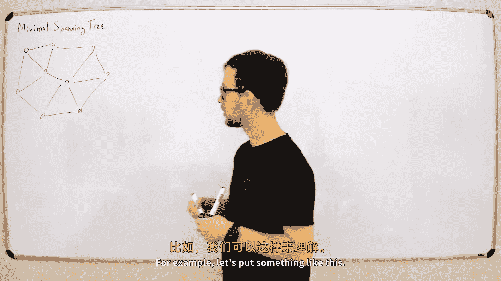

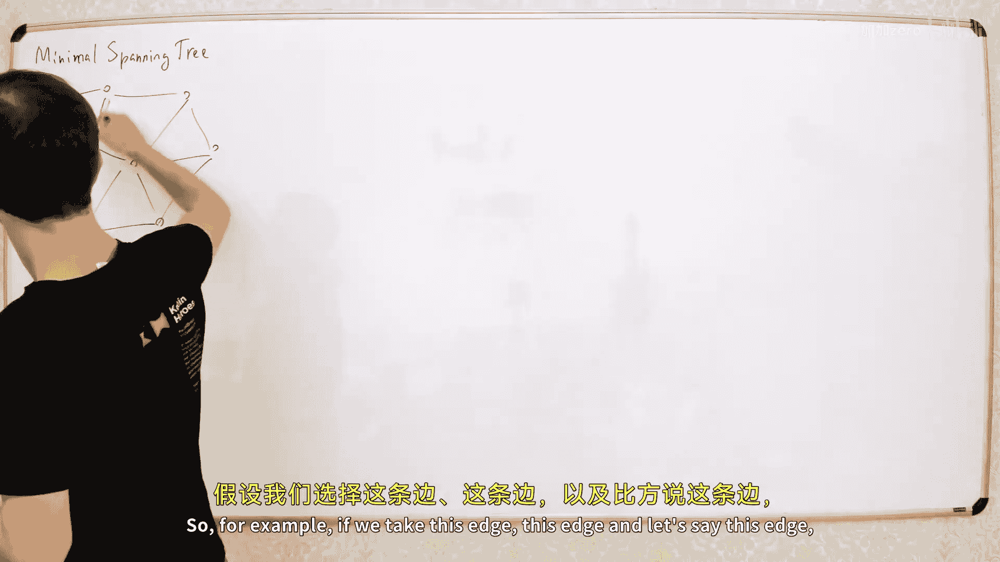


在本节课中，我们将要学习图论中的两个核心问题：**最小生成树** 和 **最小树形图**。我们将从基本概念入手，逐步介绍解决这些问题的经典算法，并分析其原理与复杂度。

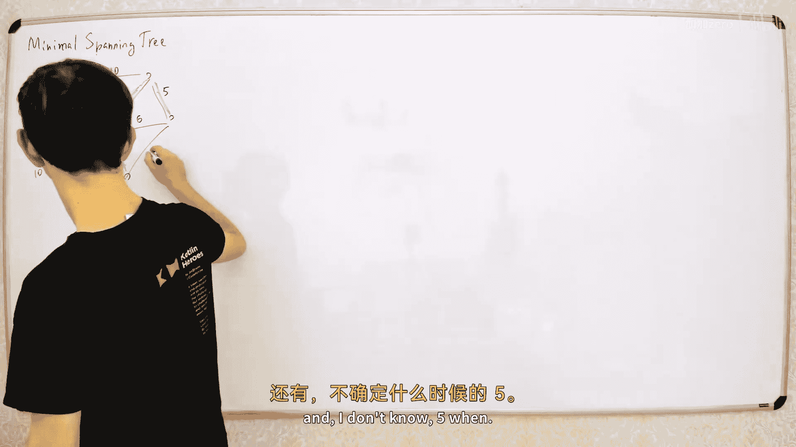

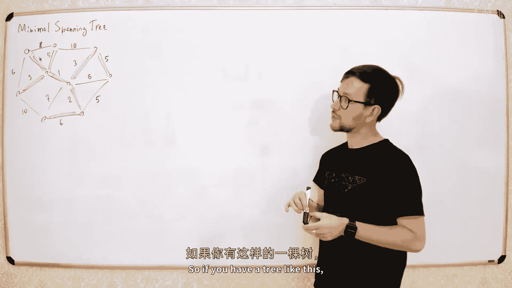

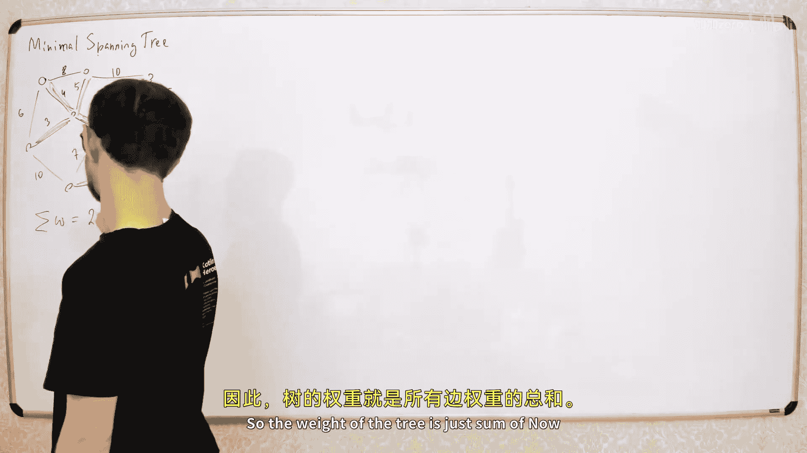

---

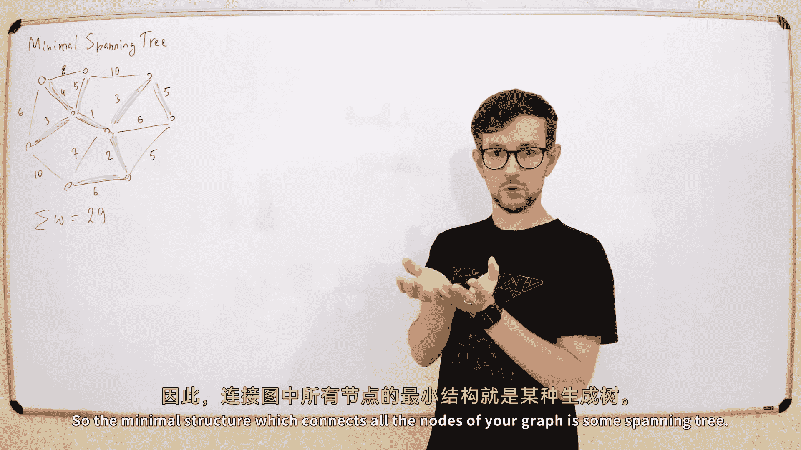

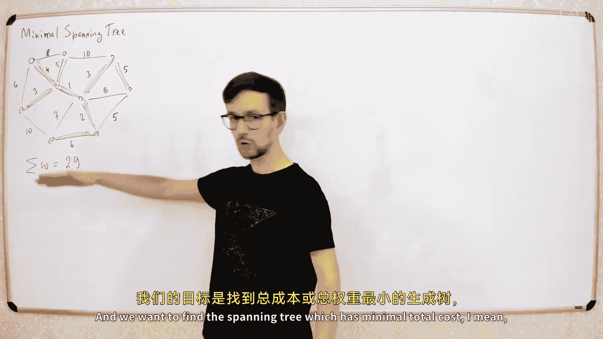


## 最小生成树问题

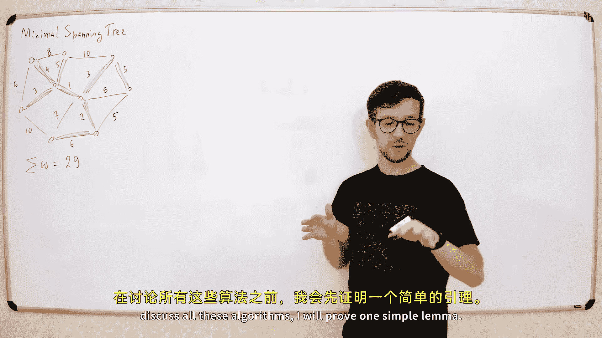

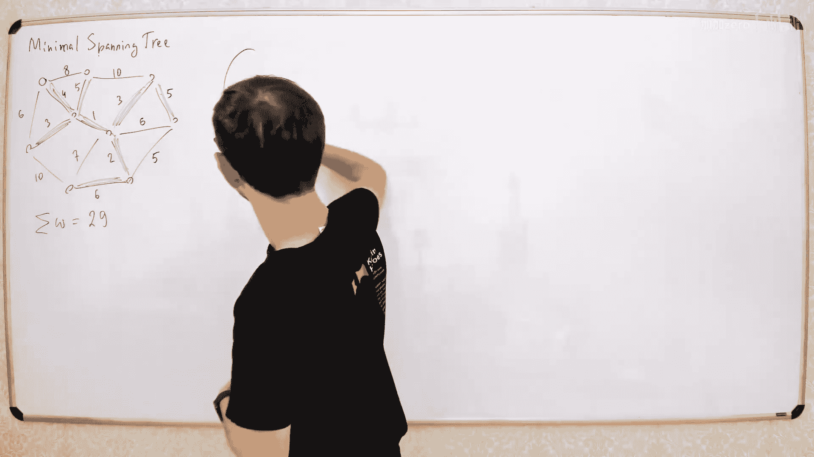

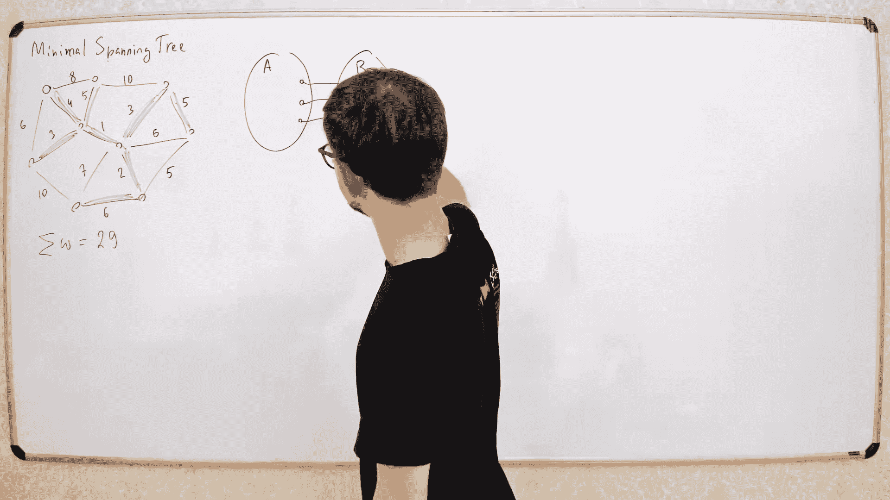

首先，我们来看最小生成树问题。给定一个**连通无向图**，其中每条边都有一个**权重**（或成本）。我们的目标是找到一个**生成树**，即一个包含图中所有节点的树形子图，并且使得该树中所有边的权重之和最小。

### 什么是生成树？

一个图的生成树是一个包含该图所有节点的树。如果图是连通的，那么它总是存在生成树。例如，你可以通过深度优先搜索得到一个深度优先搜索树，这就是一个生成树。

### 问题定义

假设我们有一个带权无向图。生成树的权重就是树中所有边权重的总和。最小生成树问题就是要找到一个权重总和最小的生成树。

这个问题的应用很广泛。例如，如果你想用最低的成本连接所有节点（如铺设电缆或道路网络），那么最小生成树就是最优的解决方案。因为如果所有权重非负，那么连接所有节点的最小成本结构必然是一棵树（如果存在环，你可以移除环中的一条边来降低成本）。

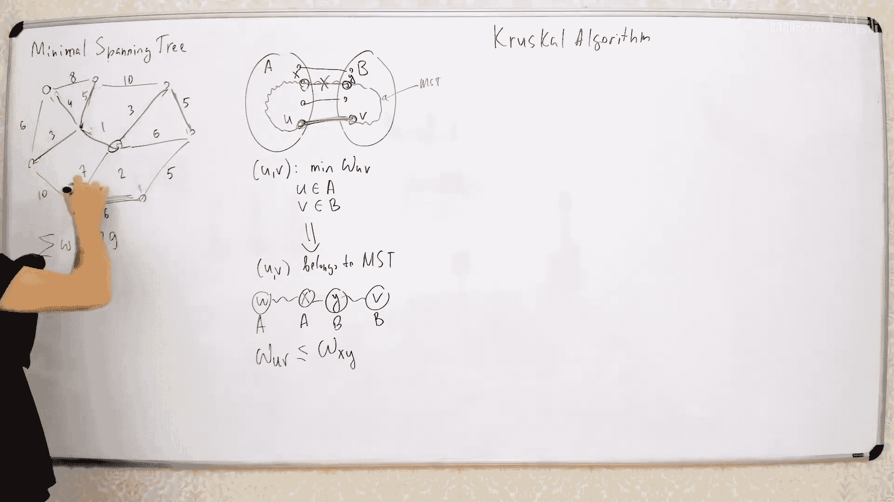

### 一个关键引理

在介绍具体算法之前，我们先证明一个关键引理，它是许多最小生成树算法的基础。

**引理**：将图的所有节点任意分割成两个集合 A 和 B。考虑所有连接集合 A 和 B 的边（称为一个“割”）。设 `(u, v)` 是这些边中权重最小的那条边（`u` 在 A 中，`v` 在 B 中）。那么，这条边 `(u, v)` 必然属于**某个**最小生成树。

**证明**：
1.  假设存在一个最小生成树 T，它不包含边 `(u, v)`。
2.  在树 T 中，节点 `u` 和 `v` 之间必然存在一条路径 P（因为生成树是连通的）。
3.  由于 `u` 在 A 中，`v` 在 B 中，路径 P 上必然存在一条边 `(x, y)`，使得 `x` 在 A 中，`y` 在 B 中（即路径穿过了割）。
4.  现在，我们构造一棵新的树 T‘：从 T 中移除边 `(x, y)`，并加入边 `(u, v)`。
5.  因为 `(u, v)` 是割中权重最小的边，所以 `weight(u, v) <= weight(x, y)`。因此，新树 T‘ 的权重不会大于 T 的权重。
6.  由于 T 是最小生成树，所以 T‘ 的权重也不可能更小，因此 T‘ 也是一个最小生成树，并且它包含了边 `(u, v)`。

这个引理告诉我们，在任何割中，权重最小的那条边对于构建最小生成树是“安全”的，我们可以放心地把它加入解中。

---

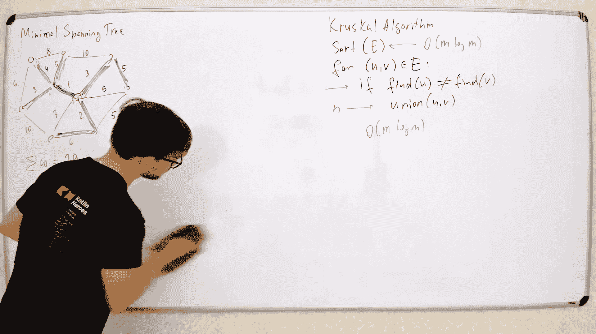

## 克鲁斯卡尔算法

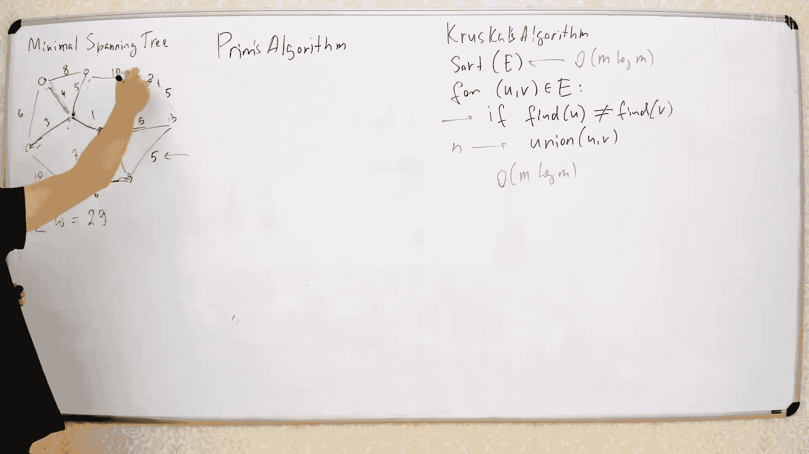

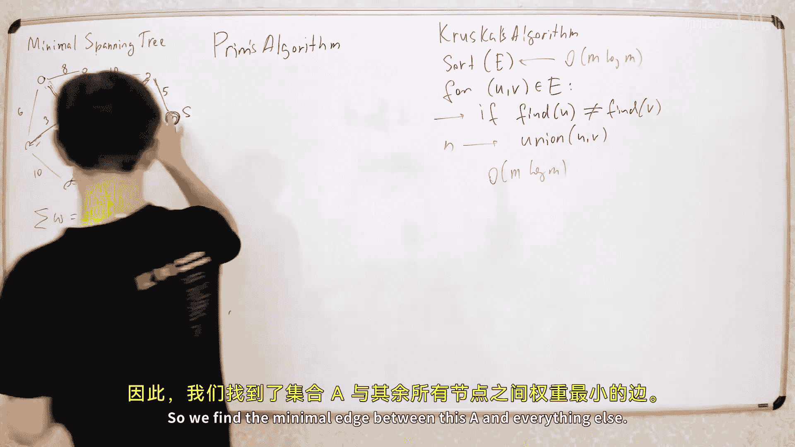

基于上述引理，我们可以设计第一个算法：**克鲁斯卡尔算法**。

### 算法思路

算法的核心思想非常简单：
1.  将图中所有边按照权重从小到大排序。
2.  按顺序遍历每条边。
3.  对于当前边 `(u, v)`，如果加入这条边不会在已选择的边集中形成环（即 `u` 和 `v` 目前尚未连通），那么就将这条边加入最小生成树中。否则，跳过这条边。

为什么这样做是正确的？当我们考虑边 `(u, v)` 时：
*   如果 `u` 和 `v` 尚未连通，那么当前已选边构成的森林中，`u` 和 `v` 属于不同的连通分量。
*   我们可以将 `u` 所在的连通分量视为集合 A，其他所有节点视为集合 B，这就构成了一个割。
*   由于我们按权重升序处理边，当前边 `(u, v)` 就是这个割中权重最小的边（因为所有比它权重小的边都已经被处理过了，并且它们连接的是各自连通分量内部的节点，不会连接 A 和 B）。
*   根据引理，这条边应该被加入最小生成树。

### 算法实现与复杂度

检查两个节点是否连通以及连通两个连通分量，最有效的数据结构是**并查集**。

以下是算法的伪代码描述：

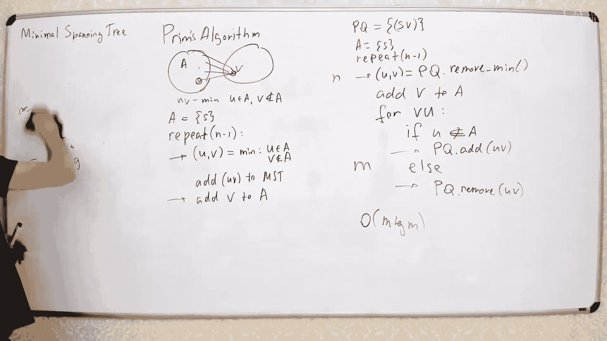

```python
# 假设 edges 是列表，每个元素是 (weight, u, v)
edges.sort() # 按权重排序
uf = UnionFind(n) # 初始化并查集，n为节点数
mst_edges = [] # 存储最小生成树的边
total_weight = 0

for weight, u, v in edges:
    if uf.find(u) != uf.find(v): # 如果u和v不在同一个集合
        uf.union(u, v) # 合并集合
        mst_edges.append((u, v))
        total_weight += weight

# 最终 mst_edges 包含最小生成树的所有边，total_weight 是其总权重
```

**时间复杂度分析**：
*   排序所有边：`O(m log m)`，其中 `m` 是边数。
*   并查集操作：进行 `m` 次 `find` 和最多 `n-1` 次 `union`。使用路径压缩和按秩合并的并查集，每次操作的平均时间复杂度接近常数 `O(α(n))`，其中 `α` 是增长极慢的反阿克曼函数。
*   因此，总时间复杂度为 `O(m log m)`，主要由排序步骤决定。由于 `m` 最多为 `O(n^2)`，所以也可以表示为 `O(m log n)`。

克鲁斯卡尔算法在边数不多（稀疏图）时非常高效。

---

## 普里姆算法

接下来我们学习第二个经典算法：**普里姆算法**。它采用了另一种贪心策略。

### 算法思路

普里姆算法从一个节点开始，逐步“生长”出一棵最小生成树。
1.  初始时，集合 `A` 只包含一个任意起始节点（例如节点0），最小生成树边集为空。
2.  重复以下步骤，直到集合 `A` 包含所有节点：
    *   考虑所有连接集合 `A` 内部节点和外部节点 `B`（`B = V \ A`）的边，这构成了一个割。
    *   找到这个割中权重最小的边 `(u, v)`，其中 `u` 在 `A` 中，`v` 在 `B` 中。
    *   将边 `(u, v)` 加入最小生成树，并把节点 `v` 从集合 `B` 移到集合 `A` 中。

每一步都直接应用了之前的引理，因此算法正确性得以保证。

### 算法实现与优化

我们需要一个高效的数据结构来维护割中的最小边。有两种主要思路：

**思路一：维护所有候选边**
*   使用一个最小堆（优先队列），存储所有从 `A` 集合连接到 `B` 集合的边。
*   每次从堆中取出权重最小的边 `(u, v)`。如果 `v` 还在 `B` 中，则将边加入 MST，并将 `v` 加入 `A`。
*   将 `v` 加入 `A` 后，需要遍历 `v` 的所有邻边 `(v, w)`。如果 `w` 在 `B` 中，则将边 `(v, w)` 加入堆中。
*   复杂度：每条边最多进入和离开堆一次，每次堆操作 `O(log m)`，总复杂度 `O(m log m)`。

**思路二：维护每个B集合节点的最小入边**
*   我们不需要维护所有边，对于 `B` 集合中的每个节点 `v`，我们只关心连接 `A` 到 `v` 的所有边中，权重最小的那条。记这个最小权重为 `dist[v]`。
*   使用一个最小堆，存储 `B` 集合中所有节点，其键值为 `dist[v]`。
*   每次从堆中取出 `dist` 值最小的节点 `v`（这对应了割中的最小边）。将 `v` 和其对应的边 `(parent[v], v)` 加入 MST，并将 `v` 移入 `A`。
*   将 `v` 移入 `A` 后，需要更新 `v` 的所有邻居 `w`（若 `w` 在 `B` 中）的 `dist` 值：`dist[w] = min(dist[w], weight(v, w))`。这需要在堆中更新 `w` 的键值（降低键值）。
*   复杂度：使用二叉堆时，降低键值操作需要 `O(log n)`。总操作次数为 `O(m)` 次降低键值和 `O(n)` 次取出最小元，总复杂度 `O(m log n)`。

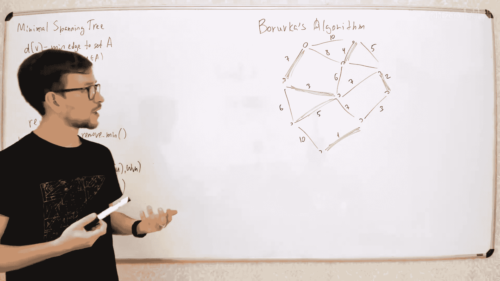

**不同数据结构的比较**
*   **二叉堆**：实现简单，复杂度 `O(m log n)`，适用于一般情况。
*   **斐波那契堆**：降低键值操作摊还时间复杂度为 `O(1)`，取出最小元为 `O(log n)`。使用斐波那契堆的普里姆算法复杂度可达 `O(m + n log n)`，在稠密图上理论更优，但常数较大。
*   **简单数组**：如果不使用堆，而用数组存储 `dist`，每次查找最小值需要 `O(n)`，但更新 `dist` 只需 `O(1)`。总复杂度为 `O(n^2 + m)`。这在**稠密图**（`m` 接近 `n^2`）时比 `O(m log n)` 更优，因为 `O(n^2)` 小于 `O(n^2 log n)`。

因此，普里姆算法的具体实现可以根据图的稠密程度选择合适的数据结构。

---

## 博鲁夫卡算法

最后，我们介绍一个并行的、非常古老的算法——**博鲁夫卡算法**。它同样基于那个关键引理，但以并行的方式应用。

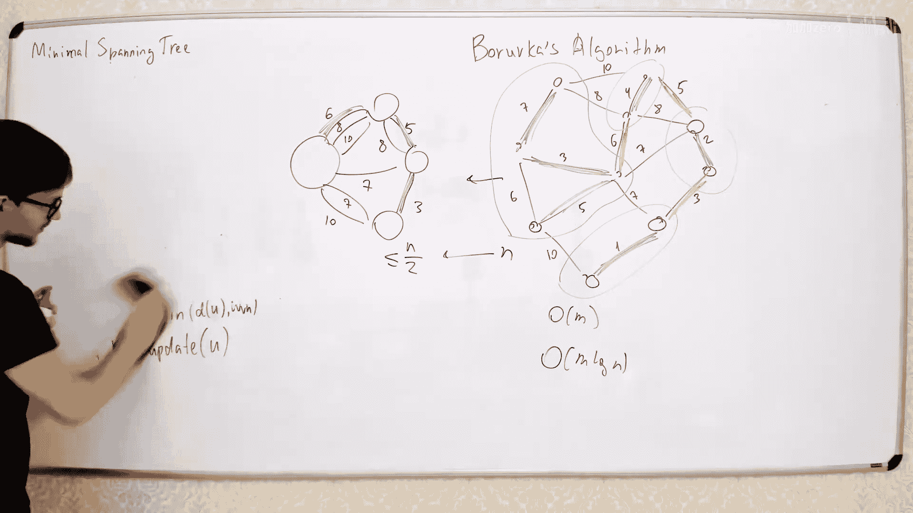

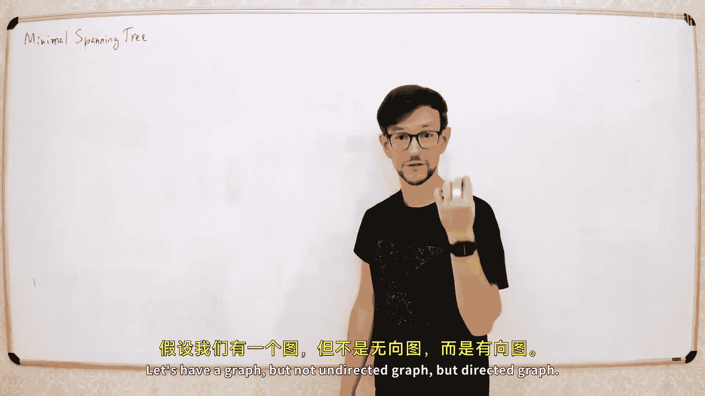

### 算法思路


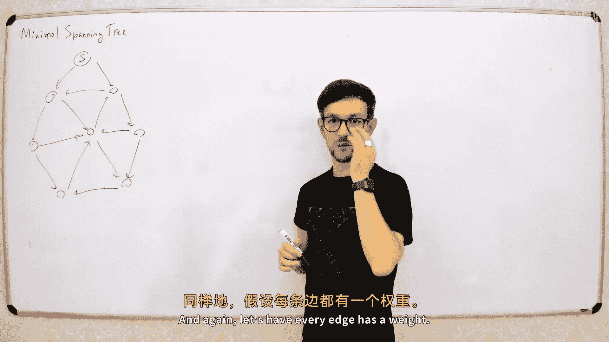

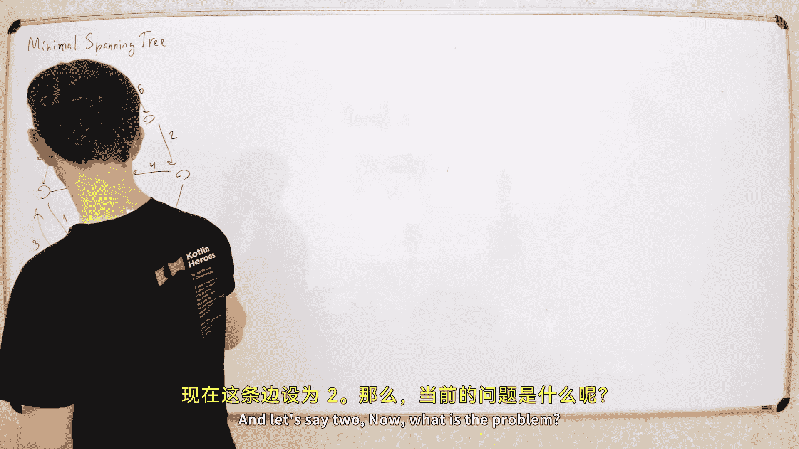

算法分为多轮，每轮并行地为每个连通分量添加一条边。
1.  初始时，每个节点自身是一个连通分量。
2.  重复以下步骤，直到只剩一个连通分量（即得到生成树）：
    a.  **对于当前图中的每个连通分量**：考虑所有连接该分量与外部节点的边，找到其中权重最小的那条边（根据引理，这条边属于某个 MST）。
    b.  将所有找到的这些最小边加入 MST 边集中（注意，同一条边可能被两个分量同时选中，只需加入一次）。
    c.  根据新加入的边，合并连通分量。即，将上一步中通过边连接起来的各个连通分量，合并成新的、更大的连通分量。
3.  展开所有被压缩的连通分量，得到最终的最小生成树。

### 复杂度分析

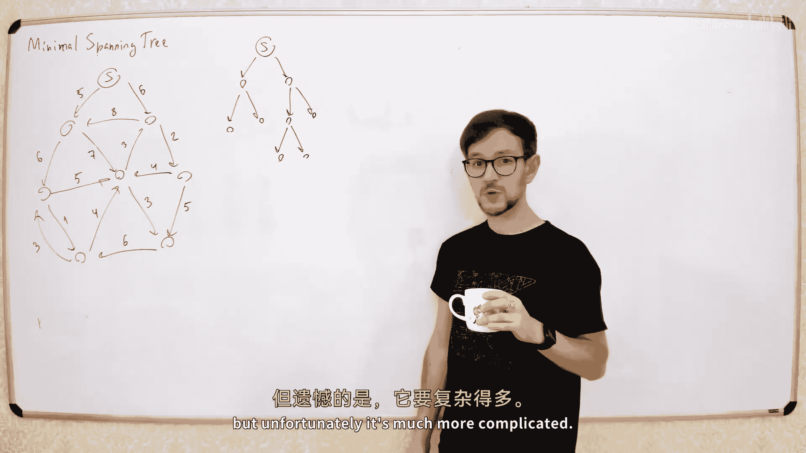

*   每一轮中，每个连通分量都会找到一条最小边并合并。最坏情况下，每轮每个连通分量至少与另一个分量合并，因此连通分量的数量至少减半。
*   所以，最多进行 `O(log n)` 轮。
*   在每一轮中，我们需要为每个连通分量找到其连出去的最小边。这可以通过遍历所有边，为每条边的两个端点所属的连通分量更新候选最小边来实现。每轮工作量为 `O(m)`。
*   因此，总时间复杂度为 `O(m log n)`。


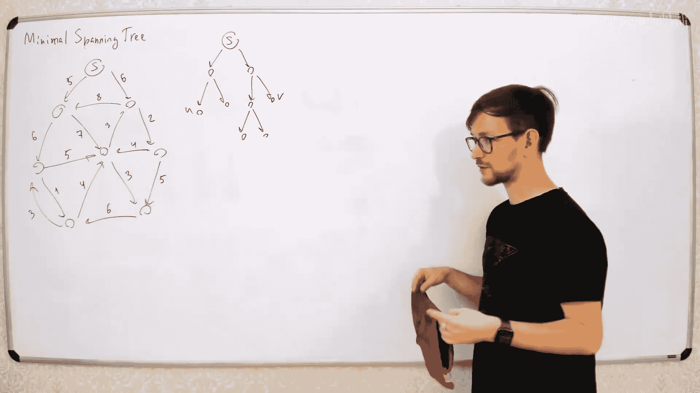

博鲁夫卡算法的优势在于其并行性，并且在实际应用中，由于连通分量快速变大，轮数往往远小于 `log n`，因此效率很高。

---

## 最小树形图问题


现在，我们转向一个类似但更复杂的问题：**最小树形图**，也称为**最小有向生成树**或**朱-刘算法问题**。

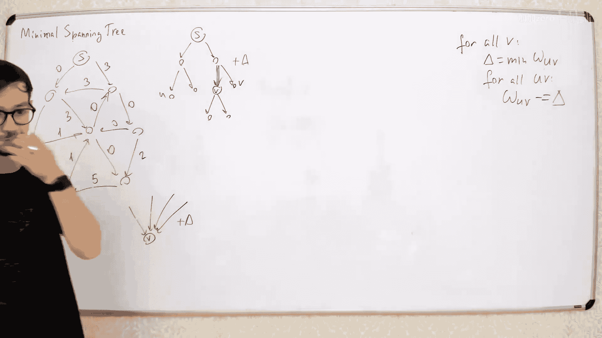

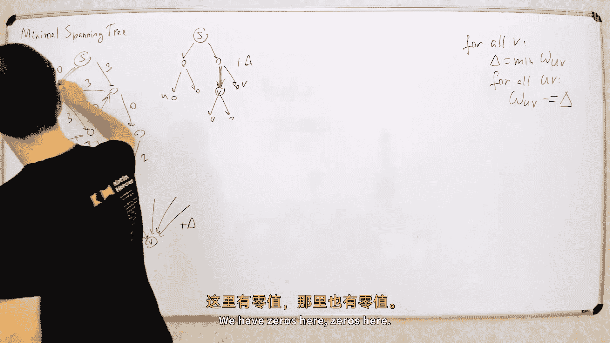

### 问题定义

给定一个**有向带权图**和一个指定的**根节点 r**。目标是找到一个以 r 为根的有向生成树，使得从 r 出发可以到达所有其他节点，并且树中所有有向边的权重之和最小。

这与最小生成树的区别在于边是有向的，并且要求所有边都从父节点指向子节点（即根节点没有入边）。

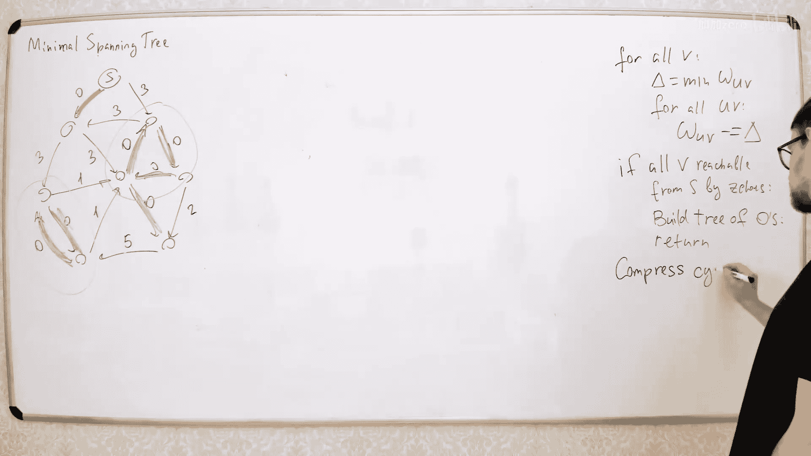

### 朱-刘算法

解决此问题的经典算法是**朱-刘算法**。其核心思想是通过“缩点”操作，逐步将图简化。

#### 算法步骤概述

1.  **预处理**：删除根节点 r 的所有入边。对于除根节点外的每个节点 v，选择所有指向 v 的入边中权重最小的那条，记为 `min_in[v]`。将所有这些最小入边的权重和记为 `total`。如果对于某个非根节点，没有入边，则问题无解。
    *   注意：这样选择的边集可能形成环，而不是树。
2.  **检查环**：如果当前选择的最小入边集合不构成环（即形成一棵以 r 为根的有向树），那么算法结束，这就是最小树形图。
3.  **缩点**：如果存在环，则进行缩点操作。
    *   将每个环收缩成一个“超级节点”。
    *   修改图中所有边的权重：
        *   对于环外的边 `(u, v)`，如果 v 在环内，则新权重为 `原权重 - min_in[v]`。这是因为我们**已经**为环内的节点 v 支付了 `min_in[v]` 的成本来选择其入边，如果最终我们选择边 `(u, v)` 进入环，那么它替代的是环内 v 原来的最小入边，所以实际增加的成本是差值。
        *   对于环内指向环外的边，权重不变。
        *   环内部的边被丢弃。
4.  **递归求解**：在收缩后的新图上，递归调用算法，找到其最小树形图。
5.  **展开环**：将收缩的环展开。递归求解得到的结果中，进入超级节点的边对应原图中进入环的某条边 `(u, v)`。在环中，断开原来指向 v 的那条环内边，并将边 `(u, v)` 加入最终解。这样，环就被打开成了一棵树的一部分。

#### 算法正确性直觉

算法的关键在于权重的调整。为每个非根节点选择最小入边，并调整环外入边权重的操作，相当于执行了如下等价变换：
*   对于任意节点 v，给所有指向 v 的边的权重同时加上或减去一个常数，不会改变最小树形树的结构（因为最终树中 v 只有一条入边，总成本变化是固定的）。
*   我们通过减去 `min_in[v]`，使得每个节点都至少有一条零权入边。如果这些零权边恰好构成一棵树，那显然是最优解。如果构成环，则说明我们需要在环上做出选择，缩点并递归求解等价于在更高的层次上做决策。

#### 复杂度

朴素的实现每轮需要 `O(m)` 时间找最小入边和缩点，最多进行 `O(n)` 轮（每轮至少减少一个节点），总复杂度 `O(mn)`。
使用更高效的数据结构（如可并堆）来维护每个节点的最小入边，可以将复杂度优化到 `O(m log n)`。

---

## 总结

本节课我们一起学习了图论中两个重要的最优化问题：

1.  **最小生成树**：在无向带权连通图中寻找权重最小的生成树。
    *   **关键引理**：任意割的最小边必属于某个最小生成树。
    *   **克鲁斯卡尔算法**：按边权排序，用并查集避免环。复杂度 `O(m log m)`，适合稀疏图。
    *   **普里姆算法**：从单点生长，用堆维护割的最小边。复杂度可优化至 `O(m + n log n)`，适合稠密图。
    *   **博鲁夫卡算法**：并行合并连通分量。复杂度 `O(m log n)`，具有并行性。

2.  **最小树形图**：在有向带权图中，寻找以指定根节点出发能到达所有点的最小有向生成树。
    *   问题比无向图情况更复杂。
    *   **朱-刘算法**：通过不断为节点选择最小入边、收缩环并调整权重来求解。朴素实现 `O(mn)`，可用数据结构优化。

理解这些算法背后的贪心思想和图论引理，是掌握其本质的关键。最小生成树问题已有接近线性的随机算法，但确定性的最优复杂度仍未可知，这体现了算法研究中理论与实践的深度。