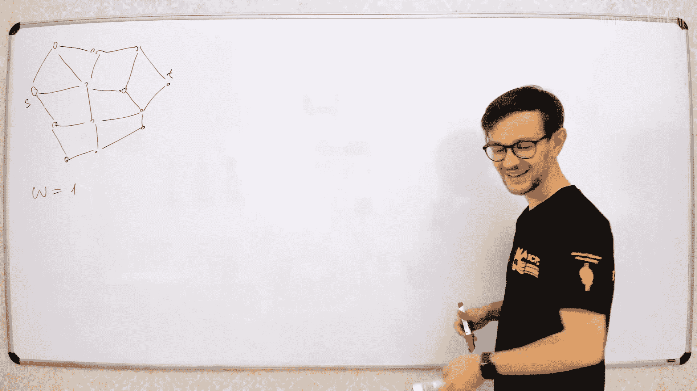
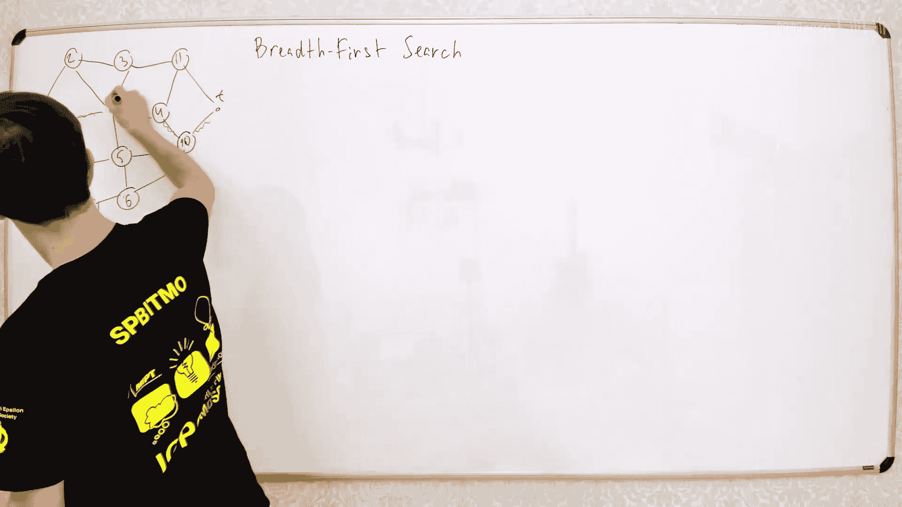
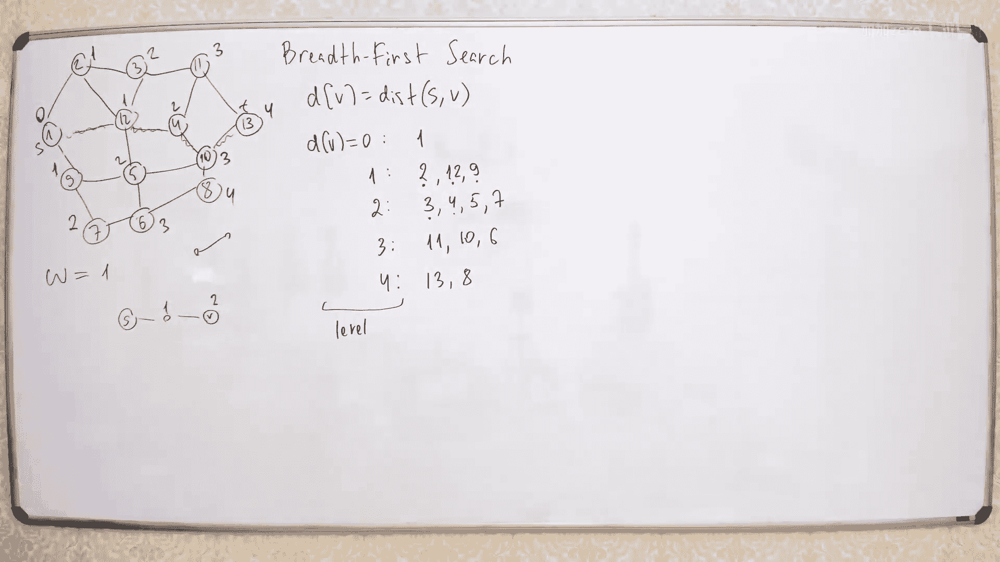
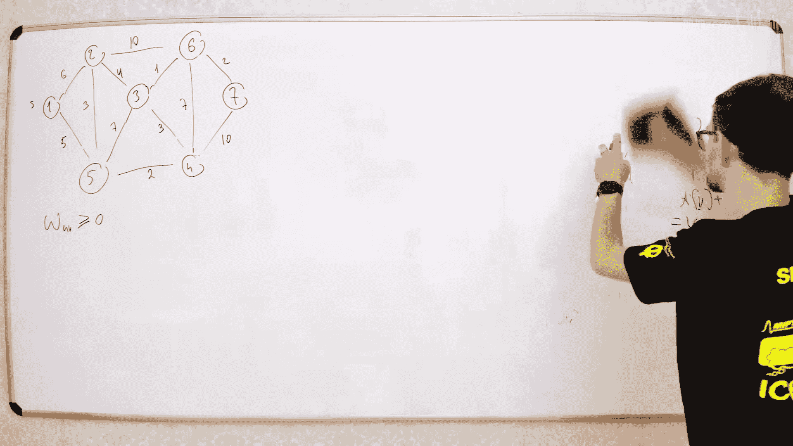
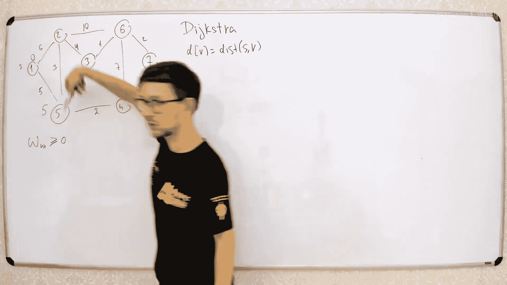

# 038：广度优先搜索与迪杰斯特拉算法 🚀


在本节课中，我们将要学习图论中的两种核心最短路径算法：**广度优先搜索**和**迪杰斯特拉算法**。我们将从最简单的等权图开始，逐步深入到带权图，并探讨算法的优化与变种。课程内容力求简单直白，确保初学者能够理解。


---



## 最短路径问题概述 🗺️



最短路径是图论中一个非常常见的问题。通常，你有一个图，图中有两个特定的节点：一个起点 **S** 和一个终点 **T**。你的目标是找到从 **S** 到 **T** 的**最短路径**。


这个问题不仅限于道路网络。有时，一个系统有多个状态，你需要找到从初始状态到目标状态所需的最少操作次数。在这些情况下，图就代表了状态之间的转移关系。


根据图的性质，问题有不同的变体。例如，图可以是有向的或无向的。对于我们将要讨论的大多数算法，图是否有向影响不大。如果是无向图，你可以简单地用两条方向相反的有向边替换每条无向边，这样最短路径问题就转化为了有向图问题。




---

## 等权图：广度优先搜索 🧭

首先，我们讨论最简单的情况：图中**所有边的权重都相同**。为了简化，我们假设每条边的权重都为 **1**。


在这种情况下，最短路径就是包含**最少边数**的路径。解决这个问题的算法称为**广度优先搜索**。

### BFS 的核心思想

BFS 的核心思想非常简单：我们按照**距离起点 S 的递增顺序**来探索图中的所有节点。我们先探索距离为 0 的节点（即 S 本身），然后是距离为 1 的节点（S 的所有邻居），接着是距离为 2 的节点，依此类推，直到我们找到终点 T。


### BFS 的逐步演示

让我们通过一个例子来演示这个过程。假设我们有如下图的节点：


1.  **距离 0**：只有起点 S。我们标记 `dist[S] = 0`。
2.  **距离 1**：找到 S 的所有邻居（节点 2, 12, 9）。我们标记 `dist[2] = dist[12] = dist[9] = 1`。
3.  **距离 2**：对于所有距离为 1 的节点，找到它们尚未被访问的邻居。
    *   从节点 2 找到邻居 3，标记 `dist[3] = 2`。
    *   从节点 12 找到邻居 4, 5，标记 `dist[4] = dist[5] = 2`。
    *   从节点 9 找到邻居 7，标记 `dist[7] = 2`。
4.  重复这个过程，每次处理完距离为 `k` 的所有节点后，就去探索距离为 `k+1` 的节点，直到访问到终点 T 或所有可达节点。

### BFS 的算法实现

以下是 BFS 的一个经典实现，它使用一个**队列**来管理待探索的节点。

```python
from collections import deque

def bfs_shortest_path(graph, S, T):
    n = len(graph)  # 节点数量
    dist = [-1] * n  # 初始化所有距离为 -1（未访问）
    parent = [-1] * n  # 用于重建路径，记录每个节点的前驱节点

    dist[S] = 0
    queue = deque([S])  # 初始化队列，加入起点

    while queue:
        v = queue.popleft()  # 从队列左侧取出一个节点
        if v == T:
            break  # 如果找到终点，可以提前结束

        for u in graph[v]:  # 遍历节点 v 的所有邻居
            if dist[u] == -1:  # 如果邻居 u 未被访问过
                dist[u] = dist[v] + 1
                parent[u] = v  # 记录是从 v 到达 u 的
                queue.append(u)  # 将 u 加入队列末尾

    # 重建从 S 到 T 的路径
    if dist[T] == -1:
        return None, -1  # T 不可达

    path = []
    cur = T
    while cur != -1:
        path.append(cur)
        cur = parent[cur]
    path.reverse()  # 反转得到从 S 到 T 的路径
    return path, dist[T]
```

**算法解释**：
*   我们使用一个数组 `dist` 来记录每个节点到起点 S 的距离，初始化为 -1 表示“无穷远”或“未访问”。
*   我们使用一个队列 `queue`。首先将起点 S 入队。
*   只要队列不为空，我们就取出队首的节点 `v`，并检查它的所有邻居 `u`。
*   如果邻居 `u` 尚未被访问过（即 `dist[u] == -1`），那么我们就找到了从 S 到 u 的一条最短路径，其长度为 `dist[v] + 1`。我们更新 `dist[u]`，将 `u` 的前驱节点记录为 `v`，并将 `u` 入队。
*   当我们从队列中取出终点 T 时，循环可以提前终止，因为我们已经找到了最短距离。
*   最后，通过 `parent` 数组从终点 T 回溯到起点 S，即可重建出完整的最短路径。

**时间复杂度**：每个节点和每条边都只被访问一次，因此时间复杂度为 **O(V + E)**，其中 V 是顶点数，E 是边数。

---



## BFS 的优化：双向搜索 🔄

上一节我们介绍了标准的 BFS，它从起点单向扩展。本节中我们来看看一种优化策略：**双向广度优先搜索**。

当图的规模非常大时（例如解魔方等状态空间巨大的问题），标准 BFS 需要探索的节点数量可能呈指数级增长。双向搜索可以显著减少需要探索的节点数。



### 双向搜索的思想

我们同时从起点 **S** 和终点 **T** 开始进行 BFS。
*   从 S 出发的搜索向前推进。
*   从 T 出发的搜索向后推进（在无向图中，向前和向后是等价的）。
*   当两个搜索的“前沿”相遇时，我们就找到了一条连接 S 和 T 的路径。


**为什么更高效？**
假设从起点和终点出发，探索到距离为 d 的节点数都约为 `α^d`（指数增长）。
*   标准 BFS 需要探索到总距离 D，节点数约为 `α^D`。
*   双向搜索每边只需探索大约 D/2 的距离，每边节点数约为 `α^(D/2)`。总探索节点数约为 `2 * α^(D/2)`，这远小于 `α^D`。

**算法要点**：
1.  维护两个队列和两个距离数组，分别对应从 S 和从 T 开始的搜索。
2.  在每一步中，选择两个队列中较小的那个进行扩展（以平衡两边的搜索进度）。
3.  当一个节点被**两个方向的搜索都访问过**时，搜索结束。假设该节点为 `v`，从 S 到 `v` 的距离为 `d1`，从 T 到 `v` 的距离为 `d2`，则最短路径长度可能是 `d1 + d2`。
4.  **注意**：对于等权图，相遇节点处的 `d1 + d2` 就是最短路径长度。对于带权图（后续介绍），情况会更复杂一些。

---

## 带权图：迪杰斯特拉算法 ⚖️

现在，我们考虑更一般的情况：图中**每条边都有不同的权重（非负）**。我们的目标是找到从 S 到 T 的**总权重和最小**的路径。


解决这个问题的经典算法是**迪杰斯特拉算法**。它的核心思想与 BFS 类似，也是按照**距离起点的递增顺序**来确定每个节点的最短距离，但这里“距离”指的是权重和。

### 迪杰斯特拉算法的核心思想

1.  我们将所有节点分为两个集合：
    *   **集合 A**：最短距离已确定的节点。
    *   **集合 B**：最短距离尚未确定的节点。
2.  初始时，集合 A 只包含起点 S，`dist[S] = 0`。其他节点的距离初始化为无穷大。
3.  重复以下步骤，直到所有节点都进入集合 A：
    a.  从集合 B 中选出**当前 `dist` 值最小**的节点 `v`。可以证明，此时 `dist[v]` 就是它的最终最短距离。
    b.  将节点 `v` 加入集合 A。
    c.  对于 `v` 的每个邻居 `u`，尝试进行**松弛操作**：如果 `dist[v] + weight(v, u) < dist[u]`，则更新 `dist[u] = dist[v] + weight(v, u)`。这意味着我们找到了一条经由 `v` 到达 `u` 的更短路径。

**为什么选择 `dist` 最小的节点是正确的？**
因为所有边权非负，所以当前 `dist` 值最小的节点 `v`，不可能通过其他尚未确定的节点获得更短的路径。任何其他从 S 到 v 的路径，在离开集合 A 的第一步，其距离就已经不小于 `dist[v]` 了。

### 迪杰斯特拉算法的实现与数据结构

算法的效率取决于如何高效地从集合 B 中取出 `dist` 最小的节点。以下是几种常见的选择：

1.  **使用数组**：每次遍历数组寻找最小值。时间复杂度为 **O(V²)**，适合稠密图。
2.  **使用二叉堆（优先队列）**：每次提取最小值和更新键值（松弛操作）的时间复杂度为 O(log V)。总时间复杂度为 **O((V+E) log V)**，适合稀疏图。
3.  **使用斐波那契堆**：提取最小值时间复杂度为 O(log V)，但降低键值（松弛）的时间复杂度为 **O(1)**（平摊）。总时间复杂度为 **O(E + V log V)**，理论效率更高。

以下是使用优先队列（最小堆）的典型实现：

```python
import heapq

def dijkstra(graph, S, T):
    n = len(graph)  # graph[u] 应返回列表 [(v, weight), ...]
    dist = [float('inf')] * n
    parent = [-1] * n
    dist[S] = 0

    # 优先队列，元素为 (当前距离, 节点)
    pq = [(0, S)]

    while pq:
        current_dist, v = heapq.heappop(pq)
        # 如果当前取出的距离大于记录的距离，说明是旧数据，跳过
        if current_dist > dist[v]:
            continue

        if v == T:
            break  # 找到终点，可提前结束

        for u, w in graph[v]:
            new_dist = current_dist + w
            if new_dist < dist[u]:
                dist[u] = new_dist
                parent[u] = v
                heapq.heappush(pq, (new_dist, u))

    # 重建路径
    if dist[T] == float('inf'):
        return None, -1

    path = []
    cur = T
    while cur != -1:
        path.append(cur)
        cur = parent[cur]
    path.reverse()
    return path, dist[T]
```

**算法解释**：
*   我们使用一个最小堆 `pq` 来存储 `(距离, 节点)` 对。
*   初始将起点 `(0, S)` 入堆。
*   每次从堆中弹出距离最小的节点 `v`。由于堆中可能存在同一节点的多个不同距离（在它被更新后），我们通过 `if current_dist > dist[v]: continue` 来跳过过时的条目。
*   对 `v` 的每个邻居 `u` 进行松弛操作。如果找到更短路径，就更新 `dist[u]` 和 `parent[u]`，并将新距离 `(new_dist, u)` 入堆。

---

## 迪杰斯特拉算法的变种与优化 🧠

### 双向迪杰斯特拉搜索

与 BFS 类似，迪杰斯特拉算法也可以从起点和终点同时进行。当两个搜索的已确定集合出现交集时，搜索可以终止。但是，与等权图不同，带权图中相遇点并不一定在最终的最短路径上。

**正确做法**：
当两个搜索相遇（即某个节点被两个方向的搜索都确定为最短路径节点）后，需要检查所有连接“起点搜索树”和“终点搜索树”的边 `(x, y)`，其中 `x` 在起点树中，`y` 在终点树中。最短路径长度为：
`min( dist_s[x] + weight(x, y) + dist_t[y] )`
其中 `dist_s` 和 `dist_t` 分别是从起点和终点出发计算的距离。

### A* 搜索算法

A* 算法是迪杰斯特拉算法的一个智能变种。它通过一个**启发式函数** `h(v)` 来指导搜索方向。`h(v)` 是对从节点 `v` 到终点 **T** 的**剩余距离的估计**。

**算法修改**：
在迪杰斯特拉算法使用 `dist[v]` 作为优先队列的键值时，A* 算法使用 `f(v) = dist[v] + h(v)` 作为键值。其中 `dist[v]` 是从起点 S 到 v 的当前最短距离。

**要求**：
启发式函数 `h(v)` 必须是**可采纳的**，即对于所有节点 v，有 `h(v) ≤ 实际从 v 到 T 的最短距离`。同时，通常还要求 `h(v)` 是**一致的**（或单调的），即对于任意边 `(u, v)`，有 `h(u) ≤ weight(u, v) + h(v)`。这保证了 A* 算法的正确性。

**效果**：
*   如果 `h(v) = 0`，A* 退化为迪杰斯特拉算法。
*   如果 `h(v)` 是实际剩余距离的完美估计，A* 将直接沿着最短路径搜索，效率最高。
*   一个好的启发式函数能显著减少需要探索的节点数量，将搜索方向“引导”向终点。

**为什么有效？**
可以证明，A* 算法等价于在一个修改了边权的新图上运行迪杰斯特拉算法。新图的边权为：`new_weight(u, v) = old_weight(u, v) + h(v) - h(u)`。在一致性启发函数保证下，新边权非负，迪杰斯特拉算法适用，且在新图上找到的路径对应原图的最短路径。


---

## 总结 📚

本节课中我们一起学习了图的最短路径算法。

1.  **广度优先搜索**：适用于所有边权相等的图。它按照距离起点的层数逐层扩展，使用队列实现，时间复杂度为 O(V+E)。我们还探讨了其优化版本——双向 BFS。
2.  **迪杰斯特拉算法**：适用于边权**非负**的带权图。它按照到起点的最短距离递增的顺序确定节点，使用优先队列实现，典型时间复杂度为 O((V+E) log V)。它的核心操作是“松弛”。
3.  **算法变种**：
    *   **双向迪杰斯特拉**：从起点和终点同时搜索，可能减少探索范围。
    *   **A* 搜索算法**：在迪杰斯特拉算法中引入启发式函数，引导搜索方向，在已知问题结构信息时能大幅提升效率。

理解这些算法及其背后的思想，是解决许多实际问题的关键，从地图导航到游戏 AI，再到状态空间搜索，它们都有着广泛的应用。