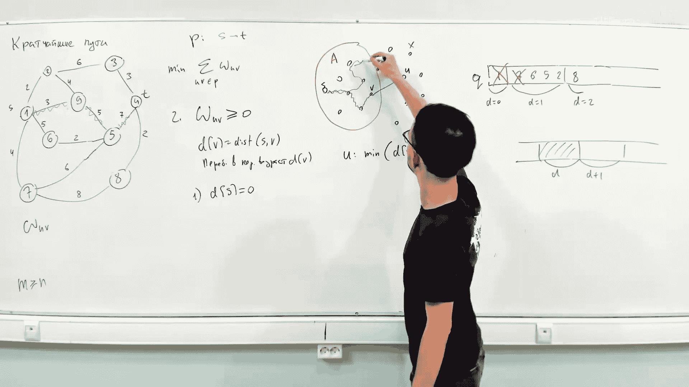
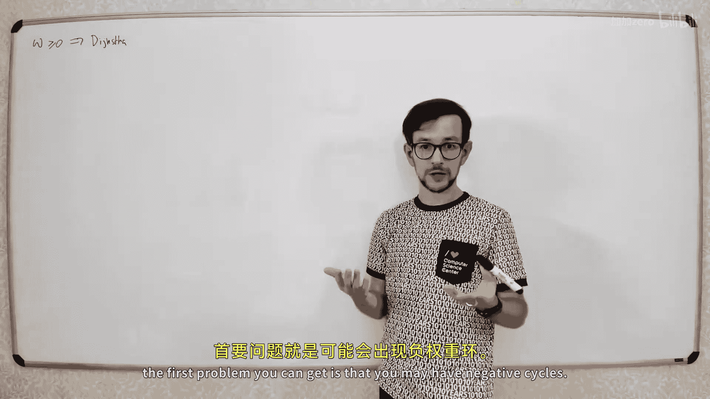
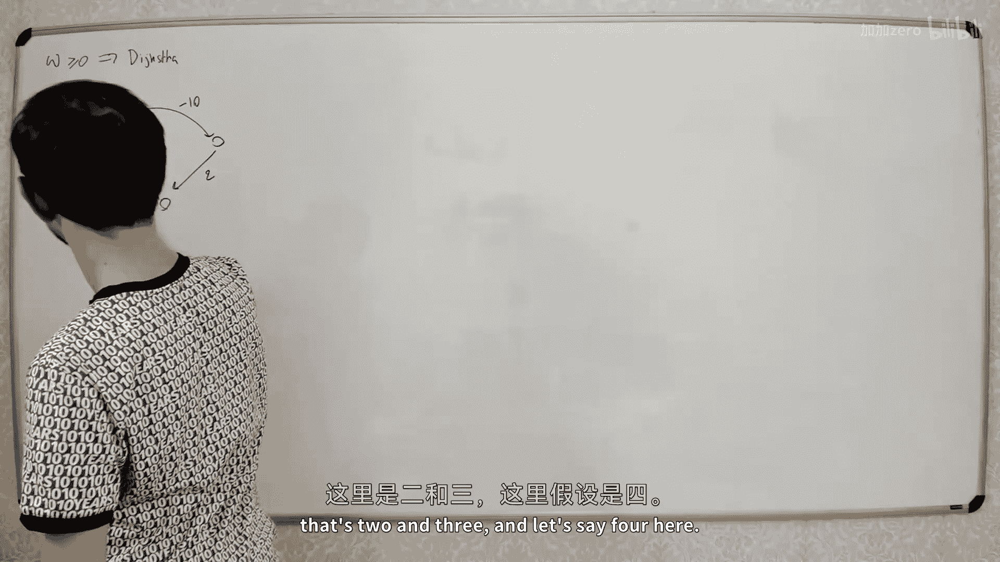
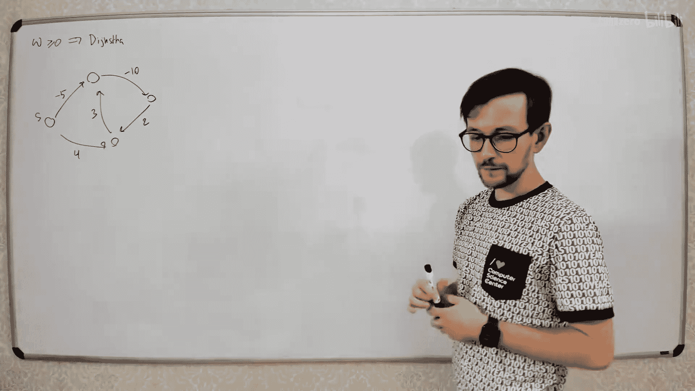
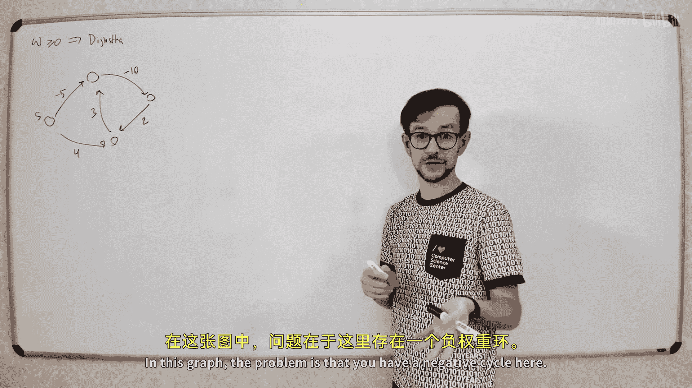
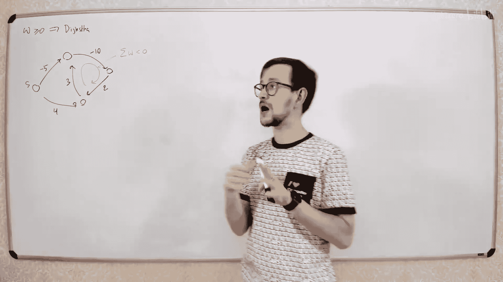
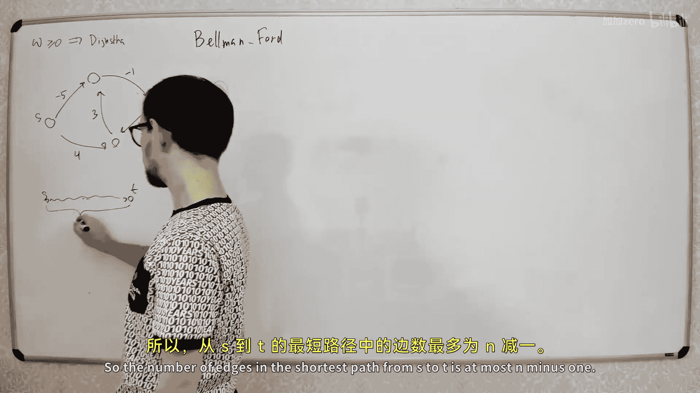
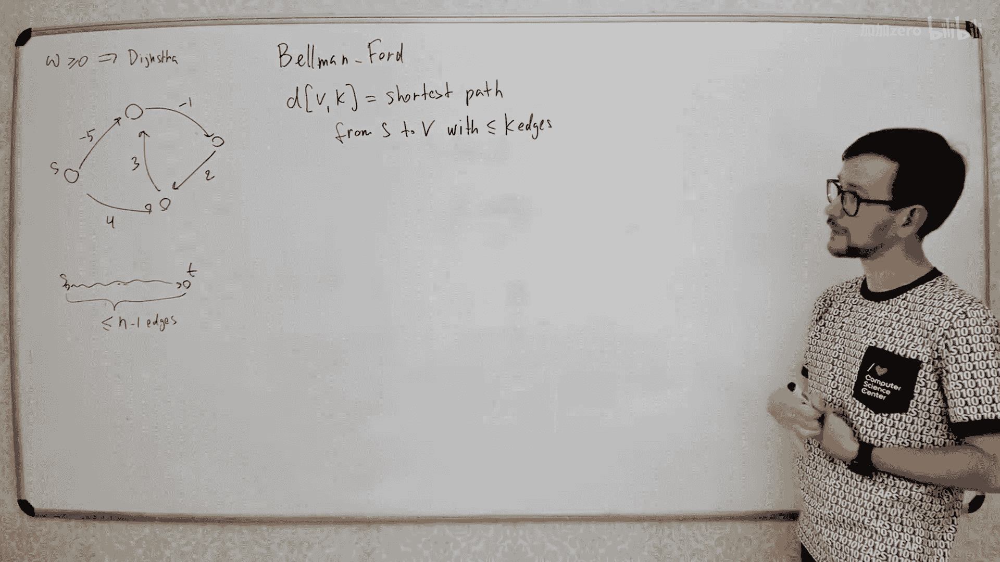
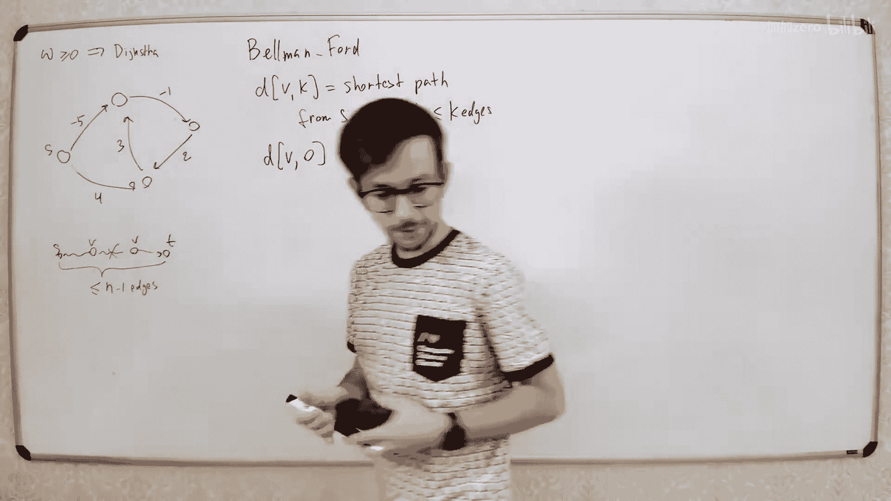
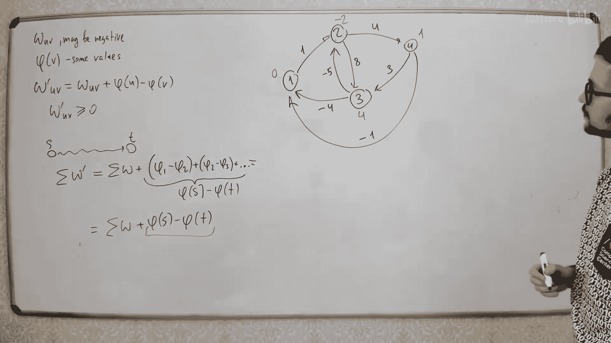

# 039：贝尔曼-福特与弗洛伊德-沃舍尔算法













在本节课中，我们将要学习两种用于处理带负权边图的单源最短路径算法：贝尔曼-福特算法和弗洛伊德-沃舍尔算法。我们将从负权边带来的问题开始，逐步推导出算法的原理、实现和优化。



## 负权边与负权环

上一节我们介绍了迪杰斯特拉算法，它要求图中所有边的权重均为非负值。本节中我们来看看当图中存在负权边时会发生什么。


首先，负权边可能导致一个严重问题：**负权环**。负权环是指一个环，其所有边的权重之和为负数。

**公式**：对于一个环 `C = (v1, v2, ..., vk, v1)`，如果 `sum(weight(vi, vi+1)) + weight(vk, v1) < 0`，则称 `C` 为负权环。


为什么负权环是问题？因为如果存在一条从起点 `s` 到终点 `t` 的路径包含一个负权环，你可以无限次地绕这个环行走，使得路径的总成本无限降低。因此，**不存在“最短”路径**，问题变得无定义。





如果我们限制路径必须是**简单路径**（不包含重复顶点），问题是否可解？答案是否定的。寻找最短简单路径是一个 NP 完全问题，因为我们可以通过将所有边权设为 -1，将寻找最长简单路径（即哈密顿路径）的问题归约到它。



因此，为了使最短路径问题有明确定义，我们**禁止图中存在任何负权环**。在此前提下，任何最短路径都必然是简单路径（因为可以移除非负权环而不增加总成本），且边数不超过 `n-1`。



## 贝尔曼-福特算法：动态规划思路

现在，我们来看如何在没有负权环的带负权图中寻找单源最短路径。贝尔曼-福特算法基于一个简单的动态规划思想。

我们定义状态 `d[v][k]`：从源点 `s` 到顶点 `v`、**最多使用 `k` 条边**的最短路径长度。

**初始化**：
*   当 `k = 0` 时，只有从 `s` 到其自身的空路径长度为 0。
*   因此：`d[s][0] = 0`，对于所有 `v != s`，`d[v][0] = +∞`。

**状态转移**：
考虑如何得到一条从 `s` 到 `v` 且最多使用 `k` 条边的路径。
1.  这条路径可能实际上使用了少于 `k` 条边。那么它的长度就是 `d[v][k-1]`。
2.  这条路径恰好使用了 `k` 条边。那么它的最后一条边一定来自某个顶点 `u`，即形式为 `s -> ... -> u -> v`。其中 `s -> ... -> u` 的部分最多使用 `k-1` 条边。
因此，我们需要检查所有指向 `v` 的边 `(u, v)`，并取最小值。

**转移方程**：
`d[v][k] = min( d[v][k-1], min_{(u,v)∈E}( d[u][k-1] + weight(u, v) ) )`

由于最短路径最多包含 `n-1` 条边，我们只需要计算 `k` 从 `1` 到 `n-1` 的情况。最终，`d[v][n-1]` 即为从 `s` 到 `v` 的最短路径长度。

以下是该动态规划思想的伪代码描述：
```
// 初始化
for each vertex v in V:
    if v == s:
        dist[v] = 0
    else:
        dist[v] = INFINITY

// 动态规划核心，进行 n-1 轮松弛
for i from 1 to |V|-1:
    for each edge (u, v) in E:
        if dist[u] + weight(u, v) < dist[v]:
            dist[v] = dist[u] + weight(u, v)
```

## 算法优化：空间与提前终止

上述动态规划需要一个二维数组。我们可以进行优化。

**空间优化**：
注意到计算 `d[v][k]` 时，只依赖于 `d[·][k-1]`。因此，我们可以只使用两个一维数组（代表当前轮和上一轮），甚至只使用一个一维数组 `dist[v]`。常见的贝尔曼-福特算法实现正是采用单数组形式，通过多轮“松弛”操作来更新距离。

**代码**：单数组实现的松弛操作。
```
if dist[u] + weight(u, v) < dist[v]:
    dist[v] = dist[u] + weight(u, v)
```

**提前终止优化**：
如果在某一轮松弛中，没有任何 `dist[v]` 被更新，说明所有最短路径已被找到，算法可以提前终止。

**负权环检测**：
如果图中存在从源点可达的负权环，那么进行第 `n` 轮松弛时，某些 `dist[v]` 仍然会被更新。因此，在完成 `n-1` 轮松弛后，再执行一轮松弛。如果仍有更新发生，则说明图中存在从源点可达的负权环。

**时间复杂度**：
最坏情况下需要 `O(V * E)` 次操作。对于稀疏图，这比迪杰斯特拉算法慢，但它能处理负权边。

## 弗洛伊德-沃舍尔算法：所有顶点对的最短路径

上一节我们介绍了解决单源问题的贝尔曼-福特算法。本节中我们来看看如何高效地求解**所有顶点对之间的最短路径**。

一个朴素的想法是对每个顶点运行一次贝尔曼-福特算法，时间复杂度为 `O(V^2 * E)`。弗洛伊德-沃舍尔算法提供了一个更优的解决方案，尤其适用于稠密图。

该算法也采用动态规划，但状态定义不同：
定义 `dist[k][i][j]`：从顶点 `i` 到顶点 `j`，且**中间顶点编号不超过 `k`** 的最短路径长度。

**初始化** (`k = 0`)：
此时不允许任何中间顶点。因此，`dist[0][i][j]` 就是边 `(i, j)` 的权重（如果存在），否则为 `+∞`。此外，`dist[0][i][i] = 0`。

**状态转移**：
考虑从 `i` 到 `j` 且中间顶点编号不超过 `k` 的路径。
1.  该路径不经过顶点 `k`。那么它的长度就是 `dist[k-1][i][j]`。
2.  该路径经过顶点 `k`。那么它可以分解为从 `i` 到 `k`（中间顶点编号不超过 `k-1`）和从 `k` 到 `j`（中间顶点编号不超过 `k-1`）两段。

**转移方程**：
`dist[k][i][j] = min( dist[k-1][i][j], dist[k-1][i][k] + dist[k-1][k][j] )`

同样，我们可以将三维数组压缩成一个二维数组 `dist[i][j]`，通过循环 `k` 从 `1` 到 `n` 来进行原地更新。

以下是算法的核心伪代码：
```
// 初始化 dist 矩阵为邻接矩阵
let dist be a |V| × |V| matrix of minimum distances initialized to INFINITY
for each vertex v:
    dist[v][v] = 0
for each edge (u, v):
    dist[u][v] = weight(u, v)

// 弗洛伊德-沃舍尔算法核心
for k from 1 to |V|:
    for i from 1 to |V|:
        for j from 1 to |V|:
            if dist[i][k] + dist[k][j] < dist[i][j]:
                dist[i][j] = dist[i][k] + dist[k][j]
```

**负权环检测**：
在算法结束后，检查 `dist[i][i]`（对角线）。如果存在某个 `i` 使得 `dist[i][i] < 0`，则说明图中存在经过顶点 `i` 的负权环。

**时间复杂度**：
三重循环导致时间复杂度为 `O(V^3)`。对于稠密图（`E ≈ V^2`），这比运行 `V` 次贝尔曼-福特算法 (`O(V^2 * E) ≈ O(V^4)`) 要快得多。

## 约翰逊算法：重赋权与结合运用

最后，我们介绍一个结合了贝尔曼-福特和迪杰斯特拉算法思想的技巧——约翰逊算法。它适用于需要**多次从不同源点计算最短路径**的场景。

**核心思想**：通过**重赋权**，将原图 `G` 转换为所有边权为非负的新图 `G’`，且在新图中的最短路径与原图对应。

**重赋权方法**：
为每个顶点 `v` 分配一个势能 `h[v]`。对于每条边 `(u, v)`，定义其新权重为：
`weight'(u, v) = weight(u, v) + h[u] - h[v]`

**性质**：
对于任意路径 `p = (v0, v1, ..., vk)`，新路径长度满足：
`weight'(p) = weight(p) + h[v0] - h[vk]`
由于 `h[v0] - h[vk]` 对于所有从 `v0` 到 `vk` 的路径是常数，因此**路径的相对长度顺序不变**，最短路径保持不变。



**如何选择势能 `h[v]`**：
我们可以通过运行一次**贝尔曼-福特算法**来得到合适的势能。具体做法是：
1.  向原图添加一个虚拟源点 `s'`，并添加从 `s'` 到所有原图中顶点的边，权重为 `0`。
2.  以 `s'` 为源点运行贝尔曼-福特算法，得到从 `s'` 到每个顶点 `v` 的最短距离 `dist[s'][v]`。
3.  令 `h[v] = dist[s'][v]`。

可以证明，这样定义的 `h[v]` 能保证 `weight'(u, v) = weight(u, v) + h[u] - h[v] >= 0`（这本质上是三角不等式）。

**算法步骤**：
1.  添加虚拟源点，运行一次贝尔曼-福特算法，得到势能 `h[v]`，并检测原图是否有负权环。
2.  根据 `h[v]` 重赋权，得到所有边权非负的新图 `G’`。
3.  在 `G’` 上，对每个需要计算最短路径的源点，运行更快的**迪杰斯特拉算法**。

**优势**：
如果需要计算所有顶点对的最短路径，总时间复杂度为：一次贝尔曼-福特 `O(V*E)`，加上 `V` 次迪杰斯特拉。若使用二叉堆实现迪杰斯特拉，总时间为 `O(V*E + V*E log V)`。对于稀疏图，这比弗洛伊德-沃舍尔算法的 `O(V^3)` 更优。

## 总结

本节课中我们一起学习了处理带负权边图的最短路径算法。
*   我们首先明确了**负权环**会使最短路径问题无定义，因此算法通常假设图中不含负权环。
*   **贝尔曼-福特算法**基于动态规划，通过 `V-1` 轮松弛操作求解单源最短路径，时间复杂度为 `O(V*E)`，并能检测负权环。
*   **弗洛伊德-沃舍尔算法**通过动态规划求解所有顶点对的最短路径，使用三重循环，时间复杂度为 `O(V^3)`，适合稠密图。
*   **约翰逊算法**巧妙地结合了前两者，通过重赋权消除负权边，从而可以运用更快的迪杰斯特拉算法，在需要多次计算最短路径时（尤其是稀疏图）效率更高。

理解这些算法的核心思想、状态定义以及它们之间的关联，是掌握图论最短路径问题的关键。