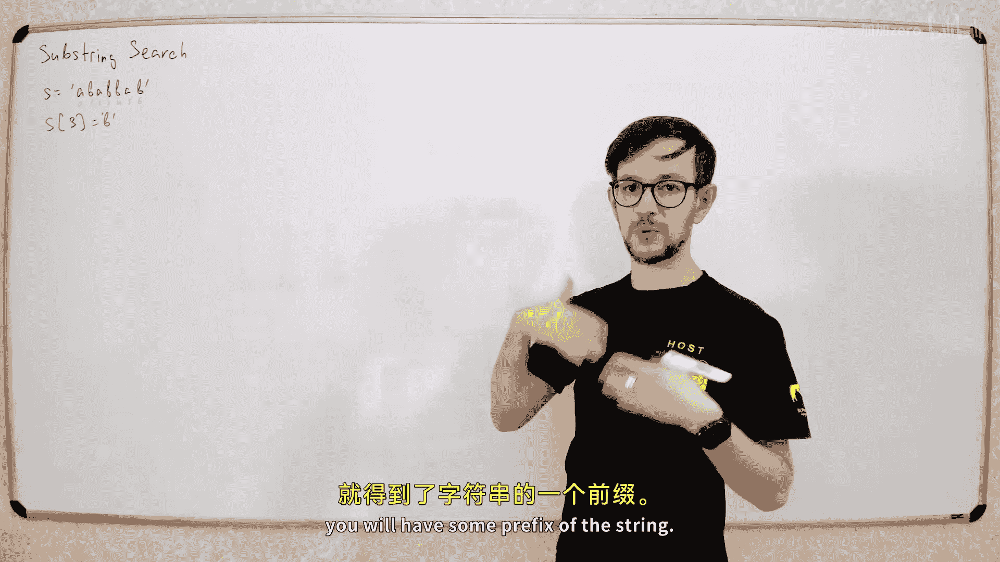
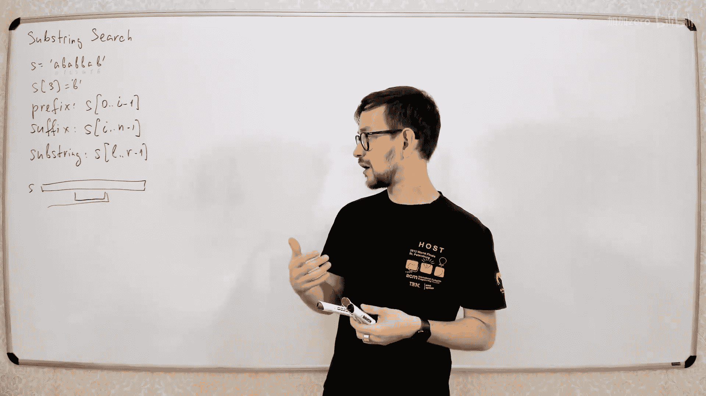
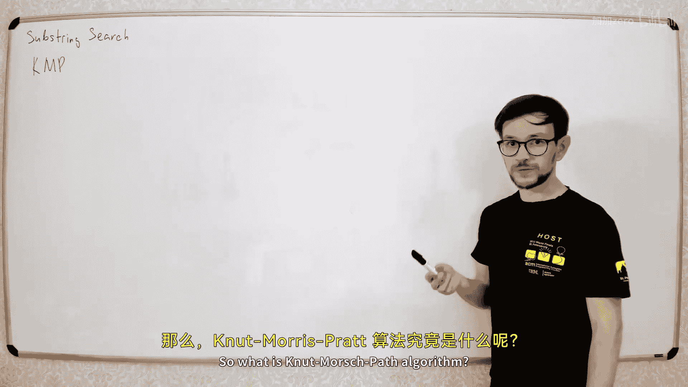
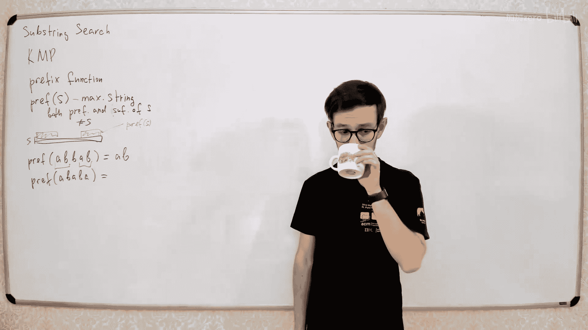
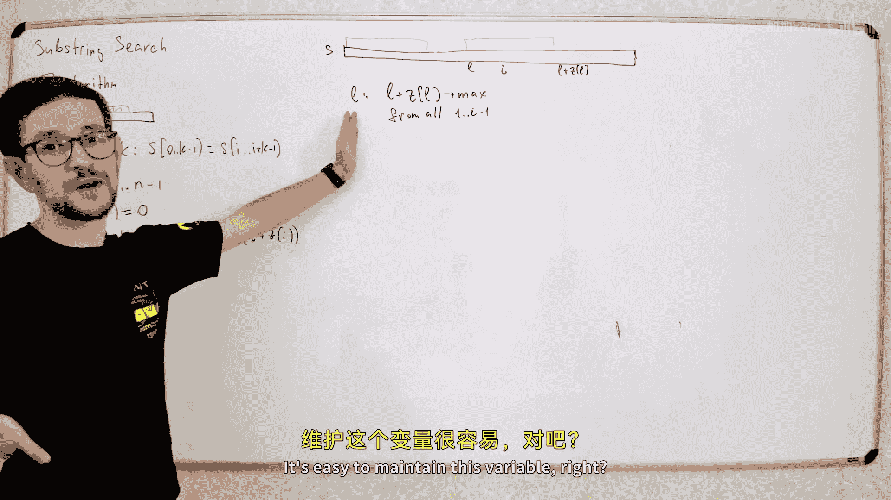

# 041：哈希、KMP与Z算法





在本节课中，我们将要学习处理字符串的基础算法。我们将从最基础的子串查找问题开始，逐步介绍三种核心的字符串处理技术：基于哈希的快速查找、经典的KMP算法以及高效的Z算法。这些算法是解决许多复杂字符串问题的基础。


---



## 字符串基础

字符串本质上是一个字符数组。

例如，一个字符串 `S` 可以是 `A, B, A, B, B`。每个字符串只是一个字母序列。

对字符串的基本操作包括在常数时间内获取任意位置的字符，就像操作数组一样。例如，给定索引 `0, 1, 2, 5, 6`，你可以直接通过索引访问字符。

字符串的某些部分有特定的名称：
*   **前缀**：取字符串开头的任意多个字符。例如，取前 `i` 个字符 `S[0..i-1]`，就得到了一个长度为 `i` 的前缀。
*   **后缀**：取字符串末尾的任意多个字符。
*   **子串**：取字符串中从位置 `L` 到 `R-1` 的任意连续字符序列 `S[L..R-1]`。

关于这些部分有一些有趣的性质：
*   任何前缀的前缀，仍然是前缀。
*   任何后缀的后缀，仍然是后缀。
*   任何前缀的后缀，是一个子串。换句话说，**任何子串都是某个前缀的后缀**。
*   同样，任何后缀的前缀，也是一个子串。所以，**任何子串也是某个后缀的前缀**。

这些是字符串部分的基本定义，也是我们本节讨论字符串算法所需的基础知识。

---

## 子串查找问题

本节我们将讨论的核心问题是**子串查找**。

子串查找问题描述如下：你有一段很长的文本 `T`（一个大字符串），以及一个较短的字符串 `S`（模式串）。你需要在文本 `T` 中找到一个子串，这个子串与 `S` 完全相同。

形式化地说，给定文本 `T`（长度为 `N`）和模式串 `S`（长度为 `M`），我们需要找到一个位置 `i`，使得子串 `T[i..i+M-1]` 等于字符串 `S`。这就是整个问题。

---

## 朴素算法

让我们从一个非常简单的算法开始：暴力匹配。

算法思路是尝试所有可能的位置 `i`，对于每个位置，取出对应的子串并与 `S` 进行比较。

以下是该算法的伪代码：
```python
for i from 0 to N - M:
    if T[i..i+M-1] == S:
        return i
return -1
```

让我们讨论这个算法的时间复杂度。外层循环最多进行 `N` 次迭代。但是，字符串比较操作 `T[i..i+M-1] == S` 并不是常数时间的，它需要逐个字符比较，因此需要 `O(M)` 的时间。所以，总的时间复杂度是 `O(N * M)`。

这个算法虽然正确，但速度较慢。今天我们的目标就是寻找更聪明、更快速的方法来解决这个问题。

---

## 基于哈希的算法

第一种改进时间复杂度的方法是使用**哈希函数**。

核心思想是：大多数情况下，字符串比较的结果是“不相等”。如果我们能在常数时间内判断两个字符串“很可能不相等”，就能节省大量时间。

我们可以比较两个字符串的哈希值，而不是直接比较字符串本身。如果两个字符串的哈希值不相等，那么这两个字符串一定不相等。如果哈希值相等，我们才需要进行一次精确的字符串比较来确认（因为存在哈希碰撞的可能）。

以下是改进后的算法框架：
```python
hash_S = hash(S)
for i from 0 to N - M:
    hash_sub = hash(T[i..i+M-1])
    if hash_sub != hash_S:
        continue # 哈希值不同，子串一定不同，跳过
    if T[i..i+M-1] == S: # 哈希值相同，进行精确比较
        return i
return -1
```

这带来了两个需要解决的问题：
1.  **碰撞问题**：我们需要一个好的哈希函数，使得不同字符串哈希值相同的概率尽可能小。
2.  **计算效率**：我们需要能够快速计算文本中每个子串的哈希值。如果每次计算都需要 `O(M)` 时间，那么我们没有获得任何改进。

接下来，我们将解决这两个问题。

---

### 多项式哈希函数

我们将使用一种称为**多项式哈希**的函数。对于一个字符串 `S`（字符序列 `S0, S1, ..., S_{n-1}`），我们将其每个字符视为一个数字（例如ASCII码或字母表索引），然后构造一个多项式：

**H(S) = (S0 * x^{n-1} + S1 * x^{n-2} + ... + S_{n-1} * x^0) mod M**

其中 `x` 和 `M` 是我们选择的参数。`M` 通常是一个大质数，`x` 是一个随机数。

**为什么这个哈希函数好？**
考虑两个不同的字符串。它们的哈希值相同，意味着对应的两个多项式在模 `M` 下相等，即 `x` 是它们差多项式的根。一个 `n` 次多项式最多有 `n` 个根。如果我们随机选择 `x`，那么碰撞的概率大约为 `n / M`。通过选择足够大的 `M`（例如接近 `2^64`），我们可以使碰撞概率极低。

---

### 滚动哈希

现在解决第二个问题：如何高效计算文本中连续子串的哈希值？

假设我们已经计算了子串 `T[i..i+M-1]` 的哈希值 `H`。当窗口向右移动一位，我们需要计算 `T[i+1..i+M]` 的哈希值 `H‘`。

设多项式为：
*   `H = T[i]*x^{M-1} + T[i+1]*x^{M-2} + ... + T[i+M-1]*x^0`
*   `H' = T[i+1]*x^{M-1} + T[i+2]*x^{M-2} + ... + T[i+M]*x^0`

观察可得，`H'` 可以通过 `H` 快速计算：
**H' = (H * x - T[i] * x^M + T[i+M]) mod M**

这样，我们就能在常数时间内从一个子串的哈希值推导出下一个子串的哈希值。

---

### 完整算法与复杂度




结合滚动哈希，完整的算法如下：
1.  预计算模式串 `S` 的哈希值 `hash_S`。
2.  预计算文本 `T` 第一个长度为 `M` 的子串的哈希值 `hash_T`。
3.  遍历所有起始位置 `i`：
    *   比较 `hash_T` 与 `hash_S`。
    *   如果不同，则子串一定不同，继续循环。
    *   如果相同，则进行精确字符串比较。若相同则返回 `i`。
    *   使用滚动哈希公式更新 `hash_T` 为下一个子串的哈希值。


**时间复杂度**：外层循环 `O(N)`，每次循环中的哈希比较和更新是 `O(1)`。只有当哈希值相等时（概率极低）才进行 `O(M)` 的精确比较。因此，**期望时间复杂度接近 O(N)**。



**关于确定性与随机性**：基于哈希的算法是概率算法。在非关键系统中（如推荐系统），因其高效性而被广泛使用。在要求绝对正确的关键系统中，则需要使用接下来介绍的确性算法。

---

### 哈希的扩展应用

多项式哈希的强大之处不止于此。通过预处理字符串所有前缀的哈希值，我们可以在常数时间内计算**任意子串**的哈希值。

1.  预处理前缀哈希数组 `pref_hash`，其中 `pref_hash[i]` 是字符串 `S[0..i-1]` 的哈希值。这可以在 `O(N)` 时间内完成。
2.  要计算子串 `S[L..R-1]` 的哈希值，使用公式：
    **hash(S[L..R-1]) = (pref_hash[R] - pref_hash[L] * x^{R-L}) mod M**

这个性质非常有用，例如：
*   **快速比较任意两个子串是否相等**：比较它们的哈希值即可。
*   **统计一组字符串中不同字符串的个数**：计算每个字符串的哈希值放入集合，集合的大小就是近似答案。需要注意，当字符串数量 `k` 很大时，至少发生一次碰撞的概率大约为 `k^2 * P`（`P` 为单次碰撞概率），因此仍需谨慎选择参数。

---

## KMP 算法

现在，我们转向一种完全确定性的、无需随机化的经典算法——**KMP算法**（Knuth-Morris-Pratt算法）。

KMP算法的核心思想是利用一个称为**前缀函数**的预计算信息来避免在匹配失败时回退文本指针，从而实现线性时间匹配。

---

### 前缀函数

前缀函数 `π(i)` 定义为：对于字符串 `S` 的长度为 `i+1` 的前缀 `S[0..i]`，其**最长的、相等的真前缀和真后缀**的长度。

*   “真”意味着不能是字符串本身。
*   例如，字符串 `"ABABA"`：
    *   前缀 `"A"`：没有相等的真前缀和真后缀，`π(0) = 0`。
    *   前缀 `"AB"`：没有相等的真前缀和真后缀，`π(1) = 0`。
    *   前缀 `"ABA"`：最长的相等真前缀和真后缀是 `"A"`，长度为1，`π(2) = 1`。
    *   前缀 `"ABAB"`：最长的相等真前缀和真后缀是 `"AB"`，长度为2，`π(3) = 2`。
    *   前缀 `"ABABA"`：最长的相等真前缀和真后缀是 `"ABA"`，长度为3，`π(4) = 3`。

**如何找到所有相等的前缀和后缀？** 从最大的匹配（即 `π(i)`）开始，其下一个更短的匹配就是 `π(π(i)-1)`，以此类推，直到长度为0。这形成了一个链式关系。

---

### 计算前缀函数数组

KMP算法的第一步是为模式串 `S` 计算其所有前缀对应的前缀函数值，得到一个数组 `p[]`，其中 `p[i] = π(i-1)`（即前缀 `S[0..i-1]` 的前缀函数值）。我们规定 `p[0] = -1` 以方便计算。

计算过程是递推的，从 `i=1` 到 `M-1`：
*   设 `k = p[i-1]`，即前一个前缀的最长相等前后缀长度。
*   我们检查字符 `S[i]` 是否等于 `S[k]`。
    *   如果相等，那么 `p[i] = k + 1`。
    *   如果不相等，则我们需要找一个更短的、也是前后缀的字符串，即令 `k = p[k]`，然后继续比较 `S[i]` 和 `S[k]`，直到 `k` 变为 `-1`。
*   如果 `k` 变为 `-1`，意味着没有匹配的前后缀，则 `p[i] = 0`。

以下是该算法的核心代码：
```python
p[0] = -1
for i in range(1, M):
    k = p[i-1]
    while k >= 0 and S[i] != S[k]:
        k = p[k]
    p[i] = k + 1
```

**时间复杂度证明**：关键在于 `while` 循环。变量 `k` 在循环中严格递减，而在每次外层循环中，`k` 最多增加1（`p[i] = k+1`）。因此，`k` 减少的总次数不会超过 `k` 增加的总次数 `O(M)`，所以整个算法是 **O(M)** 的。

---

### 使用KMP进行子串查找

有了模式串 `S` 的前缀函数数组 `p`，我们可以在文本 `T` 中进行查找。

算法使用两个指针：`i` 遍历文本 `T`，`j` 表示当前已匹配的模式串字符数。
1.  初始化 `i = 0`, `j = 0`。
2.  当 `i < N` 时循环：
    *   如果 `T[i] == S[j]`，则 `i++`, `j++`。
    *   如果 `j == M`，则匹配成功，返回 `i - M`。
    *   如果 `T[i] != S[j]`：
        *   如果 `j > 0`，根据前缀函数，将 `j` 回退到 `p[j-1]`（即已匹配部分的最长相等前后缀长度），然后继续比较 `T[i]` 和 `S[j]`。
        *   如果 `j == 0`，则直接 `i++`。

这个算法保证了文本指针 `i` 永不回退，因此总的时间复杂度是 **O(N + M)**。

一个更简单的实现技巧是：构造新字符串 `S + ‘#’ + T`，其中 `‘#’` 是一个不出现在 `S` 和 `T` 中的分隔符。然后对这个新字符串计算前缀函数数组。在数组的后半部分（对应原文本 `T` 的位置），如果某个 `p[i]` 的值等于 `M`，就意味着在位置 `i - M - 1`（考虑分隔符的偏移）处找到了一个匹配。

---

## Z 算法

最后，我们介绍另一种线性时间算法——**Z算法**。它与KMP算法思想类似，但是从另一个角度计算信息。

---

### Z 数组

对于字符串 `S`，Z数组 `z[i]` 定义为：从位置 `i` 开始的子串 `S[i..]` 与整个字符串 `S` 的**最长公共前缀**的长度。
*   通常我们定义 `z[0] = 0` 或不使用它。
*   例如，字符串 `"ABACABAB"`：
    *   `z[1]`：`"BACABAB"` 与 `"ABACABAB"` 的公共前缀长度为0。
    *   `z[2]`：`"ACABAB"` 与 `"ABACABAB"` 的公共前缀长度为0。
    *   `z[3]`：`"CABAB"` 与 `"ABACABAB"` 的公共前缀长度为0。
    *   `z[4]`：`"ABAB"` 与 `"ABACABAB"` 的公共前缀 `"AB"`，长度为2。



---

### 计算 Z 数组

计算Z数组也有一个高效的线性算法。它维护一个“匹配段” `[L, R]`，表示当前已知的、与前缀匹配的最右子串区间。

算法从左到右计算 `z[i]`：
1.  如果 `i > R`，则无法利用已知信息，朴素地逐个字符比较计算 `z[i]`。
2.  如果 `i <= R`，则可以利用 `z[i-L]` 的值。
    *   设 `k = i - L`。
    *   如果 `z[k] < R - i + 1`，那么 `z[i] = z[k]`。
    *   否则，我们知道 `S[0..R-i]` 与 `S[i..R]` 匹配，但 `R` 之后的情况未知。因此，从 `R+1` 开始继续朴素比较，并更新 `L = i`，`R` 为新的匹配右边界。

以下是算法框架：
```python
L = R = 0
z[0] = 0 # 或不使用
for i in range(1, N):
    if i > R:
        # 朴素扩展
        L, R = i, i
        while R < N and S[R] == S[R - i]:
            R += 1
        z[i] = R - L
        R -= 1
    else:
        k = i - L
        if z[k] < R - i + 1:
            z[i] = z[k]
        else:
            L = i
            while R < N and S[R] == S[R - i]:
                R += 1
            z[i] = R - L
            R -= 1
```

**时间复杂度证明**：算法中的 `while` 循环每执行一次，匹配段的右边界 `R` 都会向右移动。而 `R` 最多移动 `N` 次，因此总循环次数为 **O(N)**。

---

### 使用Z算法进行子串查找

与KMP类似，我们可以构造新字符串 `S + ‘#’ + T`。对这个新字符串计算Z数组。在数组的后半部分（对应原文本 `T` 的位置），如果某个 `z[i]` 的值等于 `M`（模式串长度），就意味着在位置 `i - M - 1` 处找到了一个匹配。

---

## 总结

本节课我们一起学习了三种重要的字符串子串查找算法：
1.  **基于哈希的算法**：利用多项式哈希和滚动哈希，在**期望 O(N)** 时间内完成查找。它实现简单、效率高，但属于概率算法。
2.  **KMP算法**：通过预计算模式串的**前缀函数**，在匹配失败时智能移动模式串指针，实现了**确定性的 O(N+M)** 时间查找。它是经典的字符串匹配算法。
3.  **Z算法**：通过计算字符串的**Z数组**，同样实现了**确定性的 O(N+M)** 时间查找。它从“每个后缀与整个字符串的匹配长度”这一角度提供信息。

KMP的“前缀函数”和Z算法的“Z函数”在本质上是相通的，可以相互转换。在不同的具体问题中，选择哪一种视角更为方便。掌握这些基础算法，是解决更复杂字符串问题（如后缀数组、自动机等）的关键第一步。