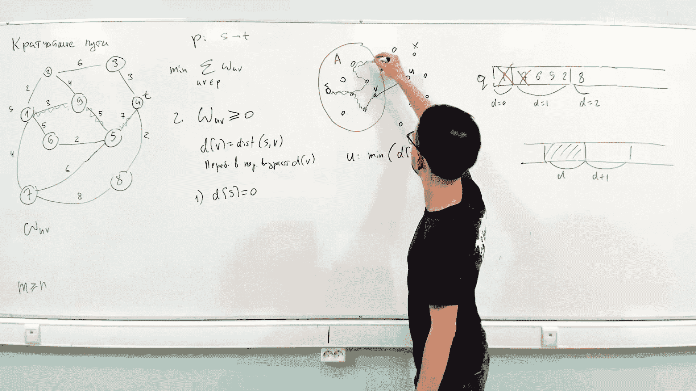
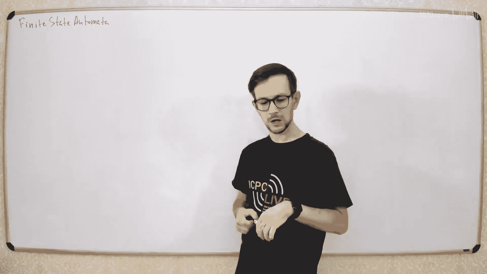
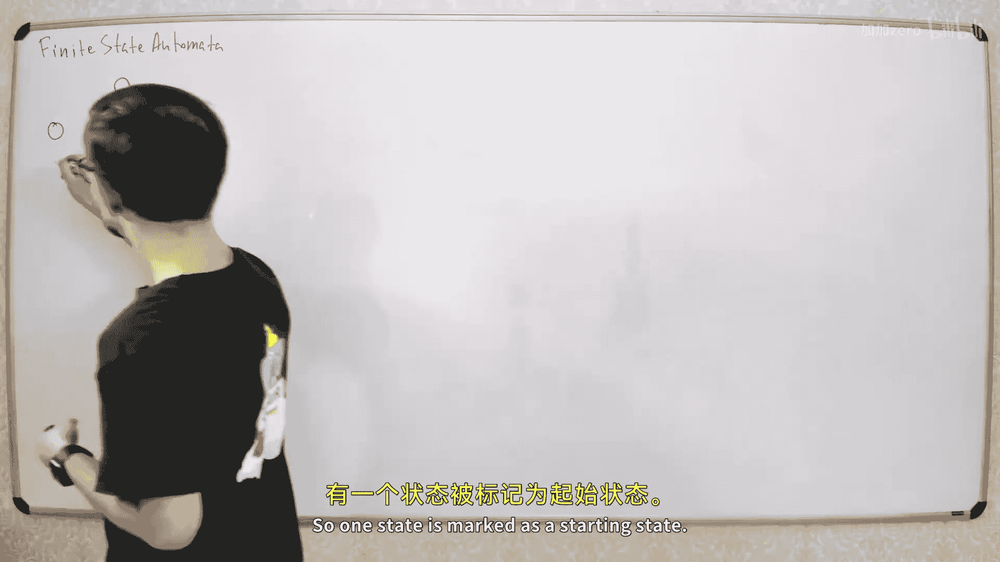
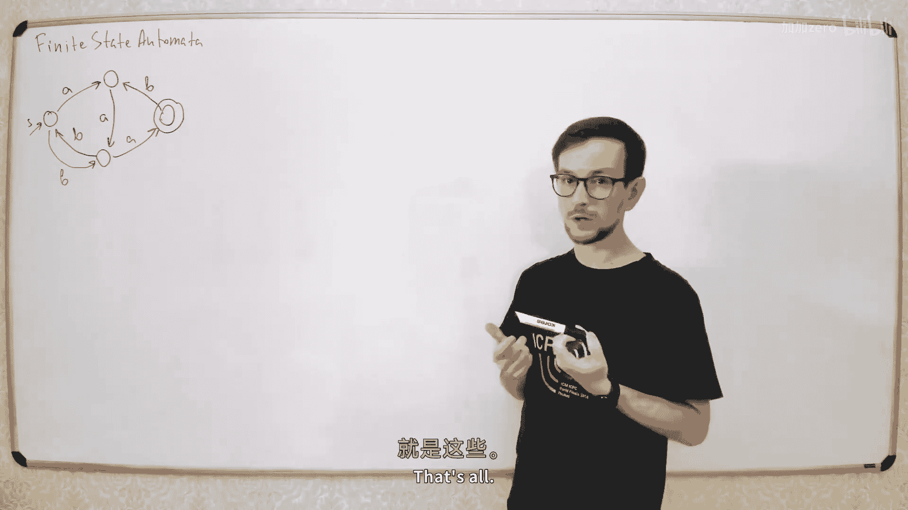
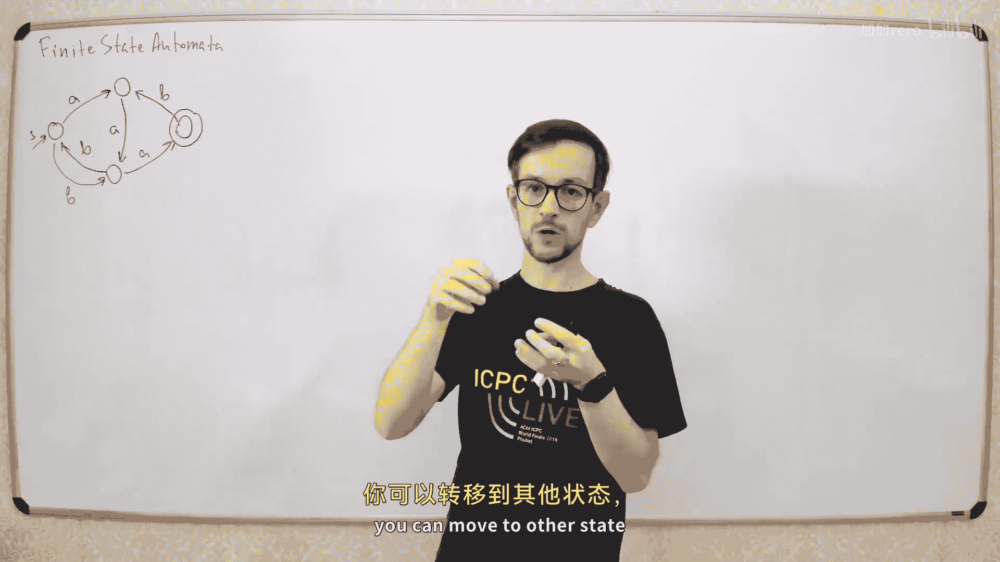
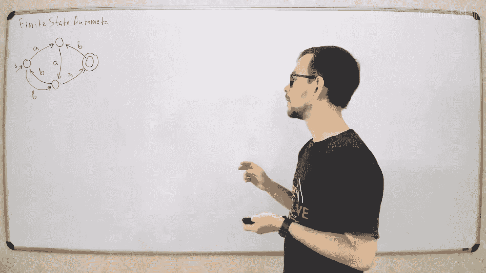
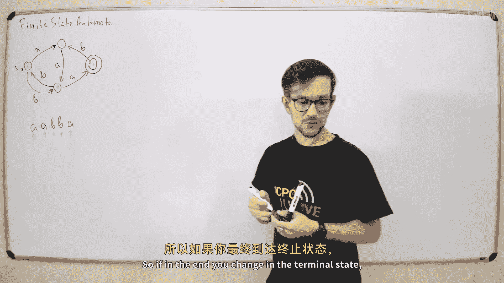
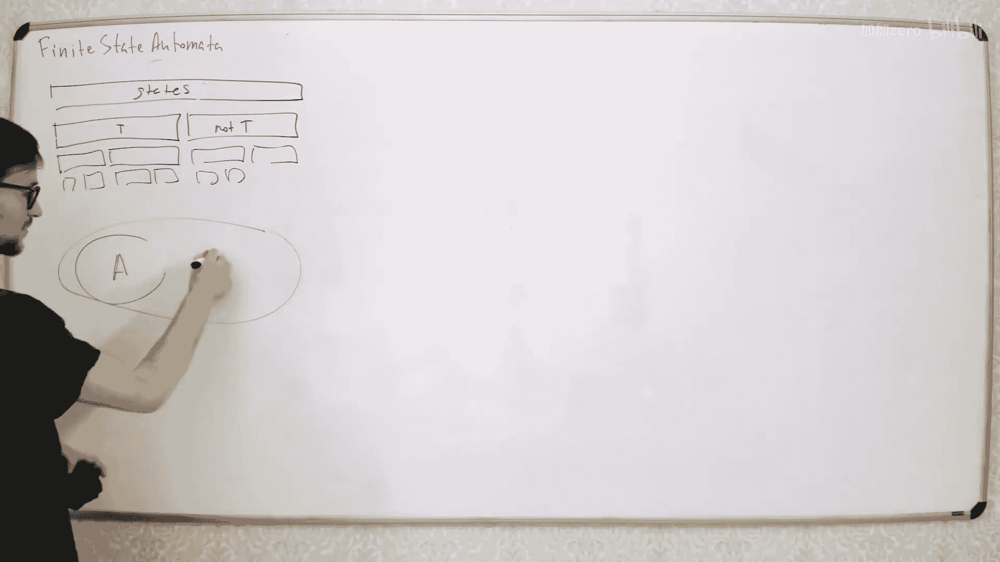

# 042：有限状态自动机 🎯

















在本节课中，我们将学习有限状态自动机（Finite State Automata）的基本概念、如何构建它，以及如何将其应用于算法问题中。我们将从简单的定义开始，逐步深入到构建特定自动机的算法，并学习如何最小化自动机。



---

## 什么是有限状态自动机？ 🤔

有限状态自动机本质上是一个包含若干状态的图。每个状态是图中的一个顶点。其中一个状态被标记为起始状态，一些状态被标记为终止状态。状态之间存在转移，每条转移都标记了字母表中的一个字母。

例如，假设我们有一个字母表，只包含字母 `A` 和 `B`。一个简单的自动机可能如下图所示：

```
起始状态 (S) --A--> 状态1 --B--> 终止状态 (T)
```

在这个自动机中，从起始状态 `S` 出发，读取字母 `A` 会转移到状态1，再从状态1读取字母 `B` 会转移到终止状态 `T`。

---

## 如何使用有限状态自动机？ 🛠️

给定一个字符串，自动机的工作方式非常简单。它从起始状态开始，然后依次读取字符串中的每个字母，并根据当前字母沿着对应的转移边移动到下一个状态。

例如，对于字符串 `"AB"`，自动机从起始状态 `S` 开始：
1.  读取 `A`，移动到状态1。
2.  读取 `B`，移动到终止状态 `T`。

如果处理完整个字符串后，自动机停留在某个终止状态，那么我们就说这个自动机**接受**这个字符串。

---

## 确定性与非确定性自动机 ⚙️

我们主要讨论**确定性有限状态自动机**。在这种自动机中，对于每个状态和字母表中的每个字母，**最多只有一条**对应的转移边。这意味着在任何状态下，给定一个输入字母，下一步的去向是唯一确定的。

也存在**非确定性有限状态自动机**，它允许从一个状态对同一个字母有多个转移。虽然功能更强大，但在算法中通常不那么实用，因为我们需要在多个可能的选择中做出决定，这通常很复杂。在本讲座中，我们主要关注确定性自动机。

---

## 自动机的作用：连接字符串与图问题 🌉

自动机就像一个桥梁，它将字符串问题转化为图问题。你有一个关于字符串的问题，可以构建一个对应的自动机。现在，你面对的就是一个关于图的问题，而我们已经学习了许多优秀的图算法。

例如，假设一个自动机定义了一个语言（即一组字符串的集合）。如果你想计算该语言中长度为 `n` 的字符串有多少个，你可以这样做：

每个被自动机接受的字符串，都对应着图中一条从起始状态到某个终止状态的路径。因此，计算长度为 `n` 的字符串数量，就等价于计算图中从起始状态到任意终止状态的、长度为 `n` 的路径数量。这可以通过动态规划轻松解决。

**动态规划公式示例：**
设 `dp[v][k]` 为从起始状态到顶点 `v`、长度为 `k` 的路径数量。
则 `dp[v][k] = sum(dp[u][k-1])`，其中 `u` 是所有能通过一条边到达 `v` 的状态。

---

## 构建接受特定子串的自动机 🧱

现在，让我们看一个具体的例子：如何构建一个自动机，它接受**所有包含给定字符串 `S` 作为子串**的文本。

假设 `S = "ABBA"`。我们想要构建的自动机 `A`，满足：对于任何文本 `T`，当且仅当 `S` 是 `T` 的子串时，`A` 接受 `T`。

### 构建思路

1.  **构建主干路径**：首先，自动机必须能接受字符串 `S` 本身。因此，我们创建一条路径，其转移边依次对应 `S` 的每个字符，并从起始状态通向一个终止状态。这条路径上的每个状态，都对应着 `S` 的一个前缀。
    *   状态0：对应空前缀 `""`（起始状态）
    *   状态1：对应前缀 `"A"`
    *   状态2：对应前缀 `"AB"`
    *   状态3：对应前缀 `"ABB"`
    *   状态4：对应前缀 `"ABBA"`（终止状态）

2.  **为其他状态添加转移**：关键点在于，每个状态 `i` 表示“当前已读文本的最长后缀，且该后缀是 `S` 的一个前缀”。当我们处于状态 `i`（对应前缀 `P_i`）并读入字符 `c` 时，我们需要找到新的最长后缀，它必须是 `P_i + c` 的后缀，同时是 `S` 的前缀。
    *   如果 `c` 正好等于 `S[i]`（即 `S` 的下一个字符），那么我们直接转移到状态 `i+1`。
    *   否则，我们需要回退。我们寻找更短的、`P_i` 的后缀，看看加上 `c` 后是否能成为 `S` 的前缀。这实际上就是计算 **KMP 算法中的前缀函数**。

3.  **处理终止状态**：一旦到达终止状态（状态4），意味着已经找到了子串 `S`。我们希望此后永远停留在这个接受状态。因此，在终止状态，我们为所有字母添加指向自身的循环转移。

### 高效构建算法

我们可以利用类似 KMP 算法中计算前缀函数的思想，在线性时间内构建这个自动机。我们维护一个 `next` 状态转移表。

**算法核心（伪代码）：**
```python
# 假设字母表为小写字母 a-z
# S 是模式串，长度为 m
# go[i][c] 表示在状态 i 读入字符 c 后转移到的状态
# 状态编号 0...m，其中 m 是终止状态

# 初始化所有转移为 0
go = [[0]*26 for _ in range(m+1)]

# 构建路径：对于 S 本身的字符
for i in range(m):
    c = S[i]
    go[i][ord(c)-ord('a')] = i+1

# 利用前缀函数快速构建其他转移
link = [0]*(m+1) # 前缀函数，link[0] = -1
j = 0
for i in range(1, m):
    # 计算前缀函数
    while j > 0 and S[i] != S[j]:
        j = link[j]
    if S[i] == S[j]:
        j += 1
    link[i+1] = j
    # 为状态 i+1 构建失败转移
    for c in range(26):
        if go[i][c] != 0:
            go[i+1][c] = go[i][c]
        else:
            go[i+1][c] = go[link[i+1]][c]
```

这个算法的时间复杂度是 `O(m * |字母表|)`。如果字母表大小是常数，那么就是 `O(m)` 的线性时间。

---

## 存储字符串集合：Trie 树 📚

另一个重要的自动机是 **Trie 树**（前缀树），它是一种特殊的确定性有限状态自动机，用于高效存储字符串集合。

**构建方法：**
1.  从单一的根节点（起始状态）开始。
2.  对于集合中的每个字符串，从根节点开始，依次添加字符对应的边和节点。
3.  每个字符串的最后一个字符对应的节点标记为终止状态。

**优点：**
*   **线性时间构建**：总构建时间为所有字符串长度之和 `O(总字符数)`。
*   **快速查询**：检查一个字符串是否在集合中只需 `O(字符串长度)` 时间。
*   **支持动态操作**：可以较容易地添加或删除字符串。
*   **表示所有前缀**：Trie 树不仅存储了字符串集合，还隐式存储了所有字符串的所有前缀，便于进行各种前缀相关的查询和计算。

---

## 自动机的最小化与等价性检查 ⚖️

对于一个给定的语言，可能存在许多接受它的不同自动机。**自动机最小化**的目标是找到状态数最少的那个等价的确定性有限状态自动机。



### 最小化算法原理

算法的核心思想是识别并合并**等价状态**。两个状态 `u` 和 `v` 是等价的，当且仅当：从它们出发，**所有**可能输入的字符串要么都导致接受，要么都导致拒绝。换句话说，它们无法被任何字符串区分。

**算法步骤（划分细化法）：**
1.  **初始划分**：将所有状态划分为两个组——终止状态组和非终止状态组。显然，这两组状态不等价。
2.  **迭代细化**：不断检查每个分组 `A`。对于每个输入字符 `c`，查看组内状态通过 `c` 转移到的目标状态组。
    *   如果组内所有状态通过 `c` 都转移到**同一个**目标组，则保持该组不变。
    *   否则，将组 `A` **分裂**为更小的子组，使得每个子组内的状态通过 `c` 都转移到同一个目标组。
3.  **重复**步骤2，直到没有任何分组可以再被分裂。此时，每个分组内的状态都是等价的。
4.  **合并**：将每个等价状态组合并成一个单一状态，更新转移关系，得到的就是最小自动机。

**Hopcroft 算法** 是执行上述划分过程的一个高效实现，时间复杂度可达 `O(n log n)`，其中 `n` 是状态数。

### 检查两个自动机是否等价

有了最小化算法，检查两个自动机 `A` 和 `B` 是否等价就很简单了：
1.  分别最小化 `A` 和 `B`。
2.  检查得到的最小自动机是否**同构**（即结构完全相同）。由于最小自动机在忽略状态命名的情况下是唯一的，所以如果它们同构，则原自动机等价；否则不等价。

更直接的方法是：将两个自动机视为一个更大的自动机，然后运行上述最小化算法。如果算法结束时，`A` 的起始状态和 `B` 的起始状态被划分在**同一个等价组**中，那么这两个自动机就是等价的。

---

## 总结 📝

本节课我们一起学习了有限状态自动机的核心知识：
1.  **基本概念**：自动机是一个带有标记转移边的图，包含起始状态和终止状态，用于识别字符串。
2.  **核心应用**：它将字符串问题转化为图问题，使我们能够利用动态规划等图算法来解决复杂的字符串计数、匹配问题。
3.  **特定自动机构建**：我们学习了如何为“包含某子串”这一语言构建自动机，并利用类似 KMP 前缀函数的思想实现线性时间构建。
4.  **Trie 树**：作为一种特殊的自动机，用于高效存储和查询字符串集合。
5.  **最小化与等价性**：我们了解了自动机最小化的原理，以及如何通过最小化来检查两个自动机是否描述同一种语言。

掌握有限状态自动机，为你解决各类字符串处理问题提供了又一个强大的工具。