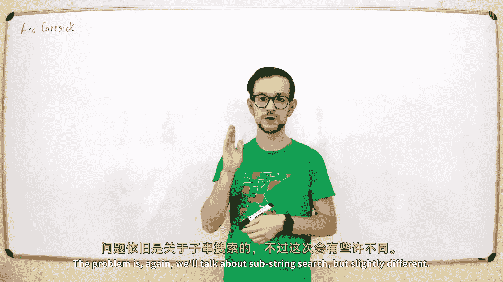
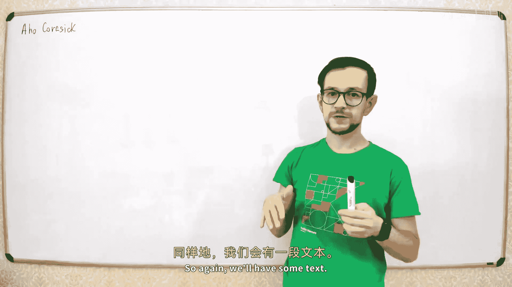
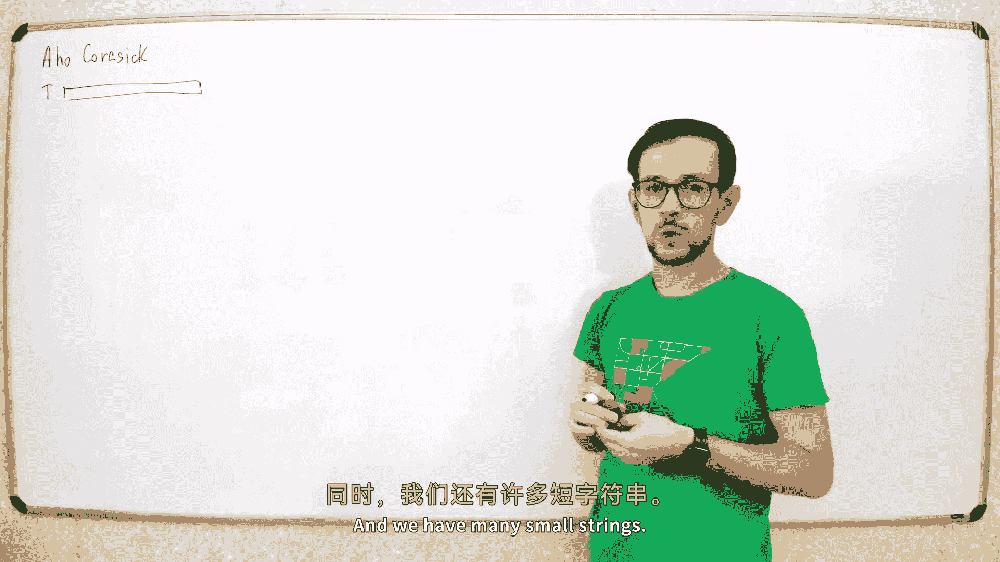
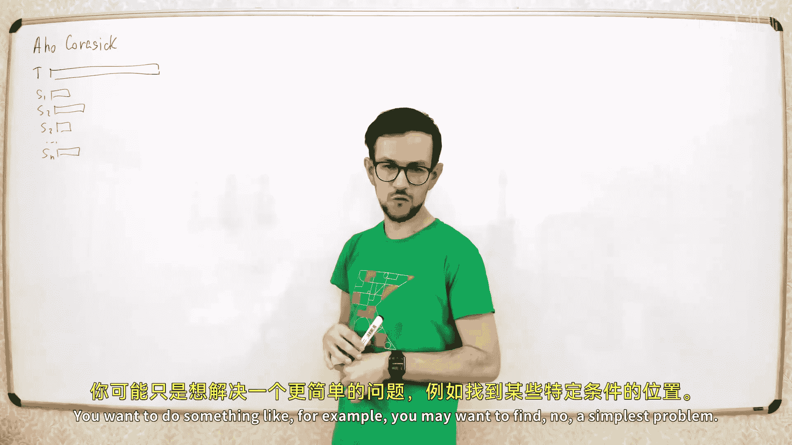
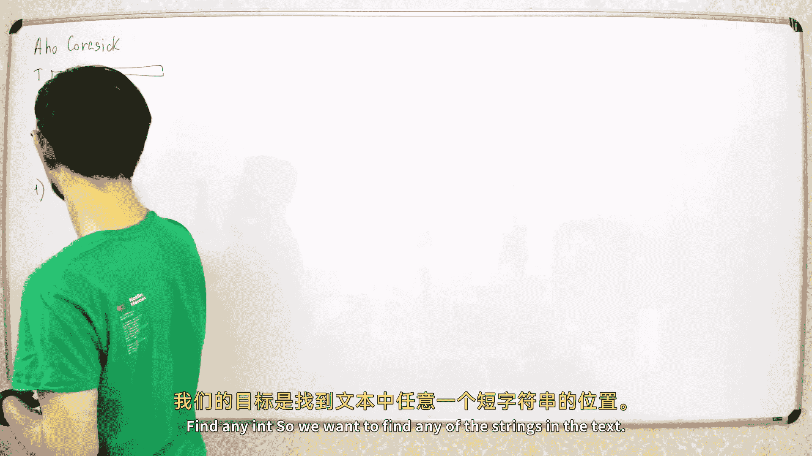
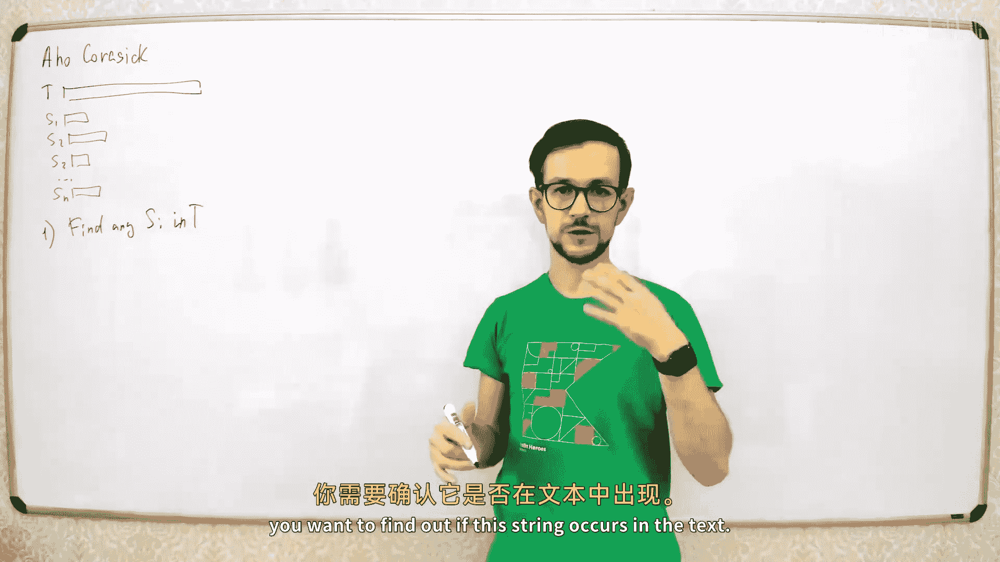
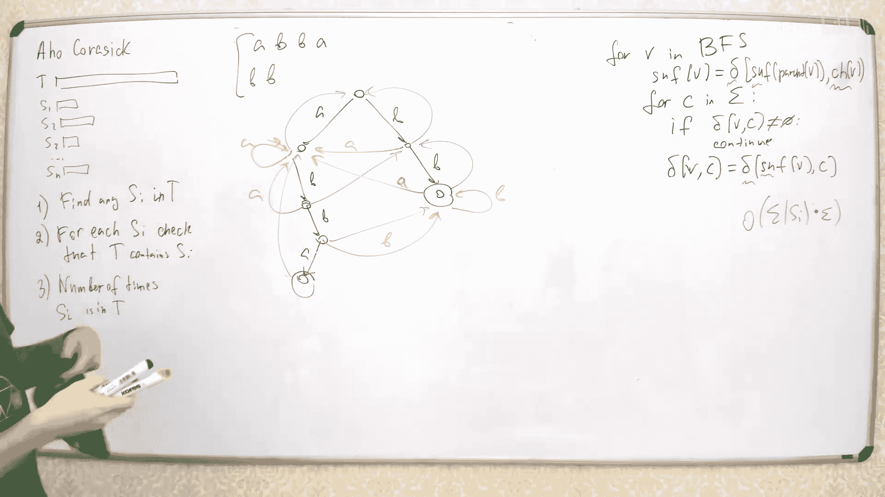

# 043：Aho-Corasick 算法 🎯












在本节课中，我们将学习 Aho-Corasick 算法。这是一个用于在文本中同时查找多个模式串的高效算法。我们将从问题定义开始，逐步构建算法的核心概念，并学习如何用它解决不同类型的字符串匹配问题。






## 问题定义

上一节我们讨论了单模式串的搜索算法。本节中，我们来看看一个更复杂的问题：**多模式串匹配**。

我们有一个很长的文本字符串 `T`，以及一组较短的字符串集合 `{S1, S2, ..., Sk}`。我们的目标是找出文本 `T` 中所有出现这些模式串的位置。

一个简单的解法是对每个模式串 `Si` 都运行一次 KMP 等线性搜索算法。但这样做的总时间复杂度是 `O(|T| * k)`，当文本很长或模式串很多时，效率很低。我们希望只对文本 `T` 进行一次扫描，就能找出所有模式串的出现。

## 构建 Trie 树 🌲

Aho-Corasick 算法的第一步是构建一个 **Trie 树**（前缀树），将所有模式串插入其中。

以下是构建 Trie 树的过程：
1.  从根节点（代表空字符串）开始。
2.  对于每个模式串 `Si`，从根节点出发，按字符依次向下走。
3.  如果当前字符对应的边不存在，则创建一个新的节点和边。
4.  当处理完一个模式串的所有字符后，标记最后一个节点为“终止节点”。

构建 Trie 树的时间复杂度是 `O(Σ|Si|)`，即所有模式串的总长度。

## 构建后缀链接 (Suffix Links) 🔗

上一节我们介绍了 Trie 树，本节中我们来看看 Aho-Corasick 算法的核心：**后缀链接**。

后缀链接类似于 KMP 算法中的 **前缀函数 (π)**。对于 Trie 树中的每个节点 `v`（代表一个字符串 `str(v)`），我们定义它的后缀链接 `link[v]` 指向另一个节点 `u`，使得 `str(u)` 是 `str(v)` 的**最长真后缀**，并且 `u` 也存在于 Trie 树中。如果不存在这样的后缀，则 `link[v]` 指向根节点。

**公式定义**：
对于节点 `v`，`link[v] = u`，其中 `str(u)` 是 `str(v)` 的最长真后缀，且 `u` 在 Trie 中。

以下是计算后缀链接的规则：
*   **根节点**：没有后缀链接（或指向一个虚拟的空节点）。
*   **深度为 1 的节点**（即代表单个字符的节点）：其后缀链接指向根节点。
*   **其他节点 `v`**：设其父节点为 `p`，从父节点到 `v` 的边上的字符为 `c`。要计算 `link[v]`，我们首先看 `link[p]` 指向的节点 `k`。然后，我们检查节点 `k` 是否有通过字符 `c` 的转移。如果有，则 `link[v]` 就指向那个转移的目标节点。如果没有，我们就继续查看 `link[k]`，重复此过程，直到找到这样的转移或到达根节点。

这个过程可以通过广度优先搜索 (BFS) 按节点深度递增的顺序高效完成。

## 构建转移函数 (Transitions) ➡️

有了后缀链接，我们就可以定义完整的**转移函数** `go(v, c)`。它表示当我们在状态（节点）`v` 时，读入下一个字符 `c` 后，应该转移到哪个状态。

转移函数的计算规则如下：
1.  如果节点 `v` 本身有一条标记为字符 `c` 的边指向子节点 `u`，那么 `go(v, c) = u`。
2.  否则，`go(v, c) = go(link[v], c)`。这里我们递归地利用后缀链接指向的更短后缀的状态来计算转移。这个递归过程最终会停止在根节点（根节点对所有字符都有定义，通常是转移到自身或一个初始状态）。

在实际实现中，我们可以用动态规划的方式，在计算后缀链接的同时或之后，一次性计算出所有 `(v, c)` 的转移，并存储起来。这样，在扫描文本时，每次转移都是 `O(1)` 时间。

**代码描述（伪代码）**：
```python
# 假设 nodes 是 Trie 节点列表，root = 0
# link[v] 是节点 v 的后缀链接
# next[v][c] 是节点 v 在字符 c 下的转移



def build_automaton():
    queue = [root]
    while queue:
        v = queue.pop(0)
        for c in alphabet:
            if next[v][c] exists: # 情况1：有直接子节点
                u = next[v][c]
                link[u] = next[link[v]][c] if v != root else root
                queue.append(u)
            else: # 情况2：无直接子节点，利用后缀链接
                next[v][c] = next[link[v]][c] if v != root else root
```

## 利用自动机进行匹配 🧲

现在，我们已经构建了一个完整的自动机。用它来扫描文本 `T` 并解决问题就非常直观了。

以下是匹配过程：
1.  初始化当前状态 `state = root`（根节点）。
2.  从左到右遍历文本 `T` 的每个字符 `c`：
    *   `state = go(state, c)`。根据转移函数移动到下一个状态。
    *   检查新状态 `state` 及其通过后缀链接可达的所有状态，看它们是否是“终止节点”，以报告匹配到的模式串。

关键在于，当处于某个状态 `state` 时，不仅 `state` 本身代表的字符串（某个模式串的前缀）是当前文本后缀，所有通过后缀链接链从 `state` 能回溯到的状态所代表的字符串，也都是当前文本的后缀。因此，我们需要检查这条链上的所有节点。

## 解决不同类型的问题 ✅

上一节我们介绍了匹配的基本过程，本节中我们来看看如何用这个框架解决课程开头提出的几类具体问题。

以下是三类典型问题的解法：

1.  **问题一：判断文本是否包含任意一个模式串**
    *   **解法**：在扫描文本时，只要当前状态 `state` 或其通过后缀链接可达的任意状态是终止节点，就立即返回 `True`。扫描完若未发现，则返回 `False`。

2.  **问题二：判断每个模式串是否在文本中出现**
    *   **解法**：在扫描文本时，记录所有访问过的状态（节点）。然后，通过后缀链接树（所有后缀链接反向构成的树），将这些“访问标记”**传播**给它们的祖先节点。如果一个状态被标记，意味着以它为后缀的某个前缀曾在文本中出现。最后，对于每个模式串对应的终止节点，检查它是否被标记，即可知该模式串是否出现。

3.  **问题三：计算每个模式串在文本中出现的次数**
    *   **解法**：在扫描文本时，对每个访问到的状态 `state`，将其计数器 `cnt[state]` 加 1。扫描结束后，在后缀链接树上进行一次**后缀和**累加：对于每个节点 `v`，将 `cnt[v]` 的值加到 `cnt[link[v]]` 上。这个过程完成后，对于每个模式串对应的终止节点 `v`，`cnt[v]` 的值就是该模式串在文本中出现的总次数。

## 算法复杂度分析 📊

让我们总结一下 Aho-Corasick 算法的时间和空间复杂度。

*   **构建 Trie 树**：`O(Σ|Si|)`。
*   **构建后缀链接和转移函数**：`O(Σ|Si| * |A|)`，其中 `|A|` 是字母表大小。如果字母表很大，我们可以选择不预计算所有转移，而是在匹配时动态计算，这样构建复杂度可降至 `O(Σ|Si|)`，但每次转移可能需要 `O(log |A|)` 或均摊 `O(1)` 时间。
*   **扫描文本**：`O(|T| + z)`，其中 `z` 是匹配到的模式串总数。因为每次状态转移是 `O(1)`，报告匹配的额外开销与匹配数成正比。

因此，对于字母表不大的情况，Aho-Corasick 算法是一种非常高效的多模式串匹配算法。

## 总结

本节课中我们一起学习了 **Aho-Corasick 算法**。我们从多模式串匹配的问题定义出发，首先构建了包含所有模式串的 **Trie 树**。然后，通过引入类似 KMP 前缀函数的 **后缀链接**，并在此基础上定义 **转移函数**，我们构建了一个强大的自动机。最后，我们学习了如何利用这个自动机一次性扫描文本，高效地解决“是否存在任意匹配”、“哪些模式串出现”以及“计算各模式串出现次数”等三类经典问题。该算法是处理字典匹配和关键词过滤等任务的基石。