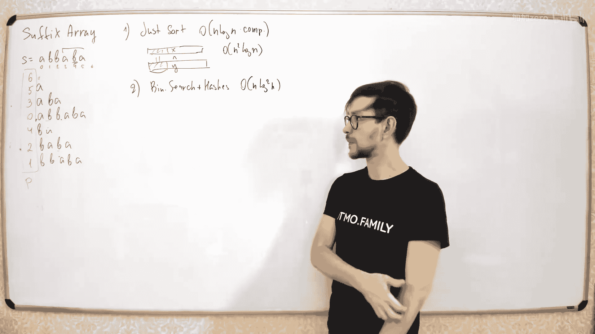
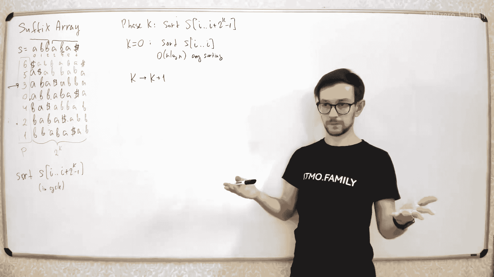
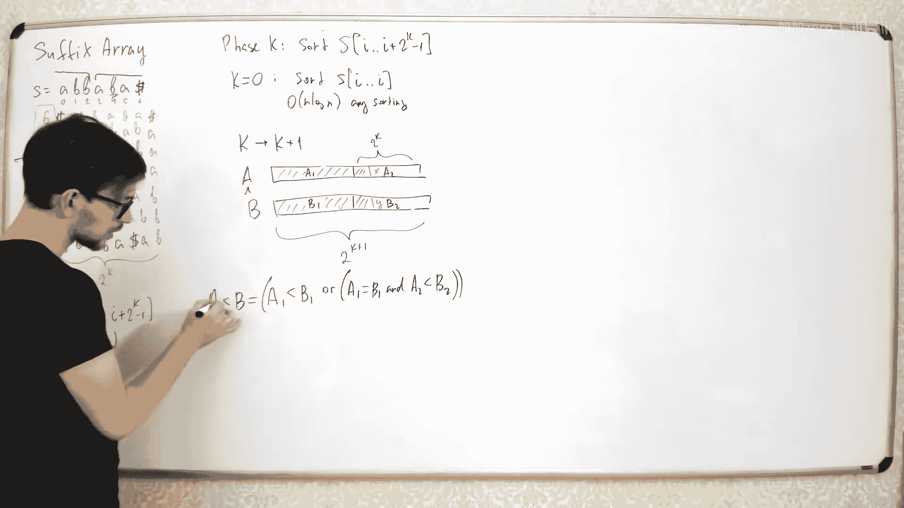
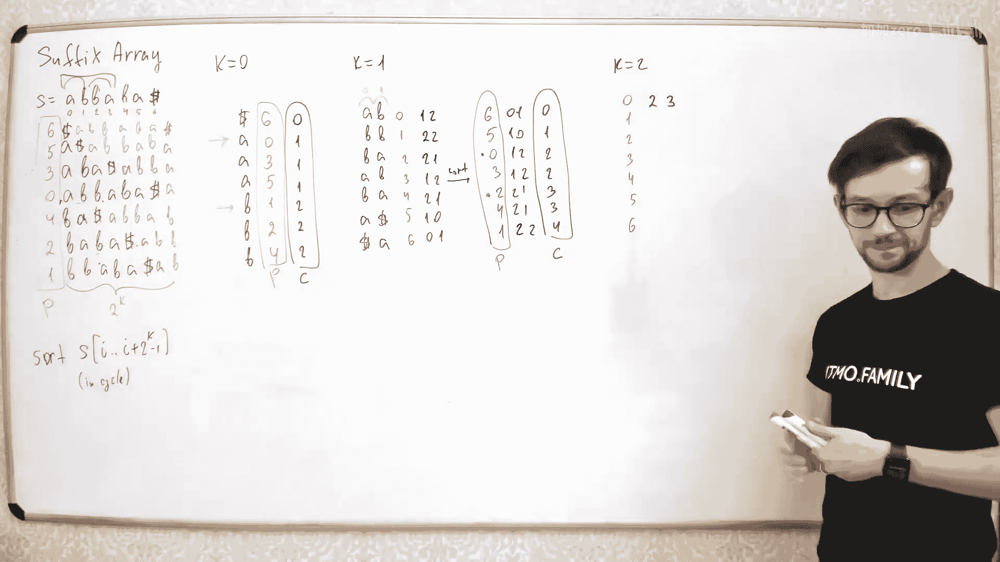
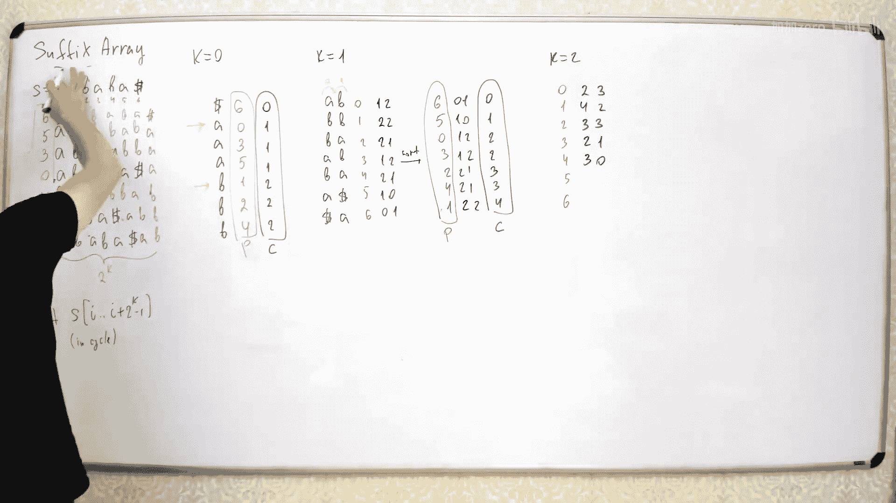

# 044：后缀数组

在本节课中，我们将要学习一种名为“后缀数组”的字符串数据结构。后缀数组是一种非常简洁且强大的工具，它能够帮助我们高效地解决许多与字符串子串相关的问题，例如在文本中快速查找子串。我们将学习后缀数组是什么、为什么需要它、如何构建它，以及如何利用它来回答查询。

## 什么是后缀数组？

后缀数组是一种简单的数据结构。给定一个字符串，后缀数组就是将该字符串的所有后缀按字典序排序后，记录每个后缀起始索引的数组。

例如，对于字符串 `ABBABA`，我们列出它的所有后缀：
*   起始于索引 0：`ABBABA`
*   起始于索引 1：`BBABA`
*   起始于索引 2：`BABA`
*   起始于索引 3：`ABA`
*   起始于索引 4：`BA`
*   起始于索引 5：`A`
*   起始于索引 6（空后缀）：` `

将这些后缀按字典序排序后得到：
1.  ` ` (空后缀)
2.  `A`
3.  `ABA`
4.  `ABBABA`
5.  `BA`
6.  `BABA`
7.  `BBABA`

后缀数组 `P` 就是记录这些排序后后缀的起始索引：`[6, 5, 3, 0, 4, 2, 1]`。

我们并不直接存储后缀字符串本身，因为那样总长度会是 `O(n^2)`，内存消耗过大。我们只存储起始索引，当需要获取某个后缀的第 `j` 个字符时，可以通过 `S[P[i] + j]` 在常数时间内获得。

## 为什么需要后缀数组？

后缀数组可以高效解决许多字符串问题。一个最常见的应用场景是：在一个给定的长文本中，回答多个关于子串是否存在的查询。

假设我们有一个文本 `S`，以及一系列查询字符串 `Q1, Q2, ...`。对于每个查询 `Q`，我们需要判断它是否在文本 `S` 中出现。

利用后缀数组，我们可以将这个问题转化为：在排序好的后缀数组中，二分查找第一个以 `Q` 为前缀的后缀。因为任何子串都是某个后缀的前缀。如果找到了这样的后缀，并且它的前 `|Q|` 个字符与 `Q` 匹配，那么就说明 `Q` 存在于文本中。二分查找的时间复杂度为 `O(log n * |Q|)`。

后缀数组的优势在于其内存效率高，只需要额外 `O(n)` 的空间（一个整数数组），就能支持快速查询。

## 如何构建后缀数组？

构建后缀数组最直接的方法是将所有后缀的索引放入数组，然后使用自定义比较器进行排序。比较两个后缀需要 `O(n)` 时间，因此总复杂度为 `O(n^2 log n)`。对于随机字符串，比较通常很快，但在最坏情况下（如所有字符相同）效率很低。

我们可以利用字符串哈希和二分查找来优化比较过程。比较两个后缀时，先用二分查找找到它们的最长公共前缀长度，再比较下一个字符。这样每次比较的复杂度降为 `O(log n)`，总构建复杂度为 `O(n log^2 n)`。但哈希可能存在碰撞风险。

接下来，我们将介绍一种更稳定、更高效的 `O(n log n)` 构建算法。

### 倍增算法

倍增算法的核心思想是：分阶段对后缀进行排序。在第 `k` 阶段，我们并非直接比较整个后缀，而是比较每个后缀长度为 `2^k` 的前缀。

为了使算法更清晰，我们首先对原字符串进行一些技术性处理：
1.  在字符串末尾添加一个特殊字符（如 `$`），其值小于任何字母，以保证后缀顺序不变。
2.  将字符串视为循环字符串，并扩展其长度至 `2^m`，使得每个“后缀”实际上是一个循环移位，且长度统一为 `2^m`。这简化了边界处理。

**算法步骤：**

1.  **初始化 (k=0)**：对字符串的所有**单个字符**进行排序。我们可以得到每个长度为1的子串的排名（`rank`，或称 `class`）。
2.  **从 k 阶段过渡到 k+1 阶段**：
    *   在第 `k` 阶段，我们已经得到了所有长度为 `2^k` 的子串的排序顺序及其排名。
    *   要比较两个长度为 `2^{k+1}` 的子串 `A` 和 `B`，我们可以将它们各分为两半：`A = A1 + A2`，`B = B1 + B2`，每半长度均为 `2^k`。
    *   比较 `A` 和 `B` 等价于比较二元组 `(rank(A1), rank(A2))` 和 `(rank(B1), rank(B2))`。因为 `rank` 值可以直接从上一阶段获得，所以这个比较可以在常数时间内完成。
3.  **排序与更新**：利用这个常数时间的比较器，我们对所有长度为 `2^{k+1}` 的子串（即后缀的前缀）进行排序（例如使用快速排序）。然后根据新的排序结果，为每个子串计算新的 `rank` 值。
4.  **迭代**：重复步骤2-3，直到 `k` 使得 `2^k >= n`，或者直到所有子串的 `rank` 值都不同（意味着已完全排序）。

由于每次排序的对象是 `n` 个元素，比较成本为 `O(1)`，若使用 `O(n log n)` 的排序算法，总复杂度为 `O(n log n)`。实际上，我们可以利用计数排序对整数二元组进行线性时间排序，从而将总复杂度优化到 `O(n log n)`，且常数较小，在实践中非常高效。

**示例：**
以字符串 `ABBABA$` 为例，演示倍增算法的前几步（为简洁，略过循环扩展）：
*   **阶段0**：排序单个字符，得到初始排名。
*   **阶段1**：排序所有长度为2的子串，通过组合阶段0的两个排名作为二元组来比较。
*   **阶段2**：排序所有长度为4的子串，通过组合阶段1的两个排名作为二元组来比较。
    ……
最终得到后缀数组 `P`。

## 最长公共前缀与查询优化

仅有后缀数组，对于“求任意两个后缀的最长公共前缀”这类查询，我们还需要额外的数据结构。

我们定义 `LCP(i, j)` 为后缀数组中第 `i` 个和第 `j` 个后缀的最长公共前缀长度。

**关键观察：** 后缀数组中两个后缀的 `LCP`，等于它们之间所有相邻后缀的 `LCP` 的最小值。即：
`LCP(i, j) = min(LCP(i, i+1), LCP(i+1, i+2), ..., LCP(j-1, j))`

因此，如果我们能快速计算任意区间的最小值，就能快速回答 `LCP` 查询。这可以通过预处理一个 `RMQ` 数据结构（如稀疏表、线段树）在 `O(1)` 或 `O(log n)` 时间内完成。

所以，问题的核心转化为：如何高效计算**相邻后缀**的 `LCP` 数组 `L`，其中 `L[i] = LCP(P[i], P[i+1])`。

### Kasai 算法

Kasai 算法可以在 `O(n)` 时间内计算出 `L` 数组。其思想是巧妙地利用已经计算出的 `LCP` 值。

算法按后缀在**原字符串中的起始位置**从 `0` 到 `n-1` 的顺序进行计算（即从最长的后缀开始）。设当前计算的是以 `i` 开头的后缀与其在后缀数组中的前一个后缀的 `LCP`，长度为 `k`。那么，当我们接下来计算以 `i+1` 开头的后缀时，我们知道它至少与 `i` 的后缀的前一个后缀的对应后缀有 `k-1` 的共同前缀。因此，我们可以从第 `k` 个字符开始比较，而不是从头开始。

**算法流程：**
1.  计算一个辅助数组 `pos`，其中 `pos[P[i]] = i`，表示后缀起始位置在后缀数组中的排名。
2.  初始化 `k = 0`。
3.  遍历原字符串下标 `i` 从 `0` 到 `n-1`：
    *   如果 `pos[i]` 是后缀数组的最后一个位置，设 `k=0` 并继续。
    *   否则，找到后缀数组中 `pos[i]` 的下一个后缀，其起始位置为 `j = P[pos[i] + 1]`。
    *   比较后缀 `i` 和后缀 `j`，从第 `k` 个字符开始（初始 `k=0` 即从头开始），直到字符不同，得到新的 `k`。
    *   令 `L[pos[i]] = k`。
    *   如果 `k > 0`，则 `k = k - 1`（为下一个 `i+1` 的计算做准备）。

**时间复杂度分析：** `k` 在整个过程中最多减少 `n` 次（每次循环最多减1），而 `k` 的增加（在字符比较时）总共也不会超过 `n` 次（因为每次比较成功都会使 `k` 增加，且 `k` 不会超过 `n`）。因此总复杂度是线性的 `O(n)`。

有了 `L` 数组和 `RMQ` 数据结构，我们就能在常数或对数时间内回答任意两个后缀的 `LCP` 查询，从而极大地扩展了后缀数组的应用能力。

## 总结

本节课我们一起学习了后缀数组这一重要的字符串数据结构。
*   我们首先了解了后缀数组的定义和作用，它是对字符串所有后缀排序后得到的索引数组，是处理子串问题的有力工具。
*   接着，我们探讨了构建后缀数组的朴素方法和基于哈希的优化方法。
*   然后，我们重点讲解了高效的**倍增算法**，它通过分阶段比较固定长度的前缀，以 `O(n log n)` 的时间复杂度构建后缀数组。
*   最后，为了支持更复杂的查询（如求任意后缀的最长公共前缀），我们引入了 `LCP` 数组的概念，并介绍了能在 `O(n)` 时间内计算该数组的 **Kasai 算法**，结合区间最小值查询，可以快速回答 `LCP` 查询。

后缀数组及其相关扩展是解决大量字符串匹配、重复子串查找、不同子串计数等问题的基石，理解和掌握它对于算法学习至关重要。