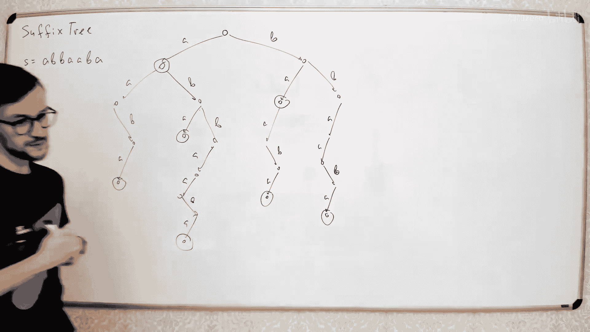
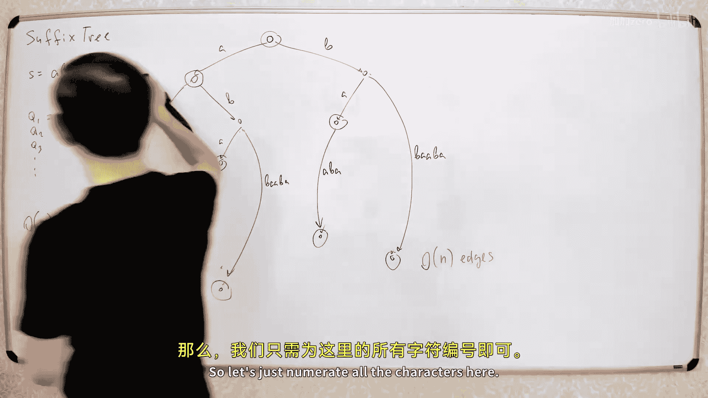
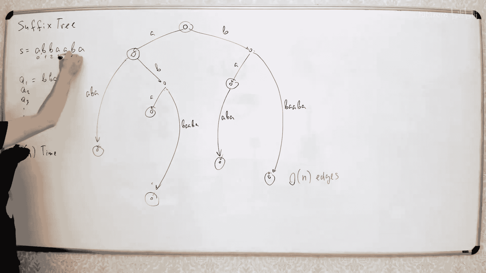
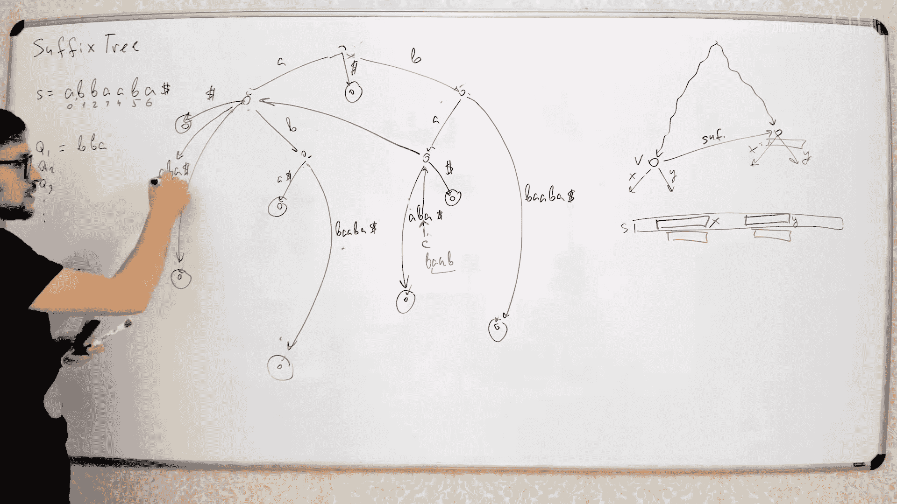

# 045：后缀树与Ukkonen算法 🎼

在本节课中，我们将学习一种非常强大的字符串数据结构——后缀树。后缀树包含了给定字符串的所有子串信息，可用于解决多种字符串问题，例如子串搜索、计算不同子串数量以及寻找最长公共子串等。我们将重点介绍如何在线性时间内构建后缀树，即Ukkonen算法。

## 什么是后缀树？ 🌳

后缀树本质上是一棵包含给定字符串所有后缀的字典树。

我们以一个字符串为例，例如 `ABBAABBA`。首先，我们构建一棵包含该字符串所有后缀的字典树。每个后缀都作为一条从根节点到叶子节点的路径被插入树中。

例如，字符串 `ABBAABBA` 的后缀包括：
*   `ABBAABBA`
*   `BBAABBA`
*   `BAABBA`
*   `AABBA`
*   `ABBA`
*   `BBA`
*   `BA`
*   `A`
*   （以及空后缀 `ε`）

将所有这些后缀插入一棵字典树，就得到了初始的后缀树。

## 压缩后缀树以节省空间 📦

上一节我们介绍了后缀树的基本概念。然而，直接存储这样一棵包含所有后缀的字典树需要 O(n²) 的内存，因为总共有 n 个后缀，每个后缀的长度最多为 n。本节中，我们将通过压缩来使树的大小变为线性。

我们通过压缩那些只有一个子节点的路径来实现。具体规则如下：
*   如果一个节点有至少两个子节点，我们保留它。
*   如果一个节点只有一个子节点，我们将其压缩。这意味着我们将该节点与其子节点之间的路径（可能包含多个字符）合并为一条边，边上标记着合并后的子串。

此外，为了简化处理，我们会在原字符串的末尾添加一个特殊的终止字符（例如 `$`），这个字符不出现在原字符串中。这样做可以确保每个后缀都对应一个叶子节点，使得树的结构更加规整。

压缩后，树中只包含两种节点：
1.  **内部节点**：拥有至少两个子节点的节点。
2.  **叶子节点**：代表某个后缀结束的节点。

由于叶子节点只有 n 个（每个后缀一个），而每个内部节点都会产生分支，所以内部节点的数量也是 O(n) 的。因此，整棵树的节点总数是线性的。

接下来，我们还需要压缩边上存储的字符串。每条边原本可能标记着一个长字符串。由于这些字符串都是原字符串的子串，我们可以用两个索引 `[l, r]` 来表示它，指向原字符串中对应的子串 `S[l:r]`。这样，存储每条边只需要常数空间。

经过以上压缩，我们得到了一棵**节点数和边数均为 O(n)** 的后缀树，这为我们在线性时间内构建它提供了可能。

## 后缀链接 🔗

在开始构建算法之前，我们需要引入一个关键概念：后缀链接。后缀链接是后缀树高效构建的核心。

对于后缀树中的每个**内部节点** `v`（代表某个子串 `s`），我们定义它的后缀链接指向另一个节点。该节点代表的子串是 `s` 的**最长后缀**，并且这个后缀也出现在树中（即也是原字符串的一个子串）。

在后缀树中有一个重要性质：由于树包含了所有子串，节点 `v`（代表子串 `s`）的后缀链接指向的节点，代表的子串恰好是 `s` 去掉第一个字符后得到的子串。例如，如果节点 `v` 代表 `"ABBA"`，那么它的后缀链接将指向代表 `"BBA"` 的节点。

另一个关键性质是：**如果一个节点是内部节点（有至少两个子节点），那么它的后缀链接所指向的节点也一定是内部节点**。这个性质保证了后缀链接总是在内部节点之间跳跃，这对于算法分析至关重要。

## Ukkonen算法概述 🚀

前面我们准备好了后缀树的结构和后缀链接的概念。现在，我们将看到Ukkonen算法如何利用这些概念，以在线性时间内逐步构建后缀树。

算法的核心思想是**在线构建**。我们从一棵只包含根节点的空树开始，然后从左到右依次将原字符串 `S` 的每个字符添加到树中。假设我们已经构建好了字符串 `S[0..i-1]` 的后缀树，现在要添加字符 `S[i] = c`。

我们需要将所有后缀 `S[j..i-1]` (j = 0..i-1) 都扩展一个字符 `c`。Ukkonen算法的高明之处在于，它并不显式地处理每一个后缀，而是通过维护一个“当前扩展点”来高效地完成所有扩展。

算法将扩展过程分为三种情况。假设我们正在处理后缀 `S[j..i-1]`：
1.  **情况1（叶节点扩展）**：如果后缀 `S[j..i-1]` 结束于一个叶子节点，那么我们只需要将该叶子节点对应的边延长一个字符 `c` 即可。实际上，我们可以一次性将这条边延长到字符串末尾，从而在后续步骤中跳过所有叶节点的扩展。
2.  **情况2（创建新分支）**：如果后缀 `S[j..i-1]` 结束于某个节点或边的中间，并且从该点出发没有以字符 `c` 开头的边，那么我们需要创建一条新的边（和一个新的叶子节点）来代表字符 `c`。
3.  **情况3（已存在路径）**：如果后缀 `S[j..i-1]` 结束于某个点，并且从该点出发存在以字符 `c` 开头的边，那么我们不需要做任何操作，只需将“当前扩展点”移动到这条边上下一个位置即可。此时，对于所有更短的后缀，情况3也会成立，因此我们可以停止本轮（第 `i` 个字符）的扩展。

算法维护一个“当前扩展点”，它代表**最长的、不是结束于叶子节点的后缀**的位置。在添加字符 `c` 时，我们从“当前扩展点”开始，执行情况2或3的操作，然后通过**后缀链接**跳转到下一个需要检查的后缀位置，重复此过程，直到遇到情况3或回到根节点。

## 算法核心：后缀链接的使用与均摊分析 ⚖️

上一节概述了算法的流程，其中最关键且复杂的部分是如何使用后缀链接进行跳转，以及为什么整个算法是线性的。本节我们来详细分析这一点。

当我们处于“当前扩展点”（可能是一个内部节点，也可能是一条边的中间位置），并需要沿着后缀链接跳转时，如果扩展点在一个节点上，跳转很简单。但如果扩展点在一条边的中间（我们称这个点代表子串 `β`，其父节点是 `u`），情况就复杂了，因为我们没有为边中间的点定义后缀链接。

此时，跳转规则如下：
1.  首先，移动到父节点 `u`。
2.  然后，使用节点 `u` 的后缀链接，跳转到另一个节点 `v`（`v` 代表的子串是 `u` 去掉第一个字符）。
3.  最后，从节点 `v` 出发，沿着原本边上的子串 `β` 走下去，到达新的位置。这个新位置就是原扩展点 `β` 的后缀链接应该指向的位置。

这个过程可能涉及沿着多条边向下走，因为 `β` 可能跨越多个节点。**这个跳转操作本身可能不是常数时间的**。

那么，如何保证整个算法的线性复杂度呢？答案是**均摊分析**。

我们定义一个势能函数：`Φ = -当前扩展点的深度`。这里深度指的是从根节点到当前扩展点所经过的边数。

*   **当沿着边向下移动（扩展）时**：每次操作是常数时间，但深度增加，所以势能 `Φ` 减少（或不变）。均摊代价是常数。
*   **当沿着后缀链接跳转时**：设我们进行了 `1 + k` 步操作（1步到父节点，k步向下走）。关键点在于，跳转后新位置的深度**最多比原位置的深度减少1**。这是因为后缀链接跳转的本质是去掉字符串的第一个字符，而在后缀树中，这种操作不会导致深度大幅减少。
    *   因此，势能 `Φ` 最多增加 1（因为深度减少了）。
    *   而向下走的 `k` 步会使势能减少 `k`。
    *   所以，整个跳转操作的均摊代价约为 `(1+k) + (1 - k) = 2`，是常数。

由于每个字符被添加时，我们只进行常数次（均摊意义上）的跳转和扩展操作，因此构建整棵后缀树的总时间复杂度是 **O(n)**。

## 算法步骤与演示 📝

现在，让我们将理论付诸实践，一步步地演示Ukkonen算法。我们以字符串 `"ABBA"`（加上终止符 `$`，即 `"ABBA$"`）为例。

我们从仅包含根节点的树开始。算法维护一个`当前扩展点`，初始在根节点。变量`当前后缀长度`等概念在完整实现中需要，但为了简化演示，我们关注核心步骤。

**添加字符 ‘A’ (i=1):**
*   从根节点（当前扩展点）开始。没有以 ‘A’ 开头的边（情况2）。
*   创建一条从根节点出发的新边，标记为 `A...$`（我们一次性将叶子边延伸到字符串末尾）。这创建了一个叶子节点，代表后缀 `"A$"`。
*   当前扩展点仍在根节点。由于在根节点没有其他以 ‘A’ 开头的边需要处理，并且我们处于情况2后创建了叶子，按照算法，我们通过后缀链接跳转？对于根节点，后缀链接是它自身。但此时规则是：如果从根节点扩展后，下一个要检查的后缀是空后缀，它也在根节点结束，并且从根节点出发有 ‘A’ 边（情况3）。因此，第一轮扩展结束。`当前扩展点` 保持在根节点。

**添加字符 ‘B’ (i=2):**
*   现在字符串是 `"AB"`。我们需要扩展后缀 `"A"` 和 `""`。
*   从根节点（当前扩展点）开始。检查代表后缀 `"A"` 的路径。`"A"` 目前结束于上一步创建的叶子节点。根据情况1（叶节点），我们不需要做任何操作，因为叶节点边会自动延伸到末尾（它已经是 `A...$`）。
*   通过后缀链接处理下一个后缀 `""`（空后缀，即根节点）。从根节点检查字符 ‘B’。没有以 ‘B’ 开头的边（情况2）。
*   创建一条从根节点出发的新边，标记为 `B...$`，代表后缀 `"B$"`。这创建了第二个叶子节点。
*   再次从根节点检查，所有后缀处理完毕。`当前扩展点` 保持在根节点。

**添加字符 ‘B’ (i=3):**
*   字符串现在是 `"ABB"`。需要处理后缀 `"BB"`, `"B"`, `""`。
*   从根节点开始，找后缀 `"BB"`。从根节点走 ‘B’ 边，到达代表 `"B"` 的叶子节点？这里需要注意，上一步 `"B"` 是一个叶子边 `B...$`。`"BB"` 需要从 `"B"` 后面再走 ‘B’。但叶子边 `B...$` 的下一个字符是 `$`（根据字符串，`"B$"`），不是 ‘B’。所以，对于后缀 `"BB"`，我们实际上是从根节点走 ‘B’ 边，但发现边上期望的字符是 `$`，而我们需要的是 ‘B’，因此是情况2。
*   我们需要在 `"B...$"` 这条边上进行**分裂**。在 ‘B’ 字符之后的位置创建一个新的内部节点（假设叫 `u`）。原边 `B...$` 被分裂成：根节点到 `u` 的边标记为 `B`，以及 `u` 到原叶子的边标记为剩余部分 `...$`。
*   现在，我们从新节点 `u` 出发，创建一条以 ‘B’ 开头的新边，指向一个新的叶子节点，代表后缀 `"BB$"`。
*   **关键步骤**：现在我们需要为新建的内部节点 `u` 设置后缀链接。根据规则，我们需要找到 `u` 的后缀链接指向哪里。`u` 代表子串 `"B"`。它的后缀链接应指向代表 `""`（空串）的节点，即根节点。所以设置 `u.suffix_link = root`。
*   接下来，通过后缀链接处理下一个后缀 `"B"`（即 `u` 的后缀链接指向的根节点）。从根节点检查字符 ‘B’。现在根节点有以 ‘B’ 开头的边（指向节点 `u`）。这是情况3。我们只需将`当前扩展点`移动到这条边上（即节点 `u` 的位置）。由于遇到情况3，后续更短的后缀（`""`）也必然满足情况3，所以本轮扩展结束。`当前扩展点` 更新为节点 `u`。

**添加字符 ‘A’ (i=4):**
*   字符串是 `"ABBA"`。需要处理后缀 `"BBA"`, `"BA"`, `"A"`, `""`。
*   从当前扩展点 `u`（代表 `"B"`）开始。检查字符 ‘A’。从 `u` 出发没有以 ‘A’ 开头的边（情况2）。
*   从节点 `u` 创建一条以 ‘A’ 开头的新边，指向一个新的叶子节点，代表后缀 `"BA$"`。
*   通过后缀链接处理下一个后缀 `"BA"`（去掉 `u` 的第一个字符？等等，`u` 代表 `"B"`，它的后缀 `""` 在根节点。我们需要处理的后缀是 `"BA"`，它等于 `u` 的后缀 `""` 加上边上的 `"A"`？这里更准确的是：我们刚刚在 `u` 扩展了 ‘A’，接下来应该看 `u` 的后缀链接指向的节点（根节点），然后从根节点尝试走 `"A"` 这条路径（即代表 `"A"` 的边）。让我们遵循算法通用步骤：
    1.  记录当前边上的剩余字符串（这里是从 `u` 扩展时，我们位于节点上，没有边上剩余字符串）。
    2.  移动到父节点（`u` 的父节点是根节点）。
    3.  通过后缀链接跳转（根节点的后缀链接是自身）。
    4.  然后，我们需要从根节点向下走，匹配之前记录的路径（这里就是 `"A"`）。
*   从根节点走 ‘A’ 边，到达代表 `"A"` 的叶子节点。检查下一个字符（我们需要添加 ‘A’），但叶子边 `A...$` 的下一个字符是 `$`，不是 ‘A’。所以是情况2。
*   分裂 `"A...$"` 边，创建一个新的内部节点 `v`（代表 `"A"`）。设置 `v` 的后缀链接。`v` 代表 `"A"`，它的后缀链接应指向根节点（代表 `""`）。所以 `v.suffix_link = root`。
*   从节点 `v` 创建一条以 ‘A’ 开头的新边，指向一个新的叶子节点，代表后缀 `"A$"`（注意，这是另一个 `"A$"`，是后缀 `"BA"` 扩展后的 `"BAA$"` 吗？不对，字符串是 `"ABBA$"`，后缀 `"A"` 是 `"A$"`）。这里有点混乱，实际上我们正在处理的是后缀 `"BA"` 扩展 ‘A’ 得到 `"BAA"`，但 `"BAA"` 不是 `"ABBA$"` 的子串。让我们重新审视。
    *   更严谨地，在 i=4 时，字符是 ‘A’。我们从代表 `"B"` 的节点 `u` 开始。
    *   在 `u` 创建了 `"A$"` 边，代表后缀 `"BA$"`。
    *   然后，我们该处理下一个后缀。`u` 的后缀链接指向根节点。我们需要从根节点匹配的路径是 `""`（因为 `u` 是单个字符节点，从父节点根节点通过后缀链接跳转后，要走的路径是 `u` 节点之后的路径，即我们刚添加的 `"A"`？不完全是）。算法中，当我们从节点 `u` 完成扩展后，下一个要检查的点是 `u.suffix_link`（根节点）。然后，我们需要从根节点走到一个位置，使得该位置代表的子串是 `u` 去掉第一个字符后剩下的部分再加上刚才扩展的字符？这比较复杂。
    *   简化理解：实际上，在Ukkonen算法完整的实现中，我们会维护一个`剩余后缀数`和`活动点`，通过后缀链接快速定位下一个需要扩展的位置。演示的细节非常繁琐。

这个逐步演示展示了分裂节点、创建新边、设置后缀链接的核心操作。尽管手动跟踪所有细节很复杂，但希望你能体会到算法是如何通过后缀链接在树中“爬行”，并逐步构建出完整后缀树的。

## 后缀树的应用 💡

学习构建后缀树之后，你可能会问：它有什么用？本节我们将探讨后缀树的一些典型应用场景。

后缀树之所以强大，是因为它将字符串的所有子串信息高效地组织在了一棵树结构中。因此，许多关于子串的问题都可以通过在后缀树上进行遍历或计算来解决。

以下是一些常见的应用方向：

*   **精确子串匹配**：给定一个文本 `T`，构建其后缀树。之后，对于任何查询模式串 `P`，要判断 `P` 是否在 `T` 中出现，只需从根节点开始，沿着 `P` 的字符在后缀树中向下走。如果能走完整个 `P`，则 `P` 是 `T` 的子串。这个过程的时间复杂度是 `O(|P|)`，与文本长度无关。
*   **统计不同子串**：计算一个字符串中不同子串的数量。在后缀树中，每个子串都对应从根节点开始的唯一一条路径。因此，不同子串的总数等于**所有边的长度之和**。因为边是用索引表示的，所以可以在 O(n) 时间内计算出来。
*   **寻找最长重复子串**：找到在字符串中出现至少两次的最长子串。这对应后缀树中**最深的内部节点**（非叶子节点），因为内部节点代表被至少两个不同后缀共享的前缀。
*   **最长公共子串**：给定两个字符串 `S` 和 `T`，找到最长的同时出现在两者中的子串。一个经典方法是：
    1.  构造字符串 `S#T$` 的后缀树（`#` 和 `$` 是特殊的终止符）。
    2.  标记每个叶子节点，记录它属于 `S` 的后缀还是 `T` 的后缀。
    3.  在后缀树上做一次DFS，对于每个内部节点，检查其子树中是否同时包含来自 `S` 和 `T` 的叶子。
    4.  满足上述条件的内部节点中，深度最大的节点所代表的子串就是最长公共子串。
*   **多模式匹配**：类似于AC自动机，后缀树也可以用于多模式匹配，尤其当模式集固定而文本经常变化时，有独特优势。

这些只是后缀树应用的一部分。由于其结构的丰富性，它可以解决大量复杂的字符串问题。

## 总结 📚

本节课中，我们一起学习了字符串处理中的终极数据结构之一——后缀树。

*   我们首先了解了后缀树的基本定义：一棵包含字符串所有后缀的压缩字典树，它隐式地包含了所有子串信息。
*   为了将空间复杂度降至线性，我们引入了路径压缩和边标记索引化。
*   我们深入探讨了**后缀链接**这一关键概念，它是Ukkonen算法高效运行的引擎。
*   我们详细阐述了**Ukkonen算法**的在线构建思想，它将构建过程分解为字符的逐步添加，并通过维护活动点、利用后缀链接和三种扩展情况，在 **O(n)** 的均摊时间内完成构建。
*   最后，我们列举了后缀树在子串搜索、统计、公共子串查找等多个方面的强大应用。

后缀树的构建算法（Ukkonen算法）理解起来有一定挑战，但一旦掌握，你就会拥有一件处理字符串问题的利器。虽然在实际编程竞赛中，由于实现复杂度，后缀数组可能更常被使用，但后缀树提供的直观树形视角和理论价值是不可替代的。鼓励你尝试实现它，这将极大地加深你对字符串算法的理解。