# 048：二分图最大匹配 🧩

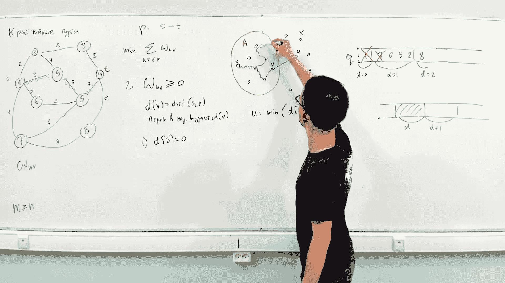


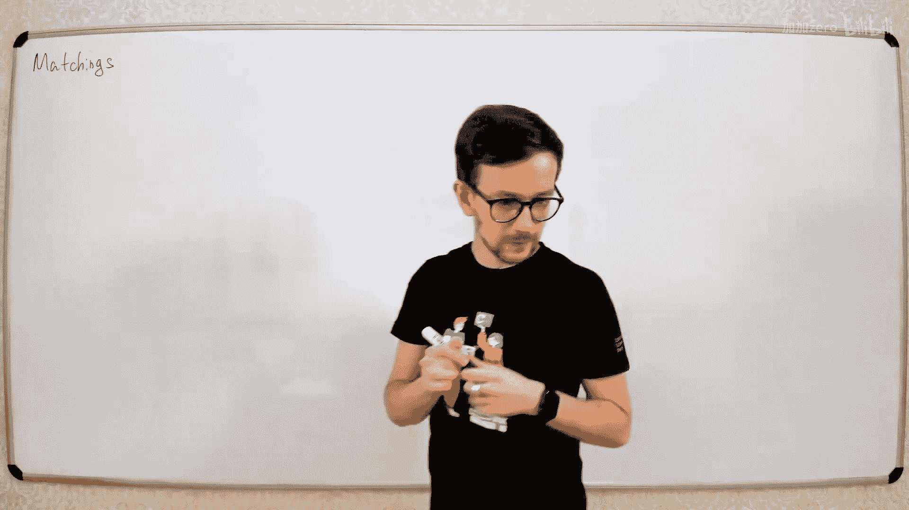


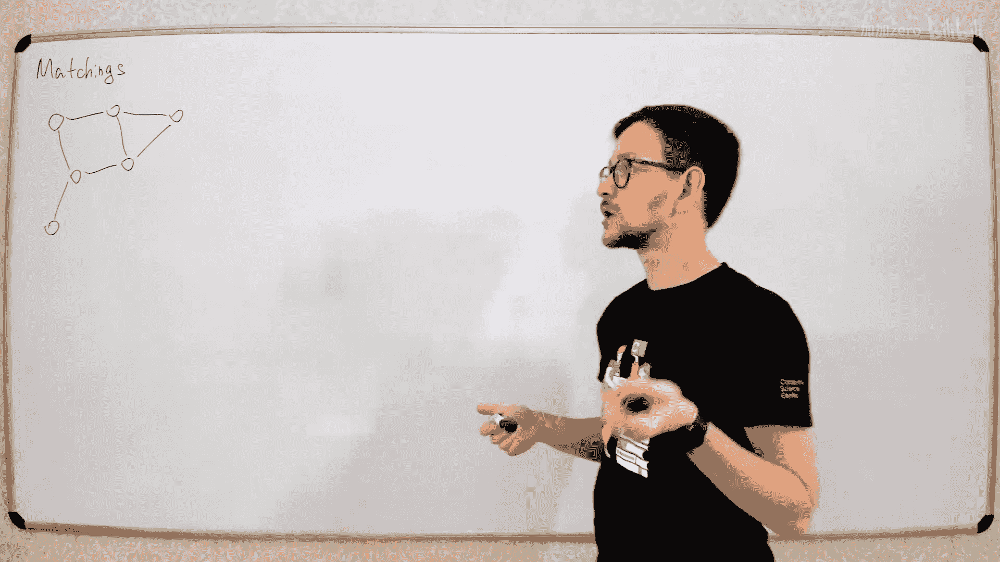


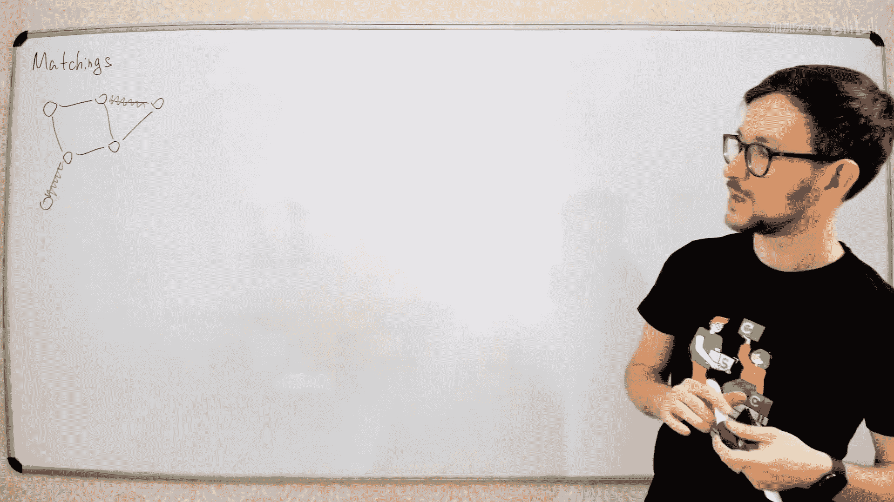

在本节课中，我们将要学习二分图的最大匹配问题。我们将从匹配的基本定义开始，逐步介绍寻找最大匹配的算法，并探讨其理论基础和实际应用。

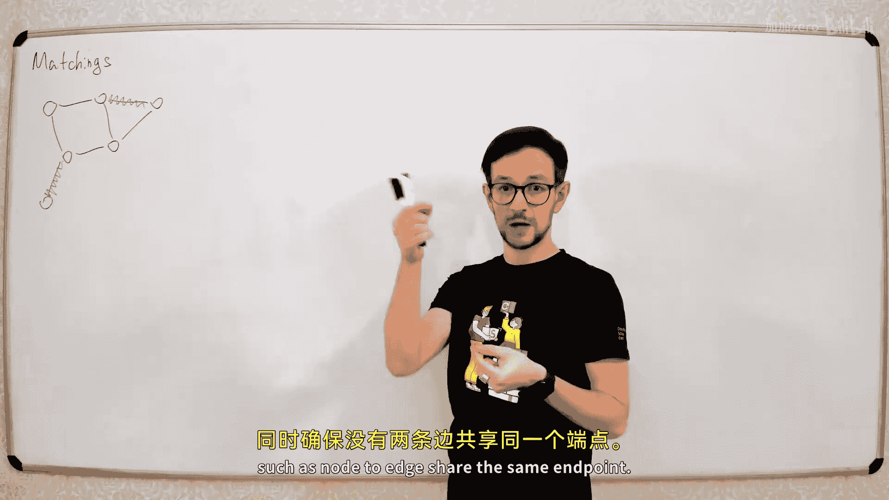


---


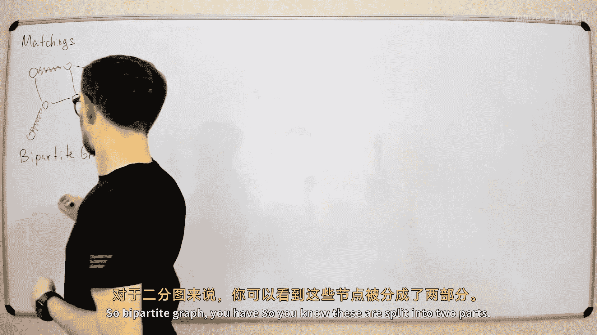

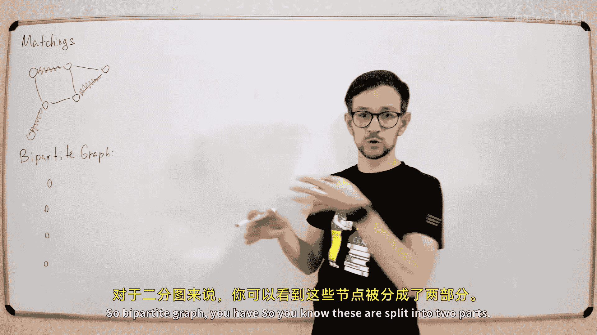


## 什么是匹配？🤔

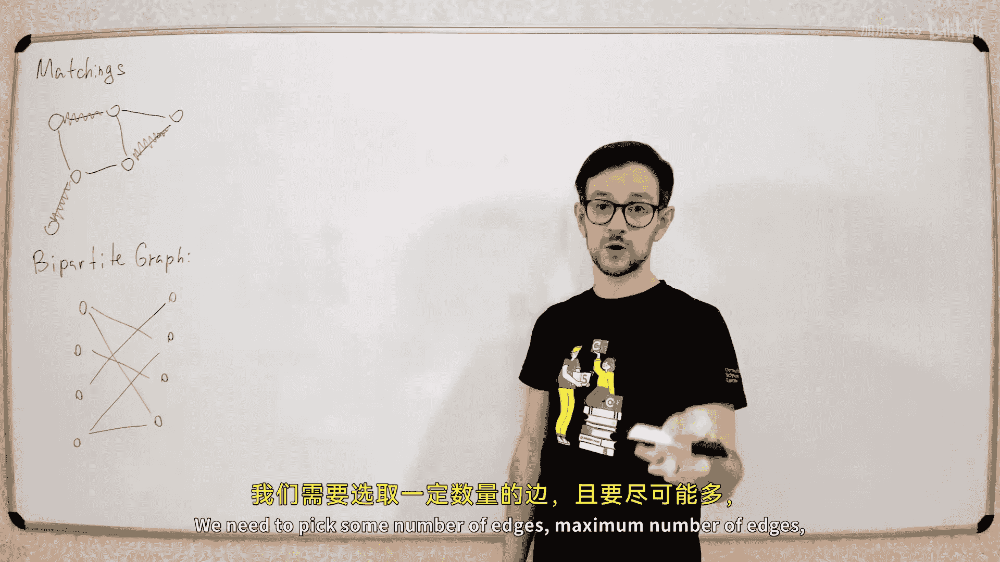


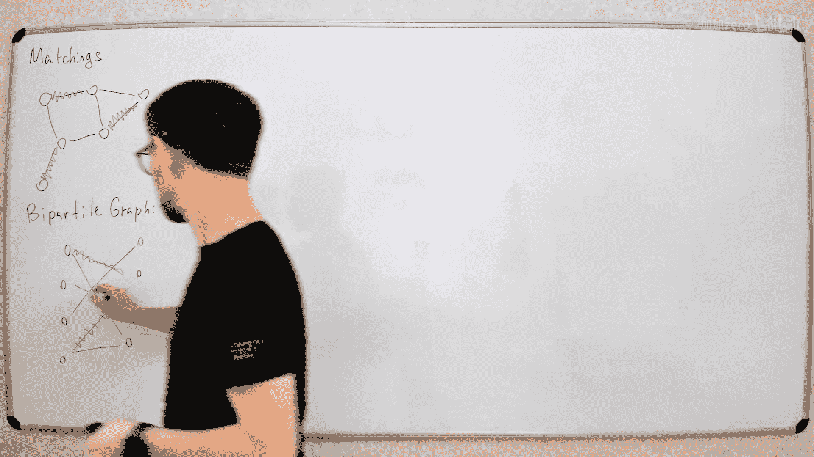

匹配是图论中的一个基本概念。给定一个无向图，一个匹配是该图中一组边的集合，并且这组边中的任意两条边都不能共享同一个顶点。

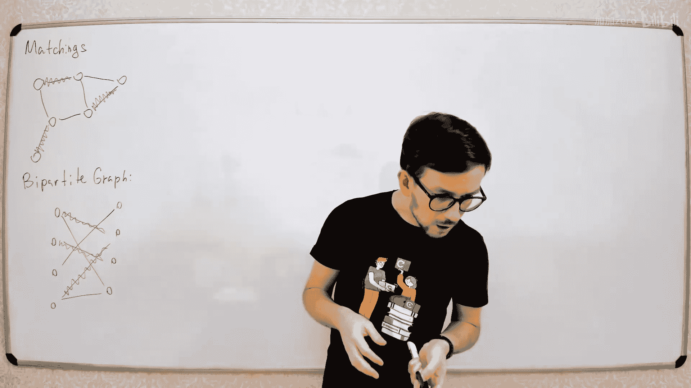


换句话说，我们选择一些边，这些边的所有端点都必须是不同的。

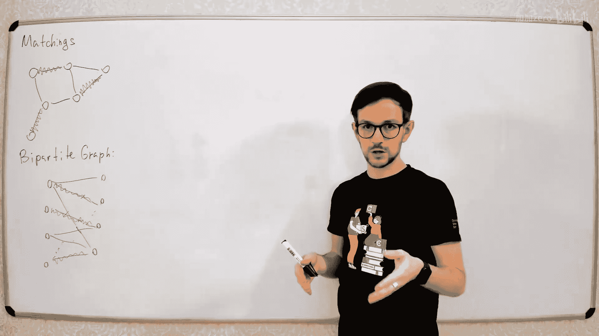


例如，在下图中，我们可以选择边 (A, B) 和 (C, D)。这两条边没有共享的端点，因此它们构成了一个匹配。


我们在这门课程中要解决的问题是寻找**最大匹配**，即包含边数最多的匹配。我们希望选择尽可能多的边，同时确保没有两条边共享同一个端点。

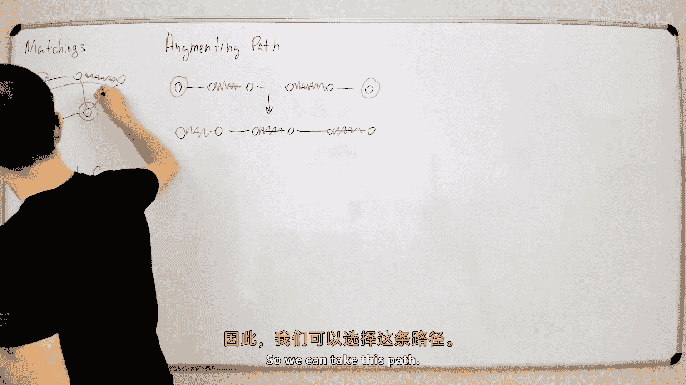

例如，在上图中，我们可以选择三条边（例如边 (A, B), (C, D), (E, F)），从而形成一个大小为3的最大匹配。

如果一个匹配包含了图中的所有顶点（即匹配的大小为 n/2，其中 n 是顶点数），则称其为**完美匹配**。

---

## 二分图与非二分图 📊

匹配问题有两种主要类型：一种针对二分图，另一种针对非二分图。

*   **二分图**：图的顶点可以被划分为两个不相交的集合（左部和右部），并且所有的边都连接着左部的一个顶点和右部的一个顶点。
*   **非二分图**：图的结构没有上述限制。


二分图和非二分图在匹配问题上存在根本性的差异，尤其是在对应的线性规划表述上。本节课我们**只讨论二分图的最大匹配问题**。

---

## 增广路径算法核心思想 💡

所有我们将讨论的算法都遵循一个基本框架：从空匹配开始，然后通过寻找一种称为“增广路径”的结构，逐步增加匹配的大小。

### 什么是增广路径？

增广路径是一条路径，它满足以下条件：
1.  路径的起点和终点都是当前匹配中的“自由顶点”（即未被任何匹配边覆盖的顶点）。
2.  路径上的边在“非匹配边”和“匹配边”之间交替出现。

例如，在下图中，假设当前匹配包含两条边（红色）。路径 `A -> 1 -> B -> 2` 就是一条增广路径：A 和 2 是自由顶点，边 (A,1) 是非匹配边，(1,B) 是匹配边，(B,2) 是非匹配边。


### 如何利用增广路径？

当我们找到一条增广路径后，我们可以通过“翻转”路径上所有边的状态来增加匹配的大小。具体来说，将路径上所有的非匹配边变为匹配边，同时将原有的匹配边变为非匹配边。

在上面的例子中，翻转后，匹配边变为 (A,1) 和 (B,2)，而 (1,B) 变为非匹配边。匹配的大小从 2 增加到了 3。

**算法的整体流程如下：**
1.  从空匹配开始。
2.  尝试寻找增广路径。
3.  如果找到，则翻转路径上的边，增加匹配大小，然后回到步骤2。
4.  如果找不到增广路径，则当前匹配就是最大匹配。

---

## 关键定理：增广路径定理 📜

这个算法的正确性基于一个重要的定理：

**一个匹配是最大匹配，当且仅当图中不存在关于该匹配的增广路径。**

**证明思路：**
*   **必要性（=>）**：如果匹配是最大的，那么显然无法通过增加边来扩大它，因此不存在增广路径（因为增广路径能扩大匹配）。
*   **充分性（<=）**：如果不存在增广路径，但当前匹配 M 不是最大的，那么存在一个更大的匹配 M_max。考虑两个匹配的边集对称差（即属于其中一个但不属于另一个的边）。这个新图的每个顶点度数最多为2（因为每个顶点最多属于 M 和 M_max 各一条边）。这样的图由环和链构成。由于 |M_max| > |M|，必然存在一条链，其两端的边都属于 M_max。这条链恰好就是关于匹配 M 的一条增广路径，与假设矛盾。因此，匹配 M 必须是最大的。

这个证明对于二分图和非二分图都成立。算法框架也适用于非二分图，**区别仅在于寻找增广路径的难度**。在二分图中，寻找增广路径要简单得多。

---

## 在二分图中寻找增广路径 🚀

在二分图中，增广路径具有固定的模式：它总是从一个左部的自由顶点开始，交替经过非匹配边（到右部）和匹配边（回到左部），最终结束于一个右部的自由顶点。

我们可以利用这个特性来简化搜索。具体方法是构建一个有向图：

1.  对于所有**非匹配边**，将其方向定为从左部指向右部。
2.  对于所有**匹配边**，将其方向定为从右部指向左部。


在这个有向图中，**任何一条从一个左部自由顶点到一个右部自由顶点的路径，都对应原图中的一条增广路径**。这样，我们就把寻找交替路径的问题，简化成了在有向图中寻找普通路径的问题。

为了处理多个自由顶点，我们可以引入一个虚拟源点 `S` 和一个虚拟汇点 `T`：
*   将 `S` 连接到所有左部的自由顶点。
*   将所有右部的自由顶点连接到 `T`。

然后，我们只需要在有向图中寻找一条从 `S` 到 `T` 的路径。如果存在这样的路径，那么去掉 `S` 和 `T` 后，中间的部分就是一条增广路径。

寻找路径可以使用深度优先搜索（DFS）或广度优先搜索（BFS）。每次搜索的时间复杂度为 O(E)，其中 E 是边数。由于最多需要寻找 O(V) 次增广路径（每次增加一条匹配边），所以**朴素的匈牙利算法时间复杂度为 O(V * E)**。

---

## 算法实现与优化 🛠️

在实际编码中，我们可以实现一个更简洁的 DFS 函数，它从一个左部顶点 `v` 出发，尝试寻找增广路径。如果找到，则在递归返回的过程中直接更新匹配关系。

以下是算法核心的伪代码描述：

```python
# 假设图是二分图，左部顶点编号为 0..nL-1，右部顶点编号为 0..nR-1
# matchR[r] 表示右部顶点 r 当前匹配的左部顶点，-1 表示自由顶点
# visited 用于DFS中标记访问状态，防止重复访问

def dfs(v):
    for u in graph[v]: # u 是右部顶点
        if not visited[u]:
            visited[u] = True
            # 如果 u 是自由顶点，或者从 u 的当前匹配点出发能找到增广路
            if matchR[u] == -1 or dfs(matchR[u]):
                matchR[u] = v # 更新匹配关系
                return True
    return False

# 主算法
max_matching = 0
matchR = [-1] * nR
for v in range(nL):
    visited = [False] * nR # 每次尝试前重置访问标记
    if dfs(v):
        max_matching += 1
```

**一个重要优化**：在上述循环中，如果一个左部顶点 `v` 的 DFS 失败了，那么在后续的循环中，我们不需要再从这个顶点出发进行搜索。因为它无法到达任何右部的自由顶点，这个状态在算法运行期间不会改变。这个优化被包含在上述伪代码的 `visited` 数组重置逻辑中，但更高效的实现可能需要持久化某些访问状态。

---

## 霍尔定理（Hall‘s Theorem）🎯

霍尔定理提供了一个判断二分图是否存在完美匹配的简洁条件。

**定理内容**：设二分图左部顶点集合为 L，右部为 R。对于 L 的任意一个子集 A，令 N(A) 为 A 中所有顶点的邻居集合（位于 R 中）。则该图存在一个覆盖所有 L 顶点的匹配（即 |匹配| = |L|），当且仅当对于 L 的**每一个**子集 A，都有 |N(A)| >= |A|。

**简单理解**：左部任意一组顶点，它们所连接的右部顶点数量必须不少于这组顶点本身的数量。否则，这组顶点中必然有人找不到匹配对象。

**证明思路**：
*   **必要性**：如果存在完美匹配，那么左部子集 A 中的每个顶点都匹配到右部不同的顶点，这些右部顶点都在 N(A) 中，所以 |N(A)| >= |A|。
*   **充分性**：如果霍尔条件满足，那么在我们之前提到的匈牙利算法中，每次从自由左部顶点出发的 DFS 都一定能找到增广路径（否则会导出一个违反霍尔条件的左部顶点集合），因此最终能构造出完美匹配。

霍尔定理通常用于理论证明，或者在处理具有特殊结构的隐式二分图时，作为判断完美匹配存在性的工具。

---

## 最小顶点覆盖问题 🛡️

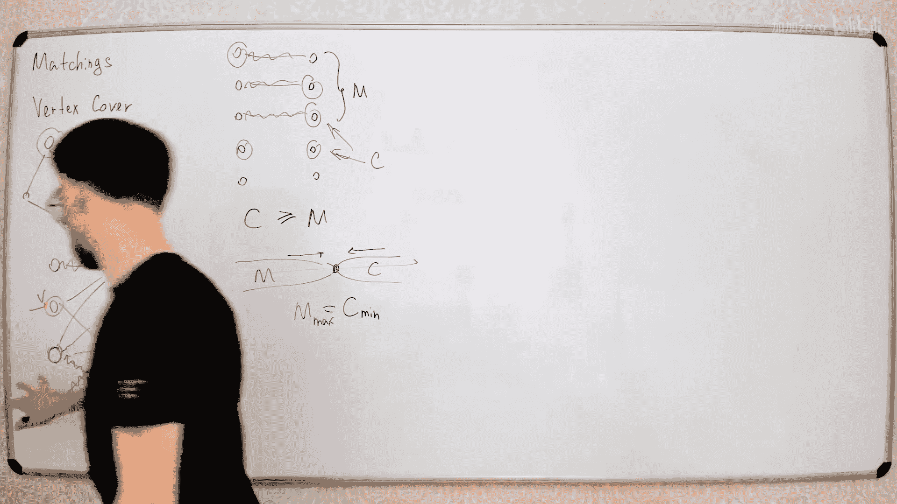

顶点覆盖是另一个经典问题：在一个无向图中，选择一个顶点集合，使得图中的每一条边都至少有一个端点在这个集合中。目标是使这个集合尽可能小。

在一般图中，寻找最小顶点覆盖是 NP 完全问题。然而，在二分图中，它可以高效解决。

### 柯尼希定理（König‘s Theorem）

柯尼希定理揭示了二分图中最大匹配和最小顶点覆盖之间的深刻联系：

**在二分图中，最大匹配的大小等于最小顶点覆盖的大小。**

这属于对偶优化问题。对于任何匹配 M 和任何顶点覆盖 C，显然有 |M| <= |C|（因为覆盖 M 中的所有边需要至少 |M| 个顶点）。柯尼希定理指出，在二分图中，这个上界是可以达到的。

### 如何找到最小顶点覆盖？

算法步骤如下：
1.  使用匈牙利算法找到二分图的一个**最大匹配**。
2.  从所有**左部的自由顶点**出发，在上一节构建的“匹配边从右到左、非匹配边从左到右”的有向图中进行 DFS，标记所有能访问到的顶点。
3.  令访问到的左部顶点集合为 `L+`，未访问到的为 `L-`。
    令访问到的右部顶点集合为 `R+`，未访问到的为 `R-`。
4.  **最小顶点覆盖**由 `L-` 和 `R+` 中的顶点构成。

**为什么这是最小覆盖？**
*   **它是顶点覆盖**：根据 DFS 后图的特殊结构，所有边要么连接 `L+` 和 `R+`，要么连接 `L-` 和 `R-`，要么连接 `L-` 和 `R+`。`L-` 和 `R+` 的并集覆盖了所有这些边。
*   **它是最小的**：这个覆盖的大小恰好等于最大匹配的大小。因为在这个覆盖中，我们只从最大匹配的边中选取顶点（每条匹配边恰好选一个端点：要么是 `L-` 中的左端点，要么是 `R+` 中的右端点）。由于 |最大匹配| <= |最小顶点覆盖|，而此覆盖大小等于 |最大匹配|，所以它一定是最小的。

---

## 总结 📝

本节课我们一起学习了二分图匹配的核心知识：

1.  **基本概念**：我们定义了匹配、最大匹配和完美匹配。
2.  **核心算法**：介绍了通过寻找**增广路径**来逐步扩大匹配的匈牙利算法框架，并证明了其正确性基于“不存在增广路径等价于匹配最大”这一定理。
3.  **具体实现**：讲解了如何在二分图中高效寻找增广路径（通过构建特定有向图并利用 DFS），给出了算法的伪代码和复杂度分析（O(V*E)）。
4.  **霍尔定理**：学习了判断二分图是否存在完美匹配的充分必要条件。
5.  **对偶问题**：探讨了二分图中**最大匹配**与**最小顶点覆盖**之间的对偶关系（柯尼希定理），并给出了通过最大匹配构造最小顶点覆盖的具体方法。

这些内容是图论和组合优化中的重要基础，广泛应用于任务分配、资源调度、网络流等众多领域。在接下来的课程中，我们将继续探讨更高效的算法（如基于网络流的算法）以及非二分图上的匹配问题。