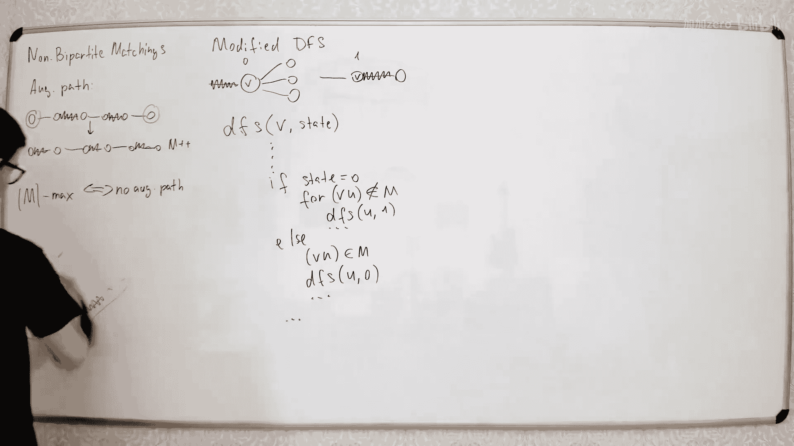

# 049：非二分图中的最大匹配 🎯


在本节课中，我们将学习如何在非二分图中寻找最大匹配。我们将从二分图匹配的简单算法出发，探讨在非二分图中遇到的挑战，并介绍解决这些挑战的核心概念——**花（Blossom）** 及其收缩算法。


---

## 回顾：二分图匹配算法

上一节我们介绍了二分图的最大匹配算法。该算法非常简单。



我们从空匹配开始，然后通过寻找**增广路径（Augmenting Path）** 来逐步增加匹配的大小。

每次我们运行一个简单的DFS算法来寻找增广路径。找到增广路径后，我们反转路径上所有边的状态，从而将匹配的大小增加一。重复此过程，直到找不到更多的增广路径，此时匹配即为最大匹配。

---

## 非二分图匹配的挑战

本节中我们来看看非二分图的情况。算法的基本思想是相同的：我们从空匹配开始，每次通过寻找增广路径来增加匹配的大小。

增广路径的定义与之前相同：路径的起点和终点必须是**自由节点（Free Vertices）**（即不在当前匹配中的节点），并且路径上的边在匹配边和非匹配边之间交替出现。

如果我们找到一条增广路径，我们可以通过反转路径上所有边的状态来增加匹配的大小。

核心区别在于，在非二分图中，寻找增广路径的算法要复杂得多。因为在二分图中，我们可以通过给边定向（例如，从左到右定向非匹配边，从右到左定向匹配边）来简化问题，从而将增广路径的寻找转化为寻找有向图中的路径。但在非二分图中，没有“左”和“右”之分，因此无法用同样的方式简化。

主要定理仍然成立：一个匹配是最大的，当且仅当图中不存在增广路径。

---

## 简单的DFS修改尝试及其问题

让我们尝试修改DFS算法，使其只寻找交替路径（即增广路径的候选）。

在修改的DFS中，我们维护当前节点的状态，该状态表示到达该节点的上一条边是否在匹配中。

以下是算法的伪代码框架：

```python
def dfs(v, state):
    # state = 0: 上一条边不在匹配中
    # state = 1: 上一条边在匹配中
    mark v as visited with the current state
    if state == 0:
        # 需要走一条非匹配边
        for each edge (v, u) not in matching:
            if u is not visited:
                dfs(u, 1)
    else: # state == 1
        # 需要走一条匹配边
        # 从v出发的匹配边最多只有一条
        let (v, u) be the matching edge from v
        if u is not visited:
            dfs(u, 0)
    # 检查是否找到了增广路径（终点为自由节点）
```

这个算法试图保证找到的路径是交替路径。然而，它存在一个问题。

**问题在于**：一个节点可能会被以两种不同的状态访问到。考虑一个奇环（Odd Cycle）的情况。DFS可能会从不同方向访问到环上的同一个节点，并且赋予它不同的状态（一次是`state=0`，另一次是`state=1`）。这会导致算法可能错过实际存在的增广路径，因为它错误地认为该节点“已访问”而不再探索。

在二分图中，所有环的长度都是偶数，因此不会出现这个问题。所以，这个问题是非二分图特有的。

---

## 核心结构：花（Blossom）🌸

当我们发现一个节点被以两种不同状态访问时，就意味着我们找到了一个被称为**花（Blossom）** 的结构。

花本质上是一个奇环，并且环上的边是交替的（匹配边和非匹配边交替出现）。花的“基部”是一个节点，从该节点有两条路径到达环上的同一个节点，一条路径长度为偶数，另一条为奇数。

以下是处理花的步骤：

1.  **识别花**：当DFS发现一条边连接了两个状态相同的已访问节点时（例如，从`state=0`的节点`v`到另一个`state=0`的节点`u`），我们就找到了一个花。这个花由DFS栈中从`u`到`v`的节点构成。
2.  **收缩花**：我们将花中的所有节点**收缩（Contract）** 成一个新的超级节点。所有原来与花中节点相连的边，现在都与这个超级节点相连。
3.  **在收缩后的图中继续搜索**：我们在新的图（记为`G'`）中继续运行DFS算法，寻找增广路径。
4.  **路径还原**：如果在`G'`中找到了增广路径，我们需要将其**扩展（Expand）** 回原图`G`。
    *   如果增广路径不经过被收缩的超级节点，那么它直接对应原图中的一条路径。
    *   如果增广路径经过超级节点，我们需要用花内部的某条交替路径来替换它。由于花是奇环，我们总是能在花内部找到一条具有正确奇偶性的交替路径来连接进入点和离开点。

---

## 完整算法流程与复杂度

现在，让我们总结完整的**带花树算法（Blossom Algorithm）** 流程：

1.  从空匹配开始。
2.  对每个自由节点，运行修改后的DFS以寻找增广路径。
3.  在DFS过程中：
    *   **情况A**：找到增广路径。反转路径上的边，匹配大小加一。回到步骤2，尝试寻找下一个增广路径。
    *   **情况B**：发现一个花。收缩该花，得到新图`G'`。在`G'`中递归地继续运行DFS。
        *   如果在`G'`中找到增广路径，将其扩展回原图`G`，然后应用情况A。
        *   如果在`G'`中未找到增广路径且未发现新花，则原图中从该起始点出发不存在增广路径。
    *   **情况C**：未找到增广路径且未发现花。说明从该起始点出发不存在增广路径。
4.  当对所有自由节点都找不到增广路径时，算法结束，当前匹配即为最大匹配。

**关于正确性的关键证明**：需要证明，在原图`G`中存在增广路径，当且仅当在收缩花得到的新图`G'`中也存在增广路径。这个证明通过构造中间图并利用匹配最大性的等价条件（存在增广路径）来完成。

**时间复杂度**：每次找到增广路径，匹配大小增加1，最多发生`O(n)`次。每次DFS（包括收缩和扩展操作）可以在接近`O(m)`的时间内完成（使用并查集处理节点集合）。因此，总时间复杂度约为 **`O(n * m * α(n))`**，其中`α(n)`是阿克曼函数的反函数，增长极慢。

---

## 总结

本节课中我们一起学习了在非二分图中寻找最大匹配的**带花树算法**。

*   我们回顾了二分图匹配的简单增广算法。
*   我们发现了将该算法直接应用于非二分图时遇到的问题，即节点可能被以不同状态重复访问。
*   我们引入了**花（Blossom）** 这一核心概念来处理奇环结构。
*   我们掌握了算法的关键操作：**识别花**、**收缩花**、在收缩后的图中**递归搜索**，以及最后将路径**扩展还原**。
*   我们概述了算法的整体流程、正确性逻辑和大致复杂度。

虽然这个算法比二分图匹配复杂，但它优美地解决了非二分图最大匹配这一经典问题，是图论算法中的一个重要里程碑。