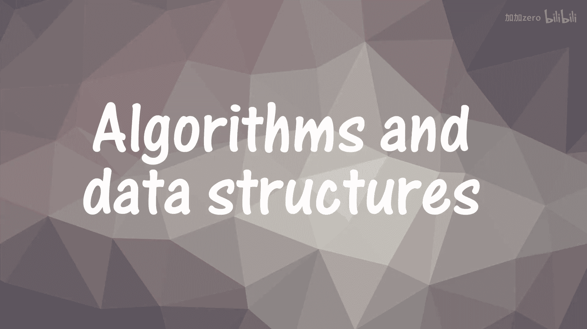
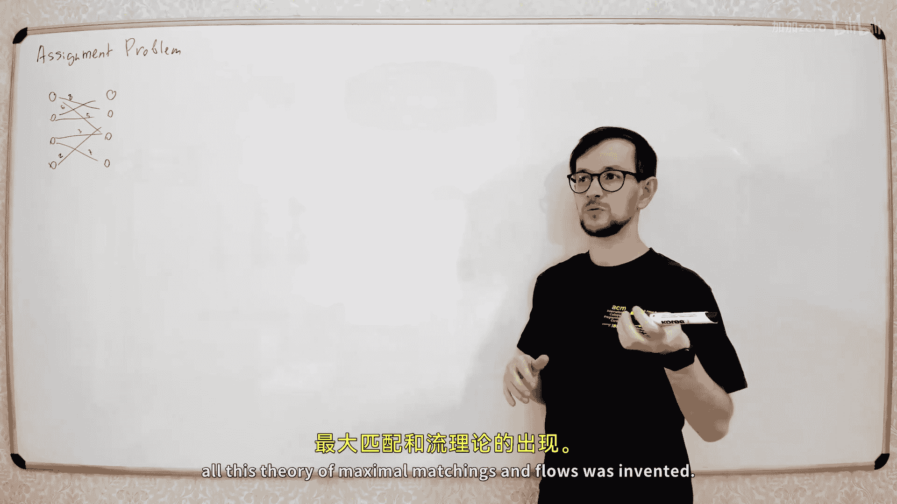

# 053：分配问题与匈牙利算法






在本节课中，我们将要学习**分配问题**以及解决它的经典算法——**匈牙利算法**。分配问题是一种寻找**最小（或最大）权重匹配**的问题，在任务调度、资源分配等实际场景中有着广泛应用。

## 什么是分配问题？

上一节我们讨论了匹配问题，但没有考虑边的权重。本节中我们来看看带权重的匹配问题。

分配问题本质上是一个寻找**最小或最大权重匹配**的问题。在之前的问题中，我们的图没有权重。在分配问题中，图的每条边都有一个权重，我们的目标不再是最大化匹配的边数，而是最大化或最小化所有被选边**权重的总和**。

通常，分配问题的传统描述是**最小化总成本**。最大化问题可以通过对所有权重取负值转化为最小化问题。

### 问题的传统表述


在传统的分配问题中，通常有数量相等的“工人”和“工作”。例如，有 `n` 个工人和 `n` 个工作。

我们有一个二分图，其中：
*   左侧节点代表工人。
*   右侧节点代表工作。
*   每条边连接一个工人和一个工作，其权重代表该工人完成该工作的成本。

我们的目标是：为每个工人分配**恰好一个**工作，同时每个工作也由**恰好一个**工人完成（即找到一个**完美匹配**），并且使得所有被选边（即分配方案）的**总成本最小**。

### 矩阵表示法

这个问题通常用一个成本矩阵 `C` 来表示，其中 `C[i][j]` 表示第 `i` 个工人完成第 `j` 个工作的成本。

我们的任务是从矩阵中选择 `n` 个单元格，满足每行和每列都**恰好选中一个**，使得这些单元格数值之和最小。这等价于在二分图中寻找一个总权重最小的完美匹配。

如果工人不能完成某项工作，可以将对应成本设为无穷大（`INF`）。

一个朴素的解决方法是检查所有 `n!` 种排列，但显然效率极低。接下来，我们将介绍更高效的**匈牙利算法**。

## 匈牙利算法的核心思想

匈牙利算法的基本思路是：通过对成本矩阵进行一系列“安全”的变换，在不改变最优解本质的前提下，逐步构造出一个零成本边构成的完美匹配。

### 安全操作

我们有两种不会改变问题最优匹配（尽管会改变总成本值）的操作：
1.  **行操作**：将矩阵某一行的所有元素都加上（或减去）同一个常数 `delta`。
2.  **列操作**：将矩阵某一列的所有元素都加上（或减去）同一个常数 `delta`。

**为什么这些操作是安全的？**
因为任何完美匹配都必然包含每行的一个元素和每列的一个元素。对一行整体加减 `delta`，会使所有包含该行元素的匹配方案总成本都变化 `delta`，因此**最优匹配方案本身不会改变**。列操作同理。

### 算法步骤概述

匈牙利算法的主要步骤如下：
1.  **初始化**：对矩阵的每一行，减去该行的最小值，确保每行至少有一个 `0`。同样地，对每一列减去该列的最小值，确保每列至少有一个 `0`。此时所有元素非负。
2.  **尝试匹配**：尝试在由 `0` 元素构成的二分图中，寻找一个完美匹配（即覆盖所有行和列的匹配）。这可以使用之前学过的寻找最大匹配的算法（如DFS增广路算法）。
3.  **检查结果**：
    *   如果找到了完美匹配，那么这些 `0` 边对应的分配就是原问题的最小成本解（因为总成本为 `0`，且所有成本非负）。
    *   如果找不到完美匹配，则进入下一步。
4.  **调整矩阵（关键步骤）**：
    *   设当前通过DFS访问到的左侧节点集合为 `L+`，未访问的左侧节点为 `L-`。
    *   设当前通过DFS访问到的右侧节点集合为 `R+`，未访问的右侧节点为 `R-`。
    *   由于未找到增广路，当前不存在从 `L+` 到 `R-` 的 `0` 边。
    *   找到所有从 `L+` 到 `R-` 的边中的**最小成本值** `delta`。
    *   对 `L+` 中的所有行，执行 `-delta` 操作。
    *   对 `R+` 中的所有列，执行 `+delta` 操作。
    *   此操作旨在创造新的 `0` 边（从 `L+` 到 `R-`），同时保证所有元素保持非负，且不破坏已有的重要 `0` 边结构。
5.  **重复**：返回步骤2，继续尝试寻找完美匹配。每次调整都会扩大DFS可访问的节点集，最终一定能找到完美匹配。

## 算法演示与细节

让我们通过一个具体例子来理解算法的执行过程。

假设我们有一个成本矩阵，经过初始化（每行每列减最小值）后得到：
```
[3, 1, 4, 0]
[0, 0, 1, 0]
[2, 0, 3, 0]
[7, 0, 6, 2]
```
我们标记出所有的 `0`。

### 第一步：在零图中寻找匹配

我们构建一个只包含 `0` 元素的二分图，并尝试寻找完美匹配。
*   从左侧节点1开始，可以匹配右侧节点4。
*   从左侧节点2开始，可以匹配右侧节点1或2或4。假设匹配右侧节点1。
*   从左侧节点3开始，可以匹配右侧节点2。
*   此时，左侧节点4无法找到未匹配的右侧节点（右侧节点3未被匹配，但边(4,3)的成本是6，不是0）。当前匹配大小为3，不是完美匹配。

### 第二步：执行DFS并调整矩阵

从未匹配的左侧节点4开始执行DFS寻找增广路：
*   访问节点4 (`L+={4}`)。
*   从节点4出发，没有成本为 `0` 的边通往未访问的右侧节点 (`R-`)。DFS失败。

确定集合：
*   `L+ = {4}`
*   `R+ = {}` （因为从节点4没有走通任何 `0` 边）
*   `L- = {1,2,3}`
*   `R- = {1,2,3,4}`

计算 `delta`：找到从 `L+={4}` 到 `R-={1,2,3,4}` 所有边的最小成本。查看矩阵第4行：`[7, 0, 6, 2]`，在 `R-` 列中的最小值为 `min(7,0,6,2) = 0`。所以 `delta = 0`。当 `delta` 为0时，调整无效，说明我们的初始零图不够好。

我们需要**从所有未匹配的左侧节点开始DFS**，而不仅仅是最后一个。更标准的做法是：维护一个“交错树”，记录所有从起点通过交替路径能访问到的节点。
假设更彻底的DFS访问后，我们得到：
*   `L+ = {1, 3, 4}` （例如，从节点4开始，通过匹配边和未匹配边交替访问）
*   `R+ = {2, 4}` 
*   `L- = {2}`
*   `R- = {1, 3}`

计算 `delta`：查找所有从 `L+` 的行（第1,3,4行）到 `R-` 的列（第1,3列）的交叉点元素，找出最小值。
*   行1，列1: 3
*   行1，列3: 4
*   行3，列1: 2
*   行3，列3: 3
*   行4，列1: 7
*   行4，列3: 6
最小值为 `delta = min(3,4,2,3,7,6) = 2`。

执行调整：
*   对 `L+` 中的行（1,3,4）全部 `-2`。
*   对 `R+` 中的列（2,4）全部 `+2`。

矩阵变为：
```
[1, 3, 2, 0]
[0, 2, 1, 2]
[0, 2, 1, 0]
[5, 2, 4, 2]
```
注意，我们在位置(3,1)创造了一个新的 `0`（原来是2，减去2后变为0）。

### 第三步：继续寻找匹配

在新的零图中，左侧节点3现在可以与右侧节点1通过 `0` 边连接。这为增广路提供了可能。重新运行匹配算法，可以找到一条增广路，并将匹配大小增加到4，即找到一个完美匹配。

### 第四步：回溯得到原问题解

在最终调整后的矩阵中找到的零成本完美匹配，直接对应了原成本矩阵的最优分配方案。只需记录匹配了哪些边即可。

## 时间复杂度与优化

基础的匈牙利算法实现复杂度为 **O(n⁴)**，因为每一步调整需要 **O(n²)** 来寻找 `delta`，最多需要 **O(n)** 步调整。

我们可以通过维护辅助变量将其优化到 **O(n³)**：

1.  **维护行、列势能**：不直接修改矩阵 `C`，而是维护两个数组 `row_potential[]` 和 `col_potential[]`。任何元素 `C[i][j]` 的“有效成本”计算为 `C[i][j] - row_potential[i] - col_potential[j]`。行加减 `delta` 的操作变为修改 `row_potential[i]`，列操作变为修改 `col_potential[j]`，均可在 **O(1)** 或 **O(n)** 完成。
2.  **快速查找 delta**：维护一个数组 `min_for_col[j]`，记录对于每个右侧列 `j`，当前 `L+` 集合中的行所能提供的最小“有效成本”。那么 `delta` 就是所有 `j` 属于 `R-` 的 `min_for_col[j]` 的最小值。这可以在 **O(n)** 内完成。
3.  **持续DFS**：在调整后，不重置DFS状态，而是在原有“交错树”的基础上继续扩展，直到找到增广路。这确保了每个节点最多被加入 `L+` 一次。

通过这些优化，匈牙利算法的复杂度可以降至 **O(n³)**。

对于稀疏图（边数 `m` 远小于 `n²`），可以使用堆（支持全局增量操作）来维护从 `L+` 到每个右侧节点的最小边权，从而获得接近 **O(n * m log n)** 的复杂度。

## 总结

本节课中我们一起学习了**分配问题**及其经典解法**匈牙利算法**。

*   **分配问题**是在二分图中寻找最小（或最大）权重完美匹配的问题。
*   **匈牙利算法**的核心是通过**行变换**和**列变换**（安全操作）逐步修改成本矩阵，使其出现一个由零成本边构成的完美匹配，此即原问题的最优解。
*   算法流程包括：初始化创造零元素、在零图中寻找匹配、若失败则通过计算最小 `delta` 调整矩阵以创造新的零边，并重复此过程。
*   通过维护**行/列势能**和**每列最小成本**等技巧，可以将算法优化到 **O(n³)** 的时间复杂度。


匈牙利算法是组合优化中的一个重要算法，其思想也与线性规划中的**原始-对偶方法**密切相关。