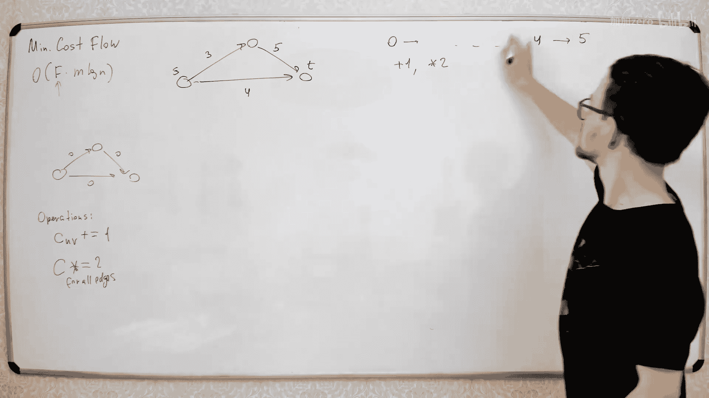
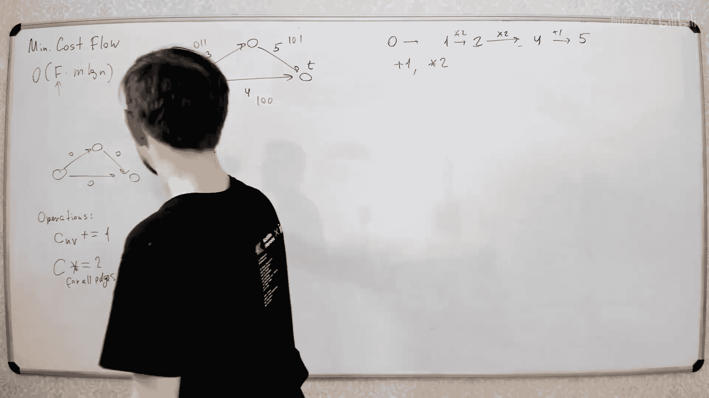

# 054：最小费用流 📊


在本节课中，我们将学习网络流问题的一个变种——最小费用流问题。我们将从基本概念入手，逐步探讨其定义、求解思路以及核心算法，并最终了解如何通过一些技巧来优化算法性能。


---


## 最小费用流问题定义

上一节我们介绍了最大流问题，本节中我们来看看它的加权版本。

在最大流问题中，我们只需要最大化从源点 `S` 到汇点 `T` 的流量，所有边都是平等的，每条边只有容量限制 `C`。

在最小费用流问题中，每条边有两个参数：
*   **容量** `C(u, v)`：表示该边能承载的最大流量。
*   **费用** `W(u, v)`：表示通过该边输送**一个单位**流量所需支付的成本。

**核心公式**：对于一条边 `(u, v)`，其参数为 `(C(u, v), W(u, v))`。

流 `f` 的**总费用** `cost(f)` 定义为流经所有边的流量与其费用的乘积之和：
**公式**：`cost(f) = Σ_{(u, v)} f(u, v) * W(u, v)`

我们的目标是：在所有可能的**最大流**中，找到一个**总费用最小**的流。这就是最小费用最大流问题。

该问题还有其他变体，例如寻找一个指定流量大小 `X` 的最小费用流。为简化起见，本节主要讨论最小费用最大流。

---

## 基础求解思路：连续最短路算法

我们先从一个简单情况开始：图中所有边的费用均为非负。

### 从零流开始构建

流量为 `0` 的最小费用流显然是空流，费用为 `0`。

如何找到流量为 `1` 的最小费用流？任何流量为 `1` 的流都可以分解为一条从 `S` 到 `T` 的路径和一些环。由于所有边费用非负，加入任何环都不会降低总费用。因此，最小费用流必然是一条从 `S` 到 `T` 的**最短路径**（按费用计算）。

**核心步骤**：`F1` = 在原始网络中，从 `S` 到 `T` 的最短路径（使用 Dijkstra 算法）。

### 逐步增加流量

假设我们已经找到了流量为 `k` 的最小费用流 `Fk`。如何得到流量为 `k+1` 的最小费用流 `F(k+1)`？

我们需要在 `Fk` 的**残量网络**中，找到一条从 `S` 到 `T` 的**最短增广路**，然后沿该路径推送一个单位的流量。

**算法伪代码**：
```
1. 初始化流 f = 0
2. while (在残量网络中能找到从 S 到 T 的路径):
      a. 在残量网络中找到从 S 到 T 的最短路径 P（按费用计算）
      b. 沿路径 P 推送尽可能多的流量（此处为1单位）
      c. 更新流 f 和残量网络
3. 输出流 f
```

**问题**：在残量网络中，反向边的费用是原边费用的**负值**。因此，即使原图无边权非负，残量网络中也可能出现负权边，导致无法直接使用 Dijkstra 算法求最短路。

一个直接的解决方案是使用能处理负权边的 Bellman-Ford 算法来寻找最短增广路。

**初始时间复杂度**：`O(F * (V * E))`，其中 `F` 是最大流值。当 `F` 很大时，效率较低。

---

## 关键优化：势函数与 Johnson 算法

我们希望能在残量网络中使用更快的 Dijkstra 算法。核心思路是引入**势函数** `φ(v)` 来调整边权，消除负权边。

### 势函数原理

为每个顶点 `v` 分配一个势 `φ(v)`。定义调整后的边权 `w'(u, v)`：
**公式**：`w'(u, v) = w(u, v) + φ(u) - φ(v)`

关键性质：**调整边权后，图中任意两点间的最短路径保持不变**（仅路径长度整体偏移了一个常数）。因此，在新图上求出的最短路径，在原图上也是最短路径。

### 如何选择势函数

如果我们能选择一组势 `φ(v)`，使得所有调整后的边权 `w'(u, v)` 都非负，就可以使用 Dijkstra 算法。

一个有效的选择是：令 `φ(v)` 等于从源点 `S` 到顶点 `v` 的**最短距离**（按原边权 `w` 计算）。根据三角不等式，可以证明此时 `w'(u, v) ≥ 0`。

**新的挑战**：为了计算这个势（即最短距离），我们似乎又需要运行 Bellman-Ford 算法，这回到了原点。

### 巧妙的维护方法

我们利用算法是**增量式**构建流这一特点。算法流程如下：

1.  初始化流 `f = 0`，初始化势 `φ(v) = 0`（此时残量网络即原图，边权非负）。
2.  在当前的残量网络（使用调整边权 `w'`）中，运行 **Dijkstra 算法**找到从 `S` 到 `T` 的最短路径 `P`。
3.  沿路径 `P` 推送流量。
4.  **更新势函数**：`φ(v) = φ(v) + dist(v)`，其中 `dist(v)` 是步骤 2 中 Dijkstra 算法计算出的从 `S` 到 `v` 的最短距离（按调整边权 `w'` 计算）。
5.  重复步骤 2-4，直到无法增广。

**为何有效**：
*   初始时，`w' = w ≥ 0`，可使用 Dijkstra。
*   找到最短路径 `P` 后，对于 `P` 上的边，有 `w'(u, v) = 0`。
*   推送流量后，在残量网络中新增的反向边 `(v, u)`，其调整边权 `w'(v, u) = -w'(u, v) = 0`。
*   因此，**每次迭代后，残量网络中所有边的调整边权 `w'` 始终保持非负**，使得下一次迭代能继续使用 Dijkstra 算法。


这个算法被称为 **Successive Shortest Path (SSP) 算法** 或 **Primal-Dual 算法**。

**优化后时间复杂度**：`O(F * (E log V))`，使用堆优化的 Dijkstra。虽然仍有因子 `F`，但实践中对于许多问题足够高效。

---

## 处理负权边与负环

### 原图存在负权边但无负环

如果原图边权可能为负，但**不含负环**，上述 SSP 算法稍作修改仍可使用。

**修改**：在算法开始前，先运行一次 **Bellman-Ford 算法**，计算出初始的势函数 `φ(v)`（即从 `S` 到各点的最短距离）。此后的步骤与之前完全相同。

因为初始势的设定保证了调整边权非负，并且算法迭代过程能维持这一性质。

### 原图存在负环

如果原图存在负费用环，最小费用流问题仍然有解（因为容量有限，总费用不会无限低），但 SSP 算法不能直接应用。

思路是：**先消除所有负环**。
1.  在残量网络中寻找负环。
2.  若找到负环，则沿该环推送尽可能多的流量。这会降低总费用，并减少环上的残余容量。
3.  重复步骤 1-2，直到残量网络中不存在负环。
4.  此时，我们得到了一个“最小费用循环流”，在此基础上再运行 SSP 算法来增加从 `S` 到 `T` 的流量。

寻找负环可以使用 Bellman-Ford 算法的扩展版。

---

## 进一步优化：容量缩放技术

SSP 算法的时间复杂度中有一个因子 `F`（最大流值），当容量很大时效率不高。容量缩放是一种用于消除对 `F` 直接依赖的经典技术。




### 核心思想



模仿二进制表示，逐步“构建”出最终的网络和流。
*   操作A：将图中**所有边**的容量翻倍。
*   操作B：将**某一条边**的容量增加 1。

我们可以从所有边容量为 0 的图开始，通过一系列“翻倍”和“加一”操作，得到目标图。操作次数约为 `O(M log C)`，其中 `C` 是最大容量。

### 算法框架

1.  从零容量图开始，其最小费用流为 `0`。
2.  **处理“翻倍”操作**：若将当前图所有容量翻倍，则最优流也只需简单翻倍即可得到新图的最优流。
3.  **处理“加一”操作**：当将边 `(u, v)` 的容量增加 1 时，相当于在残量网络中**添加一条单位容量的边 `(u, v)`**。
    *   检查加入此边是否会形成负环（通过判断 `w(u, v) + dist(v, u) < 0` 是否成立，其中 `dist` 是最短距离）。
    *   若不会形成负环，则直接添加该边。
    *   若会形成负环，则找到这个包含 `(u, v)` 的负环，并沿其推送 1 单位流量。推送后，新增的边 `(u, v)` 会被饱和并移除，负环消失。
4.  按二进制位从低到高的顺序，依次执行“加一”和“翻倍”操作，最终得到原图的最小费用最大流。

通过这种方式，我们将算法的主要开销从 `O(F * ...)` 转移到了 `O(log C * ...)`，对于大容量场景更为友好。

---

## 总结 🎯

本节课中我们一起学习了最小费用流问题。
*   **问题定义**：在满足容量限制的前提下，寻找总输送成本最小的最大流。
*   **核心算法**：连续最短路算法。通过引入**势函数**动态调整边权，使得在残量网络中能持续使用高效的 Dijkstra 算法寻找增广路。
*   **处理负权**：对于含负权但无负环的图，需先用 Bellman-Ford 初始化势函数；对于含负环的图，需先消除负环。
*   **优化技术**：容量缩放技术通过模拟二进制构建过程，将时间复杂度中的流值因子 `F` 替换为关于容量的对数因子 `log C`，提升了算法对于大容量输入的处理能力。


最小费用流是网络流中一个非常强大的模型，广泛应用于运输、调度、资源分配等实际问题中。