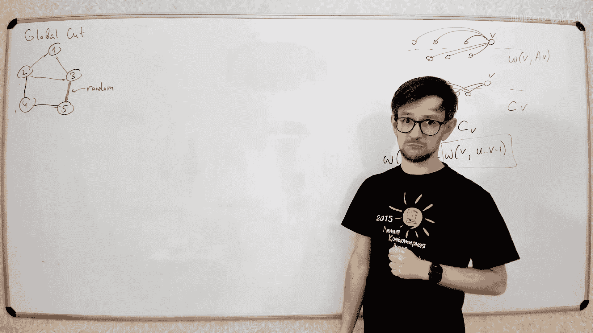
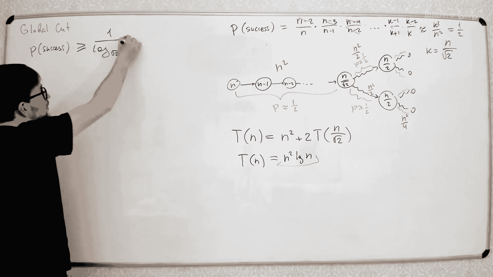

# 055：全局最小割

在本节课中，我们将学习一个与网络流理论相似但略有不同的问题：全局最小割问题。我们将探讨其定义、与标准最小割问题的区别，并介绍几种求解算法，包括确定性算法和高效的随机化算法。

## 全局最小割问题定义

首先，我们来看看什么是全局最小割问题。

你有一个图，图中的每条边都有一个权重（或称成本）。我们的目标是找到一个边集，如果从图中移除这个边集，图将不再连通。我们希望找到总权重最小的这样一个边集。

例如，在下图中，移除总权重为9的两条边（3和6），图就会被分割成两个连通分量。这个总权重为9的割就是一个全局割，我们的目标是找到总权重最小的那个。

## 与标准最小割问题的区别

你可能会想到我们之前讨论过的标准最小割问题。它们之间有什么区别呢？

在标准最小割问题中，我们有两个给定的节点S和T。目标是移除一些边，使得S和T不再连通。这相当于在图中找到一个将S和T分开的割。

而全局最小割问题没有指定的S和T。我们只想移除一些边，让整个图变得不连通即可。它不关心具体是哪两个点被分开。

## 基础算法：枚举所有点对

一个直观的想法是，既然全局割会将图分成至少两个部分，那么我们可以枚举所有可能的点对(S, T)，计算它们之间的最小割，然后取其中的最小值。

以下是该算法的步骤：
1.  初始化结果 `result` 为正无穷。
2.  对于图中每一对不同的节点 `S` 和 `T`：
    *   使用最大流算法（如Dinic、Edmonds-Karp）计算 `S` 和 `T` 之间的最小割 `cut_value`。
    *   如果 `cut_value` < `result`，则更新 `result = cut_value`。
3.  返回 `result` 作为全局最小割的值。

**时间复杂度分析**：需要计算 O(n²) 次最大流。如果最大流算法的时间复杂度是 O(F)，那么总时间复杂度为 O(n² * F)。对于稠密图，这可能会非常慢。

## 改进算法：固定源点

我们可以改进上述算法，将点对枚举次数从 O(n²) 减少到 O(n)。

思路如下：假设全局最小割将图分成两个连通分量 A 和 B。我们固定一个节点（比如节点1），它必然属于A或B。那么，我们只需要计算节点1与所有其他节点之间的最小割即可。因为至少有一个其他节点在另一个分量中，这个割就是全局最小割。

以下是改进后的算法步骤：
1.  固定源点 `S = 节点1`。
2.  初始化结果 `result` 为正无穷。
3.  对于图中每一个不同于 `S` 的节点 `T`：
    *   计算 `S` 和 `T` 之间的最小割 `cut_value`。
    *   如果 `cut_value` < `result`，则更新 `result = cut_value`。
4.  返回 `result`。

**时间复杂度分析**：需要计算 O(n) 次最大流，总时间复杂度为 O(n * F)。这比 O(n² * F) 快了不少。

## Stoer-Wagner 算法

接下来，我们介绍一个更高效且巧妙的确定性算法：Stoer-Wagner 算法。它能在 O(nm + n² log n) 的时间内解决问题，且无需多次调用复杂的最大流算法。

该算法的核心是重复进行“合并”操作，并利用一个特殊的最大邻接和序来快速找到任意两点间的最小割。

### 算法框架

算法的主循环如下：
1.  `min_cut` = 正无穷
2.  `while` 图中节点数 > 1：
    *   在当前的图 `G` 中，找到任意一对节点 `(s, t)` 以及它们之间的最小割 `cut_st`。
    *   `min_cut` = min(`min_cut`, `cut_st`)
    *   将节点 `s` 和 `t` 合并为一个新节点（合并它们的边，处理平行边）。
3.  返回 `min_cut`

关键在于如何快速找到任意一对节点 `(s, t)` 及其最小割 `cut_st`。Stoer-Wagner 使用“最大邻接和序”来解决这个问题。

### 最大邻接和序与最小割

我们通过以下步骤为当前图建立一个节点序：
1.  创建一个空集合 `A`。
2.  随机选择一个节点加入 `A`。
3.  `while` `A` 不包含所有节点：
    *   对于每个不在 `A` 中的节点 `v`，计算其到集合 `A` 中所有节点的边权之和：`w(v, A) = sum( weight(v, u) for u in A )`
    *   选择 `w(v, A)` 最大的节点 `v_max`，将其加入 `A`。
4.  最后加入 `A` 的两个节点记为 `s` 和 `t`。

**神奇的性质**：按照上述方法找到的 `s` 和 `t`，它们之间的最小割值就等于 `t` 加入 `A` 时计算的 `w(t, A)`，即 `t` 到之前所有节点的边权总和。并且，这个割就是简单地将 `t` 与其他所有节点分开的割。

### 算法步骤详解

结合以上两部分，完整的 Stoer-Wagner 算法步骤如下：
1.  `min_cut` = INF
2.  `while` 图 `G` 的节点数 `|V|` > 1：
    *   `A` = [] (空列表)
    *   随机选一个节点 `start`，`A.append(start)`
    *   `while` `len(A)` < `|V|`：
        *   对于每个节点 `v` 不在 `A` 中，计算 `w(v, A)`
        *   找到使 `w(v, A)` 最大的节点 `next_node`
        *   `A.append(next_node)`
    *   // 此时 `A` 的最后两个节点是 `s` 和 `t`
    *   `cut_weight` = `w(t, A)` (即 `t` 加入前计算的权重和)
    *   `min_cut` = min(`min_cut`, `cut_weight`)
    *   合并节点 `s` 和 `t` 为新的节点 `st`。
        *   对于所有边，如果一端是 `s` 或 `t`，则改为连接 `st`。
        *   处理可能产生的平行边（将平行边的权重相加）。
3.  返回 `min_cut`

### 时间复杂度

*   外层循环执行 O(n) 次。
*   内层寻找最大邻接和序的过程，若使用斐波那契堆维护 `w(v, A)` 的最大值，可以在 O(m + n log n) 内完成。
*   因此总时间复杂度为 **O(nm + n² log n)**。

## Karger 随机化算法

最后，我们介绍一个非常简单但充满智慧的随机化算法：Karger 算法。虽然它有时会出错，但通过多次运行，我们可以以很高的概率得到正确答案。

### 基本思想：随机边收缩

算法出人意料地简单：
1.  `while` 图中节点数 > 2：
    *   随机选择一条边 `e`。
    *   将这条边连接的两个节点 `u` 和 `v` 合并（收缩）为一个新节点。
    *   移除自环，合并平行边（权重相加）。
2.  图中只剩下两个节点 `A` 和 `B`。连接 `A` 和 `B` 的边的总权重就是本次运行得到的“割”的值。

这个算法的核心在于：**如果随机选择的边从未属于真正的全局最小割，那么最后得到的割就是全局最小割**。因为收缩操作相当于承诺这条边的两端在最终割的同一侧。

### 成功概率分析

设全局最小割的大小为 `c`，图的总边数为 `m`。
*   在第一次收缩时，随机选到最小割中边的概率 ≤ `c / m`。
*   可以证明，`c ≤ 2m / n`（最小割不超过节点的最小度，最小度不超过平均度 `2m/n`）。
*   因此，单次收缩不选到最小割边的概率 ≥ `1 - 2/n`。
*   算法需要进行 `n-2` 次收缩。可以推导出，**单次 Karger 算法运行成功（找到全局最小割）的概率至少是 `1 / C(n, 2) ≈ 2 / n²`**。

这个概率看起来很低。但我们可以通过多次独立运行来提高成功率。

### 多次运行与时间复杂度

如果我们独立运行 Karger 算法 `T` 次，并取所有结果中的最小值，那么失败（所有 `T` 次都没找到真正的最小割）的概率至多是：
`(1 - 2/n²)^T ≈ e^(-2T/n²)`

如果我们希望失败概率小于 `ε`，则需要运行 `T = O(n² log(1/ε))` 次。
每次运行的时间复杂度为 O(n²)（使用邻接矩阵）或 O(m)（使用适当的数据结构）。
因此，总时间复杂度为 **O(T * n²)** 或 **O(T * m)**。当 `T = O(n² log n)` 时，我们有很高的成功概率，总复杂度约为 O(n⁴ log n)。这比 Stoer-Wagner 算法慢，但思路极其简洁。

## Karger-Stein 算法：优化的随机算法

Karger-Stein 算法是对基础 Karger 算法的重大改进，它将成功率从 `O(1/n²)` 提升到了 `O(1/log n)`，从而将所需运行次数大幅减少。

### 核心思想：递归收缩

算法采用分治策略：
1.  如果图 `G` 的节点数 `n` 非常小（比如 ≤ 6），则直接使用枚举等暴力方法计算最小割。
2.  否则：
    *   将图 `G` 收缩到大约 `n / √2` 个节点，得到图 `G1`。**注意**：这里不是一次收缩到 `n/√2`，而是进行多次随机收缩直到节点数达标。
    *   对 `G1` 递归调用本算法两次，得到两个结果 `cut1` 和 `cut2`。
    *   返回 `min(cut1, cut2)`。

### 成功概率与时间复杂度分析

*   **成功概率**：可以证明，通过这种递归方式，算法找到全局最小割的概率约为 `1 / log n`。这比基础的 `1/n²` 高得多。
*   **时间复杂度**：使用主定理分析，每次递归调用需要 O(n²) 时间进行收缩，递归树深度为 O(log n)，每层总工作量也是 O(n²)。因此，**单次 Karger-Stein 算法运行的时间复杂度为 O(n² log n)**。

为了达到更高的总体成功率（如失败概率 < ε），我们需要运行 `O(log² n * log(1/ε))` 次 Karger-Stein 算法。
因此，**总时间复杂度为 O(n² log³ n * log(1/ε))**。这在实际应用中通常比 O(n⁴) 的朴素 Karger 算法快得多。

### 扩展到带权图

Karger 和 Karger-Stein 算法可以很容易地扩展到边带权重的图。关键在于“随机选择一条边”这一步：我们需要根据边的权重进行加权随机选择。权重越大的边，被选中的概率也成比例地增大。修改后，算法的所有理论保证（如成功概率下界）依然成立。

## 总结

本节课我们一起学习了全局最小割问题。

*   我们首先明确了其定义：移除后使图不连通的最小权重边集。
*   我们分析了它与标准 `s-t` 最小割问题的区别。
*   我们介绍了几种算法：
    *   **枚举点对法**：思路直接，但效率低下（O(n² * F)）。
    *   **固定源点法**：改进枚举，效率有所提升（O(n * F)）。
    *   **Stoer-Wagner 算法**：高效的确定性算法，利用最大邻接和序，时间复杂度为 O(nm + n² log n)。
    *   **Karger 算法**：简洁的随机化算法，单次运行成功概率低（O(1/n²)），但思路巧妙。
    *   **Karger-Stein 算法**：Karger 算法的递归改进版，大幅提升了单次成功概率（O(1/log n)），时间复杂度为 O(n² log³ n)。

在实际应用中，Stoer-Wagner 算法是一个可靠且高效的选择。而 Karger-Stein 算法则展示了随机化算法在解决组合优化问题上的独特魅力和强大潜力。