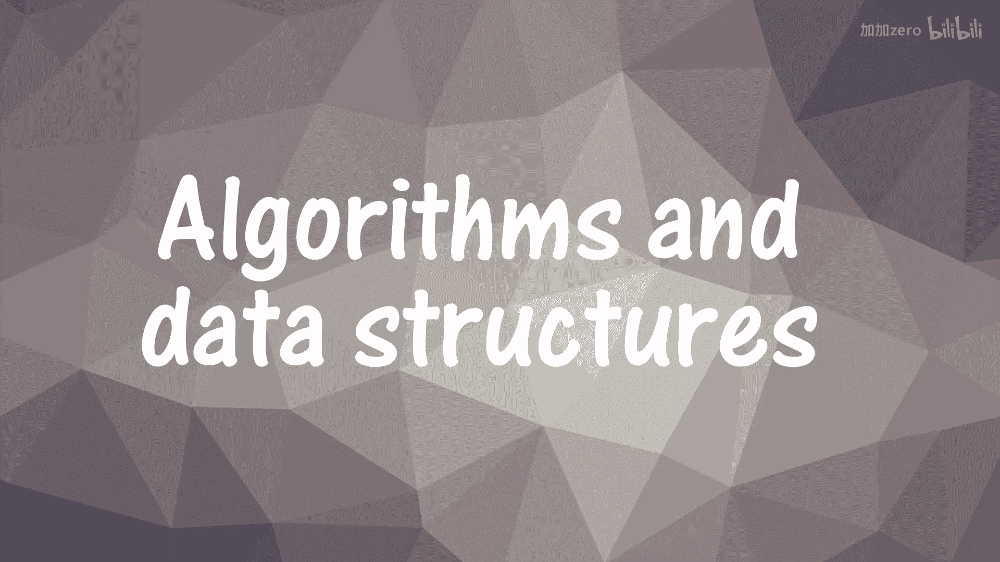
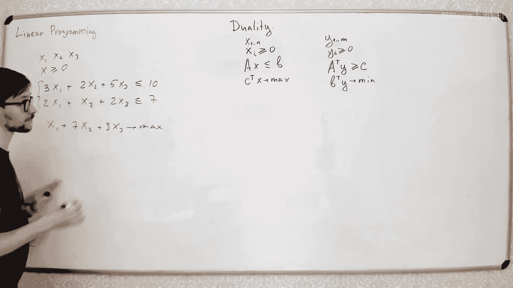

# 056：线性规划 📊

在本节课中，我们将学习线性规划。线性规划是一类优化问题，对于这类问题，存在一些通用的求解和分析方法。正如你将在本讲中看到的，我们本学期讨论过的一些问题实际上就属于线性规划问题。

## 什么是线性规划？ 🤔

在线性规划中，你求解的是一个优化问题，其中所有的约束条件和目标函数都是**线性函数**。

例如，假设你有 N 个变量：`x1, x2, ..., xn`。你对这些变量有一些线性约束。例如，像 `2*x1 + 3*x2 + 7*x5 <= 10` 这样的不等式。你有一系列这样的不等式，它们限制了变量的可能取值集合。然后，你想最大化或最小化某个函数，这个函数也必须是线性的。例如，最大化 `x1 + x3 + 4*x5`。

这里重要的是：你有这些变量，有一些线性不等式，还有一个你想最大化或最小化的线性函数。

## 课程中的例子 🔍

上一节我们介绍了线性规划的基本形式，本节中我们来看看本课程中哪些问题可以建模成这种形式。

以下是两个例子：

*   **最大流问题**：每条边有一个变量 `f_uv` 表示流量。约束包括 `0 <= f_uv <= c_uv`（容量约束）和对于每个非源/汇节点，流入等于流出（流量守恒）。这些都是线性（不）等式。目标函数是流出源点的总流量，也是一个线性函数。
*   **最大匹配问题**：每条边有一个变量 `x_uv`，取值为 0 或 1（表示是否在匹配中）。对于每个节点，约束为其相连边的变量之和 `<= 1`（即每个节点最多匹配一条边）。目标函数是最大化所有 `x_uv` 之和，即匹配的边数。

这两个问题有一个重要区别：在最大流问题中，我们通常不要求变量必须是整数（如果容量是整数，最优解自然会是整数）。而在最大匹配问题中，我们明确要求变量必须是整数（0 或 1），因为不能取“半条边”。

## 整数线性规划 vs. 实数线性规划 ⚖️

这引出了两类不同的问题：
*   **线性规划**：允许变量取任意实数。这类问题是**多项式时间可解**的。
*   **整数线性规划**：要求变量取整数值。这类问题是**NP完全**的。

对于某些整数线性规划问题，如果去掉整数限制（即求解对应的实数线性规划），得到的最优解碰巧就是整数解。例如：
*   **最大流问题**（容量为整数时）：其最优值等于最小割的值，而最小割的值是整数，因此最优流也是整数。
*   **二分图最大匹配问题**：可以转化为一个最大流问题，因此最优解也是整数。

但对于非二分图的最大匹配问题，情况则不同。考虑一个三角形图，其最优实数解可能是给每条边赋值 0.5，总值为 1.5，而实际的最大匹配大小是 1。因此，对于这类问题，实数线性规划的解只是原整数问题的一个近似。

## 线性规划的几何意义 📐

让我们从几何角度理解线性规划。假设我们有两个变量 `x1` 和 `x2`，以及一些线性不等式约束。每个不等式在平面上定义了一个半平面。所有这些半平面的交集构成了一个**凸多边形**。

我们的目标函数（例如 `c1*x1 + c2*x2`）可以看作一个向量 `(c1, c2)`。我们想在这个多边形内找到一个点，使得该点与目标向量的点积（即投影）最大。

一个关键性质是：**最优解总是出现在这个凸多边形的某个顶点上**。因为如果你在非顶点处，总可以沿着目标函数值不减少的方向移动，直到碰到边界，然后沿着边界移动，最终到达一个顶点。

在二维情况下，我们可以枚举多边形的所有顶点来找到最优解。但在高维空间（n 维）中，约束定义的区域是一个**凸多面体**，其顶点数量可能随维度指数增长，因此枚举所有顶点不可行。

## 标准形式与转换 🔧

为了方便使用通用算法求解，我们通常将线性规划问题转化为**标准形式**。一种常见的标准形式是：
*   所有变量**非负**。
*   所有约束都是**等式**。
*   目标是**最大化**一个线性函数。

任何线性规划问题都可以转化为这种形式。以下是转换方法：

1.  **处理无约束变量**：如果变量 `x` 可正可负，用两个非负变量 `x+` 和 `x-` 代替，令 `x = x+ - x-`。
2.  **处理不等式约束**：对于 `<=` 约束，添加一个**松弛变量** `s >= 0`，将不等式 `a^T x <= b` 变为等式 `a^T x + s = b`。对于 `>=` 约束，可以乘以 -1 转化为 `<=`。
3.  **处理等式约束**：等式约束 `a^T x = b` 可以直接保留。
4.  **处理最小化目标**：将最小化 `c^T x` 转化为最大化 `-c^T x`。

经过这些转换，我们总能得到标准形式的问题。

## 对偶问题 🔄

每一个线性规划问题（称为**原问题**）都有一个对应的**对偶问题**。它们从不同角度描述了同一个问题。

假设原问题是：
*   变量 `x >= 0`
*   约束 `A x <= b`
*   目标：最大化 `c^T x`

那么它的对偶问题是：
*   变量 `y >= 0`
*   约束 `A^T y >= c`
*   目标：最小化 `b^T y`

**弱对偶定理**指出，对于任何原问题的可行解 `x` 和对偶问题的可行解 `y`，都有 `c^T x <= b^T y`。即对偶问题的目标值给出了原问题目标值的上界。

**强对偶定理**指出，如果原问题和对偶问题都有可行解，那么它们的最优值相等。这是一个非常强大的结论。

### 对偶的例子

*   **最大匹配（原问题）** 与 **最小顶点覆盖（对偶问题）**：在二分图中，这两个问题的优化值相等。
*   **最大流（原问题）** 与 **最小割（对偶问题）**：根据最大流最小割定理，它们的优化值相等。
*   **指派问题（原问题）** 与 **势函数调整（对偶问题）**：匈牙利算法本质上就是在维护原问题（匹配）和对偶问题（节点势能）的可行解，并利用它们之间的关系寻找最优解。

## 互补松弛条件 ✅

如何判断我们找到的原问题解 `x*` 和对偶问题解 `y*` 是否是最优的？一个关键条件是**互补松弛条件**。

当 `x*` 和 `y*` 分别为原问题和对偶问题的最优解时，对于每一个约束，以下两者至少有一个成立（即“松弛”）：
1.  原问题的第 `i` 个约束取等号（即紧约束）。
2.  对应对偶变量 `y_i` 为 0。

用公式表示，对于原问题约束 `(A x)_i <= b_i` 和对偶变量 `y_i`，有：
`y_i * (b_i - (A x)_i) = 0`

这个条件非常实用，因为它将“全局最优”这个大条件，分解成了许多容易验证的“局部”条件。

## 处理非二分图匹配 🌀

回到非二分图最大匹配问题。我们之前看到，简单的线性规划模型（边变量 + 每个节点的度约束）会产生非整数最优解（如三角形的例子）。

解决方法是为所有**奇数大小的顶点子集 U** 添加额外的约束：
`sum_{u,v in U} x_uv <= (|U| - 1) / 2`

这个约束称为**奇圈约束**。添加了所有这样的约束后，多面体的所有顶点都变成了整数点，从而实数线性规划的解就是整数解。

问题是，这样的约束有指数多个。我们无法显式地写出整个线性规划。

解决思路是利用对偶。在对偶问题中，每个奇圈约束对应一个对偶变量。在算法（如开花算法）运行过程中，只有少数对偶变量（对应当前找到的“花”）是非零的。算法只需动态维护这些非零的对偶变量，而无需处理整个指数级的系统，从而实现了多项式时间的求解。

## 总结 📝

本节课我们一起学习了线性规划的核心概念：
1.  **定义**：目标函数和约束均为线性的优化问题。
2.  **两类问题**：实数域上的线性规划（P）和整数线性规划（NP完全）。
3.  **几何直观**：可行域是凸多面体，最优解在顶点取得。
4.  **标准形式**：为应用通用算法，可将问题转化为变量非负、约束为等式的形式。
5.  **对偶理论**：每个原问题都有一个对偶问题，它们的最优值相等（强对偶）。这提供了证明最优性和设计算法（如匈牙利算法、开花算法）的强大工具。
6.  **互补松弛条件**：判断最优解的实用准则。
7.  **应用**：我们看到了如何将最大流、匹配等问题建模为线性规划，并利用对偶理论理解其内在联系（如最大流-最小割定理）。

线性规划是优化理论的基础，其思想和方法广泛应用于算法设计、经济学、工程管理等众多领域。