# 057：数论算法入门 🧮


在本节课中，我们将学习数论算法的基础知识。数论是算法理论中一个广阔的领域，虽然我们无法深入探讨所有细节，但本次课程将提供一个简明的入门介绍，涵盖最大公约数、扩展欧几里得算法、中国剩余定理、模运算、素数测试以及因数分解等核心概念。我们将使用简单的语言和示例，确保初学者能够理解。

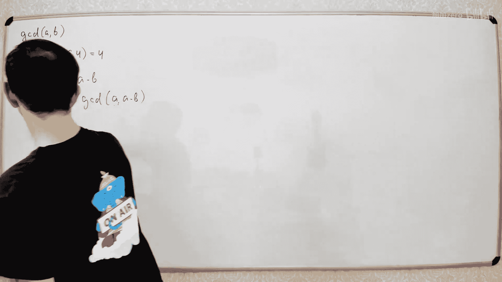

---

## 最大公约数与欧几里得算法 📐

上一节我们介绍了课程概述，本节中我们来看看如何计算两个整数的最大公约数。

最大公约数是指能同时整除两个给定整数的最大正整数。例如，20和64的最大公约数是4。

计算最大公约数有一个古老而简单的算法，称为欧几里得算法。其核心思想基于一个简单的观察：如果数字A和B都能被某个数D整除，那么它们的差 `A - B` 也能被D整除。这意味着，数对 `(A, B)` 和 `(A, A-B)` 拥有完全相同的公约数集合，因此它们的最大公约数也相同。

以下是该算法的递归实现：

```python
def gcd(a, b):
    if b == 0:
        return a
    else:
        return gcd(b, a % b)
```

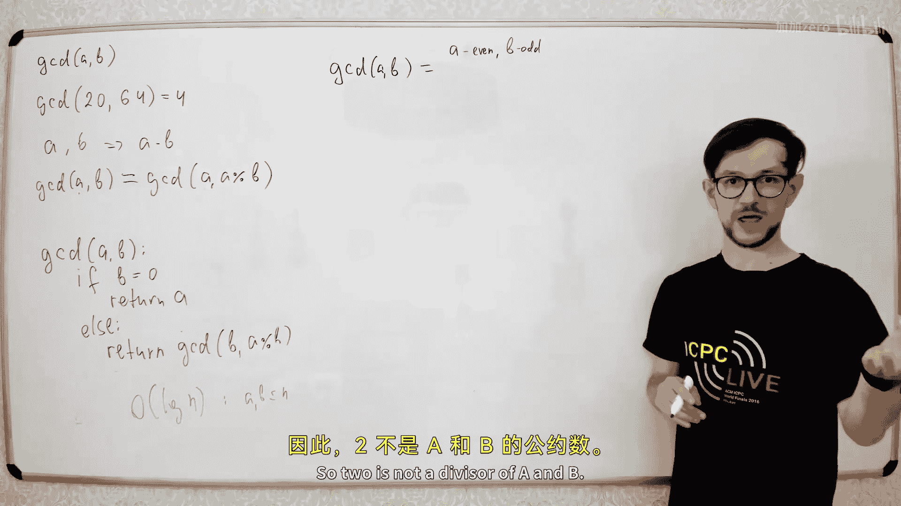

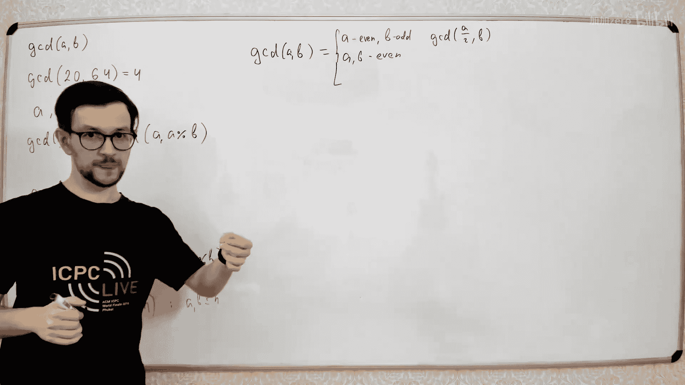

算法开始时，我们确保 `a >= b`。如果 `b` 为0，则 `a` 就是最大公约数。否则，我们递归计算 `b` 和 `a` 除以 `b` 的余数的最大公约数。每次递归调用，其中一个数至少减少一半，因此算法的时间复杂度是 `O(log(min(a, b)))`，这是一个多项式时间算法。

---

## 扩展欧几里得算法与丢番图方程 🔍

上一节我们学习了如何计算最大公约数，本节中我们来看看如何利用它来求解丢番图方程。

丢番图方程形如 `A*x + B*y = C`，其中A、B、C是整数系数，我们需要找到整数解x和y。首先，设 `d = gcd(A, B)`。如果C不能被d整除，则该方程无整数解。如果C能被d整除，我们可以先求解简化方程 `A*x + B*y = d`。

扩展欧几里得算法不仅能计算出最大公约数d，还能找到满足 `A*x + B*y = d` 的系数x和y。以下是其实现：

```python
def extended_gcd(a, b):
    if b == 0:
        return (a, 1, 0)
    else:
        d, x1, y1 = extended_gcd(b, a % b)
        x = y1
        y = x1 - (a // b) * y1
        return (d, x, y)
```

得到 `(d, x, y)` 后，原方程 `A*x + B*y = C` 的一个特解可以通过将x和y乘以 `C/d` 得到。该方程存在无穷多组解。

---

## 中国剩余定理 🧩

上一节我们解决了线性丢番图方程，本节中我们来看一个处理同余方程组的有力工具——中国剩余定理。

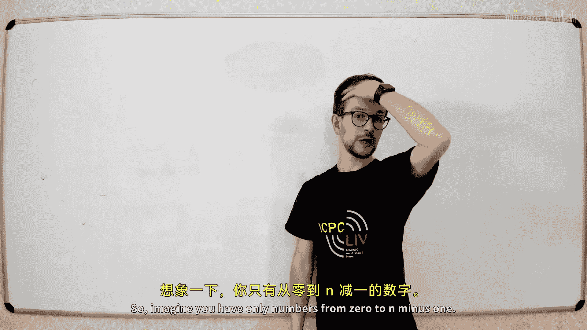


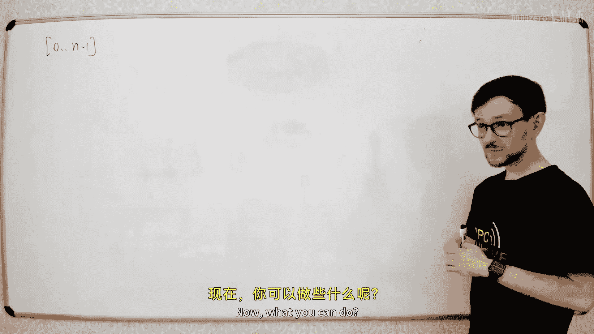

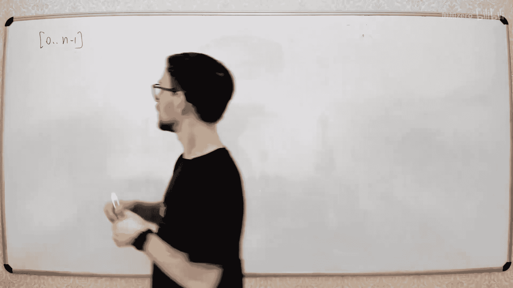


中国剩余定理指出：给定两个互质的正整数n和m（即 `gcd(n, m) = 1`），那么对于任意整数a（`0 <= a < n*m`），由它产生的两个余数 `a1 = a mod n` 和 `a2 = a mod m` 的组合是唯一的。反之，给定任意一对余数 `(a1, a2)`，都存在唯一的一个a（`0 <= a < n*m`）满足这两个同余式。

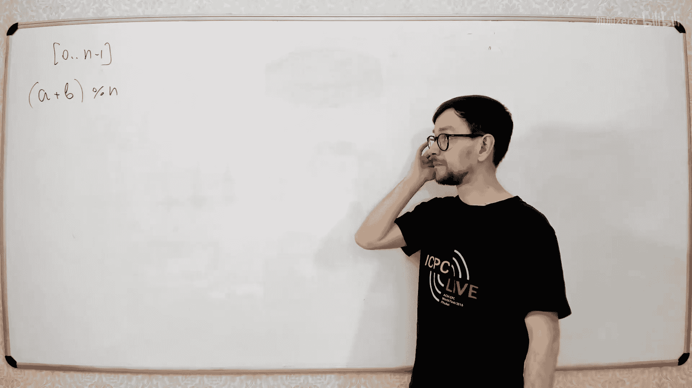

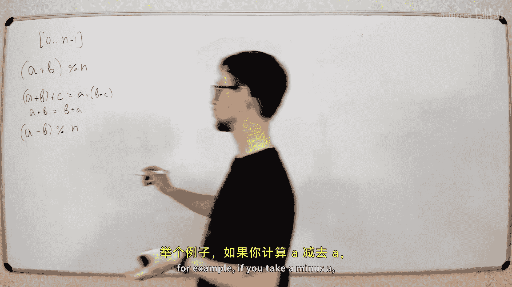

如何从 `(a1, a2)` 反推回a呢？我们可以建立方程：
`a = a1 + x*n`
`a = a2 + y*m`

将两式联立，得到 `a1 + x*n = a2 + y*m`，整理后得到关于x和y的丢番图方程：`x*n - y*m = a2 - a1`。由于n和m互质，该方程一定有解。我们可以用扩展欧几里得算法求解出x和y，然后代入任一方程即可求出a。

如果n和m不互质，方程组有解的条件是 `a2 - a1` 能被 `gcd(n, m)` 整除，并且解在0到 `lcm(n, m) - 1`（最小公倍数减一）的范围内是唯一的。

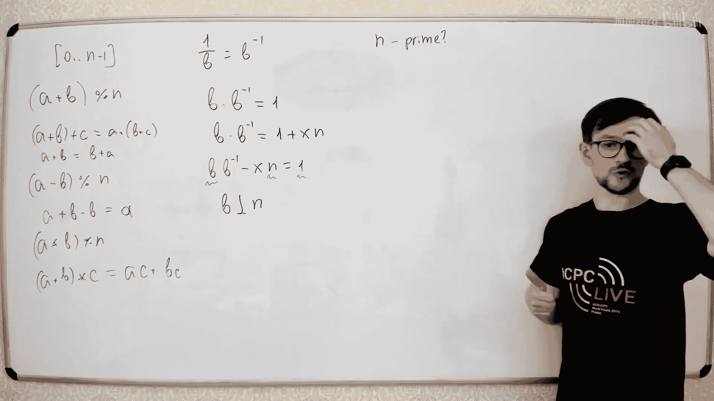

---

## 模运算的世界 🔢

上一节我们处理了同余方程组，本节中我们系统地看看在模运算下如何进行算术。

模运算将整数限制在一个有限的集合 `{0, 1, 2, ..., M-1}` 内。我们定义模M下的加法、减法和乘法如下：
`(a + b) mod M`
`(a - b) mod M`
`(a * b) mod M`

这些运算保留了普通整数运算的许多性质，如结合律、交换律和分配律。关键在于，每次运算后我们都取模M，结果始终落在0到M-1之间。

那么除法呢？在模M下，“除以B”意味着寻找一个数 `B^{-1}`（称为B的模逆元），使得 `B * B^{-1} ≡ 1 (mod M)`。这等价于求解丢番图方程 `B*x + M*y = 1`。根据之前的讨论，该方程有解当且仅当 `gcd(B, M) = 1`，即B与M互质。我们可以再次使用扩展欧几里得算法来求解逆元。

一个重要的特例是当模数M为素数时。因为素数与所有小于它的正整数都互质（除了0），所以在模素数下，我们可以对任何非零元素进行除法运算，这构成了许多密码学算法的基础。

---

## 素数测试：从费马到米勒-拉宾 ⚗️

上一节我们进入了模运算的世界，本节中我们探讨一个关键问题：如何判断一个大数是否是素数？

一个简单的方法是试除法：检查从2到 `sqrt(N)` 的所有整数是否能整除N。如果没有，则N是素数。但这个方法对于非常大的数（如几百位）来说太慢了，因为 `sqrt(N)` 相对于N的位数（`log N`）是指数级增长的。

我们需要更快的概率性算法。费马小定理指出：如果p是素数，且a是与p互质的任意整数，那么 `a^{p-1} ≡ 1 (mod p)`。费马素性测试就是基于此：随机选取一个a，检查 `a^{N-1} mod N` 是否等于1。如果不等于1，则N一定是合数；如果等于1，则N可能是素数。

但存在一些合数（称为卡迈克尔数），对于大多数与其互质的a，费马测试也会错误地返回“可能是素数”。米勒-拉宾素性测试对此进行了改进。它将 `N-1` 分解为 `2^s * d`（其中d是奇数），然后计算序列 `a^d, a^{2d}, a^{4d}, ..., a^{2^{s-1}*d} (mod N)`。如果N是素数，那么这个序列要么第一个数就是1，要么在出现1之前会出现-1（即 `N-1`）。如果在出现1之前出现的数不是±1，那么N一定是合数。

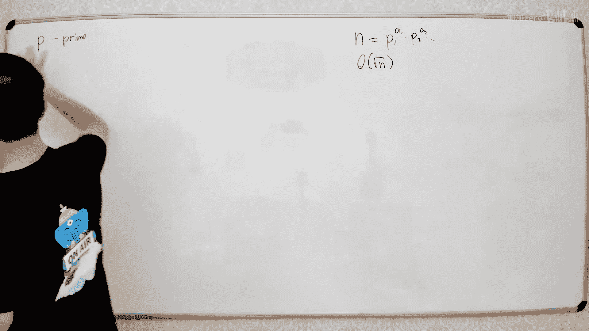

理论上，对于合数N，至少75%的a会是“证人”（证明N是合数）。因此，通过随机选择多个a进行测试，我们可以以极高的概率确定N是否为素数。

---

## 因数分解与波拉德ρ算法 🎣

上一节我们学习了如何测试素数，本节中我们看看与之相关的难题：如何将一个合数分解为质因数的乘积。

因数分解是许多密码学系统安全性的基石，目前没有已知的多项式时间经典算法。最直接的方法仍是试除到 `sqrt(N)`。但有一些更快的亚指数级算法，例如波拉德ρ算法。

波拉德ρ算法的核心思想是“生日悖论”：在一个有N个可能值的系统中，随机选取大约 `sqrt(N)` 个样本后，有很大概率出现重复（碰撞）。算法步骤如下：
1.  选择一个简单的伪随机函数，例如 `f(x) = (x^2 + 1) mod N`。
2.  从某个初始值 `x0` 开始，迭代计算序列 `x_{i+1} = f(x_i)`。
3.  使用弗洛伊德判圈算法（快慢指针）在这个序列中寻找循环。因为函数值模N是有限的，序列必然会出现循环。
4.  关键点在于：如果N有一个真因子p，那么序列模p也会形成循环，且这个循环的长度大约为 `sqrt(p)`，它可能远小于序列模N的循环长度。
5.  当快慢指针在序列中相遇时（即 `x_i ≡ x_{2i} (mod p)` 但 `x_i ≠ x_{2i} (mod N)`），它们的差 `|x_i - x_{2i}|` 将是p的倍数，但不是N的倍数。
6.  计算 `gcd(|x_i - x_{2i}|, N)`，结果就是N的一个非平凡因子。

该算法的时间复杂度约为 `O(N^{1/4})`，虽然仍不是多项式时间，但比试除法快得多。

---

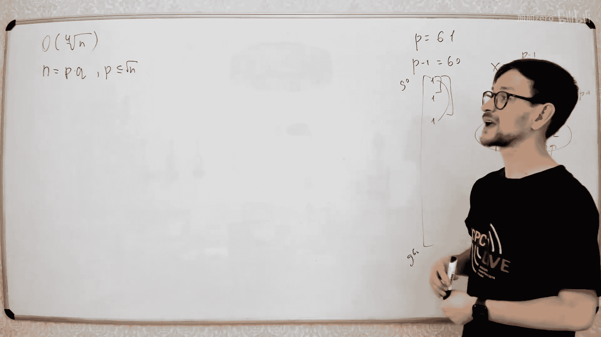

## 原根及其寻找方法 🔑

上一节我们了解了因数分解的挑战，本节最后我们简要讨论一下原根的概念。

对于一个素数p，原根g是一个整数，使得 `g^1, g^2, ..., g^{p-1} (mod p)` 这个序列恰好遍历了 `1` 到 `p-1` 的所有整数。也就是说，g的幂次在模p下能生成整个乘法群。

原根在密码学中很有用。好消息是，每个素数都有很多原根。要验证一个数g是否是模p的原根，我们不需要检查所有 `p-1` 个幂次。根据数论知识，如果g不是原根，那么它的阶（最小的正整数k使得 `g^k ≡ 1 (mod p)`）必然是 `p-1` 的一个真因子。因此，我们只需要检查对于 `p-1` 的每个质因数q，是否有 `g^{(p-1)/q} ≡ 1 (mod p)`。如果对于所有质因数q，该等式都不成立，那么g就是原根。

这里的一个实际困难是，我们需要对 `p-1` 进行质因数分解。对于精心选择的素数（例如 `p-1` 只有小质因子），这个过程会很快。

---


本节课中我们一起学习了数论算法的基础。我们从计算最大公约数的欧几里得算法开始，扩展到求解丢番图方程。然后探讨了中国剩余定理和模运算，包括求逆元。接着，我们介绍了费马测试和更强大的米勒-拉宾概率素数测试。最后，我们触及了因数分解的难题，简介了波拉德ρ算法，并了解了原根的概念。这些知识是理解现代密码学和许多高级算法的基础。