# 058：基础密码学算法

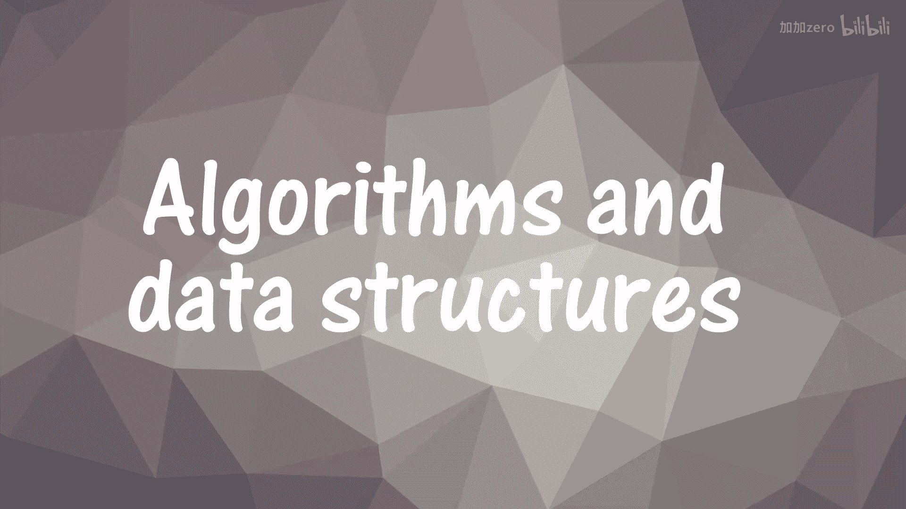

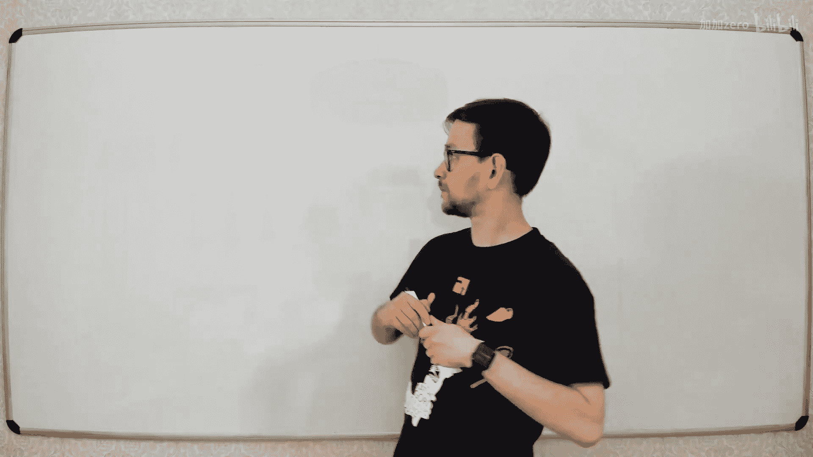

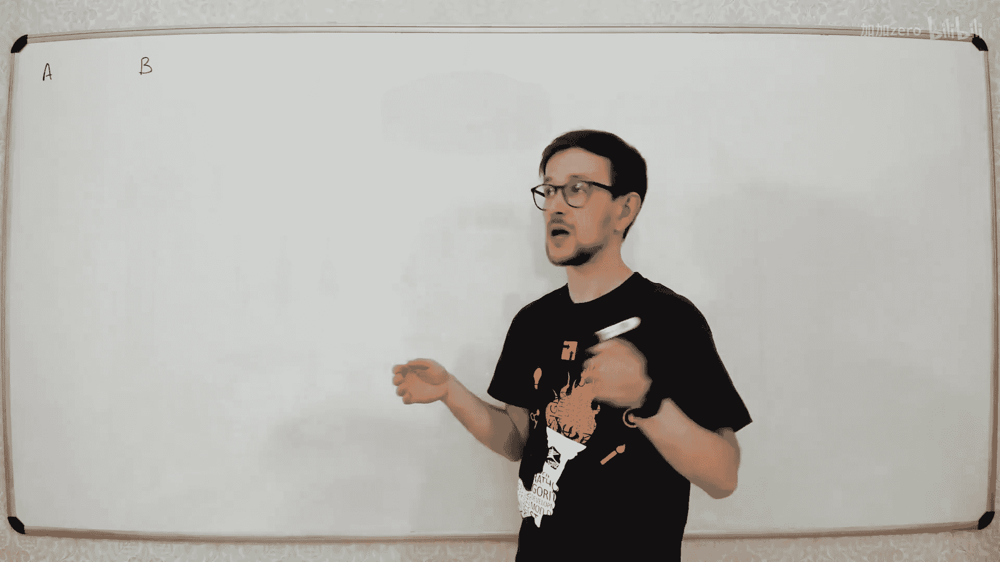

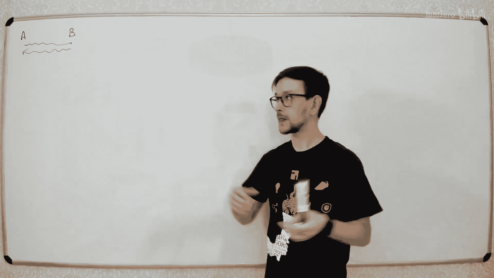

在本节课中，我们将学习密码学的基础概念，并了解如何利用之前学过的数论算法来构建现代密码系统。我们将探讨对称加密、非对称加密（公钥加密）以及数字签名等核心概念，并通过RSA和Diffie-Hellman两个具体协议来理解其背后的数学原理。

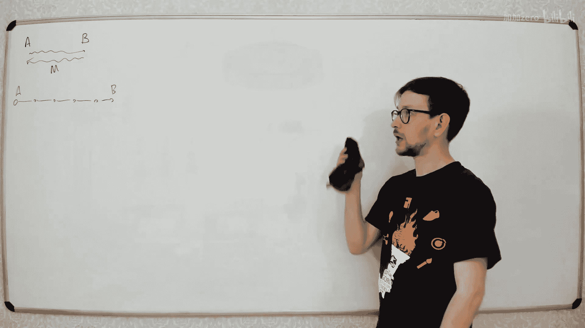

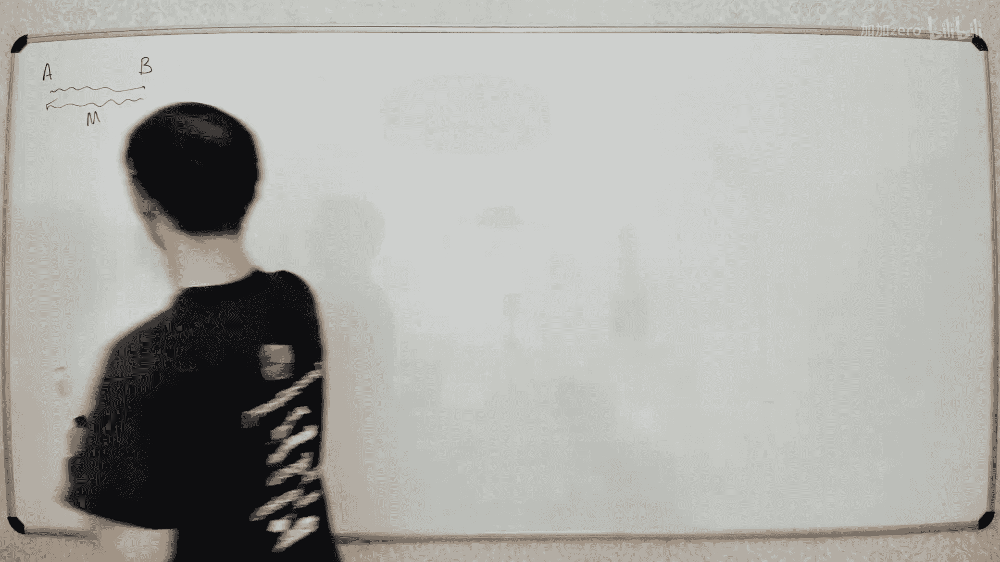

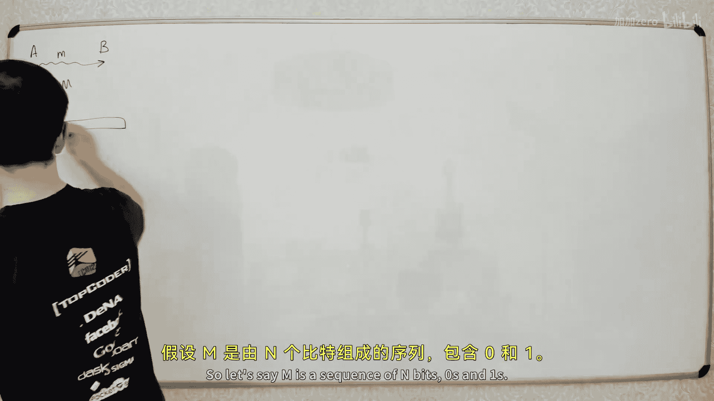

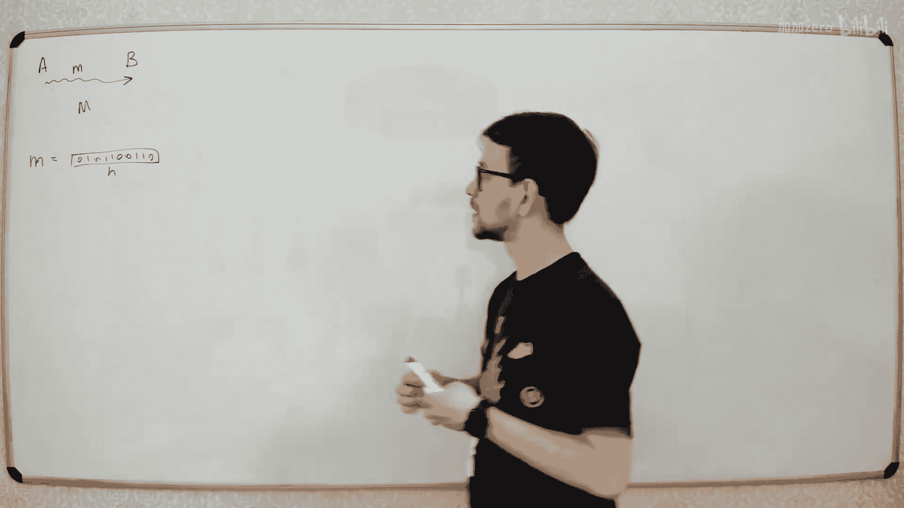

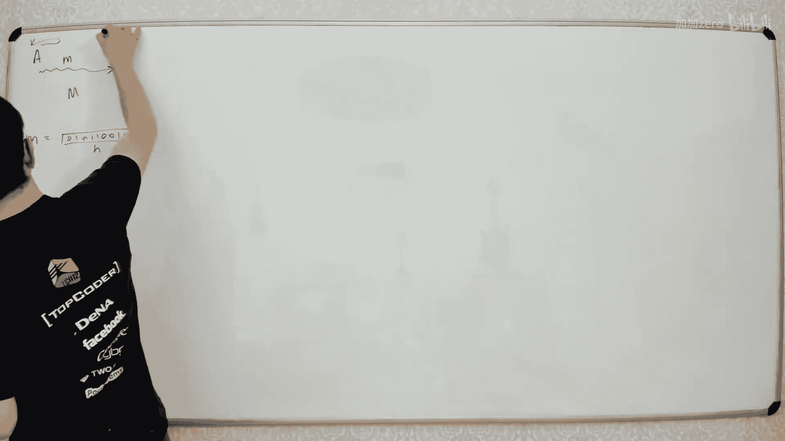

## 什么是密码学？

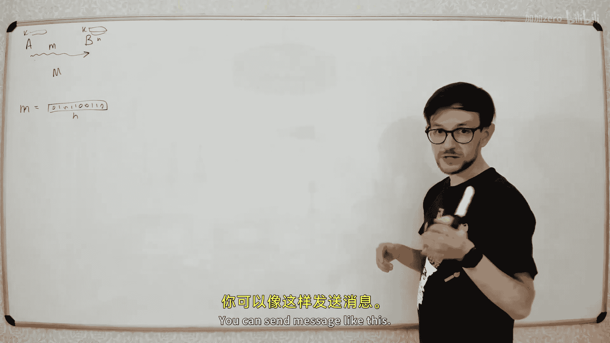

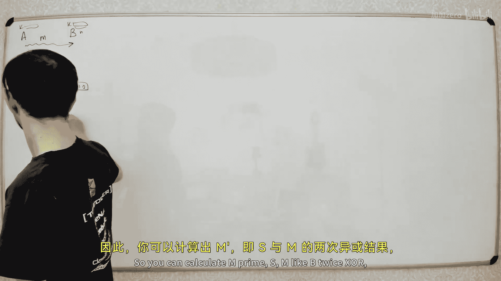

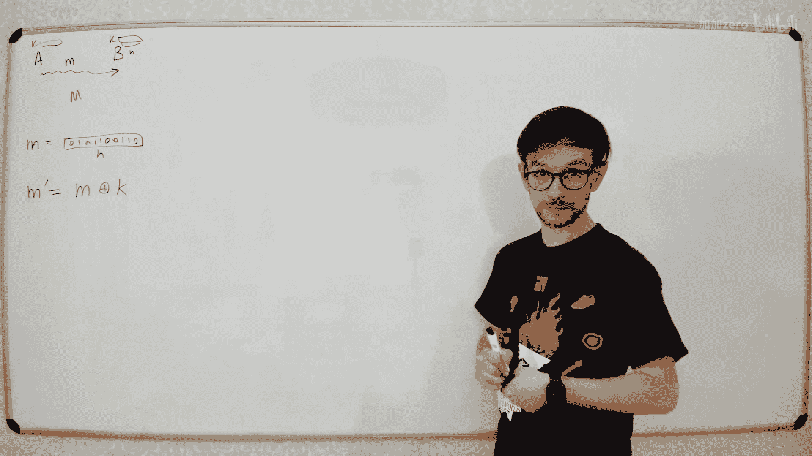

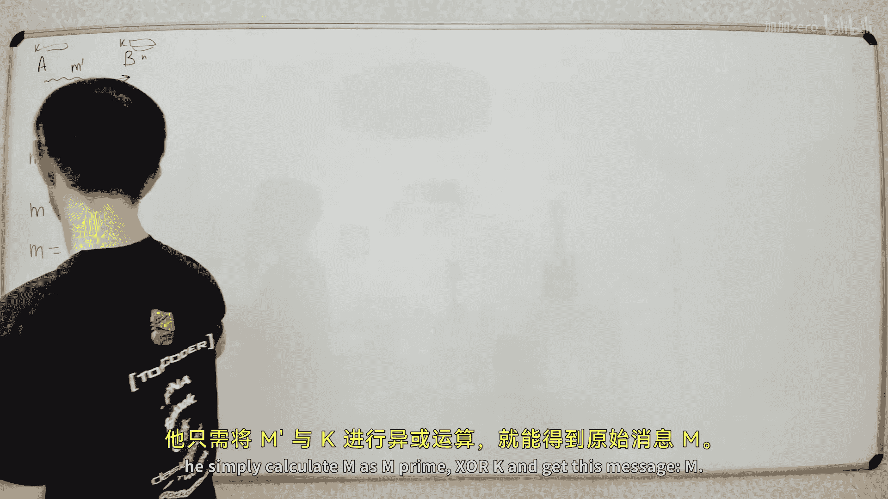

上一节我们介绍了数论算法，本节中我们来看看如何将它们应用于密码学。密码学旨在解决一个核心问题：如何在不安全的信道上（如互联网）安全地交换信息。

想象有两个人，通常称为Alice和Bob，他们想通过网络交换信息。网络中存在一个攻击者Mallory，他可以监听所有经过网络节点的数据。如果不采取任何措施，Mallory就能读取所有消息。

## 对称加密：一次性密码本

为了解决这个问题，我们需要对消息进行加密。最简单的方法是对称加密，它要求通信双方共享一个相同的密钥。

以下是其工作原理：
1.  Alice和Bob事先共享一个与消息等长的随机密钥K。
2.  Alice将原始消息M与密钥K进行按位异或（XOR）操作，得到加密消息 M' = M ⊕ K。
3.  Alice将M'发送给Bob。
4.  Bob收到M'后，用相同的密钥K进行解密：M = M' ⊕ K。

对于攻击者Mallory而言，如果他不知道密钥K，那么M'看起来就是一个完全随机的比特序列，他无法从中获取任何关于M的信息。

然而，这种方法存在两个主要问题：
1.  **密钥分发问题**：Alice和Bob如何在不安全的信道上安全地共享这个密钥？
2.  **密钥重用问题**：同一个密钥只能使用一次。如果重复使用，攻击者通过分析多个加密消息的关联性，可能推断出部分信息。

## 公钥加密（非对称加密）

对称加密的核心难题是密钥分发。公钥加密通过使用一对密钥而非单个密钥，巧妙地解决了这个问题。

公钥加密的工作原理如下：
*   每个人生成一对密钥：一个**公钥**（可以公开给任何人）和一个**私钥**（必须严格保密）。
*   用公钥加密的消息，只能用对应的私钥解密。
*   用私钥加密（签名）的消息，可以用对应的公钥验证。

### RSA加密算法

RSA是一种基于大数分解困难性的公钥加密算法。下面我们来看看如何构建RSA系统。

**密钥生成：**
1.  选择两个大质数 **p** 和 **q**。
2.  计算它们的乘积 **n = p * q**。n 的长度就是密钥长度。
3.  计算欧拉函数 **φ(n) = (p-1) * (q-1)**。
4.  选择一个整数 **e**，使得 1 < e < φ(n)，且 e 与 φ(n) 互质（通常取 65537）。
5.  计算 **d**，使得 **d * e ≡ 1 (mod φ(n))**。即 d 是 e 模 φ(n) 的乘法逆元，可以使用扩展欧几里得算法求得。
6.  公钥是 **(n, e)**，私钥是 **(n, d)**。

**加密过程：**
如果Bob想给Alice发送消息M（M是一个小于n且与n互质的整数），他使用Alice的公钥 (n, e) 计算：
**密文 C = M^e mod n**

**解密过程：**
Alice收到密文C后，使用自己的私钥 (n, d) 计算：
**明文 M = C^d mod n**

**安全性：**
攻击者知道公钥 (n, e) 和密文 C。为了解密，他需要私钥 d。而计算 d 需要知道 φ(n)，计算 φ(n) 又需要对 n 进行质因数分解（找出 p 和 q）。对于足够大的 n，质因数分解在计算上是不可行的，这就保证了RSA的安全性。

### Diffie-Hellman密钥交换

Diffie-Hellman协议不是直接用于加密消息，而是让双方在不安全的信道上安全地协商出一个共享的对称密钥，解决了对称加密的密钥分发问题。

**协议过程：**
1.  Alice和Bob公开约定一个大质数 **p** 和它的一个原根 **g**。
2.  Alice选择一个私密的随机数 **a**，计算 **A = g^a mod p**，并将A发送给Bob。
3.  Bob选择一个私密的随机数 **b**，计算 **B = g^b mod p**，并将B发送给Alice。
4.  Alice收到B后，计算共享密钥 **s = B^a mod p = (g^b)^a mod p = g^(ab) mod p**。
5.  Bob收到A后，计算共享密钥 **s = A^b mod p = (g^a)^b mod p = g^(ab) mod p**。

现在，Alice和Bob拥有了相同的共享密钥s，而窃听者Mallory只能看到p, g, A, B。他想计算出s，就需要从A或B中反推出a或b，这相当于求解离散对数问题，在计算上是困难的。

## 数字签名

公钥加密还可以用于实现数字签名，其目的是验证消息的来源和完整性，类似于手写签名。

**签名过程（以RSA为例）：**
假设Alice想对消息M进行签名。
1.  Alice计算消息的哈希值 **H = Hash(M)**。
2.   Alice使用自己的**私钥 (n, d)** 对哈希值进行“加密”：**签名 S = H^d mod n**。
3.  Alice将消息M和签名S一起发送给Bob。

**验证过程：**
Bob收到消息M和签名S后：
1.  Bob使用Alice的**公钥 (n, e)** 对签名进行“解密”：**H' = S^e mod n**。
2.  Bob自己计算收到消息M的哈希值：**H = Hash(M)**。
3.  如果 **H' == H**，则证明签名有效，消息确实来自Alice且未被篡改。

## 中间人攻击与证书

公钥加密虽然解决了密钥分发，但引入了新的问题：**身份认证**。攻击者Mallory可以进行中间人攻击：
1.  Alice想与Bob通信，向Bob索要公钥。
2.  Mallory截获请求，将自己的公钥发送给Alice，同时冒充Alice向Bob索要公钥。
3.  Bob将自己的公钥发送给“Alice”（实际上是Mallory）。
4.  现在，Alice以为Mallory的公钥是Bob的，Bob以为Mallory的公钥是Alice的。Mallory可以解密双方的消息，阅读后再用正确的公钥加密转发，而通信双方毫无察觉。

为了解决这个问题，需要引入可信的第三方——**证书颁发机构**。
*   CA用自己的私钥为网站的公钥签名，生成**数字证书**。
*   用户的设备（如浏览器）内置了受信任的CA的公钥。
*   当用户访问网站时，网站会发送其证书。用户设备用内置的CA公钥验证证书签名，从而确信该公钥确实属于所要访问的网站。

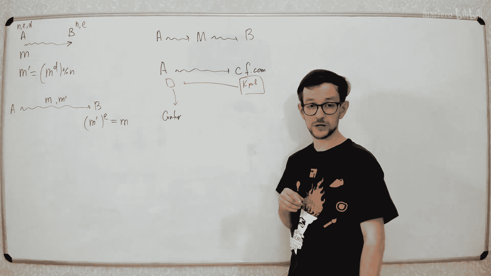

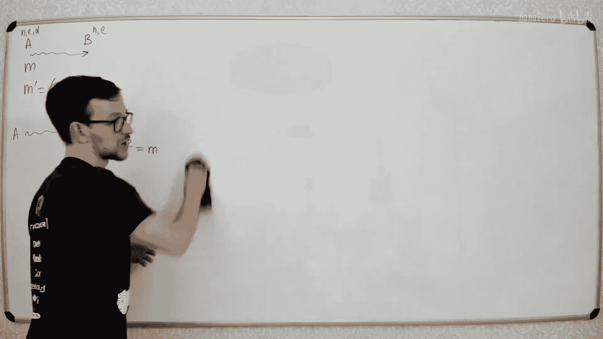

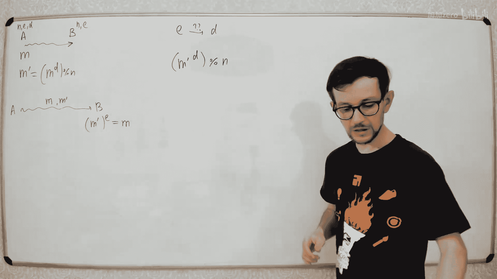

## 实践中的注意事项

理论上的安全算法在实现时可能因为细节问题变得不安全。

**侧信道攻击：**
攻击者不直接攻击算法本身，而是通过测量执行时间、功耗、电磁辐射等“侧信道”信息来推断密钥。例如，在RSA解密运算 `C^d mod n` 中，如果实现代码在遇到私钥d的某一位为1时才执行一次乘法，那么通过精确测量解密时间，攻击者就可能逐步推算出私钥d的每一位。

**低加密指数攻击：**
在RSA中，为了提升加密速度，公钥e常取一个小值（如3）。如果同一个消息M用不同的模数n1, n2, n3但相同的e=3加密，即：
C1 = M^3 mod n1
C2 = M^3 mod n2
C3 = M^3 mod n3
根据中国剩余定理，攻击者可以计算出 `M^3 mod (n1*n2*n3)`。由于M小于每个n，`M^3` 也小于 `n1*n2*n3`，因此攻击者可以直接对计算结果开三次方根得到M。解决方案是在加密前对消息进行**填充**，加入随机数据，确保每次加密的“消息”都不同。

---

本节课中我们一起学习了密码学的基础。我们从简单的对称加密及其局限性出发，引出了公钥加密的概念。我们深入探讨了基于大数分解的RSA算法和基于离散对数的Diffie-Hellman密钥交换协议，并了解了如何利用它们进行加密和数字签名。最后，我们讨论了中间人攻击的威胁及其通过CA证书的解决方案，并指出了理论算法在实践应用中需要注意的侧信道攻击等问题。密码学是构建安全数字世界的基石，理解这些基本原理至关重要。