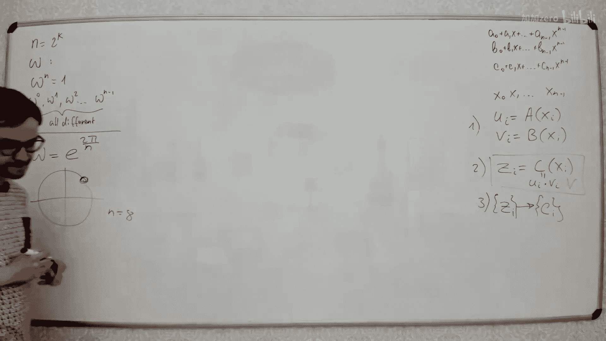

# 059：快速傅里叶变换


在本节课中，我们将要学习快速傅里叶变换。这是一种用于快速计算多项式乘法的算法，其时间复杂度远低于传统的平方级算法。我们将从整数乘法的问题引入，探讨如何通过多项式乘法来加速计算，并详细讲解快速傅里叶变换的原理和实现步骤。

## 问题引入：整数乘法

假设你有两个大整数 `A` 和 `B`，每个整数的长度都是 `n` 位。你想要计算它们的乘积 `C = A * B`。

如果使用传统的竖式乘法，你需要将 `B` 的每一位数字与整个整数 `A` 相乘，然后将所有中间结果相加。对于长度为 `n` 的整数，这需要 `O(n^2)` 的时间复杂度。

一个有趣的问题是：能否以低于 `O(n^2)` 的时间复杂度来计算两个大整数的乘积？答案是肯定的。

## 从整数到多项式

首先，让我们将问题从整数乘法转换为多项式乘法，因为后者在概念上更容易处理。

假设有两个多项式 `A(x)` 和 `B(x)`，它们的次数都是 `n-1`：
`A(x) = a0 + a1*x + a2*x^2 + ... + a_{n-1}*x^{n-1}`
`B(x) = b0 + b1*x + b2*x^2 + ... + b_{n-1}*x^{n-1}`

我们想要计算它们的乘积多项式 `C(x) = A(x) * B(x)`。乘积多项式 `C(x)` 的次数将是 `2n-2`，其形式为：
`C(x) = c0 + c1*x + c2*x^2 + ... + c_{2n-2}*x^{2n-2}`

如何找到系数 `c_i` 呢？每个系数 `c_i` 是所有满足 `j + k = i` 的 `a_j * b_k` 之和：
`c_i = Σ_{j=0}^{i} a_j * b_{i-j}`

如果直接计算这个求和，对于每个 `c_i` 需要 `O(n)` 次操作，总共有 `O(n)` 个系数，因此总时间复杂度仍然是 `O(n^2)`。

我们的目标是找到一种方法，能够比 `O(n^2)` 更快地计算这些系数和。

## 分治算法：Karatsuba算法

在深入快速傅里叶变换之前，我们先看一个更简单的分治算法：Karatsuba算法。它展示了如何通过减少递归调用的次数来改进多项式乘法。

其核心思想是将每个多项式分成两半。设：
`A(x) = A1(x) + x^{n/2} * A2(x)`
`B(x) = B1(x) + x^{n/2} * B2(x)`

那么乘积 `C(x)` 可以表示为：
`C(x) = A1*B1 + x^{n/2}*(A1*B2 + A2*B1) + x^n*(A2*B2)`

如果直接递归计算这四个乘积 `A1*B1`, `A1*B2`, `A2*B1`, `A2*B2`，我们会有四个规模为 `n/2` 的子问题。递归深度为 `log_2(n)`，总调用次数为 `4^{log_2(n)} = n^2`，时间复杂度仍是 `O(n^2)`。

Karatsuba算法的巧妙之处在于，我们并不需要分别计算 `A1*B2` 和 `A2*B1`，只需要它们的和。我们可以通过计算 `(A1 + A2) * (B1 + B2)` 来得到这个和：
`(A1 + A2)*(B1 + B2) = A1*B1 + A1*B2 + A2*B1 + A2*B2`

然后，从这个结果中减去我们已经计算好的 `A1*B1` 和 `A2*B2`，就得到了 `A1*B2 + A2*B1`。



因此，我们只需要进行三次递归调用：计算 `A1*B1`、`A2*B2` 和 `(A1+A2)*(B1+B2)`。时间复杂度变为 `O(n^{log_2(3)}) ≈ O(n^{1.585})`，比 `O(n^2)` 更快。

## 快速傅里叶变换的核心思想

快速傅里叶变换提供了另一种更快的多项式乘法方法，其目标是在 `O(n log n)` 时间内完成计算。

其基本思路分为三步：
1.  **求值**：选取一组特殊的点 `x_0, x_1, ..., x_{m-1}`，分别计算多项式 `A(x)` 和 `B(x)` 在这些点上的值。
2.  **点乘**：计算乘积多项式 `C(x)` 在这些点上的值。由于 `C(x_i) = A(x_i) * B(x_i)`，这一步只需将第一步得到的对应值相乘即可，时间复杂度为 `O(n)`。
3.  **插值**：根据 `C(x)` 在 `m` 个点上的值，重构出 `C(x)` 的系数。

这三步中，第二步是最简单的。难点在于第一步（求值）和第三步（插值）如何高效完成。如果直接计算每个点的值，每个点需要 `O(n)` 时间，`m` 个点就是 `O(n^2)`，没有改进。

快速傅里叶变换的关键在于**精心选择这组点**，并利用这些点的特殊性质，使得求值和插值都能在 `O(n log n)` 时间内完成。

## 单位根与点的选择

为了使算法高效，我们需要两个条件：
1.  多项式系数的数量 `n` 是 2 的幂次。如果不是，可以通过在末尾补零系数来扩展到最近的 2 的幂次。
2.  选取的点是**单位根**的幂次。

什么是单位根？它是一个复数 `ω`，满足 `ω^n = 1`，并且它的幂次 `ω^0, ω^1, ..., ω^{n-1}` 互不相同。在复平面上，`n` 次单位根均匀分布在单位圆上。通常我们取：
`ω = e^{2πi / n} = cos(2π/n) + i * sin(2π/n)`

我们选取的点就是这些单位根：`x_k = ω^k` (k = 0, 1, ..., n-1)。

这些点的特殊性质在于：
*   `ω^{k + n} = ω^k` （周期性）
*   `(ω^k)^2 = ω^{2k} = ω^{(2k) mod n}` （平方后仍在单位根集合中）
*   当 `n` 为偶数时，`ω^{k + n/2} = -ω^k`

这些性质是快速傅里叶变换能够进行分治的基础。

## 离散傅里叶变换

第一步的求值过程，即计算多项式 `A(x)` 在所有 `n` 次单位根上的值，被称为**离散傅里叶变换**。

设多项式 `A(x) = a0 + a1*x + ... + a_{n-1}*x^{n-1}`。DFT 将系数向量 `(a0, a1, ..., a_{n-1})` 变换为值向量 `(A(ω^0), A(ω^1), ..., A(ω^{n-1}))`。

我们可以用分治法高效计算 DFT。将多项式 `A(x)` 按奇偶次项拆分为两个小多项式：
`A_even(x) = a0 + a2*x + a4*x^2 + ...` （包含所有偶数下标系数）
`A_odd(x) = a1 + a3*x + a5*x^2 + ...` （包含所有奇数下标系数）

那么原多项式可以表示为：
`A(x) = A_even(x^2) + x * A_odd(x^2)`

现在，我们要计算 `A(x)` 在点 `ω^0, ω^1, ..., ω^{n-1}` 上的值。注意到：
`A(ω^k) = A_even((ω^k)^2) + ω^k * A_odd((ω^k)^2)`
`A(ω^{k + n/2}) = A_even((ω^{k + n/2})^2) + ω^{k + n/2} * A_odd((ω^{k + n/2})^2)`

由于 `(ω^{k + n/2})^2 = ω^{2k + n} = ω^{2k} = (ω^k)^2`，并且 `ω^{k + n/2} = -ω^k`，我们有：
`A(ω^{k + n/2}) = A_even((ω^k)^2) - ω^k * A_odd((ω^k)^2)`

观察这两个公式：
`A(ω^k) = A_even((ω^k)^2) + ω^k * A_odd((ω^k)^2)`
`A(ω^{k + n/2}) = A_even((ω^k)^2) - ω^k * A_odd((ω^k)^2)`

关键在于，我们只需要计算 `A_even` 和 `A_odd` 在 `(ω^0)^2, (ω^1)^2, ..., (ω^{n/2 -1})^2` 这 `n/2` 个点上的值。而这 `n/2` 个点恰好就是 `n/2` 次单位根的集合！

因此，计算规模为 `n` 的 DFT 问题，被归约为两个规模为 `n/2` 的 DFT 问题（分别计算 `A_even` 和 `A_odd` 的 DFT），再加上 `O(n)` 的合并操作。这给出了递归式 `T(n) = 2T(n/2) + O(n)`，根据主定理，其解为 `T(n) = O(n log n)`。

以下是 DFT 的递归伪代码描述：
```python
def FFT(a, n, ω):
    # a: 系数数组 [a0, a1, ..., a_{n-1}]
    # n: 数组长度，必须是2的幂
    # ω: n次主单位根
    if n == 1:
        return a  # 对于常数多项式，其值就是系数本身
    # 按奇偶拆分系数
    a_even = [a[0], a[2], ..., a[n-2]]
    a_odd = [a[1], a[3], ..., a[n-1]]
    # 递归计算
    y_even = FFT(a_even, n/2, ω^2)
    y_odd = FFT(a_odd, n/2, ω^2)
    # 合并结果
    y = array of size n
    for k in range(n/2):
        t = ω^k * y_odd[k]
        y[k] = y_even[k] + t
        y[k + n/2] = y_even[k] - t
    return y # 返回A(x)在ω^0, ω^1, ..., ω^{n-1}处的值
```

## 逆离散傅里叶变换

第三步的插值过程，即从多项式 `C(x)` 在单位根上的值恢复其系数，被称为**逆离散傅里叶变换**。

令人惊奇的是，逆 DFT 与 DFT 的计算过程几乎完全相同。如果 DFT 是将系数转换为点值：
`y_k = A(ω^k) = Σ_{j=0}^{n-1} a_j * (ω^k)^j`

那么逆 DFT 的公式为：
`a_j = (1/n) * Σ_{k=0}^{n-1} y_k * (ω^{-k})^j`

比较两个公式，逆 DFT 相当于：
1.  将 DFT 中的单位根 `ω` 替换为其倒数 `ω^{-1}`。
2.  最后将结果除以 `n`。

因此，我们可以复用 FFT 的代码来计算逆 FFT，只需将单位根参数改为 `ω^{-1}`，并在最后将每个结果除以 `n`。

## 算法总结与步骤

现在，我们可以总结使用 FFT 进行多项式乘法的完整步骤：

1.  **扩充**：给定两个多项式 `A(x)` 和 `B(x)`，其次数分别为 `n-1` 和 `m-1`。设 `N` 为大于等于 `(n+m-1)` 的最小的 2 的幂。将 `A` 和 `B` 的系数用零填充到长度 `N`。
2.  **求值**：计算 `A` 和 `B` 的 DFT。
    *   选择 `N` 次主单位根 `ω = e^{2πi / N}`。
    *   调用 FFT 算法，计算 `DFT(A)` 和 `DFT(B)`，得到两个长度为 `N` 的数组 `A_vals` 和 `B_vals`。
3.  **点乘**：逐点相乘得到 `C` 的点值。
    *   `C_vals[i] = A_vals[i] * B_vals[i]`，对于 `i = 0, 1, ..., N-1`。
4.  **插值**：从点值恢复系数。
    *   计算 `C_vals` 的逆 DFT。
    *   选择 `ω^{-1}` 作为单位根调用 FFT 算法（或使用专门的逆 FFT 函数）。
    *   将得到的结果数组的每个元素除以 `N`。
    *   得到的数组就是乘积多项式 `C(x)` 的系数。由于我们进行了扩充，可能需要截断掉最高次项之后多余的零系数（但保留 `n+m-1` 个系数）。

整个算法的时间复杂度为 `O(N log N)`，其中 `N = O(n+m)`。

## 模数下的FFT

在实际编程竞赛中，我们通常在模素数 `P` 下进行计算，以避免浮点数的精度问题。此时，我们需要在模 `P` 的意义下找到“单位根”。

这要求我们找到一个数 `g`（模 `P` 的原根），使得 `g^{P-1} ≡ 1 (mod P)`，并且 `g` 的幂次能生成模 `P` 的所有非零剩余。然后，如果我们需要长度为 `N` 的变换，且 `N` 是 2 的幂，我们必须要求 `(P-1)` 能被 `N` 整除。这样，我们令 `ω = g^{(P-1)/N}`，则 `ω` 在模 `P` 下就具有了 `N` 次单位根的性质（`ω^N ≡ 1`，且其幂次互不相同）。

因此，常用的模数如 `998244353 = 119 * 2^23 + 1` 和 `1004535809 = 479 * 2^21 + 1`，它们的 `P-1` 都包含大的 2 的幂因子，非常适合做 FFT（也称为 NTT，数论变换）。

## 蝴蝶操作与迭代实现

上面展示的是递归形式的 FFT，易于理解但效率较低。在实际实现中，通常使用迭代版本。迭代版本基于**位逆序置换**和**蝴蝶操作**。

*   **位逆序置换**：递归 FFT 的第一层将偶数下标和奇数下标的元素分开，这等价于根据二进制表示的最低比特进行分组。递归下去，最终输入数组的顺序恰好是其下标二进制表示的逆序。迭代实现首先将数组按位逆序排列。
*   **蝴蝶操作**：这是合并两个子问题结果的核心操作，对应于递归代码中的 `y[k] = y_even[k] + ω^k * y_odd[k]` 和 `y[k + n/2] = y_even[k] - ω^k * y_odd[k]`。迭代实现通过多层循环来模拟递归的合并过程。

迭代实现避免了递归调用栈的开销，并且访问内存更连续，效率更高。

## 总结

本节课中，我们一起学习了快速傅里叶变换。

*   我们从大整数乘法的问题出发，将其转化为多项式乘法问题。
*   我们了解了 Karatsuba 分治算法如何通过减少递归次数来优化乘法。
*   我们深入探讨了快速傅里叶变换的核心思想：通过精心选择求值点（单位根），将系数表示与点值表示相互转换，并利用点值相乘的简便性，以及转换过程 `O(n log n)` 的高效性，来实现 `O(n log n)` 的多项式乘法。
*   我们详细推导了离散傅里叶变换及其逆变换的分治算法原理。
*   我们简要介绍了在模素数下使用原根来模拟单位根的数论变换。
*   最后，我们提到了高效迭代实现的思路。

快速傅里叶变换是算法领域中一个非常强大且优美的工具，它不仅用于多项式乘法和大数乘法，还在信号处理、数据压缩等众多领域有广泛应用。


