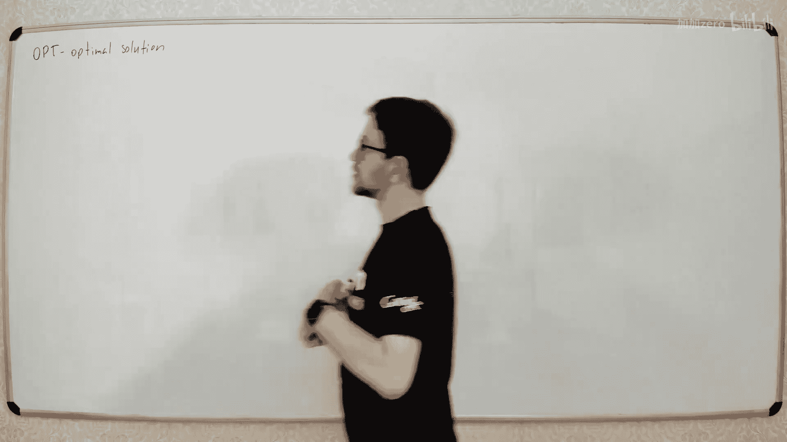
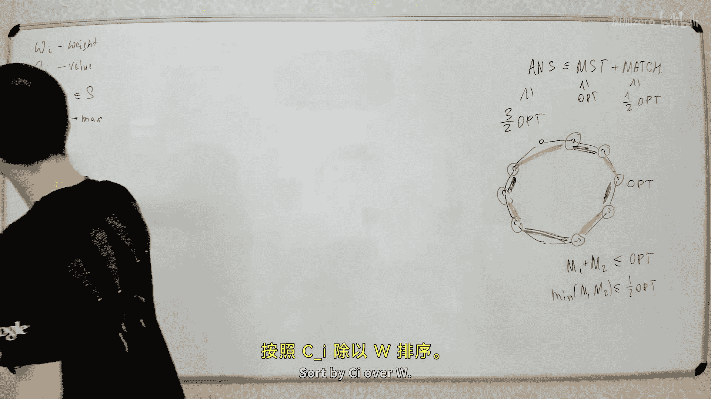
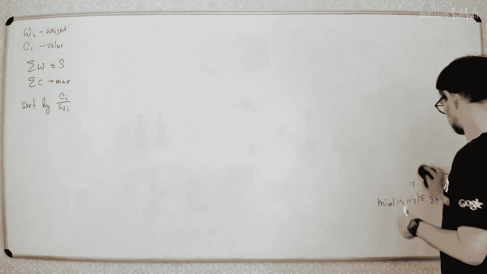
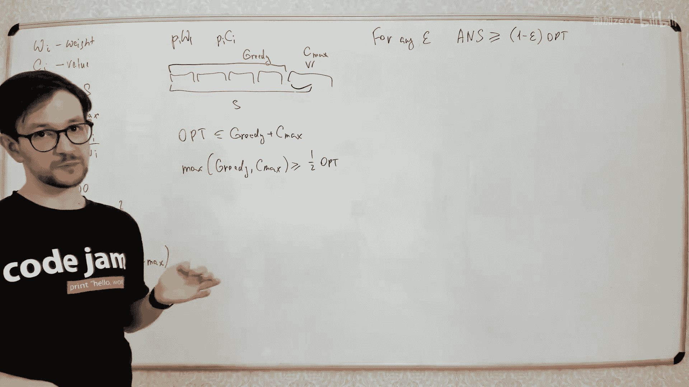

# 060：近似算法

在本节课中，我们将要学习近似算法。我们将探讨什么是近似算法，为什么需要它们，并通过几个经典问题（如顶点覆盖、旅行商问题和背包问题）来了解如何构建近似算法。

## 什么是近似算法

有些问题我们不知道如何精确求解，例如 NP 难问题。对于这些问题，我们不知道是否存在多项式时间的精确解法。科学家们在无法直接解决某个问题时，会转而寻找并解决另一个相关的问题。

对于 NP 难问题，我们通常希望最小化某个目标函数，例如寻找最短路径或最小包装。我们无法在多项式时间内找到最优解，但可以尝试找到一个“足够好”的解。

## 近似算法的定义

假设存在一个需要最小化目标函数的问题。设最优解的目标函数值为 **OPT**。如果我们找到一个解，其目标函数值 **ALG** 满足 **ALG ≤ α · OPT**（其中 α ≥ 1），那么我们称这个算法为 **α-近似算法**。

*   **α = 1.01**：意味着我们找到的解最多比最优解差 1%。
*   **α = 2**：意味着我们找到的解最多是最优解的两倍。
*   **α 可能是函数**：有时 α 不是常数，而是问题规模 n 的函数，例如 log(n)。这意味着问题规模越大，近似解的质量可能越差。

近似算法的质量因问题而异，没有统一的构建方法。接下来，我们将通过具体问题来学习如何构建近似算法。

## 顶点覆盖问题

我们首先从一个简单问题开始：**最小顶点覆盖问题**。

给定一个图，我们需要找到一个最小的顶点集合，使得图中的每一条边都至少有一个端点在这个集合中。这是一个 NP 难问题（对于非二分图）。我们将为其构建一个 2-近似算法。

以下是构建近似算法的步骤：

1.  初始化一个空的顶点覆盖集合 `C`。
2.  当图中还存在未被 `C` 覆盖的边时：
    *   任意选择一条未被覆盖的边 `(u, v)`。
    *   将它的两个端点 `u` 和 `v` 都加入集合 `C`。
3.  算法结束，`C` 即为所求的顶点覆盖。

**算法分析**：
假设算法在循环中选择了 `k` 条边。那么最终集合 `C` 的大小为 `2k`。
对于这 `k` 条被选中的边，在任意一个顶点覆盖（包括最优覆盖）中，每条边至少需要一个端点。因此，最优解 **OPT** 的大小至少为 `k`。
由此可得：**ALG = 2k ≤ 2 · OPT**。所以这是一个 **2-近似算法**。

上一节我们介绍了一个简单的贪心策略，得到了顶点覆盖问题的 2-近似解。本节中我们来看看如何应对更复杂的带权顶点覆盖问题。

## 带权顶点覆盖问题

在带权顶点覆盖问题中，每个顶点都有一个权重 `w(v)`。目标不再是最小化顶点数量，而是最小化所选顶点集合的总权重。

我们可以使用线性规划舍入法来构建一个 2-近似算法。

**1. 建立整数线性规划模型**
为每个顶点 `v` 引入一个 0-1 变量 `x_v`：`x_v = 1` 表示顶点 `v` 被选中。
目标：最小化 `∑ w(v) * x_v`。
约束：对于每条边 `(u, v)`，要求 `x_u + x_v ≥ 1`。

**2. 松弛为线性规划**
将 `x_v ∈ {0, 1}` 松弛为 `0 ≤ x_v ≤ 1`。这是一个普通的线性规划问题，可以在多项式时间内求解。设其最优解为 `x_v*`。

**3. 舍入获得整数解**
对松弛后的解进行舍入：`x‘_v = 1` 如果 `x_v* ≥ 0.5`，否则 `x‘_v = 0`。

**算法分析**：
*   **可行性**：对于任意边 `(u, v)`，由于 `x_u* + x_v* ≥ 1`，则 `x_u*` 和 `x_v*` 中至少有一个 `≥ 0.5`。舍入后，该边对应的 `x‘_u` 和 `x‘_v` 中至少有一个为 1。因此舍入后的解是可行的顶点覆盖。
*   **近似比**：对于每个顶点，由于只有当 `x_v* ≥ 0.5` 时才将其设为 1，因此有 `x‘_v ≤ 2 * x_v*`。将所有顶点的权重相加，得到总权重 **ALG ≤ 2 · (LP最优值)**。而线性规划松弛后的最优值 **LP** 是原整数规划最优值 **OPT** 的下界（因为放松了约束）。所以 **ALG ≤ 2 · LP ≤ 2 · OPT**。

因此，这是一个 **2-近似算法**。这种方法（线性规划+舍入）是构建近似算法的通用且强大的技巧。

## 旅行商问题

旅行商问题要求访问图中所有城市恰好一次并回到起点，使得总路程最短。这是一个经典的 NP 难问题。更糟的是，对于一般的旅行商问题，**不存在任何常数倍的近似算法**（除非 P=NP）。

**证明概要**：如果存在一个 α-近似算法，我们可以用它来解决哈密顿路径问题（另一个 NP 难问题）。构造一个完全图，原图中存在的边权重设为 0，不存在的边权重设为 1。如果原图存在哈密顿路径，则 TSP 最优解为 0，近似算法也必须返回 0；否则最优解至少为 1。这样我们就用 TSP 的近似算法精确判断了哈密顿路径是否存在，这与哈密顿路径是 NP 难的事实矛盾。

然而，如果问题满足**三角不等式**（即对于任意三点 `u, v, w`，有 `c(u, v) ≤ c(u, w) + c(w, v)`），情况就不同了。满足三角不等式的 TSP 称为度量 TSP。

### 度量 TSP 的 2-近似算法

我们可以构建一个基于最小生成树的 2-近似算法。

**算法步骤**：
1.  在图 `G` 上构造一棵**最小生成树**。
2.  对 MST 进行深度优先遍历，记录下访问节点的顺序（允许重复访问）。这个遍历路径的长度恰好是 **MST 边权总和的两倍**。
3.  根据 DFS 遍历的顺序，**跳过已经访问过的城市**，直接前往序列中下一个未访问的城市，从而形成一个哈密顿回路。由于三角不等式，这种“抄近路”不会增加总长度。

**算法分析**：
*   最优 TSP 回路去掉一条边后，是一条访问所有城市的路径，它构成了图的一棵生成树。因此，**MST 的总权值 ≤ OPT**。
*   我们的算法得到的回路长度 **ALG ≤ 2 · MST ≤ 2 · OPT**。

因此，这是一个 **2-近似算法**。

### 度量 TSP 的 1.5-近似算法

我们可以做得更好，获得一个 1.5-近似算法（Christofides 算法）。

**算法步骤**：
1.  构造图 `G` 的**最小生成树**。
2.  令 `O` 为 MST 中所有**度数为奇数的顶点**的集合。可以证明 `|O|` 是偶数。
3.  在由集合 `O` 诱导的子图上，构造一个**最小权完美匹配**。
4.  将 MST 和这个完美匹配的边合并，得到一个所有顶点度数均为偶数的图（欧拉图）。
5.  在这个欧拉图中找到一个欧拉回路。
6.  与之前一样，在欧拉回路中“抄近路”跳过已访问节点，得到哈密顿回路。

**算法分析**：
*   设 MST 权值为 `W_mst`，匹配权值为 `W_match`。最终回路长度 **ALG ≤ W_mst + W_match**。
*   我们已经知道 `W_mst ≤ OPT`。
*   考虑最优 TSP 回路。将 `O` 中的奇度顶点按回路顺序排列，可以形成两个互不相交的完美匹配。其中权值较小的那个匹配的权值 **≤ OPT / 2**。而我们找到的是最小权完美匹配，因此 `W_match ≤ OPT / 2`。
*   综合可得：**ALG ≤ OPT + OPT/2 = 1.5 · OPT**。

因此，这是一个 **1.5-近似算法**。在很长一段时间里，这都是度量 TSP 最好的近似比。

## 背包问题

背包问题：有 `n` 件物品，每件物品有重量 `w_i` 和价值 `v_i`，背包容量为 `S`。目标是在不超过背包容量的前提下，最大化所选物品的总价值。这也是一个 NP 难问题。

### 一个简单的 2-近似算法

首先尝试一个贪心算法：按价值重量比 `v_i / w_i` 降序排列物品，然后依次尝试放入背包。但这个算法本身可以任意差。

**改进的 2-近似算法**：
1.  运行上述贪心算法，得到解 `Greedy`。
2.  找出价值最高的单件物品，其价值为 `V_max`。
3.  输出 `max(Greedy, V_max)`。

**算法分析（思路）**：
考虑物品可分割的背包问题（分数背包），此时贪心算法是最优的。设原问题最优解为 `OPT`，分数背包最优解为 `OPT_frac`。显然 `OPT ≤ OPT_frac`。
在分数背包的贪心解中，最后一件（可能只取了一部分）物品之前的所有物品构成了原问题贪心解 `Greedy`。最后那件（部分）物品的价值 `≤ V_max`。因此有 `OPT_frac ≤ Greedy + V_max`。
结合 `OPT ≤ OPT_frac` 和输出是 `Greedy` 与 `V_max` 的较大者，可以证明 `Output ≥ OPT / 2`。因此这是一个 **2-近似算法**。

### 多项式时间近似方案

对于背包问题，我们有更强的结果：对于任意小的 `ε > 0`，都存在一个算法，可以在多项式时间内找到一个解，其价值至少为 `(1 - ε) * OPT`。这称为**多项式时间近似方案**。

**思路一（理论意义大于实用）**：
1.  猜测一个接近最优解的值 `A`（例如，先用 2-近似算法得到一个解）。
2.  将物品分为“大件”（价值 `> εA`）和“小件”。
3.  大件物品在最优解中最多有 `1/ε` 个。枚举所有可能的大件物品组合（最多 `n^(1/ε)` 种）。
4.  对于每种大件组合，用贪心法尽量加入小件。
5.  输出所有枚举结果中的最优解。
这个方法的时间复杂度是 `O(n^(1/ε))`，当 `ε` 很小时非常慢。

**思路二（更高效的方法）**：
利用动态规划，但针对修改后的价值进行。
1.  令 `V_max` 为最大物品价值。
2.  对每件物品，定义其“缩放价值” `v‘_i = floor( v_i / (ε * V_max / n) )`。这样所有 `v‘_i` 都是不超过 `n/ε` 的整数。
3.  对缩放后的价值 `v‘_i` 和原重量 `w_i`，运行标准的基于价值的动态规划算法（状态 `dp[x]` 表示达到总缩放价值 `x` 所需的最小重量）。
4.  动态规划找到的最优缩放价值对应的原物品集合，即为我们的近似解。

**算法分析**：
*   动态规划的时间复杂度为 `O(n * ∑ v‘_i) = O(n * (n * (n/ε))) = O(n^3 / ε)`，是 `1/ε` 的多项式，而不是指数。
*   设最优解集合为 `O*`，我们的解集合为 `A`。由于缩放是向下取整，对于 `O*` 中的物品，有 `∑ v_i ≤ ∑ (v‘_i * (ε V_max / n)) + n * (ε V_max / n)`。第二项是舍入误差，总和不超过 `ε * V_max`。
*   而 `V_max ≤ OPT`。我们的算法找到了缩放价值下的最优解，因此 `∑ v_i(A) ≥ ∑ v_i(O*) - ε * OPT`。
*   所以，**ALG ≥ OPT - ε * OPT = (1 - ε) * OPT**。

这是一个真正高效的多项式时间近似方案。

## 总结

本节课中我们一起学习了近似算法。
*   我们了解了近似算法的定义和动机，用于处理难以精确求解的优化问题。
*   我们学习了三种构建技巧：
    1.  **简单贪心与构造**：如顶点覆盖问题的 2-近似算法。
    2.  **线性规划舍入**：如带权顶点覆盖问题的 2-近似算法，这是一个通用性强的方法。
    3.  **利用问题结构寻找下界**：如度量 TSP 中利用最小生成树和最小权匹配来逼近最优解。
*   我们看到了问题性质对近似性的巨大影响：一般 TSP 无法近似，而满足三角不等式的 TSP 可以有 1.5 近似算法。
*   我们探讨了近似算法的强度差异，从常数倍近似（如 2 倍、1.5 倍）到可以无限接近最优解的多项式时间近似方案（如背包问题）。
近似算法是理论计算机科学和实际应用中处理难解问题的重要工具，针对不同问题需要设计不同的巧妙策略。