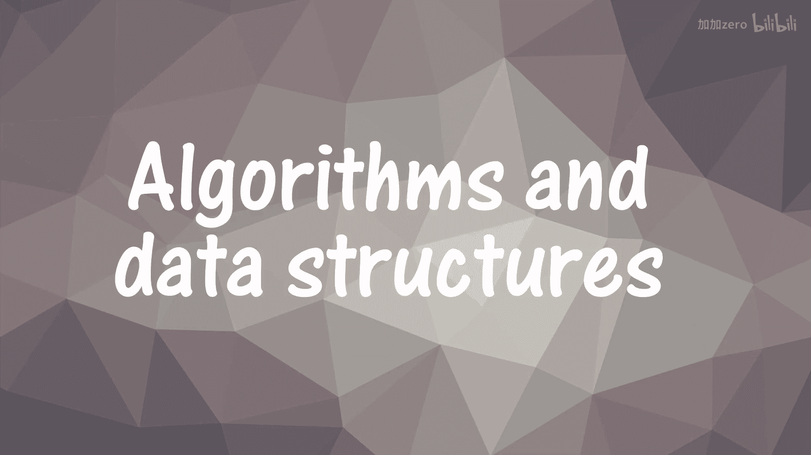
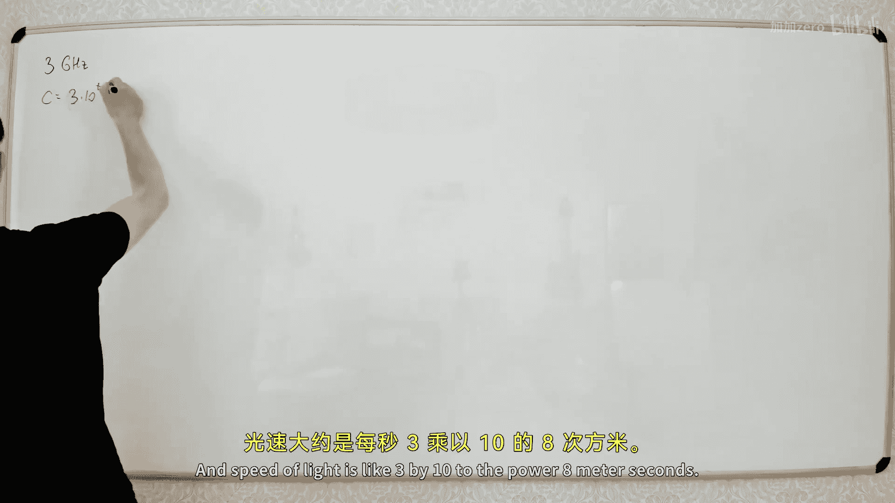
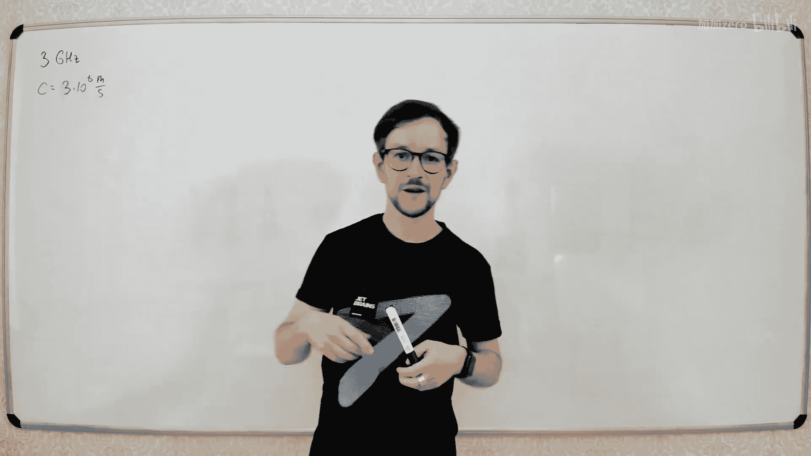
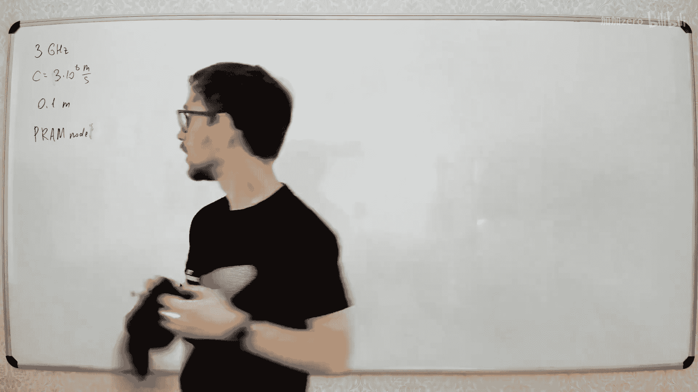
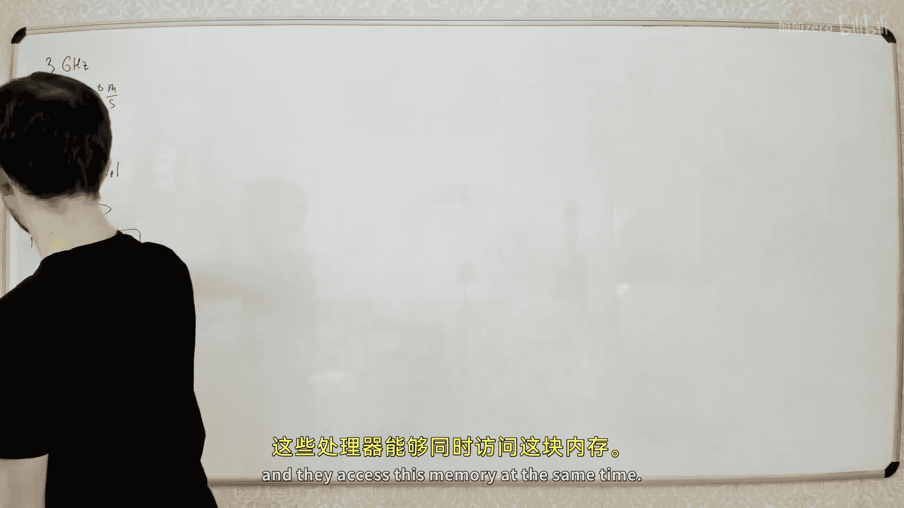
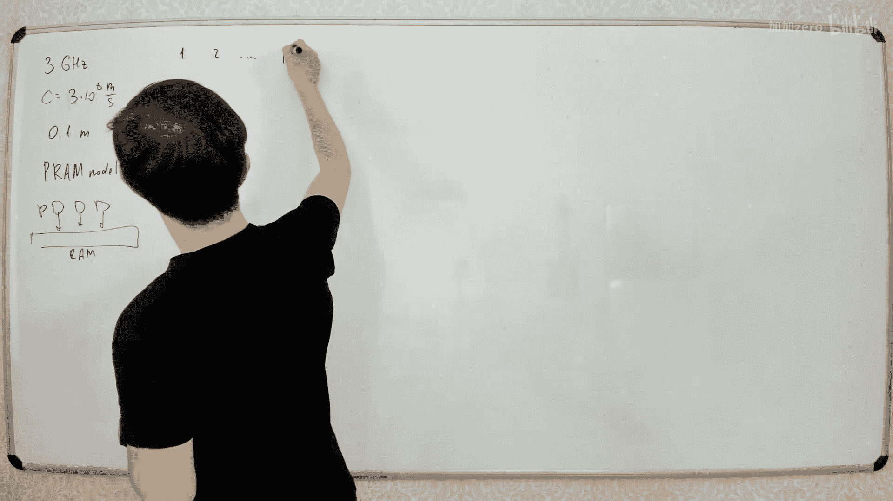
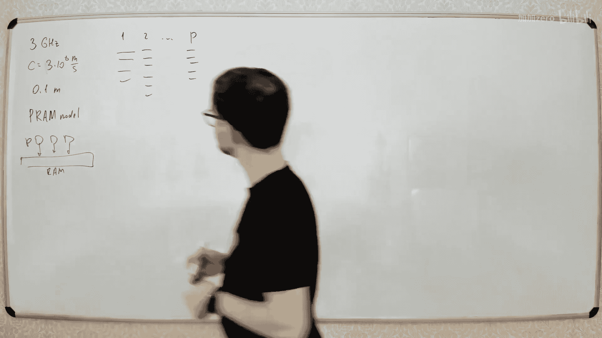
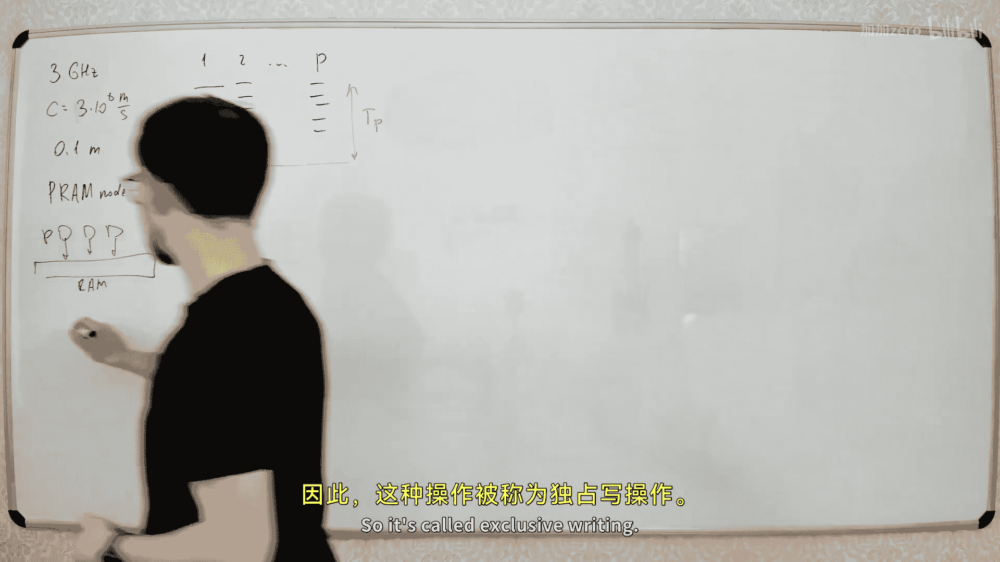
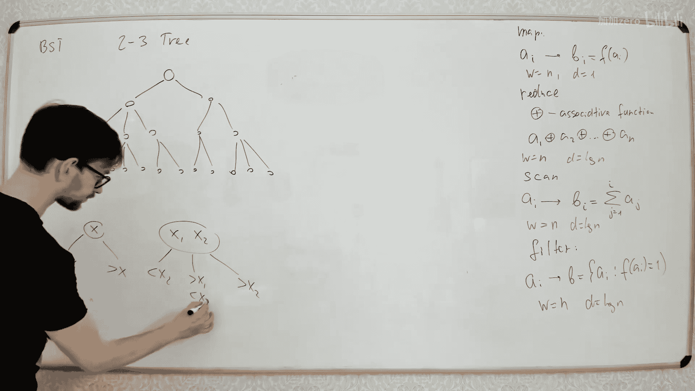

# 061：并行算法基础与经典操作

在本节课中，我们将学习并行算法的基本概念、模型以及一些经典并行操作的实现方法。我们将从现代计算机为何需要并行计算开始，逐步深入到并行计算模型和具体算法设计。

## 并行计算概述

现代计算机都是并行计算机。即使是在你的笔记本电脑中，处理器也不是单核的，而是多核的。处理器包含多个核心，它们可以同时进行计算。

这主要是因为我们已经接近了处理器速度的物理极限。处理器速度通常以每秒执行的指令数来衡量，例如从100兆赫兹发展到现在的数吉赫兹。我们无法拥有远高于3吉赫兹的处理器，是因为受到了物理定律的限制。

在物理学中，信号传递速度不能超过光速。对于一个3吉赫兹的处理器，每秒执行30亿次操作。光速约为每秒3亿米。因此，处理器执行一次操作的时间内，光只能传播约10厘米。而处理器的尺寸只有几厘米，所以无法让处理器速度比现在快太多。

因此，现代处理器不再主要提升每秒操作次数，而是增加核心数量。现代处理器通常有4核、8核等。GPU则包含更多小型处理器。我们通过增加可以同时工作的核心数量，而不是提升单核速度，来提高计算速度。

学习如何让算法在并行处理器上工作是非常有趣的，这就是我们今天要讨论的内容。

## 并行计算模型：PRAM

首先，我们来讨论并行计算模型。我们将使用PRAM模型。

PRAM代表并行随机存取存储器。在这个模型中，我们有一个共享内存和一定数量的处理器。这些处理器可以同时访问这个内存。

算法看起来是这样的：所有处理器同时执行一些操作。每个处理器执行一系列指令。我们关心的是所有处理器完成操作所需的最长时间，记为 **T(P)**，即P个处理器解决问题所需的时间。

关于内存访问，情况比单处理器时更复杂。当多个处理器试图访问内存的同一单元时会发生什么，这取决于具体的模型规则。

在一些模型中，我们只允许每个内存单元在同一时刻只能被一个处理器访问。这被称为**独占读/独占写**模型。这意味着每个内存单元在同一时刻只能被一个处理器读取或写入。

在其他模型中，我们允许同一内存单元被多个处理器同时读取，这被称为**并发读**。读取内存通常不是大问题，因为多个处理器读取同一位置会得到相同的结果。

更有趣的是当多个处理器试图同时写入同一内存单元时的情况，这被称为**并发写**。此时会发生什么取决于模型。在某些模型中，最终结果可能是任意一个处理器试图写入的值。在另一些模型中，只有ID最小的处理器能成功写入。

不同模型之间的差异最多是一个对数因子。如果一个算法能在一种模型中实现，通常也能在另一种模型中实现，只是时间复杂度会乘以一个对数因子。虽然对数因子有时很重要，但对于我们今天讨论的算法，这个差异不大。

PRAM模型虽然清晰，但在实际中实现算法可能比较复杂，因为需要手动将不同操作分配给不同处理器并跟踪其状态。

## 工作-深度模型

因此，我们有时会使用一个稍有不同的模型：工作-深度模型。

想象你需要执行的所有操作构成一个有向无环图。图中的每个节点代表一个可以在常数时间内完成的基本操作。箭头表示操作之间的依赖关系，即一个操作必须在其前驱操作完成后才能开始。

如果我们只有一个处理器，那么执行所有操作所需的总时间就是图中节点的总数，我们称之为**工作总量**，记为 **W**。

如果我们有无限多的处理器，那么执行所有操作所需的最短时间取决于图中最长的依赖路径。这条路径的长度被称为**深度**，记为 **D**。深度代表了算法内在的串行部分，无法通过增加处理器来加速。

工作 **W** 和深度 **D** 这两个值足以估算任何数量处理器下的时间复杂度。假设我们有P个处理器和一个能最优分配任务给处理器的自动调度器。

执行时间 **T(P)** 至少受两个因素限制：
1.  它不能小于深度 **D**。
2.  它不能小于总工作量 **W** 除以处理器数量 **P**。

因此，**T(P) ≥ max(D, W/P)**。实际上，这个下界是可以接近达到的。我们可以通过按层执行操作来设计算法，使得 **T(P) = O(D + W/P)**。

在实际应用中，处理器数量P通常远小于输入规模n。因此，我们通常首先优化工作量 **W**，使其与单处理器算法的工作量相同（即保持算法的高效性），然后尽可能减小深度 **D**，理想情况下达到 **O(log n)** 或 **O(log² n)**。

## 基础并行操作

接下来，我们看看如何对一些基础操作进行并行化。

### 1. Map 操作

Map操作对一个数组的所有元素应用同一个函数。例如，给定数组A，生成数组B，其中 `B[i] = f(A[i])`。

由于每个元素的计算是独立的，我们可以用多个处理器同时计算所有 `f(A[i])`。如果处理器数量足够，深度可以是 **O(1)**。在实际的 fork-join 模型中，可能需要 **O(log n)** 的深度来创建足够的并行任务。工作量显然是 **O(n)**。

### 2. Reduce 操作

Reduce操作计算一个数组在某个可结合运算符下的累积结果，例如求和、求最小值等。

串行算法需要 **O(n)** 时间。并行算法可以采用类似构建线段树的方法：
1.  将相邻元素两两相加，得到 `n/2` 个部分和。
2.  再将这 `n/2` 个部分和两两相加，得到 `n/4` 个部分和。
3.  重复此过程，直到得到最终结果。

每一层的操作都可以并行执行。总共有 **O(log n)** 层，总工作量（节点数）为 `n + n/2 + n/4 + ... = O(n)`。因此，这是一个工作量为 **O(n)**，深度为 **O(log n)** 的优秀并行算法。

### 3. Scan (前缀和) 操作

Scan操作计算数组的所有前缀和。例如，输入 `[3, 5, 2, 6]`，输出 `[3, 8, 10, 16]`。

串行算法是顺序的，深度为 **O(n)**。并行算法再次借助“线段树”：
1.  **上行阶段**：像Reduce操作一样，自底向上构建线段树，计算每个区间的和。
2.  **下行阶段**：从根节点开始，向下传递“左侧前缀和”信息。
    *   对于左子节点，继承父节点传来的前缀和。
    *   对于右子节点，前缀和 = 父节点传来的前缀和 + 左兄弟节点的区间和。

最终，每个叶子节点得到的就是其对应的前缀和。所有同层操作可并行。总工作量 **O(n)**，深度 **O(log n)**。

### 4. Filter 操作

Filter操作根据条件筛选数组元素。例如，筛选出所有偶数。

并行算法步骤如下：
1.  **Map**：对每个元素应用条件函数，得到一个布尔数组（1表示保留，0表示丢弃）。工作量 **O(n)**，深度 **O(1)**。
2.  **Scan**：计算该布尔数组的前缀和。工作量 **O(n)**，深度 **O(log n)**。前缀和数组的值减1（或第一个元素特殊处理）就代表了每个被保留元素在结果数组中的目标位置。
3.  **Scatter**：并行地将每个被保留的元素写入结果数组的对应位置。工作量 **O(n)**，深度 **O(1)**。

总工作量为 **O(n)**，深度为 **O(log n)**。

## 并行归并排序

最后，我们探讨如何并行化归并排序。归并排序的主要步骤是合并两个已排序的数组。

简单的想法是为结果数组的每个元素，并行地在另一个数组中二分查找其应插入的位置。这样，合并操作的工作量是 **O(n log n)**（n个元素，每个二分查找 **O(log n)**），深度是 **O(log n)**（所有二分查找并行）。在整个归并排序中，有 **O(log n)** 层合并，总工作量变为 **O(n log² n)**，深度为 **O(log² n)**。这比串行算法 **O(n log n)** 更差。

我们需要一个工作量为 **O(n)**，深度为 **O(log n)** 的合并算法。这里介绍一种基于分块的优化方法：
1.  将两个待合并数组分别划分为大小为 **O(log n)** 的块。
2.  对于每个数组的块边界元素，在另一个数组中并行地执行二分查找，确定其应插入的位置。这需要 **O(n / log n)** 次二分查找，每次 **O(log n)**，总工作量 **O(n)**，深度 **O(log n)**。
3.  经过步骤2，我们得到了两组块之间的对应关系。每一对对应的块（可能大小不均）合并后，可以保证每个块的大小不超过 **O(log n)**。
4.  现在，我们可以将每一对小块分配给一个单独的处理器进行串行合并。因为每个小块大小为 **O(log n)**，串行合并只需 **O(log n)** 时间，并且所有处理器可以并行工作。

最终，合并操作的总工作量为 **O(n)**，深度为 **O(log n)**。将其应用于归并排序，总工作量恢复为 **O(n log n)**，深度为 **O(log² n)**。要获得 **O(log n)** 的深度，需要更复杂的排序网络（如双调排序），但实现起来也复杂得多。

## 总结

本节课我们一起学习了并行算法的基础。我们了解了现代计算机转向多核架构的物理原因，认识了PRAM和工作-深度两种并行计算模型。我们掌握了几个关键的并行原语：Map、Reduce、Scan和Filter，它们都能以 **O(n)** 的工作量和 **O(log n)** 的深度高效实现。最后，我们探讨了并行归并排序的挑战和一种优化合并步骤的方法。并行算法的核心思想是在保持总工作量（效率）与串行算法相近的前提下，通过挖掘独立子任务，尽可能降低算法的深度，从而利用多个处理器加速计算。