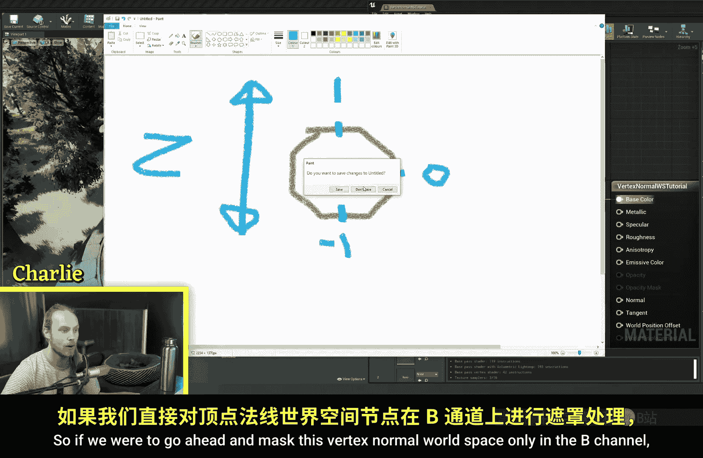
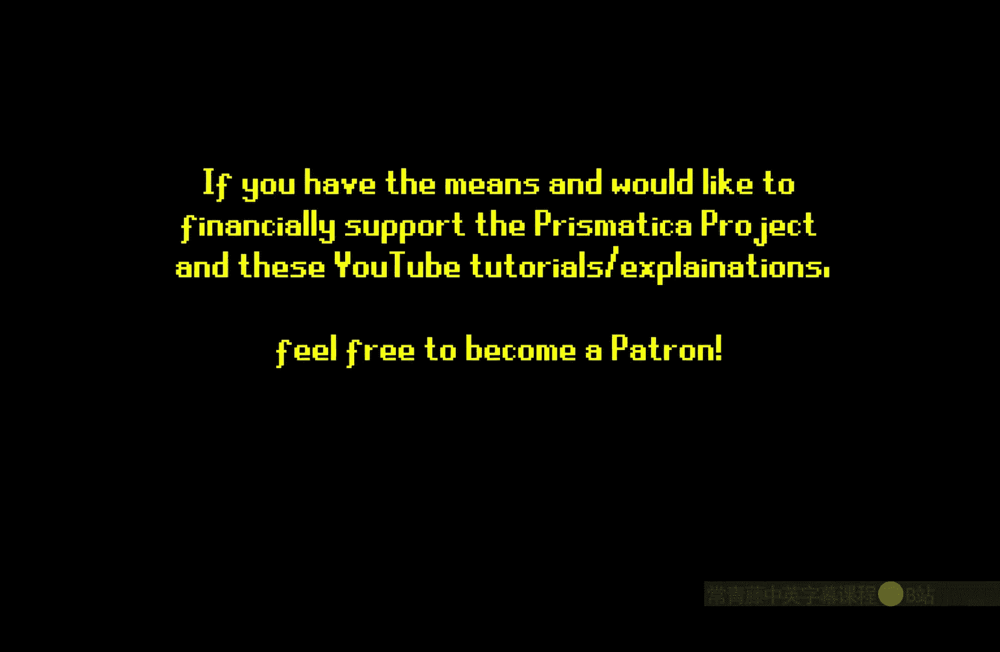
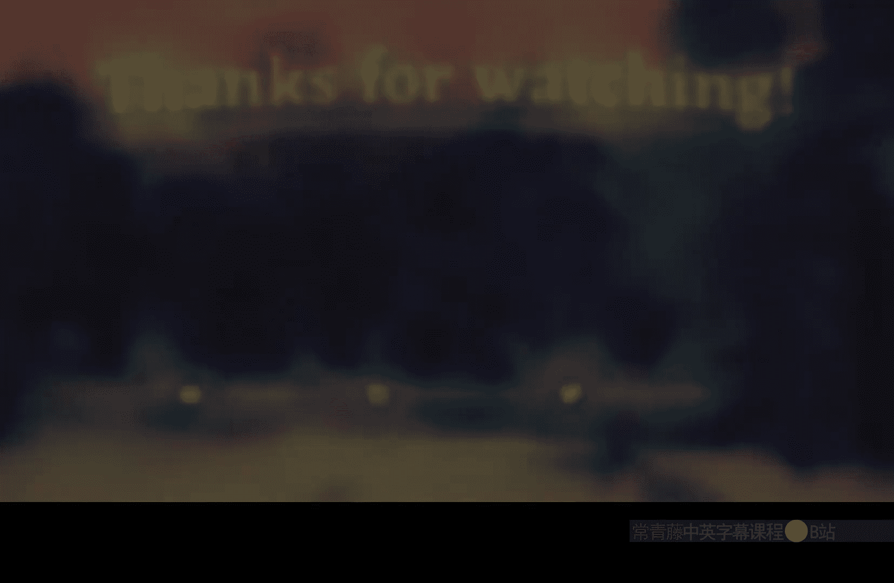

# 001：顶点法线世界空间节点

## 概述
在本节课中，我们将要学习虚幻引擎材质编辑器中的一个重要节点：**顶点法线世界空间**。我们将了解它的工作原理、如何可视化其数据，并探索它在材质制作中的两个核心应用：纹理混合和世界位置偏移。

## 理解顶点法线世界空间
顶点法线世界空间节点输出的是网格每个顶点在世界空间中的法线方向。法线是一个长度为1的向量，它垂直于顶点所在的表面。



这个向量包含三个通道的数据，分别对应三维空间中的X、Y、Z轴：
*   **红色通道** 对应X轴（左右方向）。
*   **绿色通道** 对应Y轴（前后方向）。
*   **蓝色通道** 对应Z轴（上下方向）。

每个通道的值范围在 **-1 到 1** 之间，表示该顶点法线在对应轴向上的朝向分量。

为了直观理解，我们可以将其直接连接到基础颜色上查看。你会看到一个彩色的球体。顶部是纯白色（蓝色通道值为1），侧面是品红色（蓝色通道值为0），底部则是黑色（蓝色通道值为-1，但黑色无法显示负值）。

## 核心应用一：作为纹理混合遮罩
上一节我们介绍了顶点法线世界空间数据的含义，本节中我们来看看如何利用它来混合纹理。这是该节点最常见的用途之一。

我们可以利用蓝色通道（Z轴）的值来区分物体的顶部和侧面。例如，我们可以让顶部显示苔藓纹理，侧面显示岩石纹理。

**基本步骤如下：**
1.  获取顶点法线世界空间节点的蓝色通道输出。
2.  使用 `Saturate` 节点将其值限制在 **0 到 1** 之间，以消除负值的影响。
3.  将处理后的值作为 `Lerp` 节点的Alpha输入，用于在两种纹理或颜色之间进行线性插值。

以下是实现此效果的简化代码框架：
```hlsl
// 获取世界空间法线的蓝色通道（Z轴）
float VerticalMask = VertexNormalWS.b;
// 将值限制在0-1范围
VerticalMask = saturate(VerticalMask);
// 使用该遮罩混合两种纹理
float3 FinalColor = lerp(RockTexture, MossTexture, VerticalMask);
```

我们可以通过添加参数来动态控制混合效果：
*   **偏移**：通过一个 `Add` 节点调整混合的中间点，控制“顶部”区域的范围。
*   **硬度**：通过一个 `Multiply` 节点调整遮罩的对比度，使混合边缘更柔和或更锐利。

这种方法不仅适用于基础颜色，同样可以用于混合法线贴图、粗糙度等任何材质属性，从而实现丰富的表面细节。

## 核心应用二：控制世界位置偏移
除了作为遮罩，顶点法线世界空间向量本身的方向性也非常有用。本节我们将探索如何用它来驱动世界位置偏移，让模型动起来。

我们可以用法线向量的方向来决定顶点移动的方向。例如，让所有顶点沿着其自身的法线方向向外扩张，可以模拟物体膨胀或心跳的效果。

**基本步骤如下：**
1.  将顶点法线世界空间向量（一个 `Float3` 值）与一个标量值相乘，控制偏移的强度。
2.  可以选择只影响特定轴向（例如，主要使用Z分量实现向上堆积的效果）。
3.  将结果输入到材质的世界位置偏移引脚中。

以下是模拟物体周期性膨胀的示例：
```hlsl
// 获取世界空间法线方向
float3 DisplacementDirection = VertexNormalWS;
// 创建一个随时间变化的值（如正弦波）
float Pulsate = sin(Time * Frequency) * Amplitude;
// 沿法线方向进行位移
float3 WorldOffset = DisplacementDirection * Pulsate;
// 连接到世界位置偏移
return WorldOffset;
```

**实际应用场景包括：**
*   **积雪堆积**：让顶点沿法线方向向上偏移，模拟雪堆积在物体顶部的效果。
*   **定向受风影响**：仅让朝上的顶点（法线Z分量大的区域）受风场影响而摆动。
*   **爆炸效果**：让球体模型的顶点沿径向（法线方向）向外扩张，形成爆炸烟雾的形状。

这种方法的优点是，无论模型如何旋转，偏移方向始终基于顶点自身的朝向，保证了效果的一致性。

## 总结
本节课中我们一起学习了 **顶点法线世界空间** 节点的核心概念与应用。

我们首先了解到，该节点提供了网格顶点在世界坐标系中的朝向信息，其各通道值在 **-1 到 1** 之间变化。接着，我们深入探讨了它的两大主要用途：
1.  **作为遮罩**：通过提取其蓝色通道（Z轴）信息，我们可以有效区分物体的顶面和侧面，进而混合纹理、法线贴图等，实现如岩石生苔、积雪覆盖等效果。
2.  **驱动位移**：利用法线向量自身的方向性，我们可以控制顶点沿着其朝向移动，用于创建物体膨胀、定向受风或程序化爆炸等动态效果。





这个节点是材质程序化创作中的基石之一。希望本教程能帮助你理解其原理，并激发你更多的创作思路。尝试结合其他节点（如噪声纹理、时间节点），创造出更独特、复杂的材质效果吧。