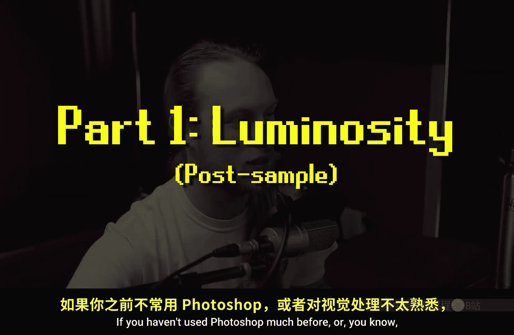
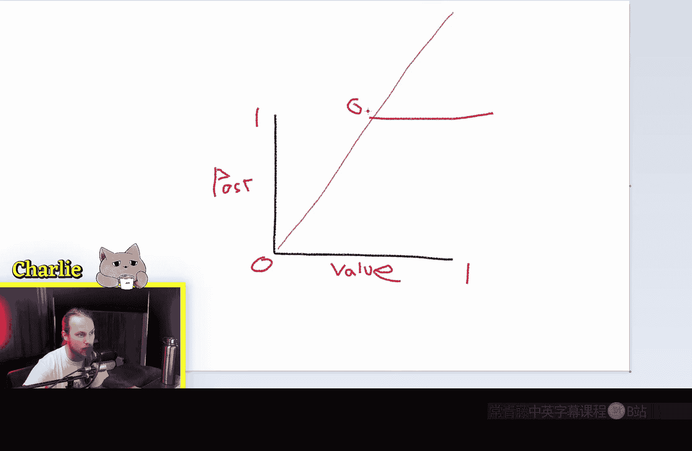
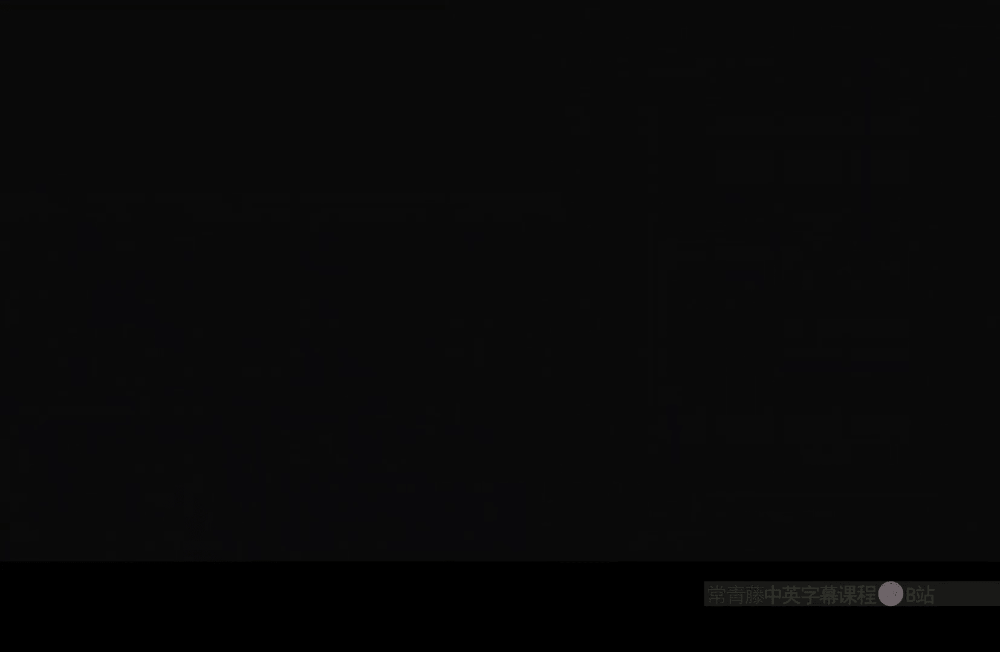
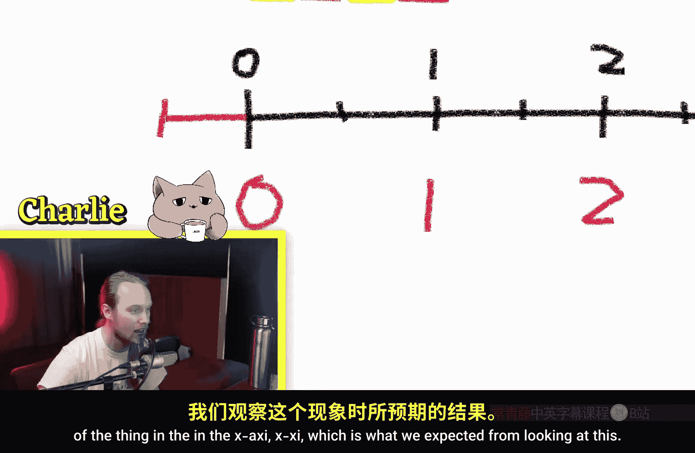
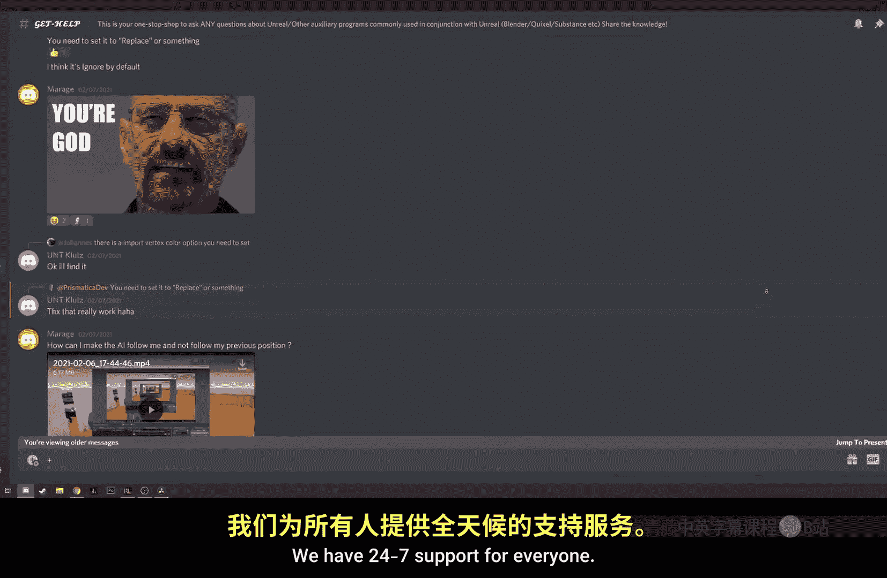
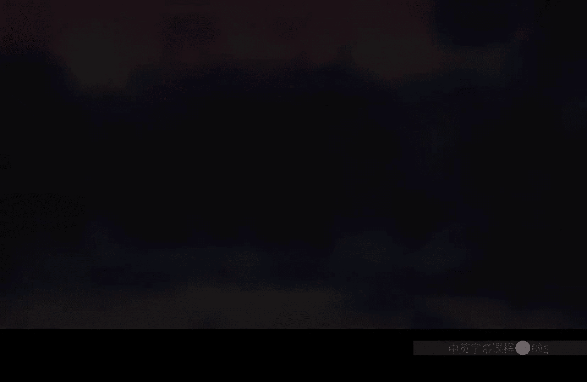

# 002：加减乘除（着色器数学）🧮

在本节课中，我们将学习虚幻引擎材质编辑器中最基础的数学运算节点：加法、减法、乘法和除法。我们将探讨这些运算在处理纹理UV坐标和纹理颜色值时分别会产生什么效果，并通过直观的示例帮助你理解其背后的原理。

---

## 概述：数学运算的核心作用



上一节我们介绍了材质编辑器的基本界面。本节中，我们来看看构成复杂材质的基础——数学运算。这些运算主要应用于两个场景：
1.  **处理UV坐标**：用于移动、缩放或平铺纹理。
2.  **处理纹理采样值**：用于混合、遮罩或调整纹理的亮度与颜色。

理解这些运算，是掌握材质创作的关键第一步。

---

## 纹理值的数学运算

首先，我们通过一个输入输出图来理解对纹理颜色值（0代表黑色，1代表白色）进行运算的效果。图中对角线表示输入等于输出，即不做任何改变。


### 加法与减法

对纹理值进行加法运算，相当于将整个曲线向上平移。



*   **公式**：`输出值 = 输入值 + 常数`
*   **效果**：让纹理整体变亮。
*   **注意**：当结果超过1.0时，会发生**裁切**。所有大于1.0的值都会被截断为1.0（纯白），因此在曲线上会看到一条水平线。

同理，减法运算将曲线向下平移，让纹理变暗。当结果低于0.0时，也会发生裁切，所有值被截断为0.0（纯黑）。

### 乘法与除法

乘法和除法运算不是平移曲线，而是拉伸或压缩它。

*   **乘法公式**：`输出值 = 输入值 * 常数`
    *   乘以大于1的数会拉伸曲线，使亮部更亮（可能裁切），暗部不变。
    *   乘以小于1的正数会压缩曲线，使整体变暗。
*   **除法公式**：`输出值 = 输入值 / 常数`
    *   除以大于1的数会压缩曲线，使整体变暗。
    *   **特别注意**：当除数接近0时，输出值会趋近于无穷大，导致极亮的白色。

---

## 纹理与纹理的混合运算

当对两个纹理进行运算时，效果会更加复杂。我们以一个线性渐变纹理和一个云噪波纹理为例。




以下是常见的混合方式及其用途：

*   **乘法**：常用于创建遮罩。任何颜色与黑色（0）相乘都会得到黑色，与白色（1）相乘则保留原色。
    *   **效果**：使用渐变纹理乘以云纹理，会使云纹理在渐变暗部区域消失，在亮部区域显现。
*   **加法**：将两个纹理的亮度值相加。
    *   **效果**：在两个纹理都是亮色的区域，结果可能裁切为白色。它常用于叠加光效或高光。
*   **减法**：效果取决于减数和被减数的顺序。
    *   `纹理A - 纹理B`：从纹理A的值中减去纹理B的值。纹理B中亮的区域会使纹理A对应区域变暗。
*   **除法**：需要非常小心，因为除以接近0的值会产生极亮区域。
    *   `纹理A / 纹理B`：如果纹理B有黑色（0）区域，纹理A的对应区域会变成白色。

---

## UV坐标的数学运算

UV坐标是一个二维向量，U代表水平方向（相当于X），V代表垂直方向（相当于Y）。对UV进行运算，会改变纹理的映射方式。

### 加法与减法

对UV坐标进行加法运算，会**移动**纹理。

*   **示例代码**（在材质蓝图中连接）：
    ```
    UV坐标 → Add节点（A端口）
    常数 → Add节点（B端口）
    Add节点输出 → 纹理采样节点的UVs输入
    ```
*   **效果**：增加U值，纹理会**向左**移动（这与直觉可能相反，因为是在移动坐标空间）。这常用于制作滚动纹理动画。

### 乘法与除法

对UV坐标进行乘法运算，会**缩放**纹理。

*   **示例代码**：
    ```
    UV坐标 → Multiply节点（A端口）
    缩放系数 → Multiply节点（B端口）
    Multiply节点输出 → 纹理采样节点的UVs输入
    ```
*   **效果**：乘以大于1的数，会使纹理在UV空间中“拉伸”，导致在屏幕上看起来更小、更密集（平铺次数变多）。乘以小于1的数，会使纹理看起来更大。
*   **除法**的效果与乘法相反。

为了理解为什么乘上一个大的数反而让纹理变小，可以想象我们拉伸了UV坐标轴本身。纹理图像没有变，但同一段屏幕空间现在对应了更长的UV范围，因此纹理被压缩显示了。



这个技巧在调整世界场景中纹理的尺度时非常有用，例如调整地面材质的重复度。


---

## 总结

本节课中我们一起学习了材质着色器中的基础数学运算：
1.  **对值运算**：加减控制明暗（需注意裁切），乘除控制对比度与强度（需避免除以零）。
2.  **对纹理混合**：乘法用于遮罩，加法用于叠加，减法和除法需注意顺序。
3.  **对UV运算**：加减用于移动纹理，乘除用于缩放纹理。理解UV坐标空间的变换是掌握纹理映射的关键。



掌握这些基础运算，你就已经迈出了创建复杂虚幻引擎材质的第一步。在后续教程中，我们将频繁运用这些节点来构建更高级的效果。



