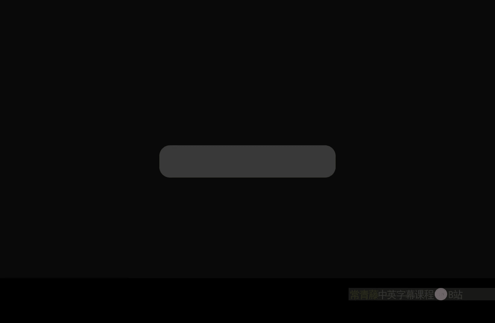

# 003：时间节点 ⏰



在本节课中，我们将学习虚幻引擎材质编辑器中的 **时间** 节点。这个节点能够返回自会话开始以来经过的时间，无论是编辑器会话还是游戏运行时的会话。我们将探索它的基本用法以及一些创造性的应用。

---

## 时间节点的基本功能

时间节点返回一个持续递增的数值，代表从当前会话开始后经过的秒数。在编辑器中，这个时间从编辑器启动时开始计算；在游戏运行时，则从点击“播放”按钮时从0开始计算。

为了直观展示，我们可以创建一个简单的材质。将时间节点连接到材质的**自发光颜色**通道上，然后保存。

```cpp
// 时间节点的输出是一个浮点数，代表秒数
float ElapsedTime = Time;
```

点击播放后，你会看到物体因为自发光值随时间不断增大而变得越来越亮。这个值会无限增大，直到达到计算机的极限。

---

## 使用正弦波创造波动效果

上一节我们看到了时间会无限递增。本节中，我们来看看如何利用正弦函数让时间产生周期性的波动，从而创造出闪烁或脉动效果。

我们可以将时间节点连接到 **Sine** 节点。正弦函数会根据输入的时间，输出一个在 -1 到 1 之间周期性波动的值。

以下是实现一个闪烁效果的步骤：
1.  将 **Time** 节点连接到 **Sine** 节点的输入。
2.  将 **Sine** 节点的输出乘以一个较大的数（例如 1000）。
3.  将这个结果连接到材质的**自发光颜色**。

```cpp
// 使用正弦函数创建周期性波动
float PulsingValue = sin(Time) * 1000;
```

现在，物体的亮度会从极亮（1000）变化到极暗（-1000），再回到极亮，形成规律的闪烁。

---

## 用纹理扭曲时间

我们不仅可以让时间均匀流逝，还可以用纹理来“扭曲”它，创造出非均匀的、有趣的效果。

我们可以将时间节点与一个纹理采样相加。纹理中白色的区域会给时间“加速”，而黑色的区域则保持原速。

以下是具体操作：
1.  引入一个云噪波纹理。
2.  将纹理采样与 **Time** 节点使用 **Add** 节点相加。
3.  将这个扭曲后的时间值输入给一个 **Panner** 节点，用于平移另一个纹理（如网格纹理）。

```cpp
// 用纹理扭曲时间
float DistortedTime = Time + TextureSample.CloudNoise.r;
float2 PannedUV = Panner(UV, Speed, DistortedTime);
```

此时，网格纹理的平移速度会在云噪波纹理的白色区域变快，在黑色区域保持正常，形成一种扭曲的动画效果。你可以通过除以一个数来减弱纹理的影响，让扭曲变得更微妙。

---

## 在百分比参数中的应用

时间节点另一个强大的用途是驱动那些接受百分比参数但未被钳制的节点，例如 **HueShift**。

色相偏移通常取值范围是0到1，代表色相环的一周。但如果我们输入持续增长的时间值，色相就会持续循环变化。

以下是创建一个循环变色效果的方法：
1.  将 **Time** 节点连接到 **HueShift** 节点的偏移量输入。
2.  将处理后的颜色连接到**自发光颜色**，并乘以一个很大的值来增强效果。

```cpp
// 用时间驱动持续的色相变化
float3 ShiftedColor = HueShift(OriginalColor, Time);
float3 EmissiveColor = ShiftedColor * 1000;
```

现在，你的材质球就会像迪斯科球一样循环变换鲜艳的色彩。

---

## 总结与回顾

本节课中，我们一起学习了虚幻引擎材质编辑器中的 **时间** 节点。

*   **核心功能**：它返回持续递增的会话时间。
*   **基础应用**：可直接用于驱动需要线性增长的值。
*   **波动效果**：通过 **Sine** 或 **Cosine** 节点，可以将线性时间转化为周期性波动，用于创建闪烁、呼吸灯等效果。
*   **扭曲时间**：通过将纹理与时间相加，可以创造出局部加速、非均匀的时间流逝效果，增加动画的复杂性。
*   **循环驱动**：可用于驱动如 **HueShift** 这类循环参数，创造持续变化的颜色或其它属性。

总而言之，时间节点是制作动态材质的基础。你可以通过乘法让它变快，通过除法让它变慢，用函数调制它，或用纹理扭曲它，可能性几乎是无限的。掌握它，你就为材质动画打开了第一扇大门。