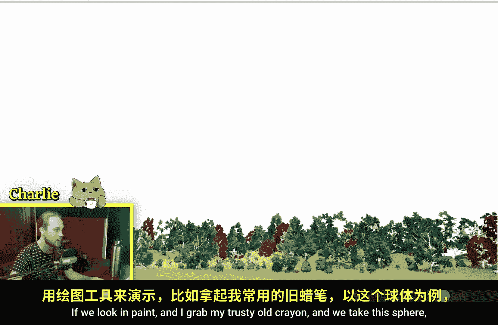
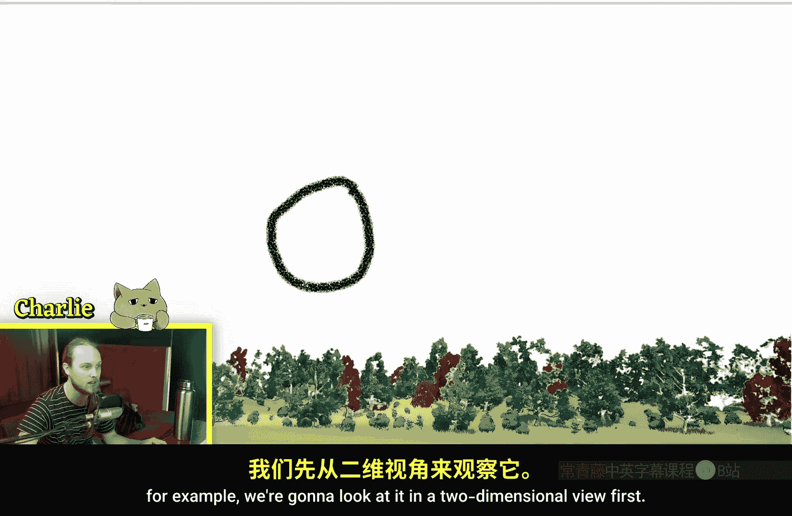
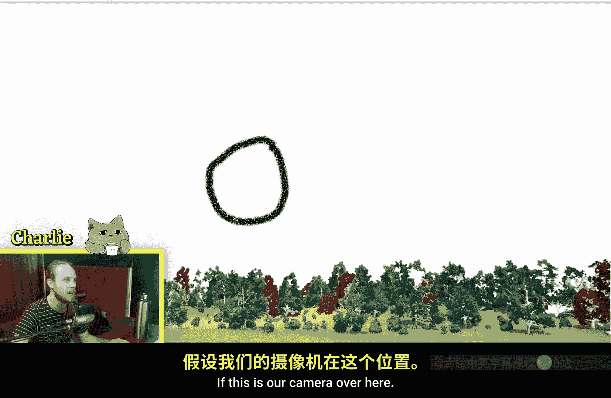
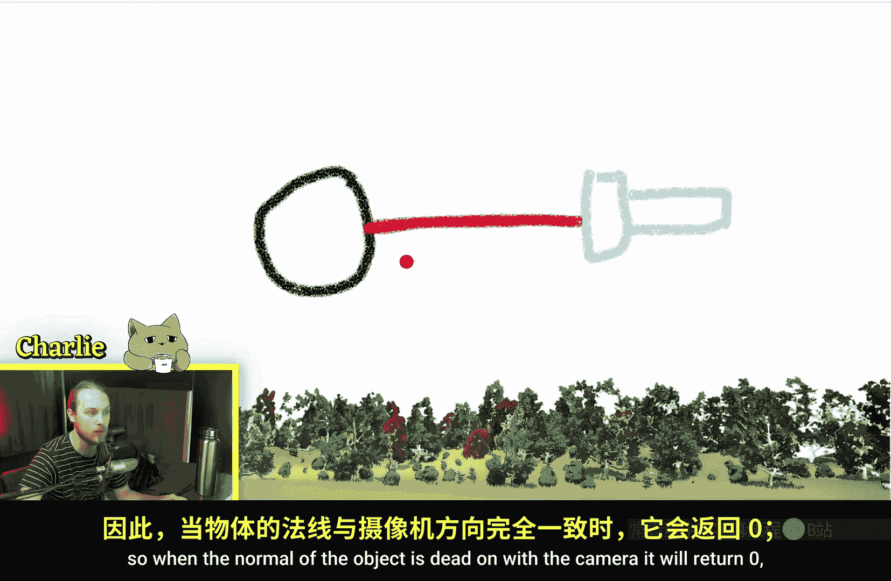
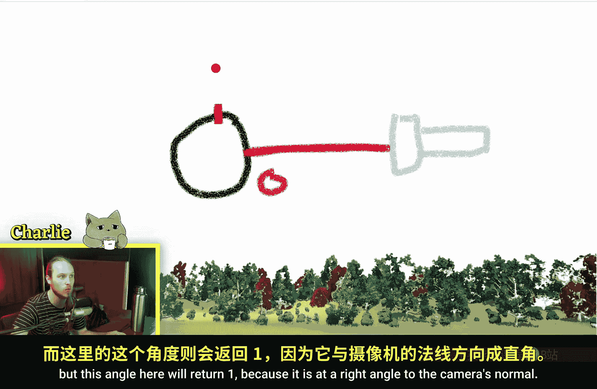
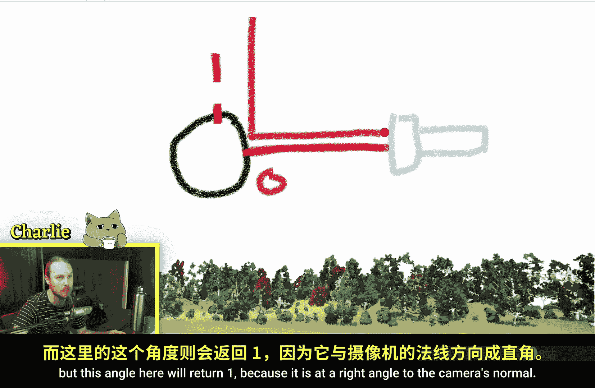
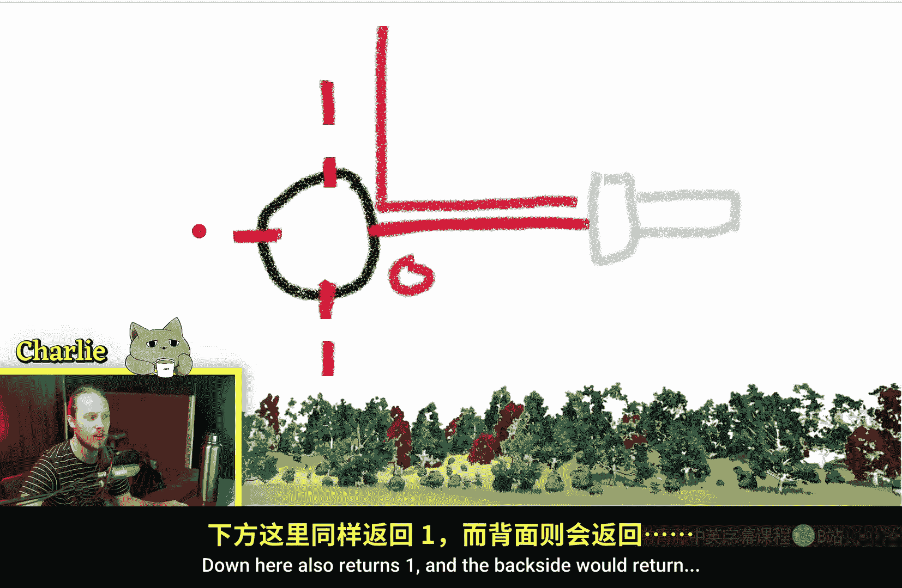
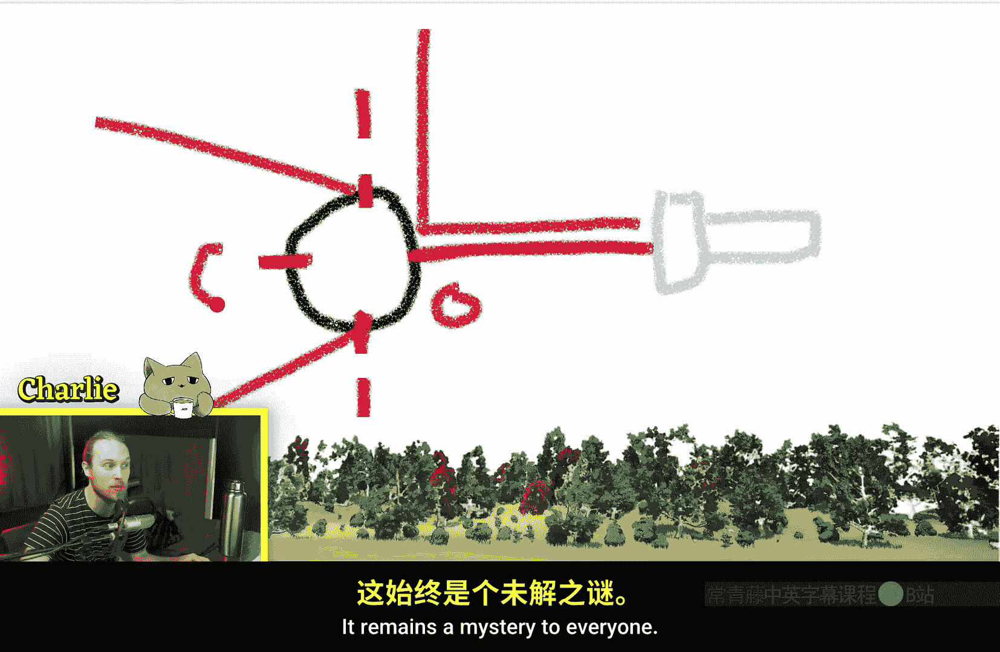
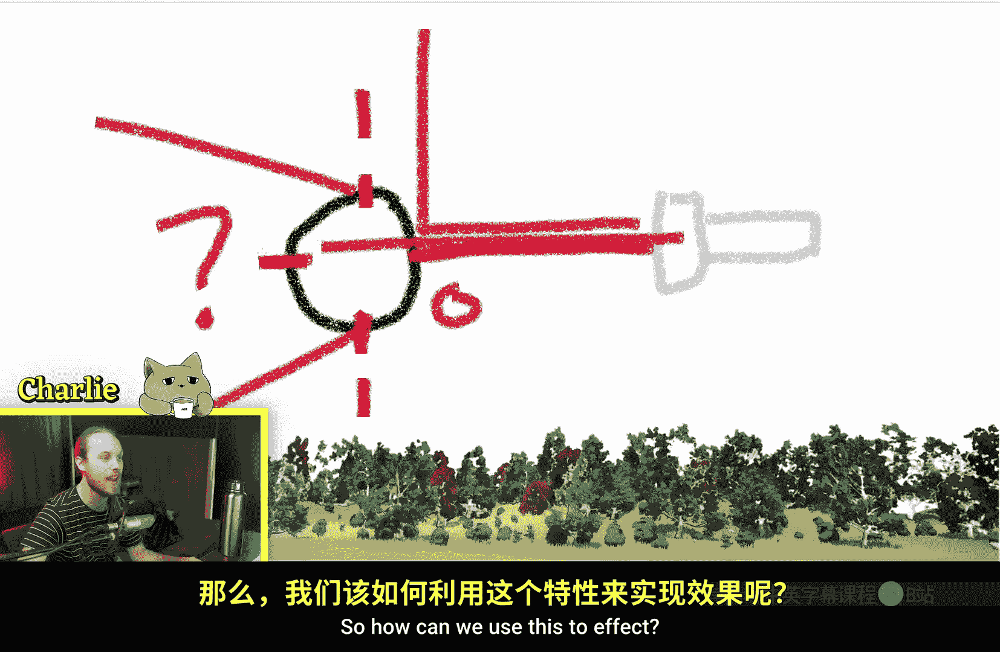

# 004：菲涅尔节点详解 🎨

在本节课中，我们将学习虚幻引擎材质编辑器中的 **菲涅尔（Fresnel）** 节点。我们将了解它的工作原理、核心参数，并通过几个实例演示如何在材质中应用它来创建边缘光、玻璃折射等视觉效果。

---

## 什么是菲涅尔节点？

菲涅尔节点根据观察者（摄像机）的视角与物体表面法线之间的角度，输出一个介于 **0** 到 **1** 之间的值。这个值描述了表面“边缘”的强度。

**核心公式概念**：
`菲涅尔输出值 = 1 - max(0, dot(视角方向, 表面法线))^指数`





简单来说：
*   当摄像机视线与表面法线方向完全一致（垂直看向表面）时，输出值为 **0**。
*   当摄像机视线与表面法线方向垂直（看向表面边缘）时，输出值为 **1**。

上一节我们介绍了节点的基本概念，本节中我们来看看它在不同形状上的直观表现。





将一个菲涅尔节点直接连接到材质的 **自发光颜色（Emissive Color）** 上。观察一个球体，无论从哪个角度，都能看到其边缘有一圈光晕。






如果将形状改为立方体，从正面观察时看不到轮廓光，但从侧面角度观察时，其边缘会变亮。






## 菲涅尔的工作原理



为了更直观地理解，我们通过一个二维示意图来说明。

假设这是一个球体，摄像机在右侧。球体表面的法线方向用箭头表示。


*   在点 **A**，表面法线正对摄像机，夹角为0度，菲涅尔输出值为 **0**（黑色）。
*   在点 **B** 和点 **C**，表面法线与摄像机方向成90度角，菲涅尔输出值为 **1**（白色）。


物体背对摄像机的部分，输出值是一个“谜”，因为通常我们看不到背面。


## 菲涅尔节点的应用实例

理解了基本原理后，我们来看看如何在材质中实际运用菲涅尔节点。

### 1. 创建边缘光效果

最常见的用法是将菲涅尔节点作为 **线性插值（Lerp）** 节点的Alpha通道输入。

**实现步骤**：
1.  创建一个 **菲涅尔** 节点。
2.  创建一个 **线性插值（Lerp）** 节点。
3.  将菲涅尔输出连接到Lerp的Alpha通道。
4.  为Lerp的A和B通道指定两种不同的颜色（例如，深色和亮色）。
5.  将Lerp的输出连接到材质的 **基础颜色（Base Color）**。

以下是核心节点连接的代码表示：

```cpp
// 伪代码表示材质节点连接逻辑
FresnelOutput = Fresnel(Exponent, BaseReflectFraction);
FinalColor = Lerp(Color_A, Color_B, FresnelOutput);
```

这样，物体中心显示A颜色，边缘逐渐过渡到B颜色，形成光晕。游戏《黑暗之魂》中幽灵角色的轮廓光就使用了类似效果。


**指数（Exponent）参数的作用**：
*   指数值越大，边缘光效果越集中在非常尖锐的边缘。
*   指数值越小，边缘光效果越柔和，扩散范围越广。
*   当指数值趋近于无穷大时，输出几乎全为0（A颜色）。
*   当指数值降为0时，输出几乎全为1（B颜色）。

### 2. 影响菲涅尔计算的“法线”

菲涅尔节点的一个关键特性是：它基于**像素法线**进行计算，而非顶点法线。

这意味着，如果你为材质添加了**法线贴图（Normal Map）**，菲涅尔效果会跟随法线贴图表面的微小凹凸细节而变化，效果会更加破碎和不规则，而不是平滑的渐变。

### 3. 模拟玻璃材质

我们可以利用菲涅尔节点来制作更真实的玻璃折射效果。

**实现步骤**：
1.  将材质的 **混合模式（Blend Mode）** 从 **不透明（Opaque）** 改为 **半透明（Translucent）**。
2.  在 **半透明（Translucent）** 区域中，将 **光照模式（Lighting Mode）** 设为 **表面半透明体积（Surface TranslucencyVolume）**。
3.  使用一个Lerp节点，混合两个不同的**折射（Refraction）**强度值（例如1.0和1.52，1.52是玻璃的近似折射率）。
4.  用**菲涅尔**节点的输出作为这个Lerp的Alpha，控制不同视角下的折射强度。
5.  将材质的**不透明度（Opacity）**设为0。

此时，球体看起来就像玻璃或水一样，边缘的折射效果更强。更酷的是，你还可以将法线贴图连接到菲涅尔节点的法线输入口，来模拟粗糙或有划痕的玻璃表面。

### 4. 控制表面效果的可见性

菲涅尔节点可用于根据视角隐藏或显示某些效果。

例如，在一个冰面材质中：
*   从正上方（垂直）看下去时，材质呈深蓝色，可以看到冰层下的图案（如符文、星星）。
*   从侧面（浅角度）看时，材质变为浅蓝色或白色，冰层下的图案因菲涅尔值乘以0而完全消失。

这种技巧也可用于水材质：让水面从上方看是透明的，从侧面看则显示其自身颜色和天空反射。

---

## 课程总结

本节课中我们一起学习了虚幻引擎的 **菲涅尔（Fresnel）** 节点。

*   **核心功能**：根据摄像机视角与物体表面法线的夹角，输出0到1的值。表面正对摄像机时为0，边缘（90度角）时为1。
*   **关键参数**：**指数（Exponent）** 控制效果过渡的锐利程度。
*   **计算基础**：基于**像素法线**，因此受法线贴图影响。
*   **常见应用**：
    1.  创建物体轮廓光或边缘着色效果。
    2.  增强玻璃、水等材质的折射真实性。
    3.  根据视角控制次级效果（如底层图案）的显示与隐藏。

菲涅尔节点是增强材质视觉层次感和真实感的强大工具，通过巧妙地混合颜色、透明度或折射，可以极大地提升场景中物体的表现力。