# 005：正弦与余弦节点 🎨

在本节课中，我们将要学习虚幻引擎材质编辑器中的两个数学节点：**正弦（Sine）** 和 **余弦（Cosine）**。我们将了解它们的基本工作原理、如何将它们的输出值映射到更实用的范围，以及如何利用它们创建动态、重复的视觉效果，例如脉动光环或颜色循环。

---

## 正弦节点的基本作用

上一节我们介绍了数学节点的基础概念，本节中我们来看看正弦节点的具体功能。

正弦节点接收一个输入值，并输出一个在 **-1 到 1** 之间周期性波动的值。其核心公式可以表示为：
`输出值 = sin(输入值)`

为了更直观地理解，我们可以将一个从 **0 到 1** 的线性渐变（Gradient）输入到正弦节点。观察输出，你会发现：

*   输入值 **0** 对应的输出是 **0**。
*   输入值 **0.5** 对应的输出也是 **0**。
*   在 **0 到 0.5** 之间，输出值会先上升到正值，再下降回 **0**。
*   在 **0.5 到 1** 之间，输出值会下降到负值，再上升回 **0**。

由于材质通常处理 **0 到 1** 的范围（对应黑到白），负值在预览中显示为黑色，因此我们看不到完整的波形。

为了让波形更清晰，我们可以对正弦节点的输出进行一个常用处理：**先除以 2，再加 0.5**。这相当于一个重映射公式：
`处理后的值 = (sin(输入值) / 2) + 0.5`

经过这个处理，输出值就被映射到了 **0 到 1** 的范围内。此时，波形从 **0.5**（灰色）开始，上升到 **1**（白色），再下降到 **0**（黑色），最后回到 **0.5**，完成一个完整的周期。

---

## 调整周期与结合时间节点

正弦节点的一个关键参数是 **周期（Period）**。默认值为 **1**。减小周期值会使波形在相同的输入范围内完成更多次循环。

例如，将周期设置为 **0.5**，波形会在 **0 到 1** 的输入范围内完成两次循环，产生更密集的条纹效果。

正弦节点最强大的用途之一是结合 **时间（Time）** 节点来创建动态效果。将时间节点输入正弦节点，其输出就会随时间在 **-1 到 1** 之间循环。

以下是利用此特性创建颜色循环效果的步骤：

1.  将 **Time** 节点连接到 **Sine** 节点的输入。
2.  将 **Sine** 节点的输出（经过除以2加0.5的处理后）连接到一个 **LinearInterpolate（Lerp）** 节点的 **Alpha** 端口。
3.  在 **Lerp** 节点的 **A** 和 **B** 端口输入两种不同的颜色。
4.  将 **Lerp** 节点的输出连接到材质的 **Base Color**。

这样，材质就会在两种颜色之间平滑地循环过渡。调整正弦节点的周期可以控制颜色变化的速度。

---

## 正弦与余弦节点的关系

现在，让我们看看余弦节点。余弦节点与正弦节点在数学上密切相关。

余弦节点的输出同样在 **-1 到 1** 之间波动。其核心公式为：
`输出值 = cos(输入值)`

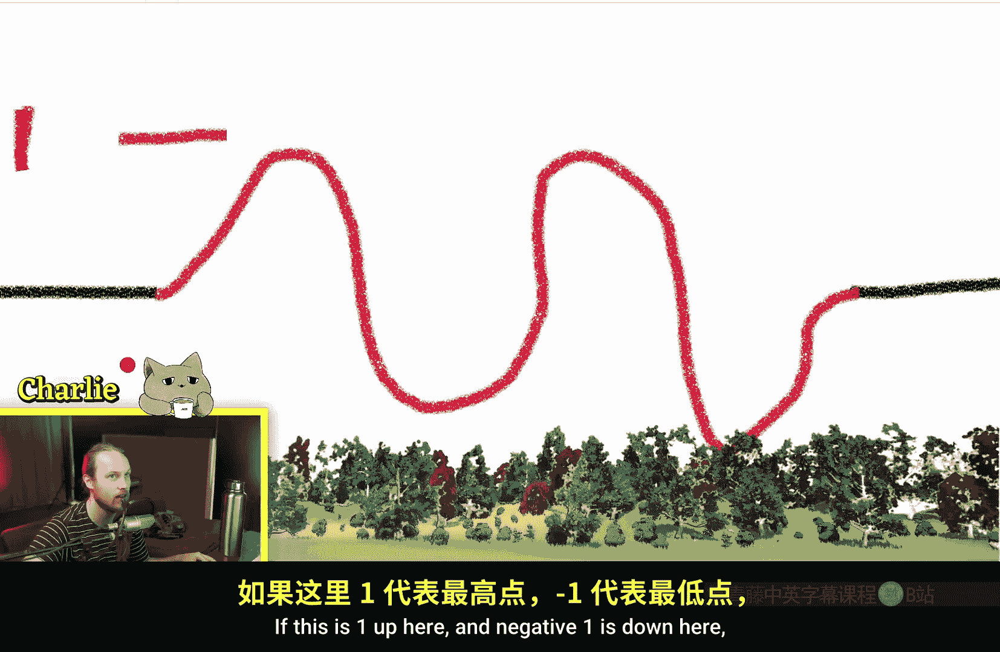

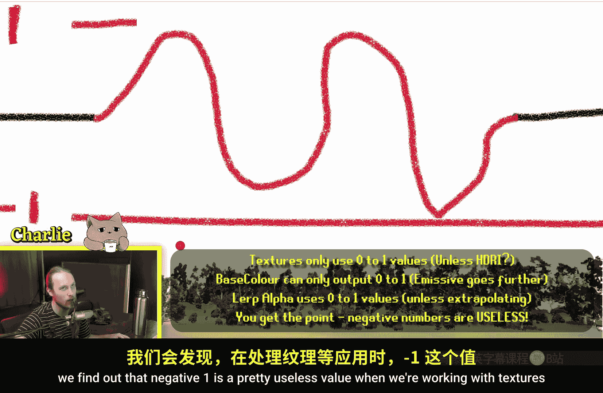

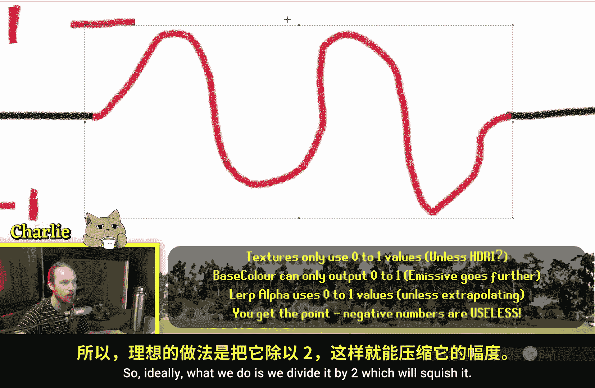

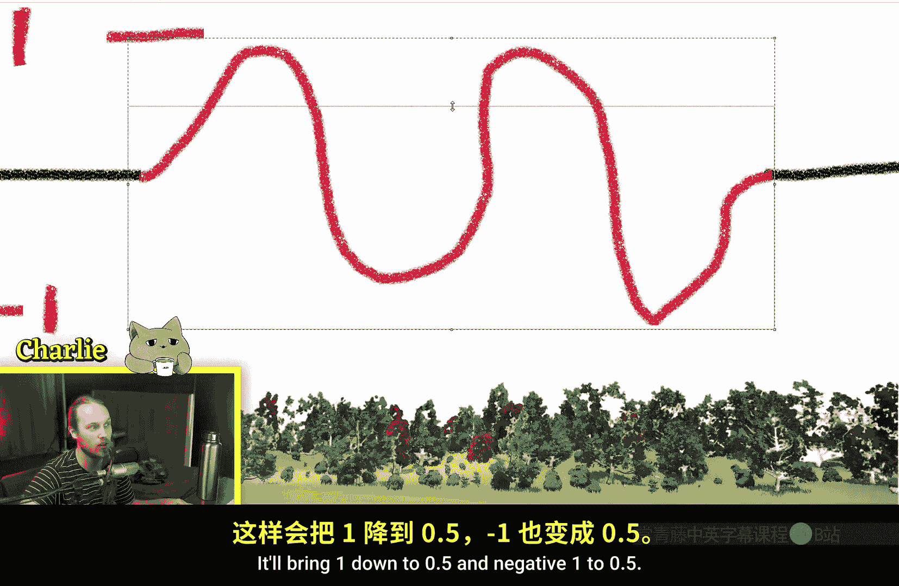

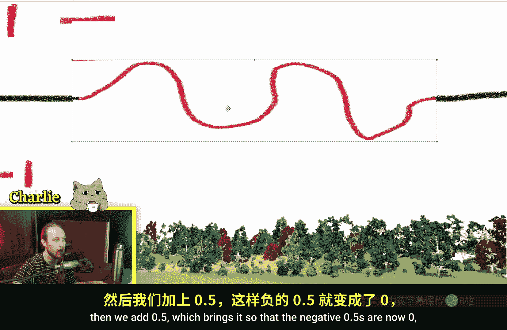

它与正弦波形的形状完全相同，唯一的区别是 **相位偏移**。正弦波从 **0** 开始，而余弦波从 **1** 开始。

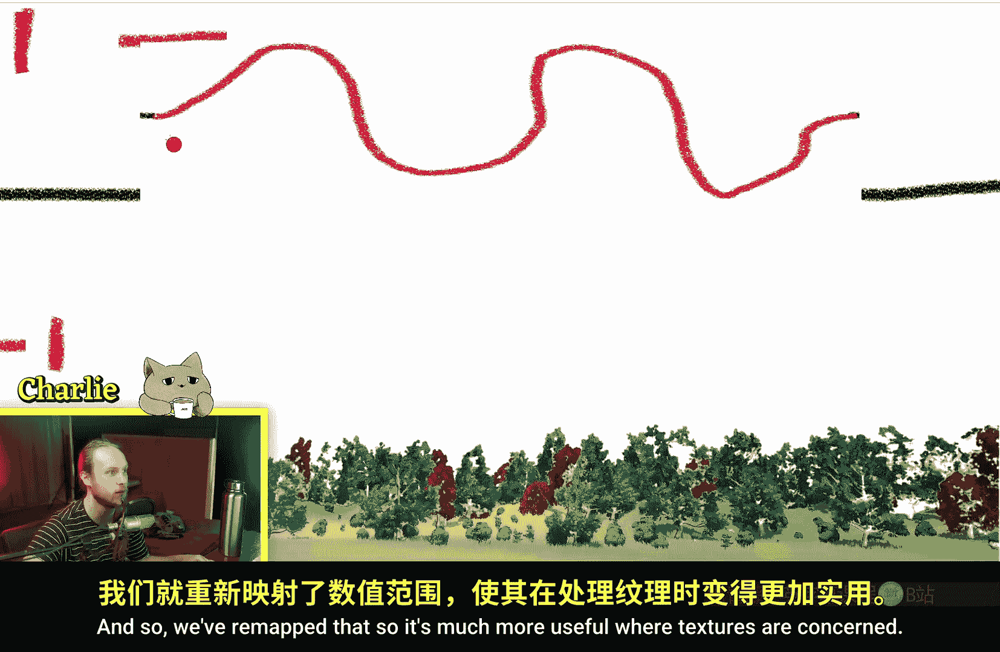

当我们对余弦波进行相同的重映射处理（除以2再加0.5）后，它会变成一个从 **0.5** 开始，上升到 **1**，再下降到 **0** 的波形。

有时，我们可能需要一个从 **0** 开始上升到 **1** 再下降的波形。这可以通过对余弦波进行一个简单的变换实现：
`处理后的值 = ((-cos(输入值)) / 2) + 0.5`

这个操作相当于先将余弦波垂直翻转（乘以-1），再进行标准的范围重映射。因此，根据你想要波形起始点的不同，可以选择使用正弦或处理后的余弦节点。

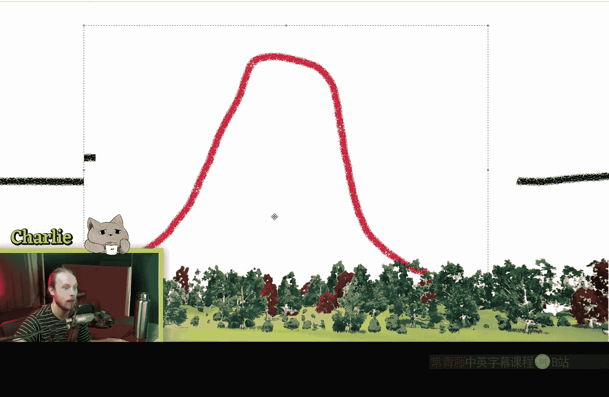

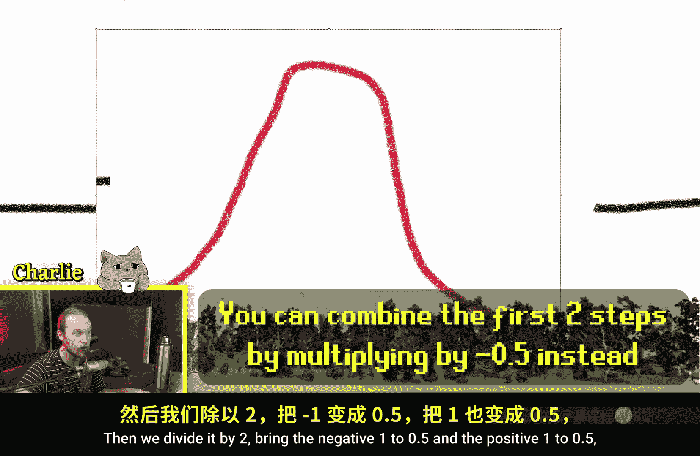

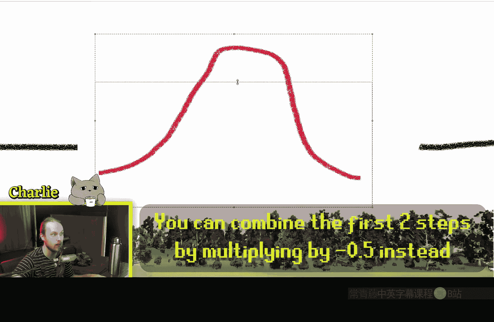

---

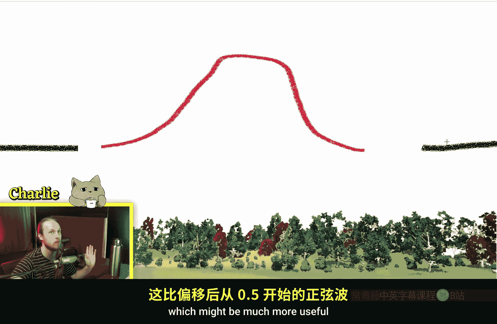

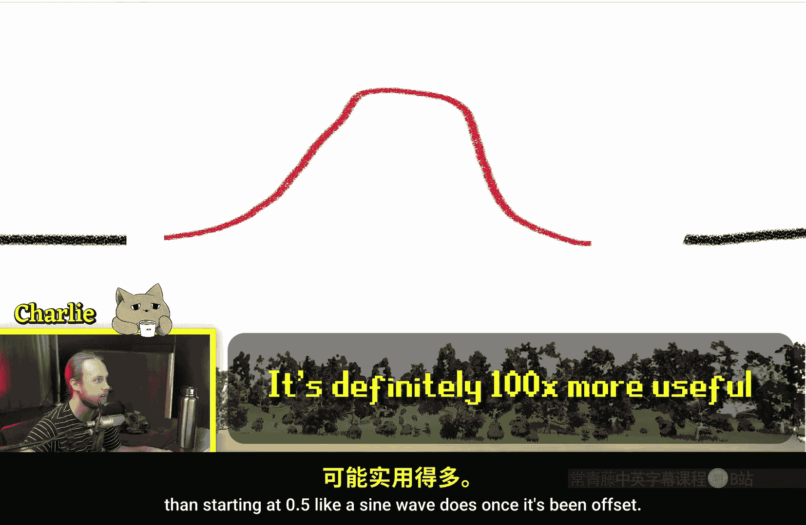

## 实用案例：创建脉动发光效果

正弦节点非常适合创建周期性的强度变化。以下是一个创建自发光（Emissive）脉动效果的例子：

1.  将 **Time** 节点输入 **Sine** 节点。
2.  对正弦输出进行重映射，使其在 **0 到 1** 之间波动。
3.  将该值乘以一个较大的数（例如 **100**）以增强强度，然后直接连接到材质的 **Emissive Color** 通道。这样会产生白色强度的脉动。

4.  若要实现彩色发光，可以先将重映射后的波形与一个颜色值（**三维向量**，如金色 `(1.0, 0.84, 0.0)`）相乘，再将结果连接到 **Emissive Color**。乘法节点同时控制了发光的强度。

5.  更复杂的效果：可以将波形输入 **Lerp** 节点的 **Alpha**，在 **A** 和 **B** 端口设置两种不同的发光颜色（如红色和蓝色），然后将 **Lerp** 的输出连接到 **Emissive Color**。这样材质就会在两种颜色之间脉动变化。

这种方法完全在着色器中运行，不消耗CPU资源，非常适合用于游戏中的能量拾取物、魔法物品等特效。

---

## 总结

本节课中我们一起学习了虚幻引擎材质编辑器中的正弦与余弦节点。

*   **核心功能**：它们能将输入值转换为 **-1 到 1** 之间的周期性波形。通过 `(sin(x)/2)+0.5` 的公式可以将其输出重映射到更实用的 **0 到 1** 范围。
*   **主要区别**：余弦波是正弦波的一个相位偏移版本。根据波形起点的需求，可以选择使用正弦或经过变换的余弦。
*   **关键应用**：通过调整 **周期（Period）** 参数控制波动频率；结合 **时间（Time）** 节点创建动态循环效果，如颜色过渡、纹理动画和物体脉动发光。
*   **优势**：利用这些数学节点在着色器层面创造动态效果，高效且性能友好。

希望本教程能帮助你理解并开始在材质中运用正弦与余弦节点，创造出丰富的视觉效果。