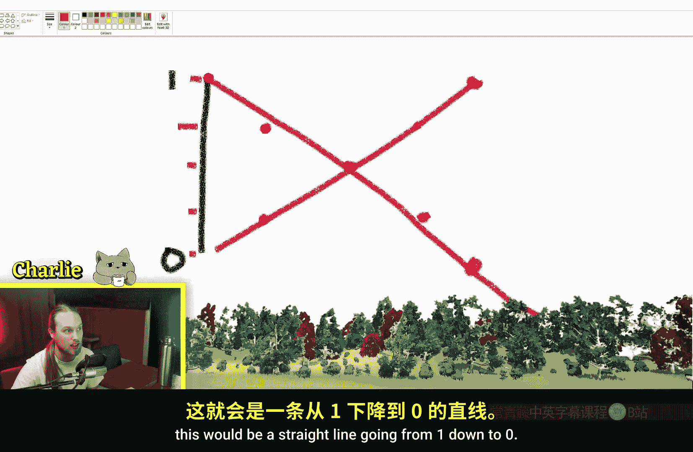
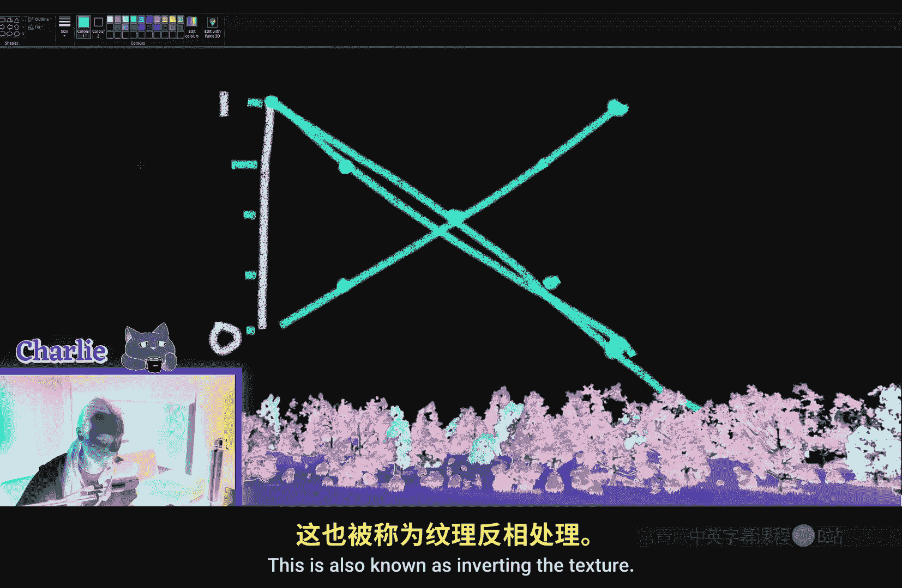
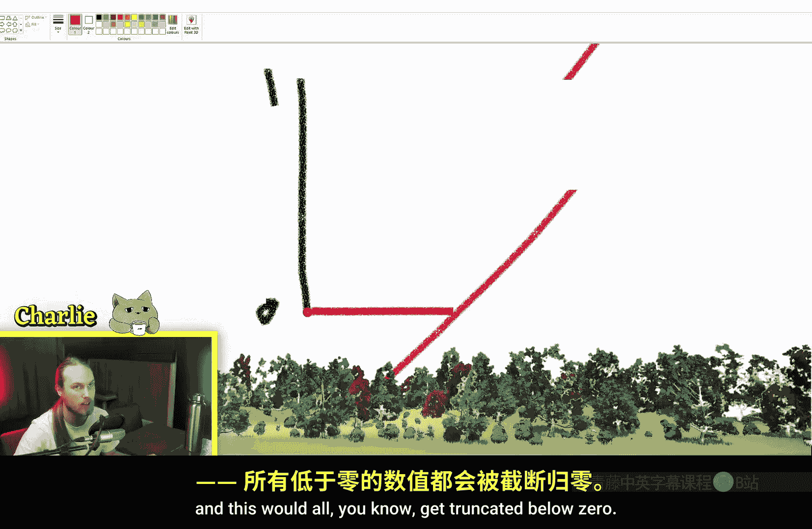

# 006：OneMinus节点详解 🎨

在本节课中，我们将学习虚幻引擎材质编辑器中的一个基础但非常重要的节点：**OneMinus** 节点。我们将了解它的数学原理、它在材质中的实际应用，以及如何巧妙地使用它来反转纹理或遮罩，从而创造出不同的视觉效果。

---

## 节点功能概述

**OneMinus** 节点的功能非常直接：它执行一个简单的数学运算，即用 **1** 减去输入值。其核心公式可以表示为：

**`输出 = 1 - 输入`**

这意味着，任何输入到该节点的值（通常在0到1的范围内）都会被“反转”。例如，输入0.2会输出0.8，输入1.0会输出0.0。

---

## 工作原理与数学解析

上一节我们概述了节点的基本功能，本节中我们来看看其背后的数学原理。

想象一条从0到1的数值线。**OneMinus** 节点所做的，就是将线上的每个点映射到其关于中点（0.5）的对称点上。

以下是几个关键点的计算示例：
*   输入 **0.0**：`1 - 0 = 1.0`
*   输入 **0.25**：`1 - 0.25 = 0.75`
*   输入 **0.5**：`1 - 0.5 = 0.5`
*   输入 **0.75**：`1 - 0.75 = 0.25`
*   输入 **1.0**：`1 - 1 = 0.0`





从视觉上看，这相当于将一张纹理的颜色进行**反相**处理：白色（值为1）变为黑色（值为0），黑色变为白色，中间的灰度值也相应地反转。

---

## 核心应用场景

理解了原理后，我们来看看 **OneMinus** 节点在材质制作中的几个典型用途。

### 1. 反转遮罩（Mask）效果

最常见的用途是快速反转一张遮罩纹理。例如，你有一张黑白纹理用于控制顶点偏移，白色部分会使模型凸起。

```cpp
// 原始效果：白色区域凸起
World Displacement Offset = Texture Sample * Strength
```

如果你希望改为让黑色部分凸起，只需将纹理通过 **OneMinus** 节点处理：

```cpp
// 反转后效果：黑色区域凸起
World Displacement Offset = OneMinus(Texture Sample) * Strength
```

这样，原本白色的区域保持平坦，而黑色区域则产生位移，轻松实现了效果的翻转。

### 2. 配合数学运算进行选择性调整



**OneMinus** 节点可以与基础数学节点结合，实现对纹理特定区域（亮部或暗部）的精细控制。

假设我们使用 **除法（Divide）** 节点来降低纹理的亮度。除法运算会均匀地压缩所有值，但主要影响的是高亮（白色）区域，暗部变化较小。

如果我们希望**只提亮暗部区域而不影响高亮部分**，可以按以下步骤操作：
1.  使用 **OneMinus** 节点反转纹理。
2.  对反转后的纹理进行除法运算（此时原图的暗部变成了亮部，成为主要受影响区域）。
3.  再次使用 **OneMinus** 节点，将纹理反转回原始的黑白关系。

这个操作流程可以表示为：
```cpp
最终输出 = OneMinus( Divide( OneMinus(原纹理), 系数 ) )
```

通过这种方式，我们能够非破坏性地、平滑地调整暗部亮度，避免了直接使用**加法（Add）** 节点可能导致的数值裁切（Clipping，即值超过1.0或低于0.0）和生硬的边缘。

---

## 与直接加减法的对比

为了加深理解，我们对比一下使用 **OneMinus** 配合除法与直接使用加减法的区别。

以下是两种方法的对比：
*   **`OneMinus + Divide + OneMinus`**：此方法能**平滑地提亮暗部**，同时完美保留从黑到白的**所有渐变层次**，不会产生突兀的色阶断层。
*   **`Add`**：直接增加一个值会使整张纹理变亮，但可能导致原本亮部的值**超过1.0而被裁切**为纯白，丢失细节。同时，它无法做到只针对暗部进行调整。

因此，当需要对纹理的暗部或亮部进行非对称性、保细节的调整时，**OneMinus** 节点提供的这种“反转-处理-再反转”的思路是一个非常实用的技巧。

---

## 课程总结

本节课中我们一起学习了 **OneMinus** 节点。
*   **功能**：它执行 `1 - 输入` 运算，用于**反转**输入值。
*   **视觉表现**：将纹理的**黑白颜色反相**。
*   **核心应用**：
    1.  快速**反转遮罩**，改变效果的作用区域。
    2.  结合其他数学节点（如除法），实现对纹理**暗部或亮部的选择性、平滑调整**，避免数值裁切。


掌握这个简单的节点，能让你在材质编辑中更灵活地控制纹理数据，是实现复杂效果的基础工具之一。