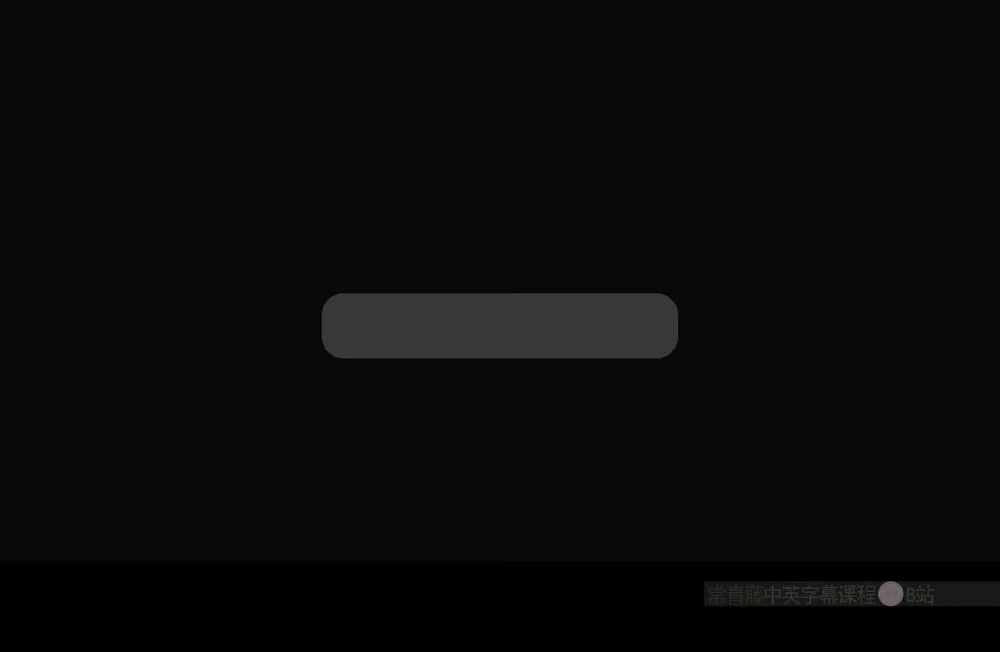
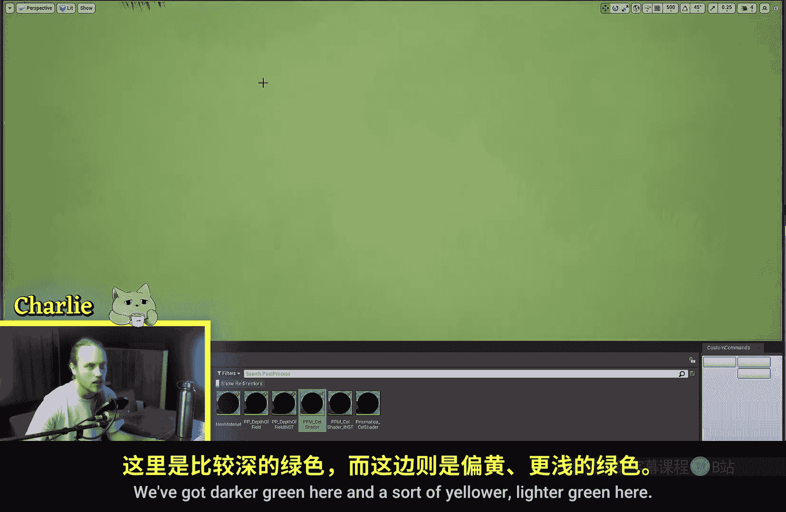
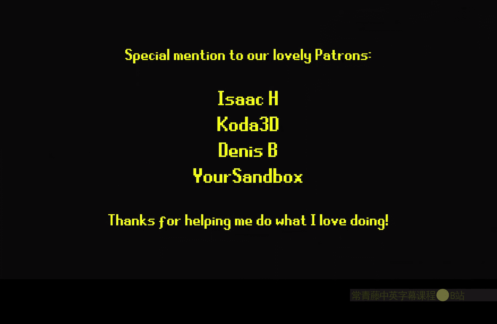

# 007：世界位置节点详解 🌍

在本节课中，我们将学习虚幻引擎材质编辑器中的“绝对世界位置”节点。我们将探讨它的工作原理、基本应用，以及如何利用它来创建无缝贴图投影和风格化的颜色变化。

---

## 节点基础：什么是绝对世界位置？

上一节我们介绍了材质节点的基本概念，本节中我们来看看“绝对世界位置”节点。

“绝对世界位置”节点返回材质所应用表面的每个点在虚幻世界空间中的精确三维坐标。其输出是一个三维向量 **(X, Y, Z)**，分别对应世界空间中的左右、前后和上下方向。

如果你创建一个新材质，将“绝对世界位置”节点直接连接到“基础颜色”，你会看到一个类似打印机色卡的效果。这直观地展示了该节点输出的数据：颜色代表了该点在空间中的位置。

---

## 核心应用：使用世界坐标投影纹理

理解了节点的基本输出后，我们来看看它的一个核心用途：基于世界坐标投影纹理。

以下是实现步骤：
1.  获取 **AbsoluteWorldPosition** 节点。
2.  使用 **Component Mask** 节点，通常选择 **R** 和 **G** 通道（即 X 和 Y 坐标），忽略垂直的 Z 轴。
3.  将处理后的坐标连接到纹理采样节点的 **UV** 输入口。

此时，纹理会以世界坐标原点为中心，平铺在整个场景中。**每个纹理贴图的大小恰好是1个虚幻单位（即1厘米）**。这通常不是我们想要的效果。

为了使纹理尺寸更符合实际，我们需要对坐标进行缩放。这是通过除法运算实现的：

`缩放后的UV = AbsoluteWorldPosition.xy / 缩放系数`

例如，除以100，意味着**每100个世界单位（即1米）重复一次纹理贴图**。调整这个除数，可以自由控制纹理在世界空间中的显示大小。

这种方法的优点是：**无论物体如何移动或旋转，其表面纹理都基于固定的世界坐标，因此多个物体之间的纹理可以完美对齐，没有接缝**。这对于地面、墙面等需要连续纹理的场景非常有用。

---

## 进阶技巧：创造风格化颜色变化

除了投影纹理，世界位置节点还能用于创造非破坏性的颜色变化，为场景增添细节和风格。

以下是两种常见技巧：

**1. 使用噪波贴图混合颜色**
此技巧常用于地形材质，创建自然的颜色斑块。
*   使用世界位置XY坐标采样一张噪波贴图（如云朵噪波）。
*   对噪波结果进行对比度等调整。
*   将其作为Alpha通道，使用 **Lerp（线性插值）** 节点在两个颜色间进行混合。

**2. 利用正弦函数创建颜色渐变**
此技巧可用于植被材质，模拟随高度变化的颜色。
*   获取 **AbsoluteWorldPosition** 节点，并使用 **Component Mask** 提取 **B** 通道（即Z轴，高度）。
*   将其输入一个 **Sine（正弦）** 节点。通过调整正弦函数的周期，可以控制颜色变化的频率。
*   对正弦结果进行除法运算，以柔化颜色过渡。
*   最后，使用 **Lerp** 节点将颜色变化应用到材质上。

---

## 视觉化理解：节点输出揭秘

为了更透彻地理解这个节点，让我们将其输出直接可视化。

将 **AbsoluteWorldPosition** 直接连到“基础颜色”，你会看到一个彩色立方体。其颜色规律与三维坐标系完全对应：
*   **红色（R）** 分量代表 **X轴** 方向。所有包含红色的面（如洋红、黄、白）都位于X轴正方向。
*   **绿色（G）** 分量代表 **Y轴** 方向。所有包含绿色的面（如青、黄、白）都位于Y轴正方向。
*   **蓝色（B）** 分量代表 **Z轴** 方向。所有包含蓝色的面（如青、洋红、白）都位于Z轴正方向。
*   原点另一侧（负方向）的区域则颜色很深。

当你对坐标进行除法运算时，相当于延长了颜色从0到1（例如从黑到纯红）的过渡距离。这就是为什么除以一个数会让基于此坐标的纹理看起来“变大”了——因为相同的颜色/纹理信息覆盖了更广阔的世界空间。

---

## 总结

本节课中我们一起学习了“绝对世界位置”节点的核心知识与应用。

我们首先了解了该节点**返回物体表面点在三维世界中的精确坐标**。接着，探索了其主要用途：**通过世界坐标投影纹理，实现物体间的无缝贴图对齐**。然后，学习了两个进阶技巧：**利用噪波贴图混合颜色**以及**使用正弦函数创建基于高度的颜色渐变**，从而为场景增添丰富的风格化细节。最后，通过对节点输出的直接可视化，我们更深刻地理解了其数据含义。

掌握“绝对世界位置”节点，是迈向量化、程序化材质创作的重要一步。