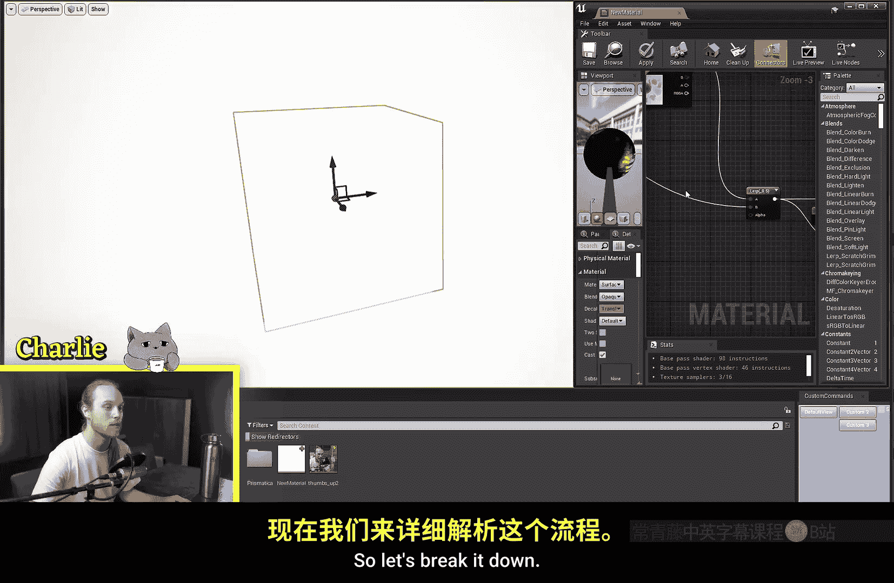
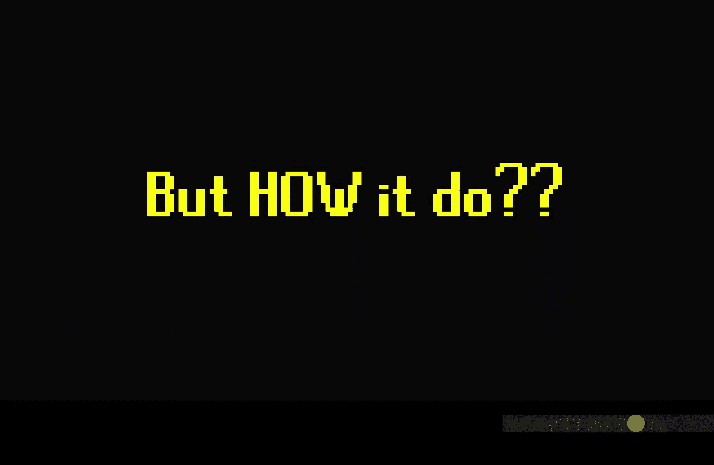
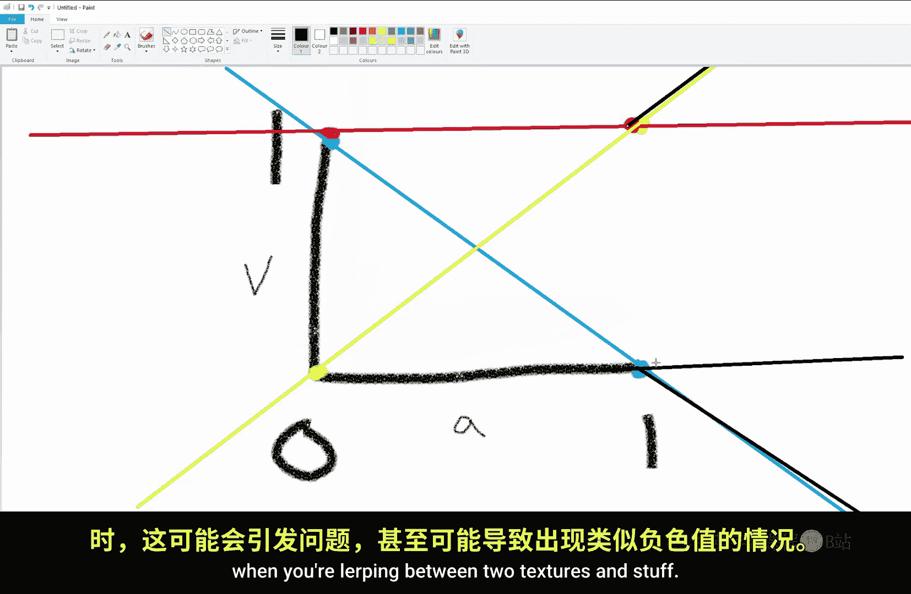

# 008：线性插值节点详解 🎨

在本节课中，我们将学习虚幻引擎材质编辑器中最核心、最常用的节点之一：**线性插值**节点。我们将深入探讨它的工作原理、应用场景以及使用时的注意事项。

## 概述

线性插值节点是材质编辑中用于在两个值之间进行平滑混合的核心工具。无论是混合颜色、纹理还是标量值，它都能胜任。本节将详细解析其功能与用法。



## 线性插值节点基础

线性插值节点，常被称为 **Lerp** 节点，其核心功能是在两个输入值之间进行基于“Alpha”值的混合。

以下是其基本形式：
```
Result = (1 - Alpha) * A + Alpha * B
```
其中 **A** 和 **B** 是待混合的两个值，**Alpha** 是一个范围通常在0到1之间的标量，用于控制混合权重。

### 核心工作机制



上一节我们介绍了节点的基本概念，本节中我们来看看它的具体工作方式。当Alpha值为0时，输出完全等于输入A；当Alpha值为1时，输出完全等于输入B；当Alpha值在0到1之间时，输出是A和B的加权平均值。

例如，混合紫色（RGB: 1, 0, 1）和黄色（RGB: 1, 1, 0）：
*   **红色通道**：从1到1，保持不变。
*   **绿色通道**：从0到1，线性增加。
*   **蓝色通道**：从1到0，线性减少。
在Alpha为0.5时，会得到一个近似灰色的中间色（RGB: 1, 0.5, 0.5）。

## 线性插值节点的应用

线性插值节点在材质创作中无处不在，其应用灵活多样。

以下是几个典型应用场景：

1.  **纹理混合**：将两种不同的纹理（如草地和岩石）基于高度或遮罩进行混合，常用于制作地形材质。
2.  **颜色过渡**：创建颜色之间的平滑渐变，例如根据角色血量改变武器光泽的颜色。
3.  **参数控制**：将其他节点（如噪声纹理、正弦波）的输出作为Alpha，驱动动态的混合效果。
4.  **数值映射**：快速地将一个0-1的范围映射到任意两个数值之间。例如，用正弦波和时间驱动一个物体在0到500单位高度之间上下浮动。
    ```
    // 使用Time和Sine节点生成0-1的振荡，然后映射到0-500
    Height = Lerp(0, 500, Saturate( (Sine(Time) + 1) / 2 ))
    ```



## 重要注意事项：限制Alpha值

使用线性插值节点时，一个至关重要的步骤是确保Alpha输入值被限制在合理的范围内。

以下是必须限制Alpha值的原因：

*   **避免 extrapolation**：当Alpha小于0或大于1时，操作不再是“插值”，而是“外推”。这会导致输出值超出A和B定义的范围，可能产生无效的负值或过大的正值。
*   **防止视觉错误**：在渲染颜色或纹理时，外推会产生不自然的、过亮或过暗的区域，甚至出现意料之外的色偏。
*   **确保稳定性**：将Alpha值限制在0到1之间，可以保证混合行为始终可预测且稳定。

因此，在将变量、时间或复杂表达式连接到Alpha输入之前，通常应通过 **Saturate** 或 **Clamp** 节点对其进行限制。

## 高级技巧与发现

线性插值节点还有一些有趣的特性。例如，Alpha输入不仅可以接收标量（单值），还可以接收矢量（如RGB颜色）。

如果将一个三维向量（如(1, 0, 0)）作为Alpha，节点会使用该矢量的每个分量分别控制对应通道的混合。这意味着你可以独立地控制红、绿、蓝通道的混合进度。

## 总结


本节课中我们一起学习了线性插值节点。我们了解了它是通过一个简单的公式在两点间进行混合的核心数学工具。我们探讨了它在混合纹理、颜色及映射数值方面的广泛应用。最重要的是，我们强调了使用 **Saturate** 节点将Alpha值限制在0到1之间，以避免外推所导致的各种问题。掌握线性插值节点是迈向虚幻引擎材质创作精通的关键一步。