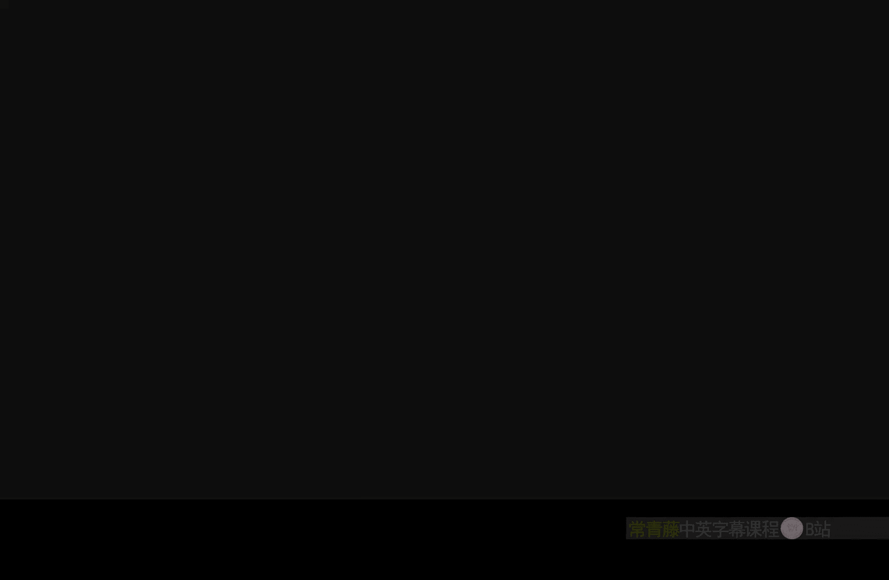

# 009：像素法线世界空间节点

在本节课中，我们将要学习虚幻引擎材质编辑器中的一个重要节点：**像素法线世界空间**。我们将了解它的作用、它与顶点法线世界空间节点的区别，以及一个非常实用的应用技巧。

## 概述

像素法线世界空间节点用于获取物体表面每个像素在世界空间中的法线方向。这个方向考虑了应用在材质上的法线贴图的影响，因此它能提供比顶点法线更精细的表面朝向信息。

## 核心概念与节点展示

该节点的核心是返回一个三维向量，其RGB通道分别对应世界空间下的X、Y、Z轴方向。我们可以用以下伪代码来理解其输出：

```
Output = (Normal_X, Normal_Y, Normal_Z)  // 在世界坐标系下
```

在材质编辑器中，它的图标和连接方式如下：



## 与顶点法线世界空间节点的区别

上一节我们介绍了顶点法线世界空间节点，本节中我们来看看像素法线世界空间节点与它的异同。

如果直接将像素法线世界空间节点连接到基础颜色上，其视觉效果与顶点法线世界空间节点非常相似。然而，关键的区别在于对法线贴图的响应。当我们为材质添加一张法线贴图后，像素法线世界空间节点返回的法线会立即反映出贴图带来的细节变化，而顶点法线则保持不变。这使得像素法线能更精确地描述物体表面的微观朝向。

## 主要用途：作为方向遮罩

像素法线世界空间节点最常见的用途之一是作为方向选择遮罩。由于它的Z通道（对应蓝色B通道）代表世界空间中的向上方向，我们可以利用这一点来选取物体表面朝上的部分。

以下是具体步骤：
1.  分离出像素法线的B通道（即Z分量）。
2.  该通道的值范围在-1到1之间，其中朝上的像素接近1，水平的像素接近0，朝下的像素接近-1。
3.  通过调整（例如使用`Clamp`或条件判断），可以创建一个清晰的遮罩，用于区分表面朝向。

通过这个遮罩，我们可以实现诸如只在物体顶部添加积雪、青苔或沙土等效果，让环境交互看起来更自然。

## 实用技巧：结合顶点法线进行精确遮罩

单独使用像素法线遮罩有时会过于“敏感”，连垂直面上的凹凸细节也可能被选中。一个进阶技巧是将其与顶点法线世界空间节点结合使用，以获取更符合整体结构的遮罩。

具体操作如下：
1.  分别获取像素法线和顶点法线的世界空间向量。
2.  分离出两者的B通道（Z分量）。
3.  将这两个通道值相加。
4.  由于最大可能值为2，因此减去1，将结果范围调整回-1到1之间。

通过这个组合公式：

```
最终遮罩 = (像素法线.B + 顶点法线.B) - 1
```

我们就能得到一个“仅在朝上的顶点区域上，且考虑表面细节”的精确遮罩。这非常适合用于程序化地生成物体顶部的覆盖物，效果比静态贴图更加动态和真实。

## 注意事项与局限性

虽然这个节点功能强大，但需要注意一个重要的局限性：**它不能用于“位置偏移”节点**。因为像素法线信息在渲染管线的后期才被计算，而顶点位移发生在更早的阶段。对于需要根据法线进行顶点变形的效果，仍需使用顶点法线世界空间节点。

## 总结


本节课中我们一起学习了像素法线世界空间节点。我们了解到，它返回的是应用了法线贴图后，物体表面每个像素在世界空间中的法线方向。它的核心价值在于提供了极其精细的表面朝向信息，最典型的应用是创建基于方向的遮罩，用于实现积雪、污渍等环境效果。我们还学习了一个结合顶点法线来获得更干净、更结构化遮罩的实用技巧。掌握这个节点，能极大地增强你材质作品的真实感和动态交互能力。