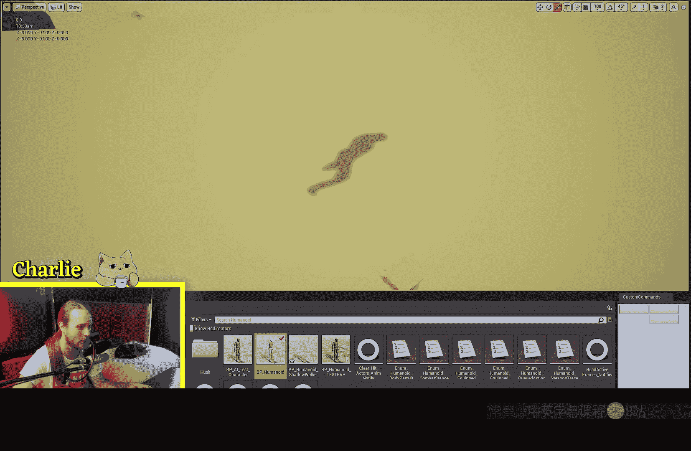
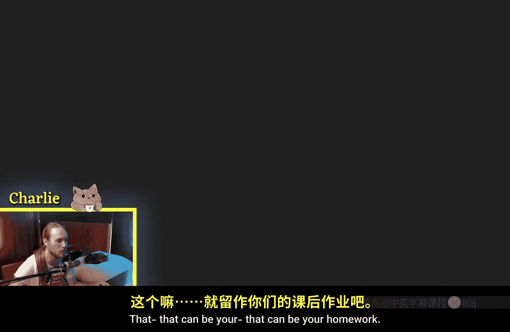

# 010：阴影通道切换

在本节课中，我们将学习虚幻引擎材质编辑器中的一个特殊节点——**阴影通道切换**节点。这个节点允许你控制一个使用遮罩材质的物体所投射的阴影，使其与物体本身的可见外观分离。这对于创建特殊视觉效果或优化场景非常有用。

## 节点基础功能

上一节我们介绍了遮罩材质的基本概念。本节中我们来看看如何用“阴影通道切换”节点控制其阴影。

“阴影通道切换”节点接收两个输入：**默认**输入和**阴影**输入。其核心功能是，在渲染物体本身时使用“默认”输入的值，而在计算该物体投射的阴影时，则使用“阴影”输入的值。

其逻辑可以用一个简单的条件语句来描述：
```
if (正在渲染阴影通道) {
    使用“阴影”输入;
} else {
    使用“默认”输入;
}
```


以下是该节点的基本操作演示：
1.  创建一个遮罩材质，默认情况下它会投射阴影。
2.  将材质的**不透明度蒙版**连接到“阴影通道切换”节点的“默认”输入。
3.  如果将值 **0**（纯黑）输入到“阴影”通道，则该物体将**完全不投射阴影**。
4.  如果将值 **1**（纯白）输入到“阴影”通道，则该物体会投射**其整个网格体的完整阴影**，无论其可见部分如何。

## 创意应用示例



理解了节点的基本原理后，我们可以探索一些更有趣的创意应用。



通过向“阴影”通道输入不同的纹理或值，你可以让物体投射出与自身形状完全不同的阴影。

例如，你可以：
*   将一个“点赞”手势的纹理Alpha通道连接到“阴影”输入。这样，一个茶壶物体就能在地面上投射出一个大拇指的阴影。
*   创建一个只有阴影行走、而本体不可见的“幽灵”敌人，增强游戏的氛围。

## 实用场景：透明物体的阴影保留

除了创意效果，该节点在解决实际渲染问题时也非常实用。

一个常见的需求是：当物体因透明或遮罩而不可见时，仍然希望保留其投射的阴影。例如，在游戏中，当角色靠近树木时，树木可能会变得透明以避免遮挡视线。如果不做处理，树木的阴影也会随之消失。

以下是利用“阴影通道切换”节点解决此问题的思路：
1.  使用 **Dither Temporal AA** 等节点实现树木的透明化（遮罩）。
2.  将实现透明化的遮罩信息连接到“阴影通道切换”节点的“默认”输入。
3.  将一个固定的值（如1）或简化版的树木阴影纹理连接到“阴影”输入。
4.  结果是：玩家视角中树木变透明了，但其阴影仍保留在地面上，保持了场景的光照真实感。

此方法也可用于优化：当复杂的树叶材质导致阴影闪烁或性能开销较大时，你可以向“阴影”通道输入一个更简单、更平滑的纹理来简化阴影计算。

## 总结

本节课中我们一起学习了“阴影通道切换”节点的强大功能。总结如下：
*   **核心作用**：允许为遮罩材质物体**单独指定**在阴影通道中使用的蒙版或值。
*   **主要应用**：
    *   **创意效果**：让物体投射出与自身形状不符的阴影。
    *   **实用优化**：在物体透明化时保留其阴影，或简化复杂物体的阴影以提高性能。


掌握这个节点，能让你在材质制作中更好地控制光影交互，实现更优的视觉效果和性能表现。