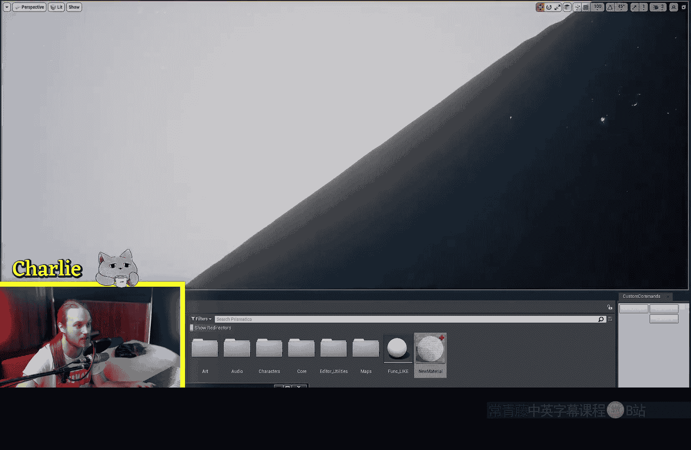
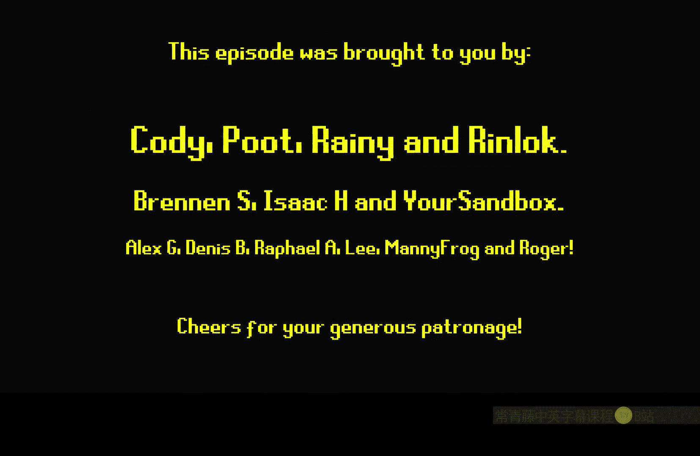
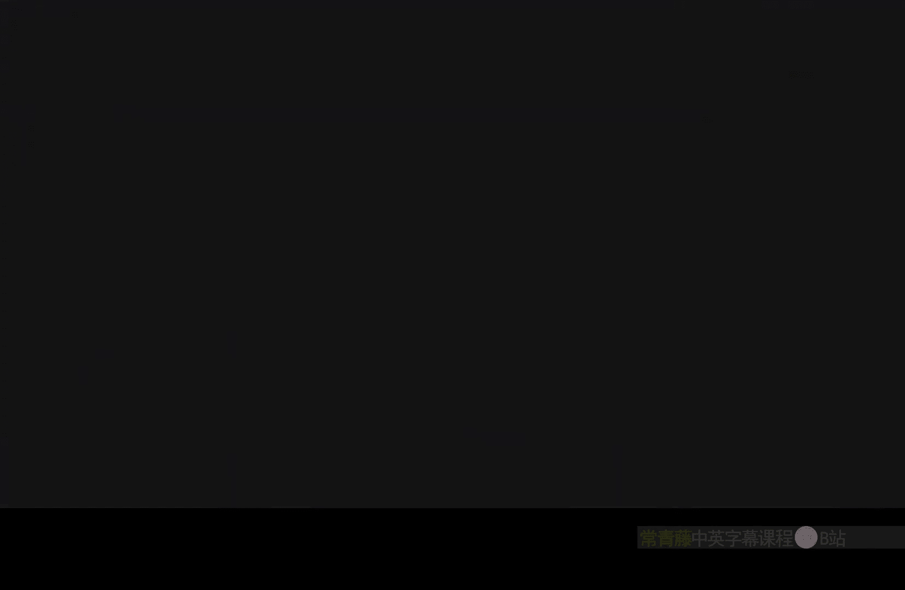

# 011：抖动时间抗锯齿节点

在本节课中，我们将要学习虚幻引擎材质编辑器中的一个非常实用且高效的节点——**抖动时间抗锯齿**节点。这个节点常用于替代半透明材质，以提升渲染性能，同时模拟出类似半透明的视觉效果。

## 节点概述与基本用法

上一节我们介绍了材质混合模式的基础概念，本节中我们来看看如何利用**抖动时间抗锯齿**节点来优化性能。

**抖动时间抗锯齿**节点通过创建一个屏幕空间的抖动图案来模拟透明度。它并非真正让材质变得透明，而是在材质上“戳”出许多像素大小的孔洞，让你能够看到背后的物体。这种技术比使用真正的半透明材质性能开销要小得多。

其核心原理可以用一个简单的概念来描述：**用不透明的遮罩材质，配合屏幕空间抖动图案，来模拟半透明效果**。

## 从半透明材质切换到抖动抗锯齿

首先，我们来看一个标准的半透明材质设置。如果你创建一个基础材质，将混合模式设置为“半透明”，并将一个渐变纹理连接到“不透明度”引脚，你会得到一个平滑的渐变透明效果。

然而，查看“着色器复杂度”视图模式，你会发现即使是这样简单的材质，其渲染开销也较高（通常显示为黄色或红色），因为半透明材质需要被渲染多次。

为了优化性能，我们可以进行以下操作：
1.  将材质混合模式从“半透明”改为“遮罩”。
2.  然后，将“遮罩”选项更改为“抖动时间抗锯齿”。

完成切换后，视觉效果看起来与半透明模式相似，但本质已完全不同。材质本身是不透明的，透明度是通过屏幕空间的抖动图案模拟出来的。在“着色器复杂度”视图中，该材质会显示为明亮的绿色，表明其渲染开销极低。

## 节点特性与潜在问题

使用抖动时间抗锯齿节点时，需要注意其一些特性和可能产生的副作用。

**特性：**
*   **屏幕空间效果**：抖动图案是基于屏幕空间计算的，这意味着无论物体距离摄像机远近，抖动点的物理大小看起来是相同的。
*   **可堆叠性**：你可以叠加多个使用此技术的材质，它们不会像真正的半透明材质那样产生深度排序问题，在性能视图下依然能保持高效。

**需要注意的问题：**
1.  **阴影异常**：使用此模式时，物体的阴影可能会显示异常。这通常可以通过使用 **“Shadow Pass Switch”** 节点来规避。
2.  **重影现象**：当启用**时间抗锯齿**时，快速移动的物体后方可能会出现重影。这是因为TAA会混合多帧画面来平滑边缘，而抖动的图案在帧与帧之间变化，导致混合后产生拖影。

有趣的是，这种重影效应有时可以被创造性地利用。例如，在表现沙尘、瀑布水花、粒子雾效等需要颗粒感或模糊朦胧感的场景中，这种重影反而能增强视觉效果。

## 抖动图案类型选择

该节点允许你选择两种不同的抖动图案，适用于不同的美学需求：

以下是两种可选图案及其适用场景：
*   **随机噪声图案**：产生更自然、颗粒状的抖动效果。适用于需要表现粗糙、不规则表面的场合，如泡沫、水花、沙尘粒子等。
*   **静态网格噪声图案**：产生更规整、侵入性更低的抖动效果。适用于需要尽可能减少视觉干扰的场合，例如一些遮挡系统。

## 实际应用案例

在游戏开发中，此节点有广泛的应用。例如：
*   **卡通着色**：模拟漫画中网点纸的透明效果。
*   **性能优化**：大规模替换场景中的半透明物体（如树叶、粒子群）为遮罩抖动材质，能显著提升帧率。
*   **风格化效果**：如前所述，用于创造沙瀑、雾效、流动的河水等需要朦胧感的特效。

## 总结

本节课中我们一起学习了**抖动时间抗锯齿**节点的核心用法。我们了解到，它是一个强大的性能优化工具，通过**在遮罩材质上应用屏幕空间抖动图案**来模拟半透明，从而大幅降低渲染开销。虽然它可能引入阴影问题和TAA重影，但通过特定节点可以缓解，甚至可以将重影转化为风格化优势。记住根据视觉效果需求在**随机**和**静态网格**噪声图案之间进行选择，并可以放心地堆叠使用该技术的材质。掌握这个节点，将帮助你在不牺牲过多视觉效果的前提下，有效提升项目的运行效率。