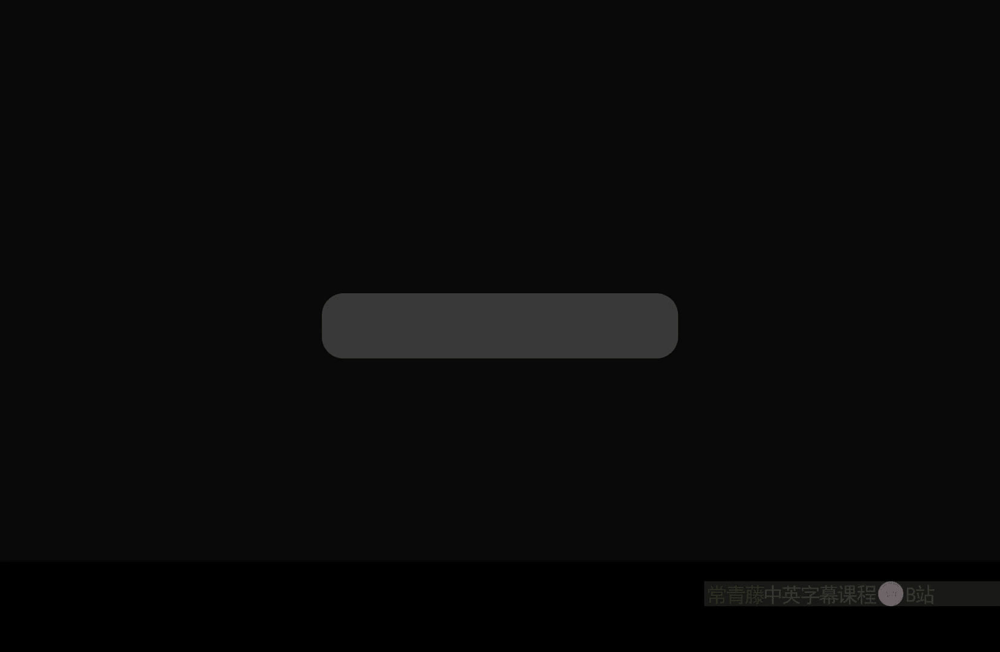
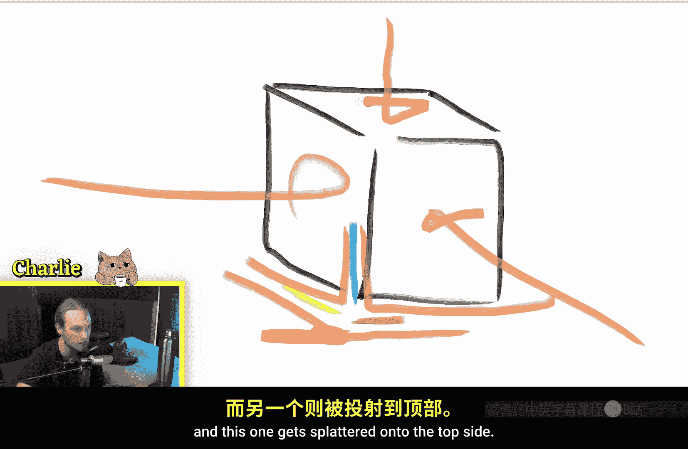
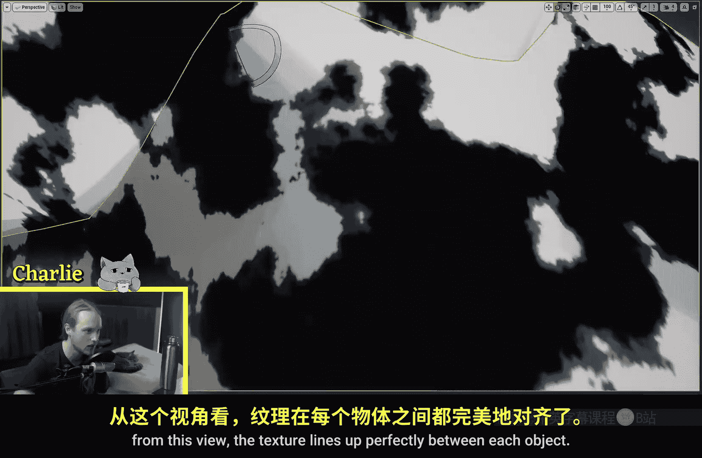
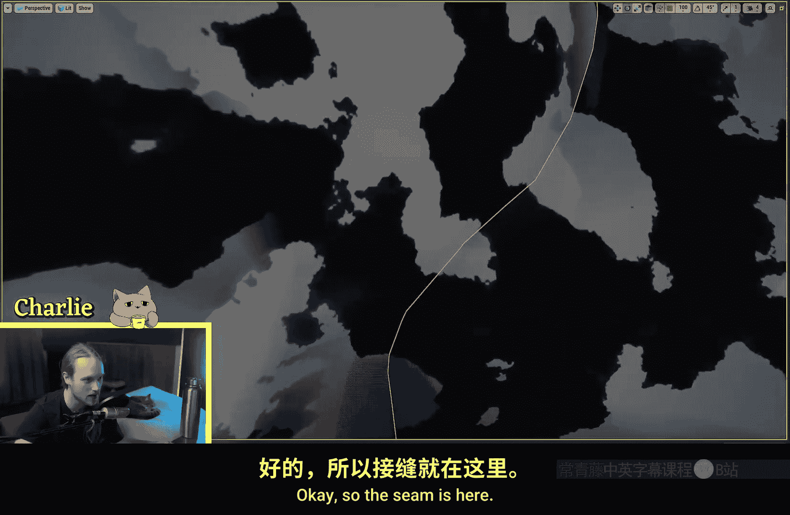

# 012：世界对齐纹理 🌍



在本节课中，我们将学习虚幻引擎材质编辑器中的一个强大功能：**世界对齐纹理**节点。我们将了解它的工作原理、核心参数以及实际应用场景。

---

## 概述

世界对齐纹理是一种材质函数，它允许纹理基于物体的世界坐标和顶点法线进行投影，而不是传统的UV坐标。这使得多个物体可以无缝共享同一纹理，无需复杂的UV展开工作。

---

## 世界对齐纹理节点解析

上一节我们概述了世界对齐纹理的概念。本节中，我们来看看这个节点的具体构成和工作原理。



世界对齐纹理节点本质上是一个材质函数。它接收一个**纹理对象**作为输入，而不是一个普通的纹理采样节点。这是因为该节点内部会为我们执行纹理采样。

它的核心功能是进行**三平面投影**。以下是其工作原理的分解：

1.  **基于世界坐标投影**：该节点使用物体的**绝对世界位置**，将同一纹理分别投影到三个坐标平面上（XY, XZ, YZ）。
2.  **基于法线混合**：为了将三个投影的纹理平滑地混合到物体表面，它使用了**世界空间顶点法线**。法线用于创建遮罩，决定在表面的每个点上应该显示哪个（或哪几个）投影的纹理。
3.  **混合与过渡**：通过调整“投影过渡对比度”参数，可以控制不同投影纹理之间混合区域的软硬程度。

简单来说，其内部逻辑类似于以下伪代码流程：
```
纹理颜色 = 混合(
    投影到XY平面的纹理,
    投影到XZ平面的纹理,
    投影到YZ平面的纹理,
    使用[世界空间顶点法线]创建的混合权重
)
```

---

## 参数详解

了解了基本原理后，我们来看看该节点提供的各个参数，以便进行自定义控制。

以下是主要参数及其作用：

*   **纹理对象**：需要被投影的纹理资源。
*   **纹理尺寸**：一个三维向量，用于控制纹理在世界空间中的缩放比例。例如，`(500,500,500)` 会使纹理图案变大。如果输入单个标量值，则三轴统一缩放。
*   **世界位置**：一个三维向量偏移量，用于整体移动纹理投影在世界空间中的位置。例如，在Y轴（绿色通道）上增加40，会使纹理沿Y方向移动40个单位。
*   **投影过渡对比度**：控制不同投影面之间过渡区域的清晰度。值越低，过渡越平滑、模糊；值越高，过渡越生硬，分界线越明显。
*   **世界空间法线**：允许覆盖用于混合的默认法线输入，可用于实现特殊效果。
*   **输出浮点B**：一个布尔值，切换是否输出包含Alpha通道的四维向量。

---

## 优势与应用场景

我们已经掌握了节点的使用方法，那么它在实际项目中有什么好处呢？

世界对齐纹理的核心优势在于**无需依赖UV**。这为以下场景提供了极大便利：

*   **自然环境物体**：如岩石、悬崖、地形。你可以将多个不同形状的岩石模型随意拼接，它们的纹理会自动对齐，形成无缝的表面。
*   **程序化生成内容**：在动态生成或摆放物体时，无需担心每个物体的UV问题。
*   **概念设计与原型**：快速为模型赋予纹理，无需进入3D建模软件进行UV展开。

**重要限制**：由于纹理是基于世界坐标固定的，此技术**不适用于会移动的物体**（如角色骨骼网格体）。物体移动时，纹理会停留在世界原地，导致视觉效果错误。



---



## 相关节点扩展

除了世界对齐纹理节点，虚幻引擎还提供了其他类似功能的节点，用于处理不同类型的贴图。

以下是其他常用的世界对齐节点：

*   **WorldAlignedNormal**：专门用于处理法线贴图，确保法线信息在不同投影面上也能正确转换方向。
*   **WorldAlignedBlend** 与 **WorldAlignedReflection**：用于混合纹理或处理反射，原理相似。

这些节点功能各异，但底层都基于相同的三平面投影和世界空间法线混合逻辑。

---

## 总结


本节课中我们一起学习了**世界对齐纹理**。我们了解到它是一个通过**世界坐标**和**顶点法线**进行**三平面投影**的材质函数。它通过`纹理尺寸`、`世界位置偏移`和`投影过渡对比度`等参数进行控制。其最大优点是**免去了UV展开的麻烦**，特别适合静态的自然场景物体，如岩石和地形，但**不适用于会移动的物体**。掌握这个节点能为你的材质制作工具箱增添一个非常实用的技巧。