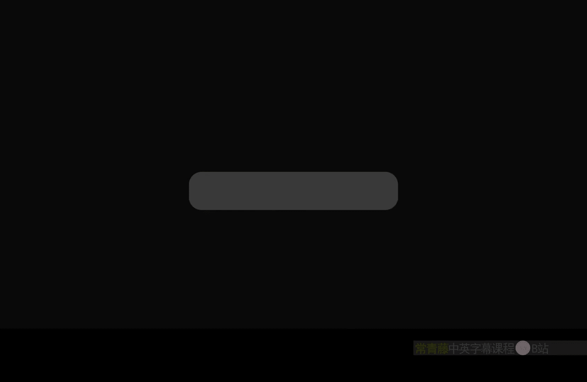
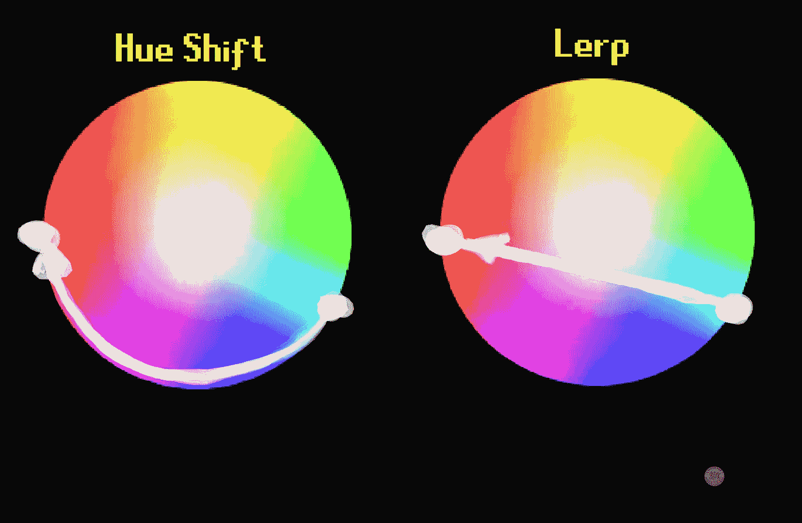

# 013：色调偏移节点 🎨



在本节课中，我们将学习虚幻引擎材质编辑器中的“色调偏移”节点。这个节点可以改变输入颜色的色调，为你的材质效果增添丰富的色彩变化。

## 概述

色调偏移节点用于调整颜色的色调值。其核心功能是接收一个颜色输入和一个百分比参数，然后沿着色轮循环移动该颜色的色调。

## 节点功能详解

上一节我们介绍了节点的基本概念，本节中我们来看看它的具体工作原理和输入输出。

该节点有两个输入端口：
*   **纹理/颜色**：这是你想要调整色调的基础颜色或纹理。
*   **色调偏移百分比**：这是一个从0到1的浮点值，用于控制色调偏移的程度。公式上，`百分比 * 360°` 决定了色调在色轮上旋转的角度。

当你滑动“色调偏移百分比”的值时，可以看到输入颜色会循环遍历色轮上的所有颜色。当值回到1时，颜色也会回到起始点。

## 创建动态色调变化

静态的色调偏移很有用，但结合其他节点可以创造出动态效果。接下来，我们看看如何实现自动循环的色彩变化。

我们可以连接一个“时间”节点来驱动色调的持续变化。由于“时间”输出是持续增大的值，而色调偏移参数需要在0到1之间循环，因此需要一些处理。

以下是实现持续循环色调变化的代码示例：
```
时间 -> 正弦 -> (+1) -> (/2) -> 色调偏移百分比
```
这个流程将“时间”的线性增长转换为-1到1的正弦波，然后通过加1和除以2，将其映射到0到1的范围，从而产生平滑往复的色调变化。



如果希望色调单向、连续地循环所有颜色，则可以直接将“时间”节点连接到“色调偏移百分比”。因为该参数会自动处理溢出，输入值2、1、0或-1的效果是相同的。

## 控制色调变化的范围与方向

有时我们不需要剧烈的全色轮变化，而是希望色彩在特定范围内微妙地波动。本节将学习如何精细控制色调变化的幅度和方向。

通过调整输入到“色调偏移百分比”的数值范围，可以控制色调变化的剧烈程度。

以下是几种控制方式的示例：
*   **小范围波动**：将经过处理的信号（如上述正弦波）除以一个较大的数（例如10、25）。这会使色调仅在红色及其邻近色（如黄色、绿色）之间轻微变化。
*   **改变变化方向**：使用负值除数（例如-25）。这会使色调变化方向反转，例如从红色向蓝色或紫色方向偏移。
*   **极其微妙的变化**：除以一个非常大的数（例如100），可以实现几乎难以察觉的、非常精致的色彩偏移。

## 实用案例：基于世界位置的色彩变化

理论知识需要结合实际应用。让我们看一个更复杂的例子：如何根据物体在世界中的位置来驱动色调变化。

我们可以利用物体的世界坐标来创造空间上的色彩渐变。例如，使用世界位置的某个分量（如B通道）作为蒙版。

实现思路如下：
1.  获取“世界位置”节点。
2.  提取或处理其中一个通道（例如，用作高度或水平坐标）。
3.  对该值进行缩放（除以一个数）和偏移处理，使其范围合适。
4.  将其输入到“正弦”节点，生成波形。
5.  最后将处理后的波形信号输入到“色调偏移百分比”。

通过调整缩放系数，可以控制色彩变化的频率和明显程度。使用负值则可以改变色彩渐变的方向（例如从红色渐变为紫色）。这种方法可以为大型物体（如地形、植被群）添加基于位置的、非重复的色彩变化，增强视觉丰富度。

## 核心优势：避免颜色混合时的灰度化

色调偏移节点有一个显著优势，尤其在混合两种颜色时。本节将探讨这一优势及其应用场景。

在传统的线性插值中，混合两种对比色（如橙色和蓝色）时，中间过渡区域很容易变成不美观的灰色。

色调偏移提供了更艺术的解决方案。其策略是：
1.  选取起始颜色A和结束颜色B。
2.  对其中一个颜色（例如颜色A）进行小幅度的色调偏移（例如10%），得到一个新的中间色C。
3.  使用一个**三色渐变**节点，将颜色A、中间色C、颜色B进行插值。

这样，过渡色会沿着色轮路径平滑变化，在A和B之间经过紫色、粉色等丰富的中间色调，从而避免产生灰暗的过渡区，创造出更生动、悦目的色彩渐变效果。这个技巧在天空、雾效、植被着色等需要自然色彩过渡的场景中非常有用。

## 总结

本节课中我们一起学习了“色调偏移”节点的核心功能与应用。
*   它通过**色调偏移百分比**参数，沿色轮循环改变输入颜色的色调。
*   结合**时间**、**正弦**、**世界位置**等节点，可以创建动态或基于空间坐标的色彩变化。
*   通过缩放输入值，可以精确控制色调变化的幅度与方向。
*   它的一个重要优势是能在颜色混合时提供更丰富、更艺术的过渡色，避免线性插值可能产生的灰度问题。


掌握这个节点，你就能为材质添加复杂而可控的色彩变化，提升场景的视觉表现力。