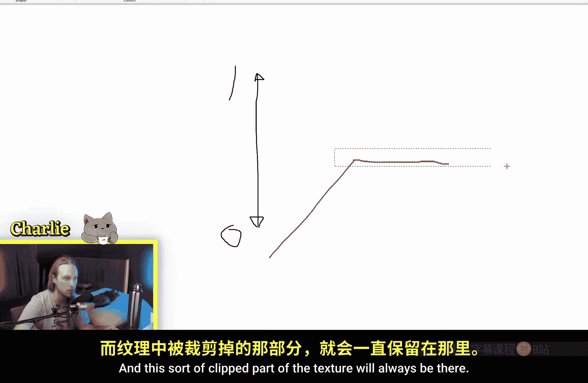

# 014：钳制节点 🎛️

在本节课中，我们将学习虚幻引擎材质编辑器中的**钳制**节点。这个节点用于限制输入值的范围，是控制材质数值、确保其不超出预期边界的重要工具。

## 节点功能解析

**钳制**节点的核心功能是为输入值设置一个允许的范围。任何低于**最小值**的输入都会被提升到最小值，任何高于**最大值**的输入都会被降低到最大值。

其行为可以用一个简单的公式来描述：
`输出值 = clamp(输入值, 最小值, 最大值)`
这意味着：如果 `输入值 < 最小值`，则 `输出值 = 最小值`；如果 `输入值 > 最大值`，则 `输出值 = 最大值`；否则 `输出值 = 输入值`。

## 基础操作演示

让我们通过一个实例来观察它的效果。这里有一个云朵纹理应用在我们的球形立方体上。

如果直接将纹理连接到钳制节点，默认的**最小值**和**最大值**分别为0和1，此时输出看起来没有任何变化。这是因为纹理的灰度值本身就在0到1的范围内。

当我们调整参数时，效果就显现出来了。

以下是调整参数的具体影响：
*   如果将**最小值**从0提高到0.25，可以看到纹理中较暗的部分（接近黑色的区域）开始变亮。节点将所有低于0.25的值都限制为0.25。
*   如果将**最大值**从1降低到0.75，则纹理中较亮的部分（接近白色的区域）会变暗。节点将所有高于0.75的值都限制为0.75。

## 核心应用场景

这个节点有很多实用功能，一个典型的应用场景是配合**线性插值**节点使用。

假设我们正在使用Lerp节点混合两种颜色：一种淡紫色和一种淡蓝色。我们使用上述云纹理（或许乘以一个系数如3）作为Lerp的Alpha通道。如果Alpha值没有被限制，可能会得到超出预期的混合结果，例如出现我们不想要的棕色。

如果在将纹理输入Lerp之前，先通过一个钳制（0到1）节点，就能“驯服”这些超出范围的值。这样，Lerp就只会在我们指定的两个颜色之间进行**插值**，而不会进行**外推**，从而得到可控、预期的颜色过渡。

## 特殊用法与优化

当需要将值限制在0到1之间时，除了使用钳制节点，还可以使用**饱和**节点。这两个节点的功能在此情况下是完全相同的。

根据工具提示，在现代图形硬件上，Saturate节点通常是“免费”的（性能开销极低）。不过，在材质编译时，一个设置为0到1的Clamp节点很可能也会被优化成相同的指令，因此无需过分纠结选择哪一个。

## 深入理解：图形化视角

为了更直观地理解，让我们用图形来思考。假设我们有一个值的变化曲线，在0到1之间波动。

如果我们将**最大值**钳制在0.5，那么曲线在0.5以上的部分就会被“削平”，变成一条水平的直线。这个被截断的部分会一直保持，之后我们可以对这个结果进行其他数学操作，例如加上0.25或乘以1.5，但最初被“裁剪”掉的高光信息将无法恢复。

这引出了一个重要概念：在材质中，诸如**基础颜色**等通道最终输出时，其值会被自动截断到0-1范围。但钳制节点允许我们在计算流程的**中间阶段**就进行限制，这为创造特定的视觉效果提供了更多控制权。

## 总结

本节课我们一起学习了**钳制**节点的原理与应用。我们了解到它通过设置最小值和最大值来限制输入范围，是确保数值稳定、防止意外外推的关键工具。它在控制Lerp混合、管理亮度标量值等方面尤为有用。掌握这个节点，并尝试在材质图表中实验其效果，将帮助你构建出更精确、更可控的材质效果。