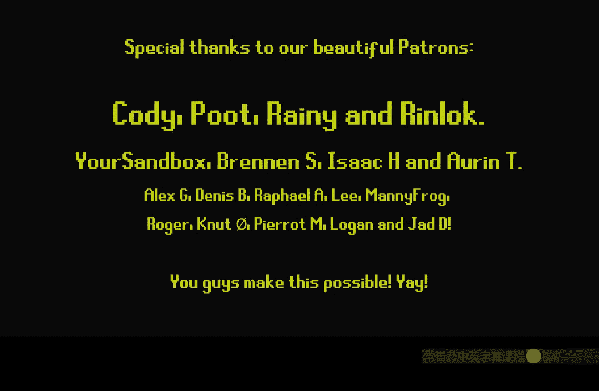
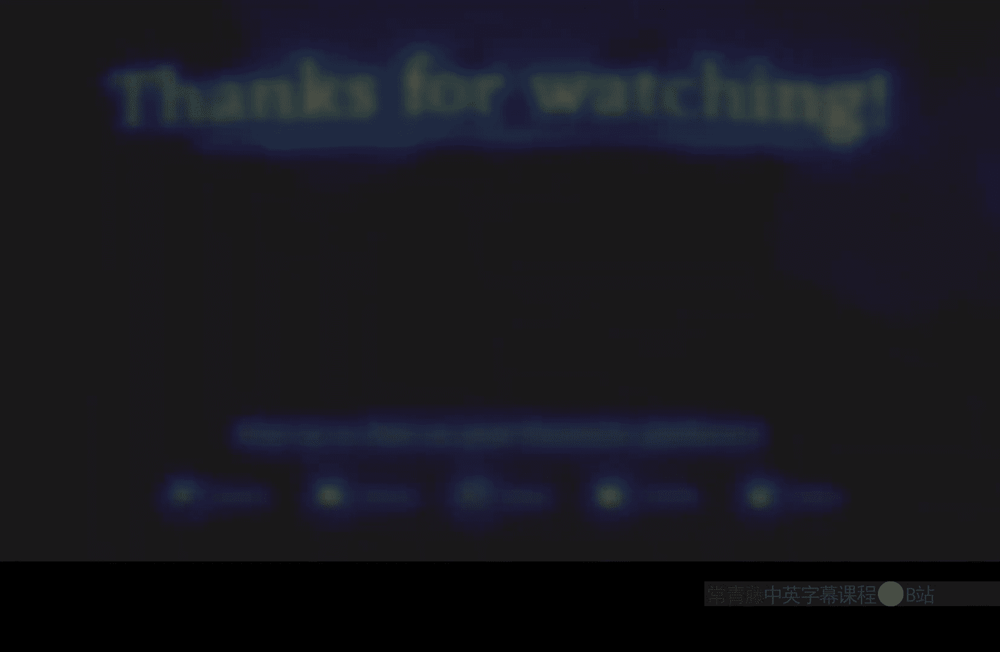

# 015：纹理变化节点

在本节课中，我们将学习虚幻引擎材质编辑器中的一个强大节点——**纹理变化节点**。这个节点能够自动为你的纹理生成随机的旋转、缩放和平移变化，从而打破重复感，让材质看起来更加自然。

## 概述

纹理变化节点通过巧妙地扭曲UV坐标，为采样纹理引入随机性。它特别适用于地形材质或任何需要避免明显重复图案的场景。本节我们将了解其核心输入、输出以及如何配置参数以达到理想效果。

## 核心节点设置

上一节我们介绍了如何通过世界坐标控制纹理平铺。本节中我们来看看如何在此基础上添加随机变化。

首先，我们需要准备基础的UV坐标。这里使用世界位置的X和Y分量（RG通道），并除以一个数值来控制单个纹理贴图的大小。例如，除以500意味着每500个单位平铺一次纹理。

```cpp
// 基础UV计算示例（非实际节点连线，仅为逻辑说明）
UVs = WorldPosition.xy / 500;
```

接下来，引入**纹理变化**节点。该节点需要一个高度图（或置换图）作为输入来指导变化混合。我们将使用一个纹理对象，并指定其Alpha通道作为高度信息。

以下是配置纹理变化节点的关键步骤：

1.  **UVs**：输入我们刚才计算好的基础UV坐标。
2.  **Height Map**：连接一个包含高度信息的纹理对象。需要指定正确的通道（例如，Alpha通道）。
3.  **Mask Channel**：如果高度图在Alpha通道，则此处填入`3`（对应Alpha）。
4.  **Height Map Influence**：控制高度图对变化混合的影响强度。可以连接一个标量参数，默认设为`1`。
5.  **Variation Levels**：决定有多少种不同的变化层级。默认值`6`通常效果不错。
6.  **Variation Scale**：控制每个变化“区块”的大小。值越小，区块越密集。
7.  **Use Dither**：一个布尔值，启用后会在变化交界处进行平滑的抖动过渡，消除硬边。
8.  **Random Rotation and Scale**：布尔值，启用随机旋转和缩放。这是该节点的核心功能。
9.  **HQ Edge Comparison**：布尔值，启用高质量的边缘比较，可能改善高度图混合效果，需根据实际纹理测试。

配置完成后，该节点会输出一组**扭曲后的UV坐标**。我们将这组新的UV坐标连接到任何你想要应用随机变化的纹理采样节点的UV输入口。

## 参数详解与效果调整

现在节点已经设置好，我们可以通过调整参数来观察它们对最终效果的影响。

以下是各个参数的作用说明：

*   **Variation Scale**：此参数控制每个独立变化区域的大小。值越小，屏幕上出现的不同旋转方向的“补丁”就越小、越密集。
*   **Variation Levels**：此参数决定存在多少种不同的变化层级。值为`1`时，只有原始方向和另一种偏移方向（如45度）两种变化。值越高，出现的随机角度种类就越多。
*   **Height Map Influence**：此参数控制高度图对变化混合的影响程度。设为`0`时，高度图不起作用，变化完全随机混合。提高此值，变化会更倾向于遵循高度图定义的图案（如砖缝）进行过渡，减少不自然的混合。
*   **Use Dither**：此布尔参数启用抖动过渡。禁用后，不同变化区域之间会出现明显的锐利接缝。启用后，接缝会被平滑的噪点图案替代，视觉效果更佳，但计算开销稍大。
*   **Random Rotation and Scale**：此布尔参数启用随机的旋转和缩放变化。如果关闭，节点将只对纹理进行随机的平移和轻微的平铺变化。
*   **HQ Edge Comparison**：此布尔参数尝试提供更高质量的高度图边缘比较。其效果因纹理而异，建议通过实际对比（开启/关闭）来为你的特定纹理选择最佳效果。

## 总结





本节课中我们一起学习了**纹理变化节点**的使用方法。这个节点是一个功能强大的工具，它通过输出一组扭曲的UV坐标，能够高效地为材质纹理添加丰富的随机变化，有效解决纹理重复带来的不自然感。你只需提供一个高度图来引导混合，并调整几个直观的参数，即可快速获得看起来更有机、更复杂的材质表面。记住，对于不同的纹理类型（如砖墙、泥土、岩石），可能需要微调`Height Map Influence`和`Variation Levels`等参数来达到最佳效果。