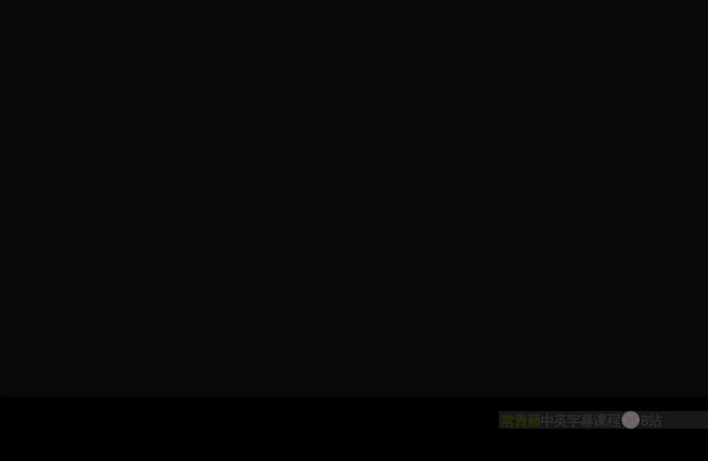
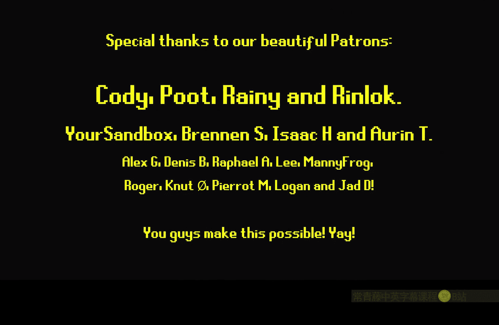

# 016：凹凸偏移节点 🧱

在本节课中，我们将学习虚幻引擎材质编辑器中的一个实用节点：**凹凸偏移**。我们将了解它的工作原理、两种主要用途，并通过实例演示如何用它来为材质增添深度感。

## 概述

凹凸偏移节点是**在不透明材质中模拟深度最经济的方法**。它通过根据视角偏移材质的UV坐标来产生视差效果，从而让平坦的表面看起来具有凹凸感或层次感。本节我们将探索其两种应用方式：混合多层纹理，以及配合高度图使用。

## 核心节点：Bump Offset

**Bump Offset** 节点的核心功能是依据一个**高度值**来偏移UV坐标。其基本输入如下：
*   **Height**：输入一个标量值（单个通道）或纹理，用于控制偏移的强度。值越高，模拟的“深度”越大。
*   **Coordinate**：输入需要被偏移的UV坐标。
*   **Height Ratio**：一个乘数，用于整体缩放高度值的影响。默认值为0.5。

它的输出是经过偏移后的新UV坐标，可以连接到纹理采样节点的UV输入。

## 应用一：创建纹理层间视差

上一节我们介绍了节点的基本构成，本节中我们来看看如何用它混合两个纹理，制造出前后层次感。

我们可以利用凹凸偏移让一个纹理看起来在另一个纹理的“下方”。以下是实现步骤：

1.  **准备纹理与UV**：获取两个纹理（例如一个网格纹理）。将它们采样并除以一个值（如500）来控制平铺大小。
2.  **应用凹凸偏移**：将其中一个纹理的UV坐标传入 **Bump Offset** 节点。调整 **Height** 参数，你会看到该纹理产生了视差移动。
3.  **混合纹理**：将偏移后的纹理调暗（例如乘以0.5），然后与未偏移的原始纹理使用 **Max** 节点混合。**Max** 节点会选取两个输入值中较大的一个，从而让较亮的区域（未偏移的顶层纹理）显示在上方。
4.  **观察效果**：随着视角移动，两层纹理之间会产生视差，模拟出简单的深度效果。

> **注意**：**Height Ratio** 的默认值是0.5，这可能导致初始效果过强。你可以创建一个标量参数来控制它，方便调节。

## 应用二：配合高度图增强材质

除了混合纹理，凹凸偏移节点的设计初衷是与**高度图**配合使用，为单张材质添加真实的表面凹凸视差。

以下是具体操作方法：

1.  **使用高度图**：选取一个带有高度信息（通常存储在Alpha通道）的砖墙纹理。将高度信息连接到 **Bump Offset** 节点的 **Height** 输入。
2.  **偏移基础颜色**：将同一纹理的RGB（基础颜色）通道采样节点的UV输入，连接到 **Bump Offset** 节点的输出上。
3.  **观察效果**：此时，砖墙的缝隙和凹凸处会根据视角产生偏移，极大地增强了立体感。与未使用凹凸偏移的平坦纹理对比，效果非常明显。
4.  **增强法线**：为了效果更逼真，你还可以获取匹配的法线贴图，并对其UV应用**相同的**凹凸偏移，然后将结果连接到材质的法线输入。这样，光照与视差效果将完美同步。

> **提示**：这种效果在视角平缓时非常逼真，但在极端掠射角度下可能会穿帮。因此，最好** subtly**（微妙地）使用它。

## 创意用例与总结

在游戏《Mortal Shell》中，开发者巧妙地使用凹凸偏移来表现冰层下的漂浮灵魂。当玩家移动时，冰面与灵魂之间产生的视差，极大地增强了场景的层次感和体积感。

本节课中我们一起学习了 **Bump Offset** 节点的强大功能。总结如下：
*   **功能**：它根据物体表面法线和视角，为应用的纹理创建视差效果。
*   **用途一**：可以在叠加或混合的多个纹理之间制造深度错觉。
*   **用途二**（主要用途）：配合高度图使用，能以极低的性能成本为材质增加令人信服的体积感和凹凸细节。

它是一种在游戏材质中实现低成本深度和体积感的优秀工具。