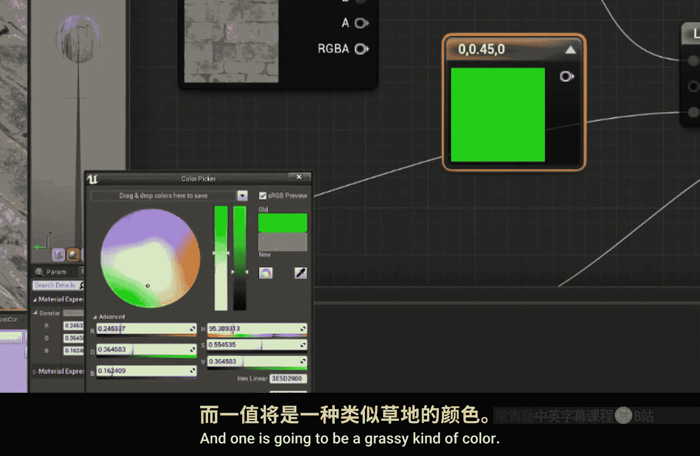
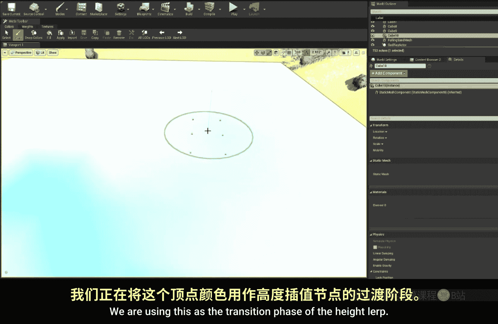

# 017：高度插值节点 🧱

在本节课中，我们将学习虚幻引擎材质编辑器中的 **高度插值** 节点。这个节点能帮助我们基于一张高度图，在两个纹理之间实现自然的混合过渡，尤其适用于制作如岩石上生长苔藓或积雪覆盖等效果。

---

## 节点功能概述

**高度插值** 节点的核心功能是生成一个用于线性插值的 **Alpha蒙版**。它根据输入的 **高度纹理** 和 **过渡相位** 值，决定如何混合两个纹理。其特点是会优先混合高度图中较低的区域，再逐渐过渡到较高的区域，从而实现更符合物理直觉的混合效果。

## 实践应用：制作岩石苔藓效果

上一节我们介绍了节点的基本概念，本节中我们来看看如何用它来制作一个具体的案例：在岩石纹理上绘制苔藓。

### 1. 设置基础材质网络

首先，我们需要准备基础材质网络。我们将使用一个砖墙纹理作为基底（A），一个草地纹理作为覆盖层（B）。

以下是设置高度插值节点的步骤：

1.  获取一张高度纹理（例如砖墙图案的Alpha通道），并将其连接到 **高度插值** 节点的 `Height Texture` 输入。
2.  将一个用于控制过渡的变量（例如一个标量参数或顶点颜色）连接到节点的 `Transition Phase` 输入。
3.  暂时将 `Contrast` 参数设置为2。

此时，高度插值节点会输出一个Alpha值，该值由高度图和过渡相位共同决定。

### 2. 混合颜色与法线

接下来，我们利用上一步生成的Alpha值，来同步混合颜色纹理和法线纹理。

*   **混合颜色**：使用 **线性插值** 节点。将砖墙颜色纹理连接到 `A`，草地颜色纹理连接到 `B`，将高度插值节点输出的Alpha值连接到 `Alpha`。
*   **混合法线**：同样使用另一个 **线性插值** 节点。将砖墙法线贴图连接到 `A`，草地的法线贴图连接到 `B`，并使用**同一个**Alpha值进行控制。

这样，颜色和法线的变化就能保持同步，确保视觉效果一致。

### 3. 调试与反转

在测试时，你可能会发现混合方向与预期相反。这时需要使用 **OneMinus** 节点对Alpha值进行反转。

`OneMinus` 节点的公式是：`输出 = 1 - 输入`

将高度插值输出的Alpha值先通过 `OneMinus` 节点，再送入线性插值节点，即可纠正混合方向。

### 4. 使用顶点色动态绘制

为了能实时在模型上绘制苔藓，我们将 `Transition Phase` 的输入从参数改为模型的 **顶点颜色**（例如红色通道）。

1.  在材质中，将顶点颜色节点（或特定通道）连接到高度插值节点的 `Transition Phase`。
2.  在编辑器中使用 **网格体绘制模式**。
3.  选择绘制颜色（例如红色），在模型上绘制。绘制过的地方，会根据高度图信息，从砖缝开始逐渐显现出苔藓纹理。

你可以通过设置不同的绘制颜色值（如0.5），来控制混合停留在某个中间状态，实现更精细的控制。

## 其他应用场景

高度插值节点用途广泛，以下是一些例子：

*   **积雪效果**：让积雪先填充岩石的裂缝和凹陷处。
*   **熔岩冷却**：让熔岩先从岩石的尖端开始凝固。
*   **地形混合**：如果使用与地形相同的纹理和UV坐标，可以实现材质与地形的无缝混合。

## 总结

本节课中我们一起学习了 **高度插值** 节点。它的核心作用是**依据高度图生成混合蒙版，优先混合低洼区域**。我们通过一个“岩石生苔”的案例，完整实践了如何用它来混合颜色与法线贴图，并最终结合顶点着色实现动态绘制。这个节点是创建复杂、自然表面混合效果的重要工具。