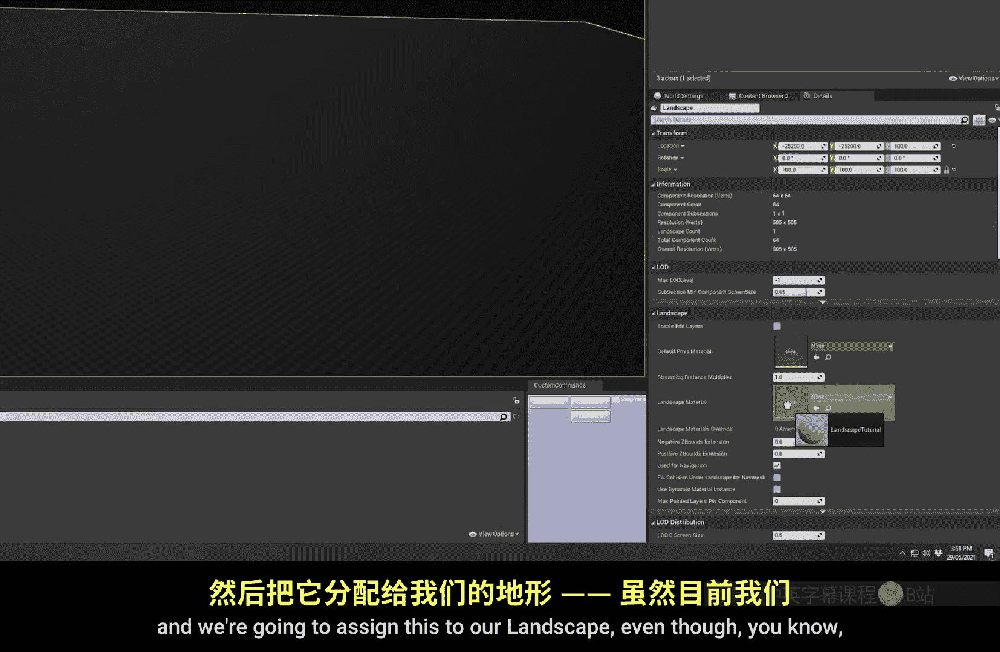
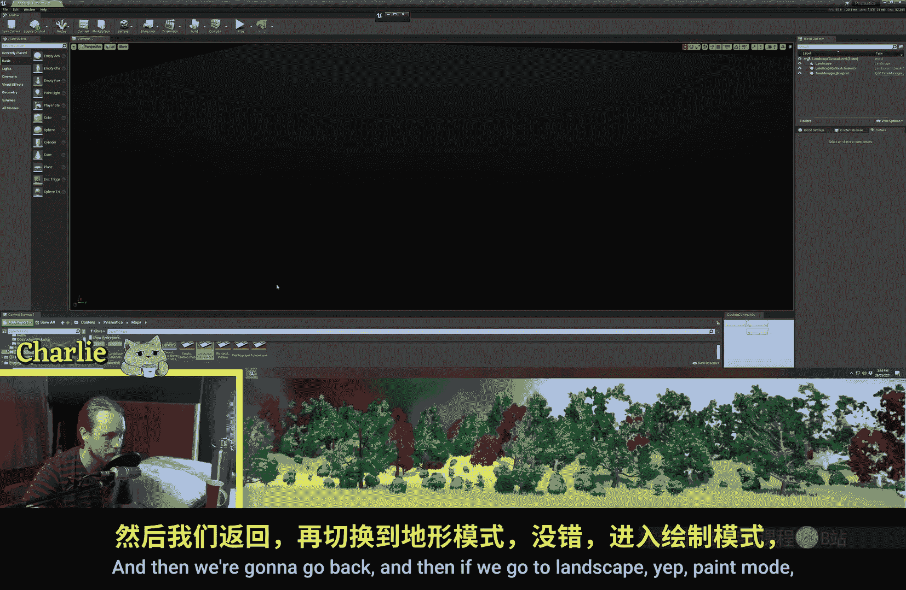
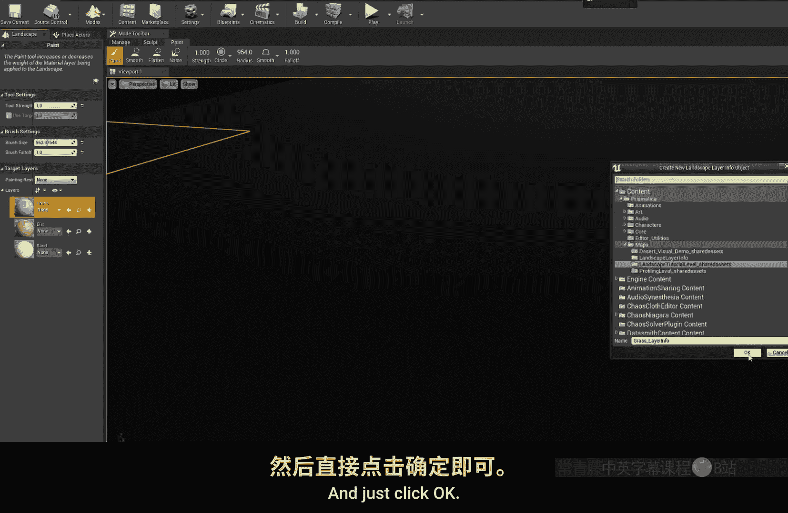
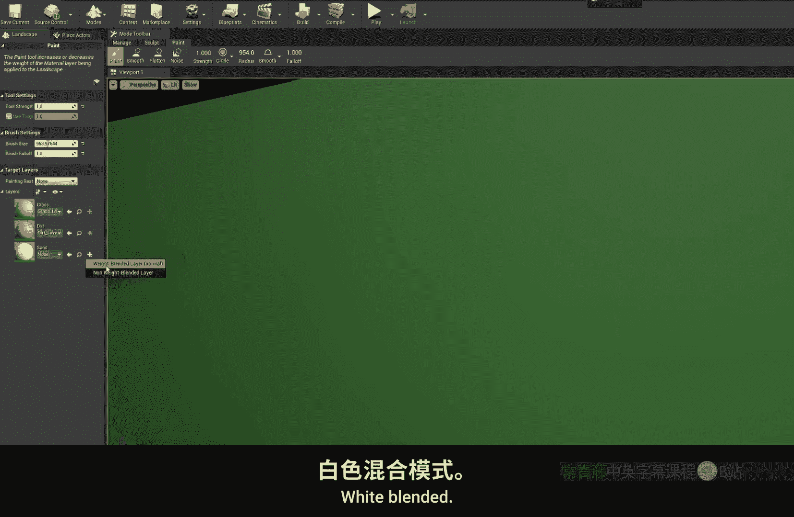
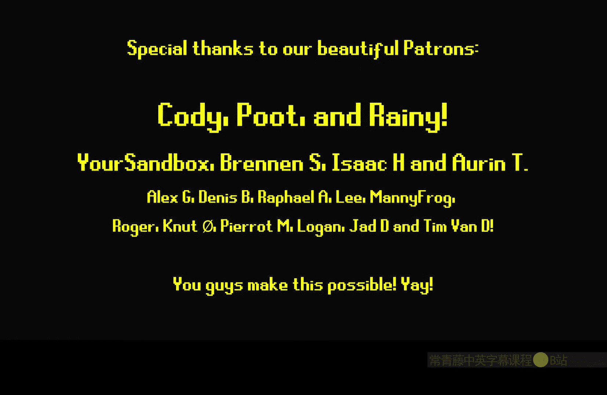

# 018：地形材质基础

在本节课中，我们将学习如何在虚幻引擎中创建和使用地形材质。我们将从创建一个基础地形开始，逐步介绍如何设置地形材质、使用层混合节点，并解释不同的混合类型及其应用场景。

---

## 创建地形

上一节我们介绍了课程概述，本节中我们来看看如何创建一个基础地形。

进入“模式”面板，选择“地形”模式。如果你的关卡中还没有地形，系统会弹出一个设置窗口。

以下是可配置的选项：
*   **尺寸**：决定地形的整体大小。
*   **分辨率**：决定地形网格的细分程度。

本教程中，我们将保持默认设置，点击“创建”按钮。现在，场景中就有了一个基础地形。

---

## 创建并分配地形材质

创建好地形后，我们需要为其指定一个材质。切换回“选择”模式，在“细节”面板中可以看到地形需要一个“地形材质”。

接下来，我们将创建一个新的材质。
1.  在内容浏览器中右键，选择“材质”。
2.  将其命名为“Landscape_Material”。
3.  将这个新材质拖拽到地形“细节”面板的“地形材质”插槽中。

即使材质目前是空的，我们也可以先完成分配。

---

## 地形材质图与层混合

地形材质与普通材质类似，但其核心是能够使用**地形层混合**节点。这个节点功能强大，允许材质对不同图层进行采样和混合。

在材质编辑器中，找到“地形”分类下的 **`LandscapeLayerBlend`** 节点，并将其放入图表。

在“层混合”节点的细节面板中，点击“新建层”来创建图层。我们将创建三个图层：
*   **Grass** (草地)
*   **Dirt** (泥土)
*   **Sand** (沙子)

为了快速演示，我们为每个图层连接一个纯色常量（例如，绿色、棕色、黄色）到“基础颜色”输入，然后保存材质。

---

## 在地形上绘制图层

保存材质后，返回地形绘制模式。你可能需要重新加载地图或重启编辑器，图层列表才会出现。

在绘制图层前，需要为每个图层创建“层信息”资产。系统会提示你创建“权重混合层”资产，点击确定即可。

创建完成后，你就可以选择不同的图层（草地、泥土、沙子）在地形上进行绘制了。这是地形材质的基础：一个可以绘制不同表面的材质。

使用地形材质的一个主要性能优势是，每个材质图层的指令**只会在实际使用了该图层的区块上运行**。例如，一个昂贵的水洼交互效果层，只会影响绘制了该层的区域，而不会影响纯草地区域。

---

## 添加法线贴图与混合类型

接下来，我们将为每个图层添加更多细节。我们将使用“顶部投影”方式为每个图层添加法线贴图。

以下是操作步骤：
1.  为每个图层准备对应的法线贴图纹理。
2.  在材质图中，使用 **`TextureSample`** 节点采样这些法线贴图。
3.  将每个法线贴图连接到`LandscapeLayerBlend`节点对应图层的“法线”输入插槽。
4.  保存材质后，地形表面将呈现出相应的纹理细节。

现在，我们来探讨`LandscapeLayerBlend`节点中不同的**混合类型**，这对于创建复杂地形至关重要。

**权重混合**：这是默认类型。其特点是，**所有图层的权重总和在任何地方都等于1**。在多个图层交界处，它们会按比例混合（例如，各占33%）。擦除一个图层时，可能会露出意料之外的底层，因为系统不“记得”被覆盖的原始图层是什么。

**Alpha混合**：此类型为图层提供**独立的不透明度（Alpha）通道**。图层的显示与否完全由其自身的Alpha值控制，不会影响底层数据。这非常适合制作像积雪这样的效果，当“积雪”被移除时，可以完美露出下面原本的地形。

**高度混合**：此类型在混合时会参考一张**高度图纹理**。你需要为图层额外提供一张黑白高度图。混合时，引擎会依据高度信息进行插值，从而在图层边缘创建出更复杂、更自然的过渡效果，尤其适用于在低顶点密度的地形上绘制精细路径或边缘。

---

## 总结与预告

本节课中我们一起学习了地形材质的基础知识。我们创建了地形和地形材质，使用了`LandscapeLayerBlend`节点来混合多个图层，并了解了权重混合、Alpha混合和高度混合三种类型的区别与用途。

掌握了这些基础，你就可以继续深入学习更高级的地形技术。在接下来的教程中，我们将探讨：
*   **基于坡度的自动纹理混合**：让材质根据地形坡度自动切换，例如平缓处是草地，陡峭处是岩石。
*   **程序化植被放置**：根据地形的不同图层，自动生成相应的植被，例如草地上长草，泥土层上放置岩石和灌木。

希望本教程对你有所帮助。