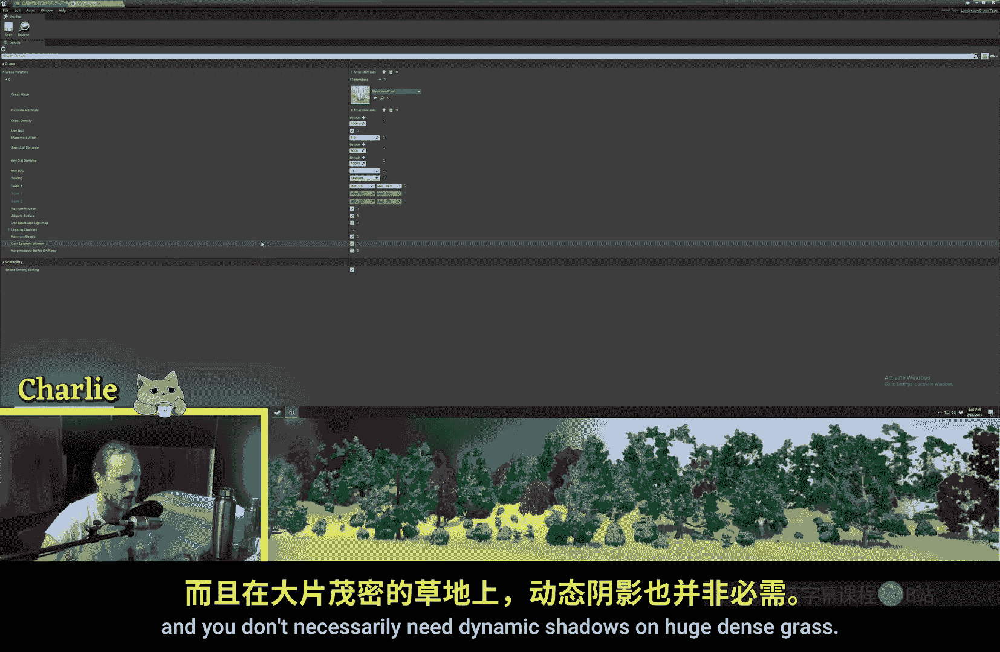
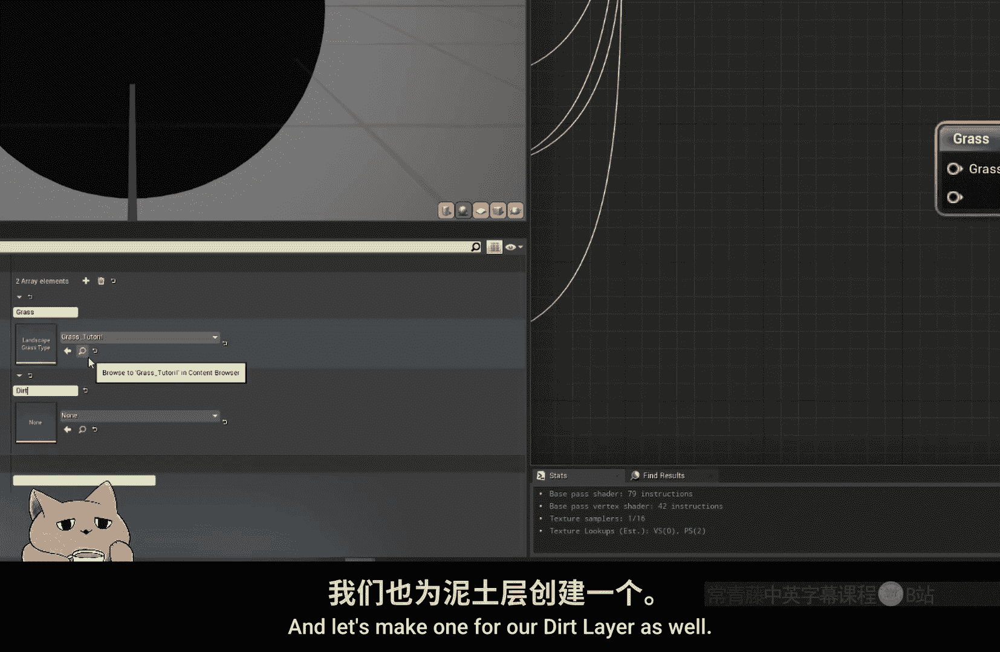
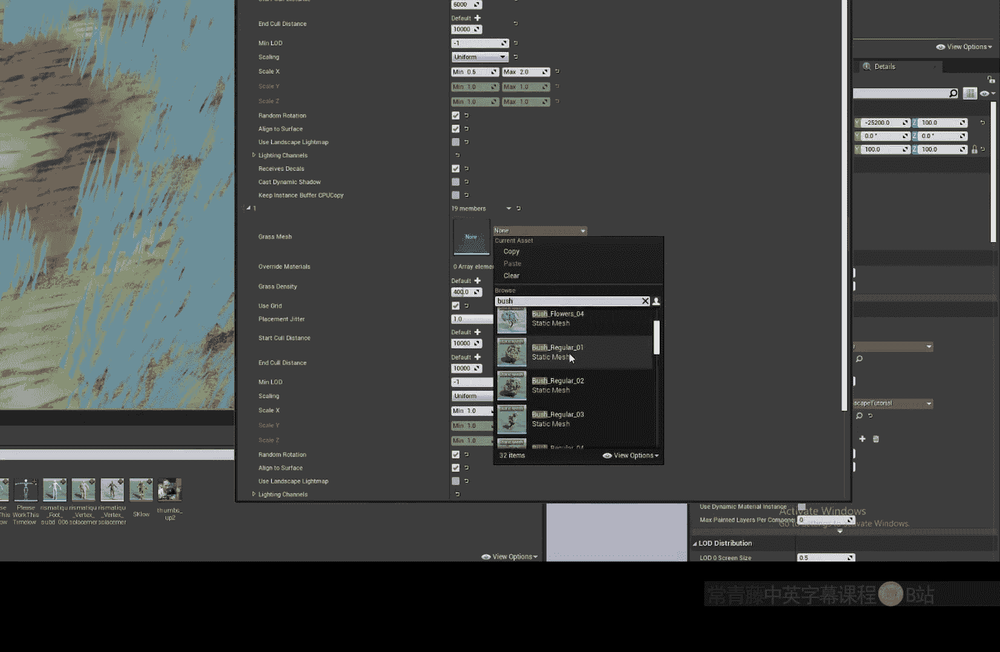

# 019：地形草地系统 🌱

在本节课中，我们将学习如何在虚幻引擎中为地形（Landscape）程序化地生成草地和其他小型植被。我们将重点介绍“景观草地类型”（Landscape Grass Type）资产和“草地输出”（Grass Output）材质节点的使用方法。

## 概述

上一节我们介绍了地形材质的基础设置。本节中，我们来看看如何根据地形图层（Layer）的绘制，自动在相应区域生成草地和灌木等植被。这种方法可以极大地节省手动放置植被的时间。

## 创建景观草地类型资产

首先，我们需要创建一个核心资产来定义要生成的植被。

1.  在内容浏览器中，右键点击，选择 **“杂项” (Miscellaneous) -> “植被” (Foliage) -> “景观草地类型” (Landscape Grass Type)**。
2.  将其命名为，例如 `Grass_Tutorial`。
3.  双击打开该资产。



## 配置草地类型属性



打开资产后，你会看到一个空白的界面。点击 **“+”** 图标可以添加一个植被元素。

以下是添加元素后需要配置的主要属性：

*   **网格体 (Meshes)**：添加你想要生成的静态网格体，例如草、小石头或灌木。
*   **密度 (Density)**：控制植被的生成密度，范围在0到1000之间。
*   **剔除距离 (Cull Distance)**：设置摄像机多远开始不渲染该植被，对性能优化至关重要。
*   **缩放 (Scaling)**：可以设置一个最小和最大缩放范围（如0.5到2），以获得大小不一的植被。
*   **随机旋转 (Random Rotation)**：通常需要开启，让植被朝向更自然。
*   **对齐到表面 (Align to Surface)**：开启后，植被会沿着地形表面的法线方向生长（例如在山坡上倾斜）；关闭则始终垂直向上。
*   **投射动态阴影 (Cast Dynamic Shadow)**：对于大片密集的草地，建议关闭此选项以提升性能。

一个基础的配置示例如下：
```cpp
// 概念性伪代码，表示在Landscape Grass Type中的设置
Density = 200;
ScalingRange = (0.5, 2.0);
bRandomRotation = true;
bAlignToSurface = true;
bCastDynamicShadow = false;
```

## 在材质中使用草地输出节点

配置好草地类型资产后，我们需要将其与地形材质关联。

1.  打开上一节创建的地形材质。
2.  在材质图表中，添加一个 **“草地输出” (Grass Output)** 节点。
3.  在节点的 **“草地类型” (Grass Type)** 插槽上，通过右键菜单或拖拽，赋予我们之前创建的 `Grass_Tutorial` 资产。
4.  要控制草地在哪些区域生长，我们需要向节点的输入引脚提供信息。这里使用 **“景观图层混合” (Landscape Layer Blend)** 节点或 **“景观图层采样” (Landscape Layer Sample)** 节点。
5.  例如，使用 `Landscape Layer Sample` 节点，并输入草地图层的名称（如“Grass”）。
6.  将此采样节点的输出连接到 `Grass Output` 节点的输入引脚。



**核心概念**：`Landscape Layer Sample` 节点输出的是一个黑白遮罩（Mask）。白色（值1）代表该图层完全覆盖的区域，黑色（值0）代表没有该图层的区域。将这个遮罩连接到 `Grass Output`，引擎就会在白色区域生成对应的植被。

连接方式如下图所示：
`Landscape Layer Sample (Layer Name: "Grass")` -> `Grass Output Node`

保存材质并应用到地形后，你就会看到草只在你绘制了“Grass”图层的区域生长。

## 为多个图层添加不同植被

你可以轻松地为不同的地形图层设置不同的植被组合。

1.  创建另一个 `Landscape Grass Type` 资产，例如 `Rocks_Bushes`。
2.  在其中添加石头和灌木的网格体。
3.  在地形材质的 `Grass Output` 节点上，可以添加多个输入。为每个输入指定不同的 `Grass Type` 资产。
4.  使用 `Landscape Layer Sample` 节点采样其他图层（如“Dirt”、“Sand”），并将其输出连接到对应的 `Grass Output` 输入引脚。
5.  你甚至可以使用 **“加法” (Add)** 节点将多个图层的采样结果合并，这样植被就会在合并后的所有图层区域生成。

例如，让石头和灌木出现在“泥土”和“沙地”上：
`Landscape Layer Sample (”Dirt”) + Landscape Layer Sample (”Sand”)` -> `Grass Output (Rocks_Bushes)`

## 注意事项与技巧

使用程序化草地系统时，需要注意以下几点：

*   **优点**：节省大量手动放置植被的时间；无需存储海量植被实例的位置数据，植被是实时程序化生成的，节省内存。
*   **限制**：通过此系统生成的植被**无法拥有碰撞体（Collision）**。因此，它仅适用于草、小花、无碰撞的灌木等装饰物。
*   **对于需要碰撞的物体**：如大树、大岩石，你需要使用引擎内置的 **“植被绘制工具” (Foliage Painting Tool)** 来手动或半自动地放置。在该工具中，你可以设置 **“包含的景观图层” (Inclusion Landscape Layers)**，使其只在特定图层上绘制，同样高效。

## 总结


本节课中，我们一起学习了虚幻引擎的地形草地系统。我们掌握了如何创建和配置 `Landscape Grass Type` 资产，如何通过材质中的 `Grass Output` 节点，根据地形的图层信息来程序化地生成植被。我们了解到这个方法非常适合用于没有碰撞的、大面积的细节植被，能显著提升场景搭建的效率。对于需要交互的大型物体，则可以结合植被绘制工具来完成。