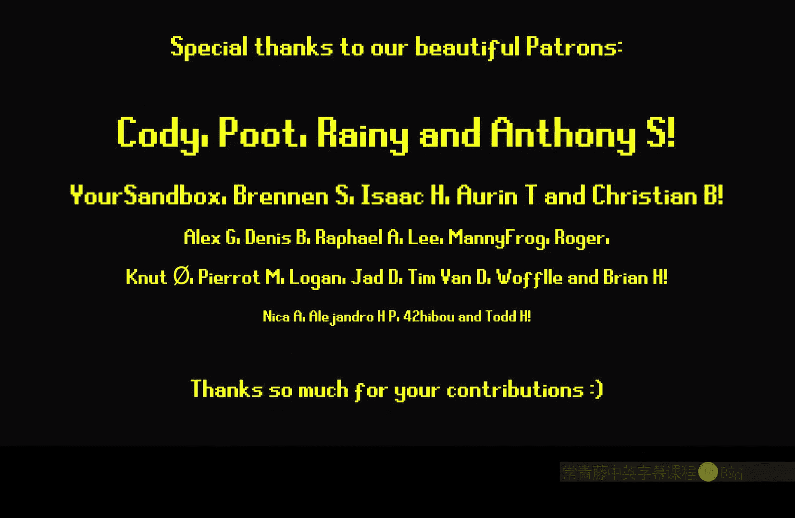

# 020：地形自动悬崖材质 🏔️

在本节课中，我们将学习如何为虚幻引擎中的地形创建自动悬崖材质。这种材质能根据地形的坡度，自动混合草地与岩石（或泥土）的纹理，使陡峭区域呈现为悬崖，平坦区域呈现为草地。我们将探讨两种实现方法，并学习如何排除斜坡上的草地。

## 概述

我们将使用以下核心节点：
*   **`HeightLerp` 函数**：基于高度图进行混合。
*   **`Vertex Normal WS` 节点**：获取顶点法线（世界空间）。
*   **`Pixel Normal WS` 节点**：获取像素法线（世界空间）。
*   **`LinearInterpolate (Lerp)` 节点**：在两个值之间进行线性插值。

## 方法一：使用法线节点计算坡度

首先，我们来看第一种方法，它主要利用顶点和像素法线信息来计算地形坡度。

以下是实现步骤：

1.  **获取法线数据**：分别将 `Vertex Normal WS` 和 `Pixel Normal WS` 节点连接到 `Add` 节点。
2.  **调整混合硬度**：在每个法线节点后连接 `Multiply` 节点，并为其创建标量参数（如 `SlopeHardness`），用于控制混合边缘的软硬程度。
3.  **钳制与合并**：将两个 `Multiply` 节点的输出分别通过 `Saturate` 节点钳制在 [0,1] 范围，然后相加。
4.  **调整输出范围**：由于两个值相加后最大为2，我们需要减去1，将其范围调整到 [0,1] 以供 `Lerp` 节点使用。公式为：`Saturate((VertexNormal * Hardness) + (PixelNormal * Hardness)) - 1`。
5.  **纹理混合**：将上一步的结果作为 `Alpha` 输入到 `Lerp` 节点。`A` 通道连接草地纹理，`B` 通道连接岩石纹理。`Lerp` 的输出连接到材质的 `Base Color`。

```cpp
// 核心计算逻辑（概念性表达）
float SlopeMask = saturate(VertexNormal * SlopeHardness) + saturate(PixelNormal * SlopeHardness);
SlopeMask = saturate(SlopeMask - 1.0);
float3 FinalColor = lerp(GrassColor, RockColor, SlopeMask);
```

创建材质实例后，你可以实时调整 `SlopeHardness` 等参数来获得理想的悬崖效果。

**注意**：此方法在混合颜色时效果很好，但**不适用于直接混合法线贴图**。因为 `Pixel Normal WS` 节点依赖当前法线贴图进行计算，如果将其输出再用于混合生成新的法线贴图，会产生反馈循环，导致材质出错。解决方法是，在混合法线贴图时，只使用来自 `Vertex Normal` 部分的计算结果。

## 方法二：使用高度图函数（HeightLerp）

上一节我们介绍了基于法线的坡度检测。本节中，我们来看看另一种更精确的方法，它利用地形的高度图信息。

这种方法使用 `HeightLerp` 材质函数（或其核心逻辑）。你需要一张高度图，通常存储在基础颜色的Alpha通道或法线贴图的某个通道中。

以下是实现步骤：

1.  **获取高度数据**：从你的纹理中采样出高度信息。
2.  **使用HeightLerp逻辑**：将高度数据、以及基于`Vertex Normal`计算出的坡度遮罩（作为过渡相位）输入到 `HeightLerp` 函数中。同时设置一个对比度参数来控制过渡的锐利程度。
3.  **进行混合**：将 `HeightLerp` 的输出同时用于颜色和法线贴图的 `Lerp` 节点。

```cpp
// HeightLerp 核心思想
float HeightTransition = saturate((SlopeMask - HeightTexture) * Contrast);
float3 FinalColor = lerp(GrassColor, RockColor, HeightTransition);
```

这种方法能产生非常清晰、基于纹理高度的过渡效果，并且可以安全地用于混合法线贴图，性能也相对较好。你可以通过调整参数，获得从柔和到锐利的各种悬崖边缘。

## 结合与优化

我们可以将两种方法结合，以获得更丰富的控制。例如，将 `HeightLerp` 的输出结果，再次与基于 `Pixel Normal` 的微调遮罩相结合，用于颜色混合，而法线混合则单独使用 `HeightLerp` 的结果。这样能在保持法线混合稳定的前提下，对颜色过渡进行更细致的艺术控制。

## 排除斜坡上的草地

目前，我们手动绘制的草地图层也会出现在悬崖斜坡上，这不符合常理。我们需要将其从陡坡上排除。

解决方法很简单：

1.  **使用坡度遮罩**：获取我们之前计算出的顶点坡度遮罩（`Vertex Slope Calculation` 的输出）。
2.  **控制排除区域**：对该遮罩进行偏移和硬度调整。我们可以创建两个参数：`Grass Slope Exclusion Offset` 和 `Grass Slope Exclusion Hardness`。公式通常为：`Saturate(SlopeMask + Offset) * Hardness`。
3.  **应用到草地**：将处理后的遮罩与草地纹理采样节点相乘。这样，在坡度遮罩强的区域（悬崖），草地纹理的贡献会减少甚至归零。

```cpp
// 排除斜坡草地的计算
float GrassExclusionMask = saturate(VertexSlopeMask + GrassExclusionOffset) * GrassExclusionHardness;
float3 FinalGrassColor = SampledGrassColor * (1.0 - GrassExclusionMask); // 通常用1减后来相乘
```

在材质实例中调整这两个新参数，直到草地从悬崖区域完全消失为止。

## 总结

本节课中我们一起学习了为虚幻引擎地形创建自动悬崖材质的两种方法：
1.  **基于法线的坡度检测**：实现简单，适合颜色混合，但混合法线时需注意避免使用 `Pixel Normal WS` 节点。
2.  **基于高度图的 `HeightLerp` 方法**：过渡精确，可安全用于颜色和法线混合，效果更佳。



我们还学会了如何利用计算出的坡度遮罩，将手绘的草地图层从悬崖区域排除，使场景更加自然。这两种方法性能开销都较低，你可以根据项目需求选择或组合使用。现在，你可以自由地雕刻地形，材质将自动处理草地与悬崖的过渡。