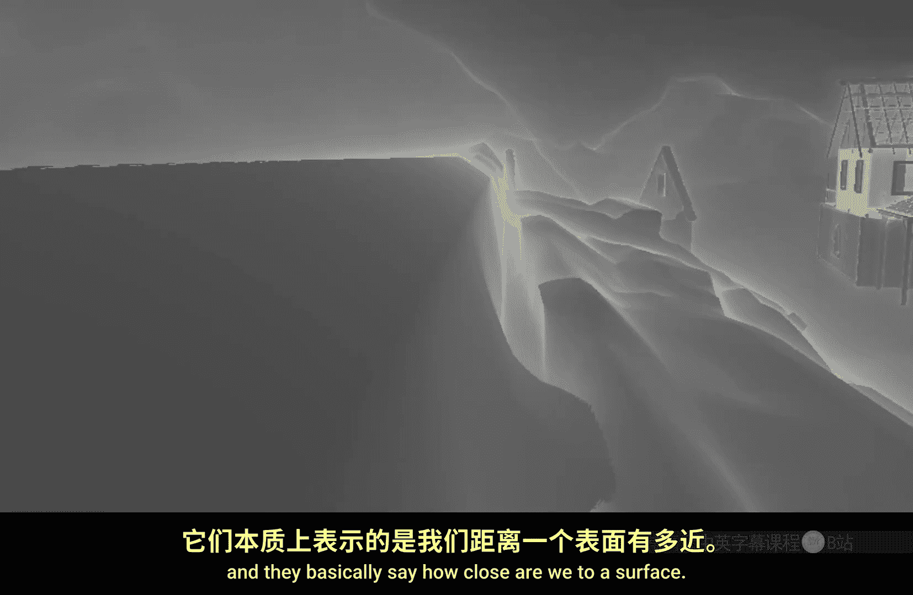
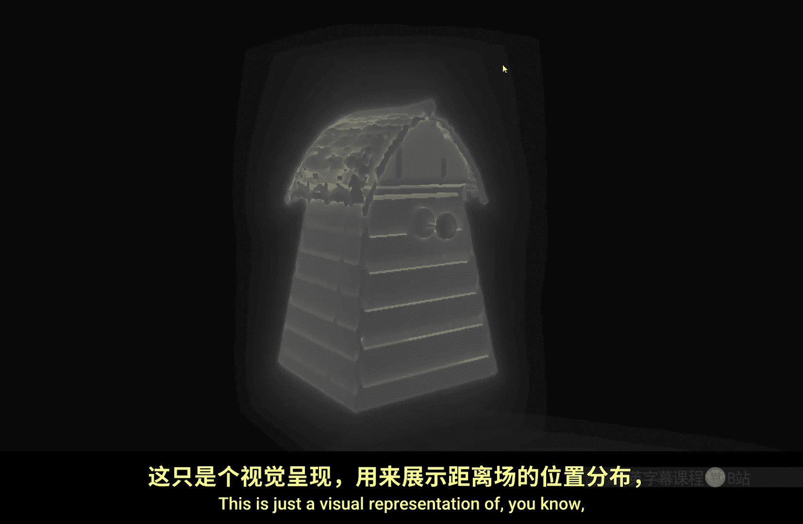
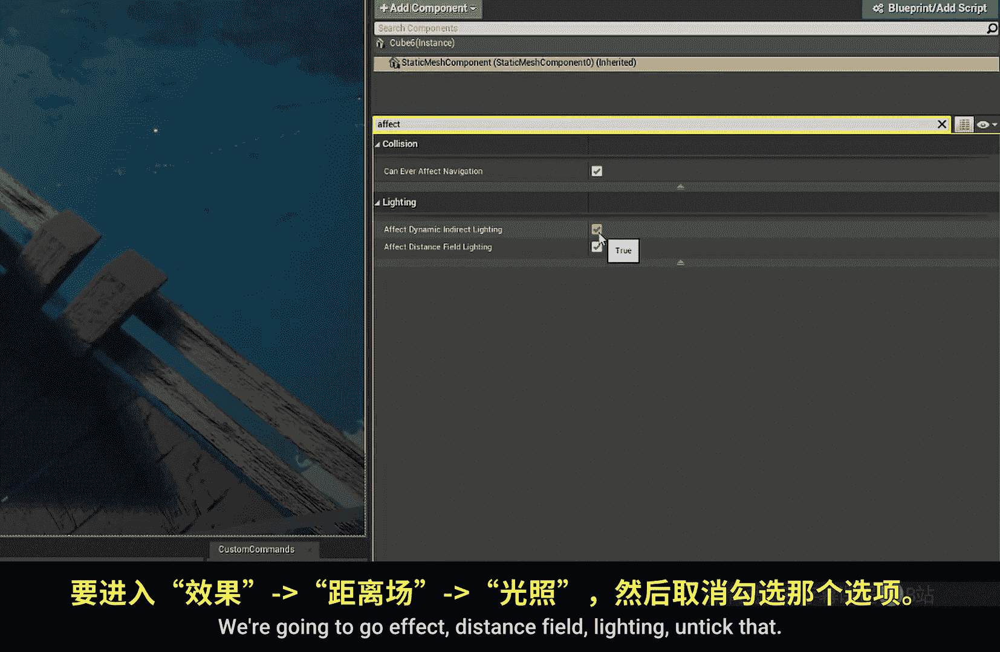
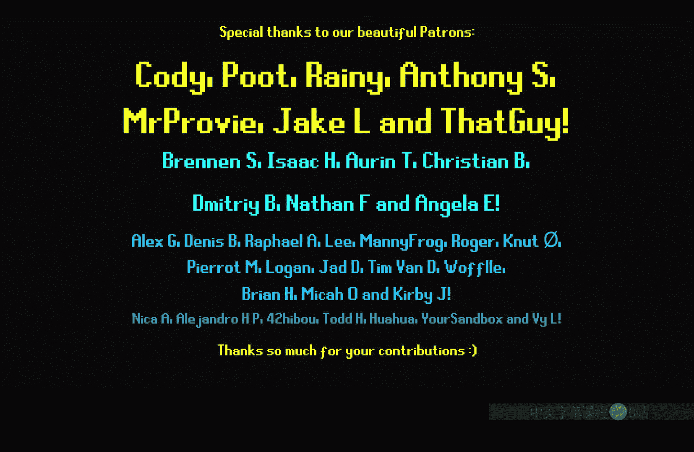

# 021：距离场（第一部分）

在本节课中，我们将学习虚幻引擎材质编辑器中的一个核心概念：**距离场**。我们将了解什么是距离场，如何在场景中可视化它，并探索如何在材质中使用它来创建有趣的效果，例如水面涟漪和网格变形。

## 概述：什么是距离场？

距离场是一种离线计算的数据结构，它记录了空间中每一点到最近物体表面的距离。在虚幻引擎中，我们可以通过可视化工具查看它。

上一节我们介绍了课程主题，本节中我们来看看如何访问和查看距离场。





在场景视口中，点击“显示”选项，找到“可视化”菜单，然后勾选“网格体距离场”。此时，场景中会显示出彩色的射线，它们直观地表示了空间中的点距离物体表面的远近。例如，将一个风车模型移到高空，可以看到距离场数据也随之变化，这反映了距离场对网格体形状的近似精度。

## 在材质中使用距离场

那么，材质如何与距离场交互呢？让我们通过一个简单的材质来探索。

首先，在场景中放置一个立方体，并为其创建一个新材质。将材质应用到立方体上并打开材质编辑器。暂时将基础颜色和镜面反射调为0，得到一个黑色的立方体。

我们将要使用的核心节点是 **`DistanceToNearestSurface`**。这个节点不需要输入，它会输出当前像素位置到最近距离场表面的距离。

如果直接将此节点连接到基础颜色，可能看不到任何效果。这是因为当前立方体自身也在发射距离场。对于要使用距离场计算的材质，通常需要关闭其自身的距离场发射。

以下是操作步骤：
1.  在材质细节面板中，找到“材质”分类下的“用途”设置。
2.  取消勾选“影响距离场光照”。



完成此操作后，立方体将变为纯白色。这是因为在默认情况下，它距离任何距离场表面都超过1个单位（例如1厘米），而`DistanceToNearestSurface`的输出在超过1时会被钳制为1（白色）。

## 处理距离场数据

为了得到更有用的灰度渐变，我们需要处理`DistanceToNearestSurface`的输出。

当前，从黑色（距离为0）到白色（距离≥1）的渐变范围只有1个单位。为了扩大这个范围，我们可以将距离值除以一个较大的数。例如，除以100，意味着渐变范围被拉伸到100个单位。

```glsl
// 核心操作：扩大渐变范围
DistanceToNearestSurface / 100
```

随着立方体靠近地面（距离场表面），其颜色会从黑色（距离为0）逐渐变为白色（距离≥100）。

然而，更常见的需求是让物体在靠近表面时显示为白色，远离时显示为黑色。这可以通过对处理后的结果进行 **`Saturate`**（钳制到0-1范围）和 **`OneMinus`**（1减去输入值）操作来实现。

```glsl
// 更常用的形式：近处为白，远处为黑
1 - Saturate(DistanceToNearestSurface / 100)
```

现在，我们得到了一个基于距离场的黑白遮罩。这个遮罩可以驱动许多效果。

## 应用示例：创建动态涟漪效果

我们可以利用这个距离场遮罩来创建动态效果，例如水面涟漪。

首先，使用遮罩在两个颜色间进行线性插值（Lerp），作为基础测试。

接下来，引入时间变量来制作动画。将时间输入到正弦波（Sine）函数中，其输出会随时间在-1到1之间周期性变化。我们可以将这个波动与距离场遮罩相乘。

```glsl
// 创建脉动效果
Sine(Time) * DistanceMask
```

为了产生更多波纹带，可以在时间进入正弦函数前将其乘以一个系数（例如5）。要减慢动画速度，则可以将时间除以一个系数（例如3）。

```glsl
// 产生多波段、慢速的涟漪
Sine( (Time / 3) * 5 ) * DistanceMask
```

这个效果的原理是：当水面（一个平面）靠近岸边（地形距离场）时，根据距离产生波纹。在实际的水材质中，可以进一步用此效果驱动折射、泡沫生成和流速扰动，从而创造出非常逼真的岸边交互。

## 进阶应用：网格体变形

距离场数据还可以用于顶点位移，改变网格体的形状。

思路是：获取网格体的世界顶点法线，并用距离场遮罩来调制它，然后将其应用于世界位置偏移。

1.  使用 **`VertexNormalWS`** 节点获取顶点法线。
2.  通常我们只需要法线的X和Y分量（水平方向），可以通过一个分量掩码（如 (1,1,0)）来实现。
3.  将处理后的法线与距离场遮罩相乘，再乘以一个强度系数。
4.  最后输出到材质的 **`World Position Offset`** 引脚。

```glsl
// 基于距离场的膨胀变形
World Position Offset = VertexNormalWS.xy * DistanceMask * Intensity
```

这样，当网格体靠近距离场表面时，其顶点会沿法线方向膨胀，产生一种“融化”或“粘稠物体”靠近表面时摊开的效果。如果使用完整的法线向量（不掩码），物体会向所有方向膨胀，仿佛要吞噬附近的物体。这种技术可用于创建史莱姆、软体生物或特殊的魔法效果。

## 总结

本节课中我们一起学习了距离场在虚幻引擎材质中的应用。

*   **距离场** 本质上是物体周围的空间距离信息。
*   材质通过 **`DistanceToNearestSurface`** 节点读取距离数据。
*   通过 **`除以一个数值`** 来调整黑白渐变的敏感范围。
*   通过 **`1 - Saturate()`** 操作获得“近白远黑”的常用遮罩。
*   此遮罩可以用于颜色混合、驱动动态效果（如水面涟漪）或进行顶点位移（如变形效果）。



建议在使用时，先将处理后的距离数据连接到基础颜色进行可视化调试，确保其反应符合预期，然后再将其应用到更复杂的材质逻辑中，尝试创作各种有趣的效果。