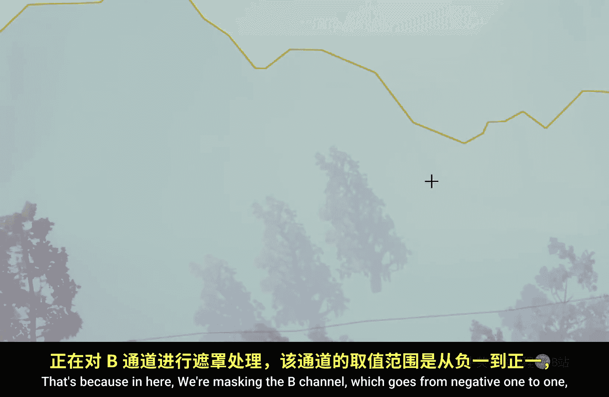
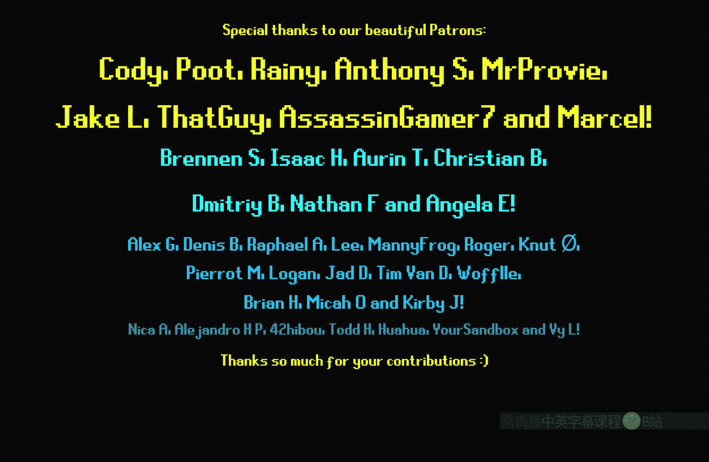

# 022：距离场（第二部分）🎨

## 概述
在本节课中，我们将深入学习虚幻引擎材质中的距离场，特别是**距离场梯度**节点。我们将探索该节点的功能、如何从中提取有用信息，以及如何利用它来创建基于方向的视觉效果。

---

## 距离场梯度节点初探 🔍

上一节我们介绍了距离场的基础概念，本节中我们来看看一个更具体的工具：**距离场梯度**节点。

首先，创建一个新材质并应用到一个球体上。在材质图表中，添加一个 **DistanceFieldGradient** 节点，并将其直接连接到基础颜色上。

```cpp
// 节点：DistanceFieldGradient
// 输出：一个三维向量，代表到最近距离场表面的方向。
```

此时，球体看起来几乎是黑色的。这是因为该节点输出的原始数据值非常小，接近零。为了可视化这些数据，我们需要对其进行处理。

---

## 处理梯度数据的两种方法 ⚙️

为了让距离场梯度数据变得有用，主要有两种处理方法。

### 方法一：归一化
第一种方法是使用 **Normalize** 节点。归一化会确保向量的R、G、B分量在任何时候（除非向量本身接近零）的平方和为1，并将结果钳制在0到1之间。

以下是操作步骤：
1.  将 **DistanceFieldGradient** 节点连接到 **Normalize** 节点。
2.  将结果连接到基础颜色。

此时，当球体位于立方体的正Z方向（上方）时，它会显示为蓝色；在正Y方向（侧面）时显示为绿色；在正X方向时显示为红色。在立方体下方或某些负方向区域，球体显示为黑色，因为这些方向的分量是负值，被归一化处理为0。

### 方法二：缩放与钳制
第二种方法（也是在某些情况下更可取的方法）是直接放大数据并手动钳制。
1.  将 **DistanceFieldGradient** 节点的输出值乘以一个较大的数（例如100）。
2.  使用 **Clamp** 节点将结果限制在 -1 到 1 的范围内。

```cpp
// 公式：Clamp(DistanceFieldGradient * 100, -1, 1)
```



与归一化相比，这种方法产生的颜色过渡更加平滑。更重要的是，它能同时保留正负方向的信息，而不仅仅是判断向量“一半朝上、一半朝侧”，这对于某些效果至关重要。

---

## 结合距离创建方向性遮罩 🎭

了解了如何获取方向信息后，我们可以将其与其他节点结合，创建更复杂的效果。

我们可以将方向信息与 **DistanceToNearestSurface** 节点结合。以下是创建一个方向性变形效果的步骤：
1.  使用 **DistanceToNearestSurface** 除以一个值（如200），以定义开始产生效果的临界距离。
2.  用 **Saturate** 和 **OneMinus** 节点处理，创建一个靠近表面时变为白色、远离时变为黑色的遮罩。
3.  将此黑白遮罩乘以一个强度值（如100）。
4.  **关键步骤**：将上述结果乘以处理过的 **DistanceFieldGradient** 方向向量。
5.  将最终结果连接到材质的**世界位置偏移**上。

```cpp
// 核心逻辑：
// Offset = (1 - Saturate(DistanceToSurface / 200)) * Strength * ProcessedGradientDirection
```

现在，当球体靠近立方体时，它会沿着距离场表面的法线方向发生变形。如果使用归一化的梯度，在角落处变形方向是对角线；如果使用缩放钳制的方法，变形过渡会更平滑。

---

## 应用案例：方向性发光与河流效果 💡

让我们看两个具体的应用案例。

### 案例一：方向性发光
假设我们想让物体只在靠近表面上方的特定方向时发光。
1.  创建靠近表面时发光的逻辑（使用距离场和自发光颜色）。
2.  使用处理后的梯度数据的B（蓝色）通道作为方向遮罩。B通道代表世界空间的上下方向。
3.  将发光逻辑与B通道遮罩相乘。这样，只有球体位于表面上方的区域才会发光。
4.  如果想在表面上、下两个方向都发光，可以在B通道后使用 **Absolute** 节点取绝对值。

```cpp
// 方向性发光遮罩：
// GlowMask = (1 - Saturate(DistanceToSurface / Threshold)) * Saturate(Abs(Gradient.B))
```

### 案例二：河流材质中的方向性效果（物体局部空间）
在河流材质中，我们可能希望效果（如波纹或泡沫）只沿着河流流动的方向（即物体的局部前进方向）产生，而不是世界坐标的方向。
1.  获取 **DistanceFieldGradient**。
2.  使用 **Transform** 节点将其从**世界空间**转换到**物体局部空间**。
3.  使用局部空间向量的R（红色）通道作为遮罩，它对应物体的局部X轴方向。
4.  将此方向遮罩应用于你的效果逻辑（如波纹强度）。

这样，无论物体如何旋转，效果都会始终沿着物体自身的正向发生。通过调整遮罩后的偏移或锥形范围，可以进一步控制效果区域。在这个案例中，使用**归一化**的梯度通常能获得更清晰、对几何体形状更敏感的方向界定。

---

## 总结与拓展 🚀

本节课我们一起深入学习了**距离场梯度**节点的使用。
*   我们学习了两种可视化及处理该节点数据的方法：**归一化**和**缩放钳制**，它们分别适用于需要硬边界或平滑过渡的不同场景。
*   我们探索了如何将梯度方向信息与距离信息结合，创建出**方向性变形**和**方向性发光**等效果。
*   最后，我们通过**河流材质**的案例，了解了如何将世界空间的方向转换到物体局部空间，以实现与物体自身朝向相关的复杂效果。

距离场梯度是一个强大但精细的工具，需要反复实验和可视化调试才能掌握。如果你想查看更多应用案例，可以搜索作者的“流沙着色器”教程，其中使用了距离场梯度来让沙粒贴合物体表面；或者查看“河流着色器”视频，深入了解如何模拟下游波纹。




希望本教程能帮助你理解并开始使用这个强大的节点。