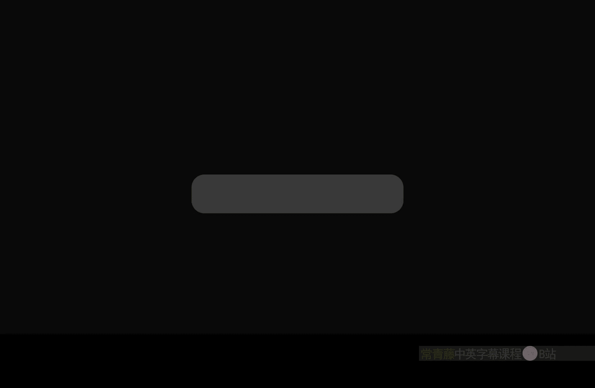
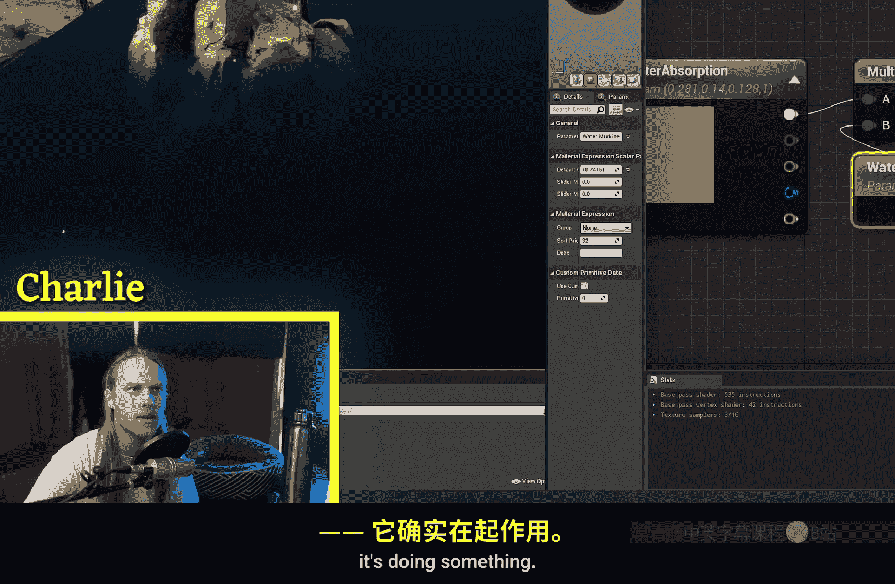
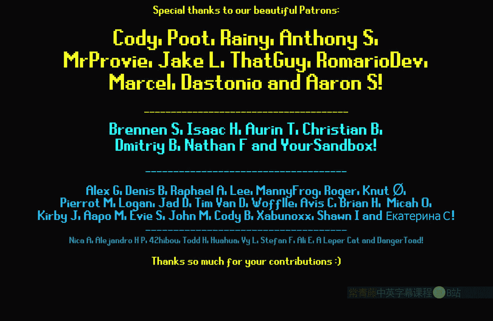

# 023：单层水体材质教程 🌊

在本节课中，我们将学习虚幻引擎中的“单层水体”着色模型。这是一种用于模拟水体的高效且效果出色的材质系统，能够处理光线吸收、散射等物理特性，比传统的半透明材质更易用且性能更好。

---

## 启用单层水体着色模型

首先，我们需要创建一个平面来模拟水面，并为其创建一个新材质。为了启用单层水体功能，关键步骤是更改材质的着色模型。

1.  在材质编辑器中，找到“材质属性”中的“着色模型”选项。
2.  将默认的“默认光照”下拉菜单，滚动到底部并选择“单层水体”。
3.  此时，材质图表中会自动出现一个“单层水体材质输出”节点。建议将其放置在常规“材质输出”节点下方。

完成此设置后，我们便可以使用单层水体特有的输入参数了。

---

## 配置基础水体属性

上一节我们启用了单层水体模型，本节中我们来看看如何配置其核心属性，让水看起来更真实。

首先，我们将一些基础参数归零，然后重点配置“吸收系数”。

*   **基础颜色**：设置为纯黑（0, 0, 0）。
*   **不透明度**：设置为0。
*   **折射**：设置为1。

接下来，配置“吸收系数”。它决定了水体对不同波长光线的吸收程度，直接影响水的颜色和清澈度。

以下是配置吸收系数的步骤：
1.  创建一个标量参数，命名为“WaterAbsorption”（水体吸收）。
2.  创建一个乘法节点，将“WaterAbsorption”与另一个标量参数（例如“Murkiness”，浑浊度）相乘。
3.  将相乘的结果除以100，因为吸收系数需要非常小的数值，除以100便于在参数面板中调节。
4.  最后，将结果连接到“单层水体材质输出”节点的“吸收系数”引脚。

**核心概念**：吸收系数决定了水的颜色。你连接的颜色（例如淡红色）表示水会**吸收**该颜色的光，因此水体最终会呈现其**互补色**（例如蓝绿色）。物体在水下越深，被吸收的光线越多，颜色变化越明显。

---

## 添加光线散射效果

除了吸收光线，真实的水体还会散射光线。接下来，我们为水体添加散射效果。

“散射系数”的配置方式与“吸收系数”类似。
1.  创建另一组参数和计算节点，用于控制散射。
2.  将结果连接到“单层水体材质输出”节点的“散射系数”引脚。
3.  散射颜色通常设置为蓝色系，强度不宜过高。

散射效果模拟了光线在水体内部的漫反射，可以增加水体的质感和体积感。你可以通过调整颜色和强度参数进行实验，找到最适合的效果。

---

## 其他可选参数与性能提示

单层水体节点还有其他几个输入，可用于实现更复杂的效果。

*   **相位 G**：取值范围为-1到1，控制散射的方向性。通常保持默认值0即可。
*   **水后颜色缩放**：用于增强水底物体的亮度，常与焦散等效果配合使用。留空则不会增加计算开销。
*   **性能提示**：将“散射系数”、“相位G”和“水后颜色缩放”留空或设为0，可以降低材质的指令数，从而提升性能。对于风格化水体，通常只需配置“吸收系数”即可。

---

## 实现水面细节：泡沫、折射与法线

单层水体模型同样支持水面细节的模拟。现在，我们来看看如何添加泡沫、折射和波纹法线。

**泡沫效果**可以通过“不透明度”输入实现。
1.  使用一张噪声或泡沫纹理。
2.  通过“对比度”等节点调整纹理，使黑色区域透明（水），白色区域不透明（泡沫）。
3.  将处理后的纹理连接到“不透明度”输入。

**折射**效果由“折射”输入控制。对于水，折射率通常从1.033开始尝试，虽然水的真实折射率约为1.33，但在引擎中1.033的视觉效果可能更自然。

**水面波纹**通过“法线”输入实现。
1.  使用两张平移的Water Normal贴图。
2.  通过“混合角度校正法线”节点将它们混合。
3.  将混合后的法线连接到“法线”输入，即可产生动态波纹效果。

---

## 实用技巧：模拟岸边涟漪

如果你想通过“世界位置偏移”制作物体移动产生的涟漪，需要注意偏移不会自动影响法线。这里有一个小技巧可以模拟这种效果：

你可以根据物体到岸边的距离，动态地增加“折射”指数的值。这能在视觉上“伪造”出涟漪导致的凹凸扭曲感，虽然水面几何体本身并未改变，但能获得不错的互动视觉效果。

---

## 总结与应用示例

本节课中，我们一起学习了虚幻引擎“单层水体”着色模型的核心用法。我们涵盖了从启用模型、配置吸收与散射、添加水面细节（泡沫、法线）到一些实用技巧的全过程。

总而言之，单层水体模型通过物理参数（吸收、散射）高效地模拟了光线与水体的交互，替代了传统半透明材质中复杂的深度淡化处理。它是一个不透明材质，通过单独的渲染通道实现，通常能获得更好看且更易控制的结果。

正如示例所示，结合距离场、纹理动画和交互逻辑，你可以用它创建出包含动态波浪、岸边涟漪、航行泡沫等复杂效果的完整水体系统。希望本教程能帮助你开始使用这个强大的工具。