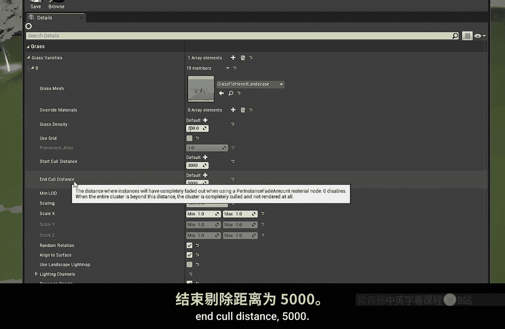

# 024：每实例淡出量节点详解 🎨

在本节课中，我们将学习虚幻引擎材质编辑器中的一个实用节点——**每实例淡出量**。这个节点主要用于处理场景中植被（如草地、灌木）的平滑淡出效果，避免它们在远处突然“弹出”或消失，从而提升视觉体验。

## 节点用途与问题背景 🌿

上一节我们介绍了课程主题，本节中我们来看看这个节点的具体应用场景。

如果你在场景中使用了任何类型的植被，无论是通过景观草地类型生成的，还是手动放置的预制植被，你可能会遇到“剔除距离”设置的问题。该设置包含最小值和最大值。例如，将灌木的最小剔除距离设为1000单位，最大设为3000单位。当你远离这些植被时，它们会直接消失，而不是逐渐淡出，这看起来效果不佳。

## 应用方法与节点连接 🔌

为了解决上述问题，我们需要在植被所使用的材质中应用“每实例淡出量”节点。

以下是应用步骤：
1.  在材质图表中找到并添加 **PerInstanceFadeAmount** 节点。
2.  在绝大多数情况下（99%），你应该将该节点的输出连接至 **DitherTemporalAA** 节点。
3.  最后，将 **DitherTemporalAA** 节点的输出与你材质中原本的 **不透明度蒙版** 通道进行乘法运算。

**核心连接公式示例：**
`最终不透明度蒙版 = 原始纹理不透明度 * DitherTemporalAA(PerInstanceFadeAmount)`

完成连接后，观察你的植被。在正常距离下，它们看起来与往常一样。但当你移动到设定的剔除距离（如1000单位）时，植被会开始平滑地淡出。

## 技术细节与优化建议 ⚙️

这里所说的“平滑”淡出，是通过**抖动抗锯齿**技术实现的，并且是基于距离而非屏幕空间的。如果你放大观察，会发现植被在完全消失前会有一个渐隐的过程。它们最终会“弹出”消失，是因为虚幻引擎默认的抖动图案在低值区效果不理想。

我们可以进行优化：
*   将抖动模式从默认的 **Random** 改为 **Uniform**。这样虽然不完美，但能改善植被突然消失的问题，使远处植被的淡入淡出不那么明显。

**“每实例淡出量”节点的本质是：** 它根据你在植被工具或景观草地类型中设置的剔除距离，返回一个从 **1 到 0** 的渐变值。

## 扩展应用与性能考量 🚀

这个节点非常灵活。例如，为了演示，我们可以直接将它的输出连接到基础颜色上，让植被颜色随着距离从白色渐变到黑色，然后再因剔除而淡出。

我们选择使用 **DitherTemporalAA** 的主要原因在于其性能开销极低。这对于有大量重叠植被需要处理的场景至关重要。抖动效果是一种屏幕空间效果。

若想将此效果应用于景观草地，只需在景观草地类型的设置中，调整 **Start Cull Distance** 和 **End Cull Distance** 即可，材质系统会自动应用淡出效果。

## 课程总结 📝

本节课中我们一起学习了 **每实例淡出量** 节点的核心用途与使用方法。总结如下：
*   **功能**：根据剔除距离生成1到0的渐变值，实现植被平滑淡出。
*   **核心方法**：将 `PerInstanceFadeAmount` 节点连接至 `DitherTemporalAA` 节点，再与不透明度蒙版相乘。
*   **优化技巧**：将抖动模式改为 **Uniform** 以获得更均匀的淡出效果。
*   **优点**：基于距离计算，使用高效的抖动技术，对性能影响小。

掌握这个节点能有效提升场景中中远距离植被的视觉表现，消除生硬的剔除边界。