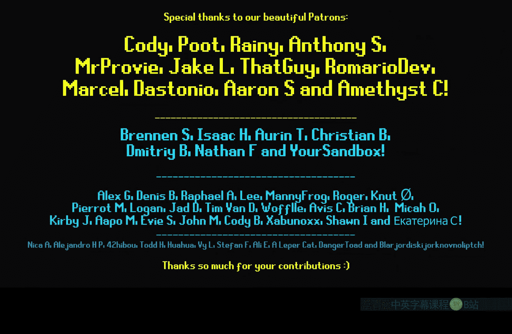
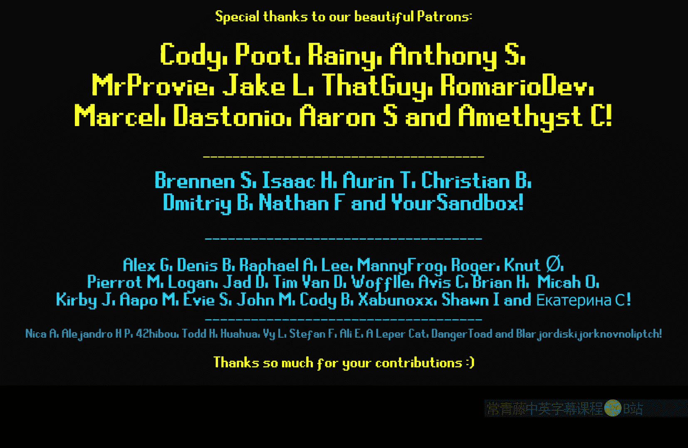

# 025：每实例随机节点

在本节课中，我们将要学习虚幻引擎材质编辑器中的一个特殊节点——“每实例随机”。这个节点能为大量重复放置的物体（如植被）提供随机变化，而无需创建多个材质。

## 概述

“每实例随机”节点为每个实例化的静态网格体组件返回一个介于0到1之间的随机值。这非常适合用于为大片植被或通过实例化放置的物体添加颜色、纹理偏移等随机变化，从而增强场景的自然感和多样性。

## 核心节点解析

首先，在材质图表中搜索并添加“PerInstanceRandom”节点。

这个节点的作用是：为每个实例返回一个唯一的、在0到1范围内的随机浮点数。其输出是一个标量值。

## 应用实例：随机颜色植被

以下是使用该节点为植被实例赋予随机颜色的步骤。

1.  创建颜色插值：使用“Lerp”（线性插值）节点。将“每实例随机”节点的输出连接到Lerp的“Alpha”引脚。
2.  设置颜色范围：为Lerp节点的“A”和“B”引脚分别连接两种不同的颜色（例如绿色和黄色）。
3.  输出到基础颜色：将Lerp节点的输出结果连接到材质“基础颜色”引脚。

完成上述步骤后，在场景中查看使用该材质的实例化植被（如通过植被绘制工具放置的植物），你会发现每棵植物都呈现出介于预设两种颜色之间的随机色调。

## 重要限制与替代方案

上一节我们介绍了“每实例随机”节点在实例化物体上的应用，本节中我们来看看它的一个重要限制。

**该节点仅对实例化静态网格体组件生效**。这意味着，如果你手动从内容浏览器中拖放一个静态网格体到场景中（成为一个独立的Actor），它将不会从该节点获得随机值。所有手动放置的相同网格体将显示完全一致的颜色。

对于非实例化的静态网格体，我们可以使用一种基于世界位置的伪随机方法来模拟每对象随机效果。以下是实现方法。

1.  获取对象位置：使用“Object Position”节点（选择“Pivot”模式）获取物体的枢轴点位置。
2.  生成伪随机数：将位置向量的X、Y、Z分量相加，然后使用“Frac”节点取小数部分。`Frac(X+Y+Z)` 这个操作会生成一个基于位置的、稳定的“随机”数。
3.  应用随机数：将此伪随机数作为Alpha值输入到Lerp节点，来控制颜色或其他属性。

**请注意**：此方法依赖于物体的世界坐标。如果物体移动，其“随机”值会随之改变，导致颜色闪烁。因此，这种方法**仅适用于静止不动的物体**。

## 其他应用思路

“每实例随机”节点不仅可用于颜色变化，还可用于其他需要随机性的场合。

*   **纹理随机偏移**：当在植被上使用平铺纹理时，可以将随机值添加到UV坐标中，使每个实例的纹理起始位置不同，从而打破重复感。
*   **随机缩放或旋转**：通过将随机值映射到不同的范围，可以控制实例的轻微大小或方向变化，使集群看起来更自然。

## 总结

本节课中我们一起学习了“每实例随机”节点的核心功能与应用。我们了解到该节点能为每个实例化物体提供0到1的随机数，是高效创建植被等群体对象多样性的利器。关键点在于，它只对实例化组件有效。对于非实例化的静态网格体，我们探索了基于对象位置生成伪随机数的替代方案，但需注意其只适用于静止物体。掌握这个节点能有效提升场景的视觉丰富度和真实感。