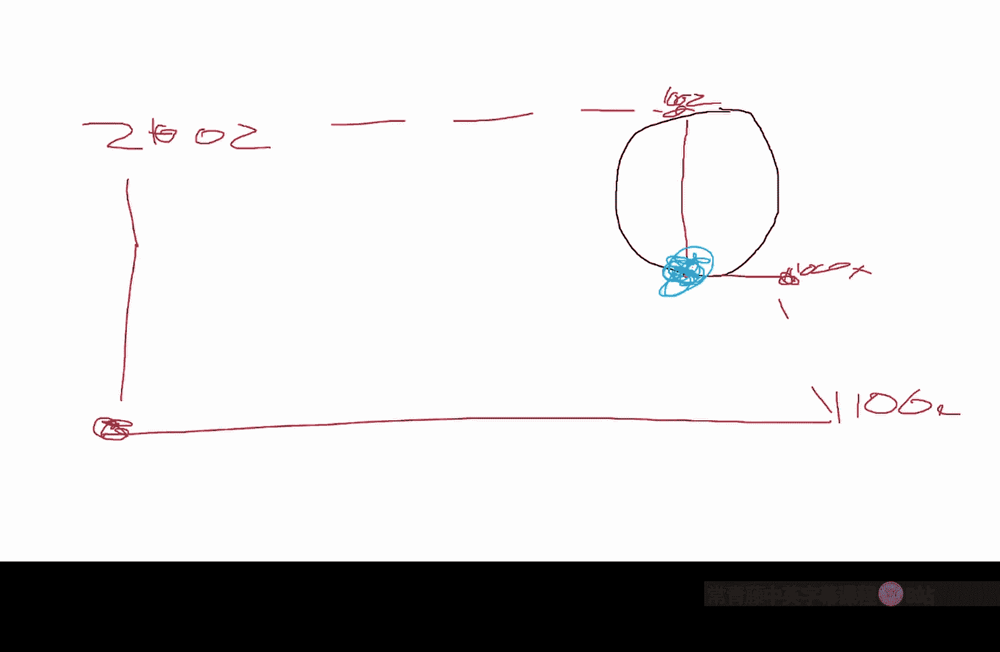
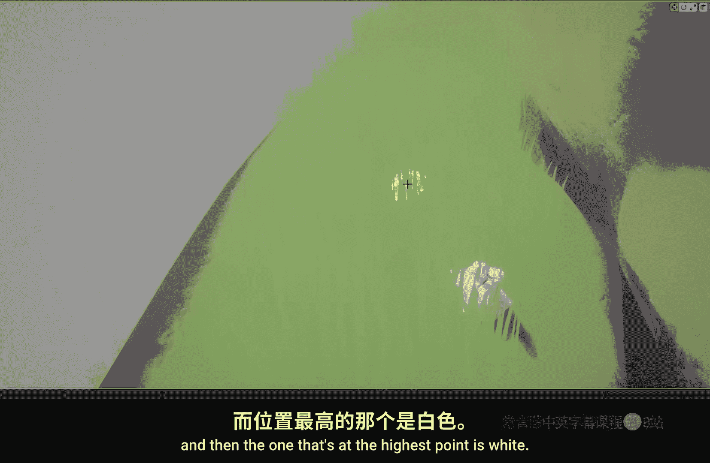
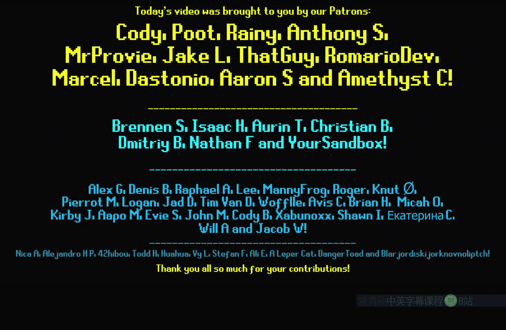

# 026：对象枢轴点节点 🎯


在本节课中，我们将深入探讨虚幻引擎材质编辑器中的一个特定节点：**对象枢轴点**。我们将了解它的基本功能、工作原理，并通过几个实际案例学习如何有效地在项目中使用它。

## 概述



对象枢轴点节点是一个材质函数。它的核心功能是获取物体局部空间中的零点（即枢轴点），并将其坐标转换到世界空间中。理解这一点是运用该节点的关键。

## 节点功能解析

上一节我们概述了节点的基本概念，本节中我们来看看它的具体工作原理。

本质上，该节点执行一个坐标转换。在局部空间中，物体的枢轴点坐标是 `(0, 0, 0)`。此节点获取该点，并通过以下过程计算出它在世界空间中的对应位置：

**公式：** `世界空间坐标 = 物体变换矩阵 × 局部空间枢轴点坐标 (0,0,0)`

用图表来理解：假设一个物体，其局部空间原点（枢轴点）在物体中心。在世界空间中，这个点的坐标值会根据物体在场景中的位置、旋转和缩放而完全不同。该节点输出的正是这个转换后的世界空间坐标。

## 实际应用案例

理解了节点的基本原理后，我们来看看它在实际项目中的几种强大用途。

### 应用一：基于枢轴点的纹理采样

一种非常实用的用法是利用枢轴点来为整个网格物体传播纹理颜色。以下是实现步骤：

1.  获取**对象枢轴点**的世界空间坐标。
2.  将此坐标（通常只使用XY分量）输入到 **Texture Sample** 节点的UV引脚。
3.  纹理将在物体的枢轴点位置采样一次，并将该像素颜色应用到整个物体上。

**效果**：当移动物体时，其整体颜色会根据其枢轴点下方纹理的颜色而改变。这对于需要让物体（如灌木丛）颜色与地面纹理匹配，但又希望颜色在物体表面均匀一致（而非随顶点变化）的情况非常有用。

### 应用二：实例化植被的统一遮罩

在处理通过植被工具放置的实例化网格时，我们经常需要为每个实例单独创建遮罩（如从底部到顶部的渐变）。使用传统的 **BoundingBoxBasedUV** 节点会出问题，因为它会基于所有实例的整体包围盒计算，导致每个实例的遮罩不正确。



解决方案是使用对象枢轴点来构建每个实例独立的遮罩。以下是核心思路：

1.  获取当前像素的**世界位置**。
2.  获取当前实例的**对象枢轴点**世界位置。
3.  计算两者在特定轴（如Z轴）上的差值：`差值 = 世界位置.Z - 枢轴点位置.Z`。
4.  将此差值除以物体的最大高度，进行归一化处理，从而得到一个基于每个实例自身枢轴点的、从底部（0）到顶部（1）的渐变遮罩。

**代码示意（材质蓝图逻辑）：**
```
Mask = (WorldPosition.Z - ObjectPivotPoint.Z) / Foliage_Max_Height
```

这个遮罩可以用于控制树木随风摇摆的幅度（顶部摇摆更剧烈）或实现基于高度的其他效果。

### 应用三：顶点着色器阶段的注意事项

当在像素着色器阶段（如影响基础颜色、法线）使用对象枢轴点处理实例化物体时，必须通过 **VertexInterpolator** 节点来传递枢轴点数据。这是因为实例数据在像素阶段默认无法区分。

**操作流程：**
1.  将 **Object Pivot Point** 节点连接到 **VertexInterpolator** 节点的输入。
2.  将 **VertexInterpolator** 节点的输出用于后续的像素着色计算。

**重要例外**：如果对象枢轴点仅用于 **World Position Offset**（世界位置偏移），则不需要使用 **VertexInterpolator**，因为WPO本身就在顶点阶段计算，能够正确识别每个实例。

## 总结

本节课我们一起学习了 **对象枢轴点** 节点的核心机制与应用。关键点在于：它提供了每个网格实例在世界空间中的原点坐标。我们探讨了它的三大用途：
1.  为整个物体赋予基于枢轴点位置的统一纹理颜色。
2.  为实例化植被创建独立、正确的垂直渐变遮罩，替代有局限性的BoundingBoxBasedUV节点。
3.  在像素着色器中使用时，需借助 **VertexInterpolator** 来保证实例数据的正确传递。



掌握这个节点能让你更灵活地控制实例化物体的外观和行为，特别是在处理大规模植被、风场交互和与环境纹理匹配的场景时。