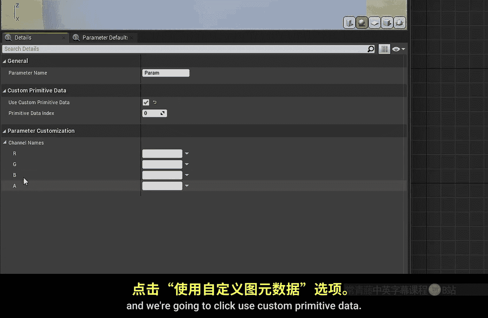
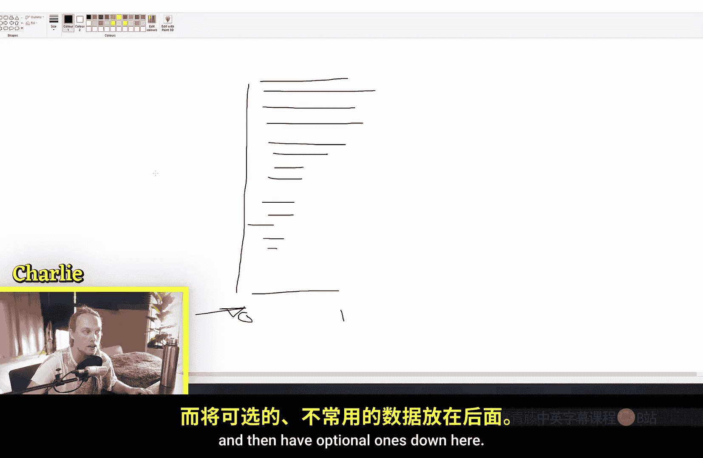
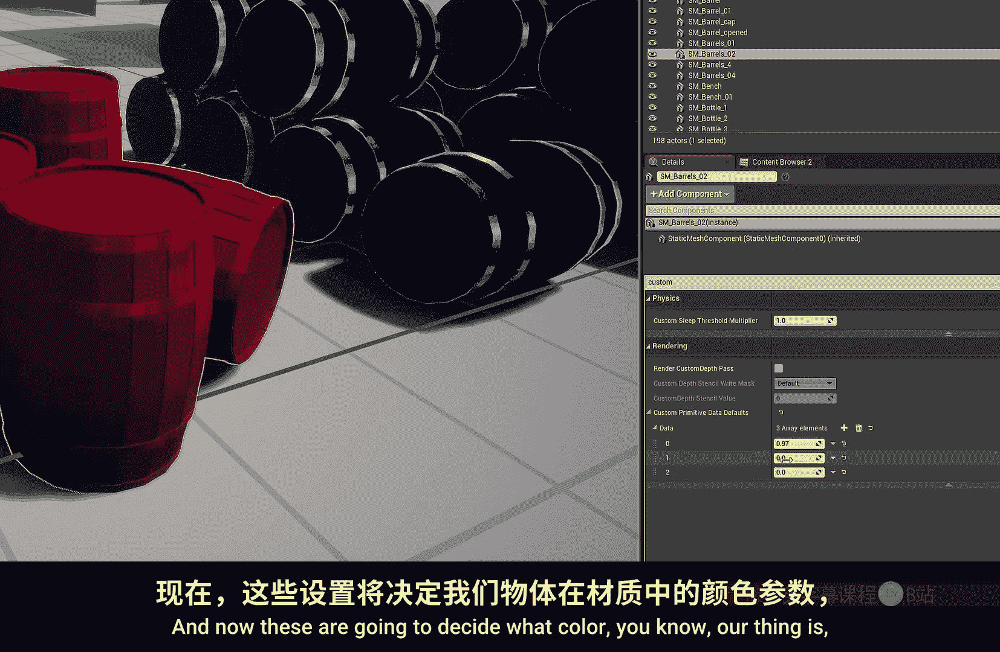
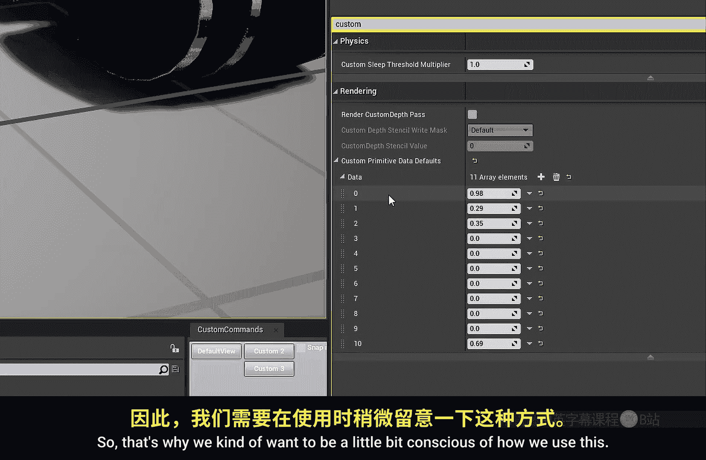
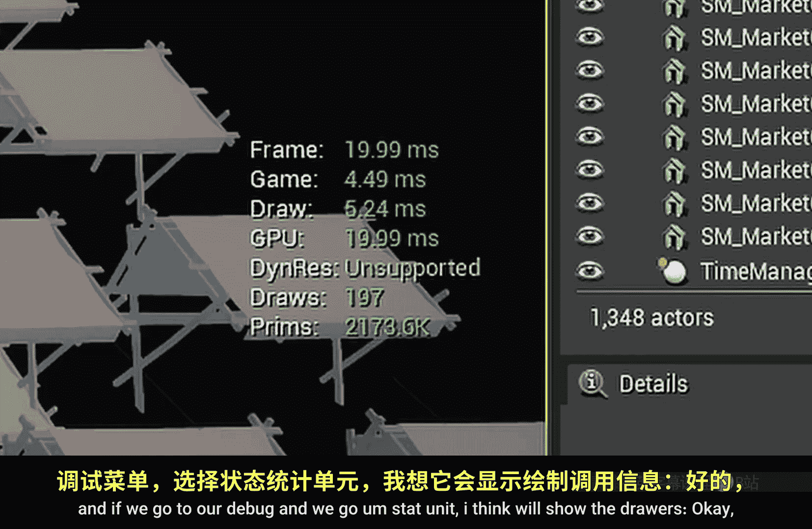
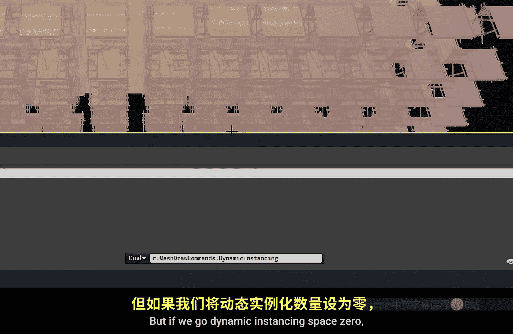
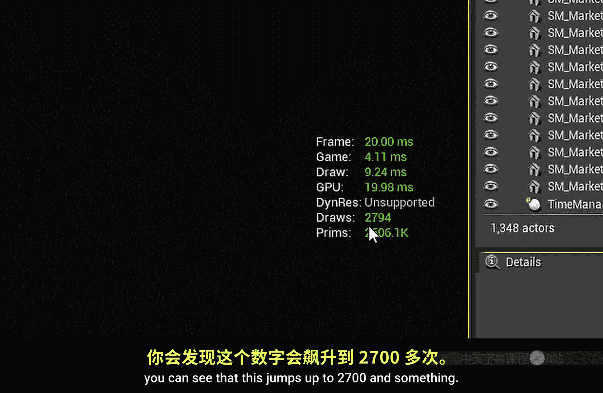

# 027：使用自定义数据优化材质

在本节课中，我们将学习虚幻引擎中一个非常实用的工具——自定义数据。它听起来复杂，但实际上很简单，并且是优化场景、减少绘制调用数量的得力助手。

## 什么是自定义数据？🤔

上一节我们介绍了材质参数的基本概念，本节中我们来看看如何通过自定义数据实现更高效的材质变化。自定义数据允许我们为场景中的每个静态网格体实例设置独特的参数值，而无需为每个变化创建独立的材质实例。

## 如何创建自定义数据参数？🔧

以下是创建自定义数据输入的具体步骤：

1.  在材质图表中，按住键盘上的 **4** 键并点击鼠标左键，创建一个四维向量节点。
2.  右键点击该节点，选择“转换为参数”。
3.  选中这个新创建的参数节点，在细节面板中找到“自定义原始数据”部分。
4.  勾选“使用自定义原始数据”选项。现在，这个参数就变成了一个自定义原始数据参数。
5.  将该参数连接到材质的某个输入上，例如基础颜色。
6.  在细节面板中，为其指定一个“索引”值。这个索引决定了该参数在数据数组中的起始位置。



**代码示例：创建自定义数据参数**
```cpp
// 在材质蓝图中，通过以下步骤创建：
// 1. 创建 VectorParameter 节点
// 2. 在细节面板中启用 “Use Custom Primitive Data”
// 3. 设置 “Index” 值
```

## 使用自定义数据的注意事项 ⚠️

由于自定义数据通过索引访问，因此需要谨慎规划其使用顺序。以下是几点建议：



*   将最常用、每个实例都可能不同的参数放在较低的索引位置。
*   将可选或不常用的参数放在较高的索引位置。
*   这样做的目的是避免为访问高索引参数而填充大量不必要的默认值，从而节省资源。

## 为何要使用自定义数据？💡



使用自定义数据主要有三大好处：实现变化、提升性能、节省时间。



以下是详细说明：

1.  **实现变化**：在游戏场景中（如一个繁忙的市场），我们可以让大量相同的静态网格体（如货摊）拥有不同的颜色，而无需为每种颜色创建单独的材质。
2.  **提升性能**：这是最关键的一点。当多个相同的静态网格体使用**同一个材质**时，它们可以被“动态实例化”批量处理，合并为一个绘制调用发送给GPU，极大提升渲染效率。如果每个实例使用不同的材质实例，则无法合并，会导致绘制调用数量激增。
3.  **节省时间**：无需通过复制、修改来创建大量相似的材质实例，直接在场景中为每个对象设置自定义数据值即可，工作流程更加高效。

## 性能对比演示 📊

为了直观展示性能差异，我们可以在场景中放置大量相同的静态网格体。







*   **启用动态实例化**时，绘制调用数量保持在较低水平（例如约200次）。
*   **禁用动态实例化**时，每个对象都可能产生独立的绘制调用，数量会飙升（例如超过2700次）。
*   关键点在于：**即使我们通过自定义数据为每个实例设置了不同的颜色，只要它们使用同一个基础材质，动态实例化依然有效，绘制调用数量依然很低**。

## 自定义数据的其他应用 🎨

自定义数据不仅限于控制颜色，它可以驱动任何标量或向量参数。

例如，我们可以：
*   创建一个名为“污垢度”的自定义数据参数（索引设为5）。
*   在材质中使用这个值，通过 `Lerp`（线性插值）节点混合干净材质和带噪波的污垢材质。
*   这样，每个实例都可以拥有独立的陈旧或干净程度，而它们仍然可以被实例化。

**公式示例：使用自定义数据混合材质**
```
最终颜色 = Lerp(干净颜色, 污垢颜色, 自定义数据_污垢度)
```

更高级的用法还包括使用纹理图集，并通过自定义数据来偏移UV，从而让实例化对象显示图集中的不同部分纹理，实现外观多样化。

## 运行时动态修改 ⚡

自定义数据的另一个强大之处是可以在运行时轻松修改。例如，当一个物体着火时，我们可以通过代码动态提高它的“燃烧度”参数值，实时改变其外观，而无需创建新的动态材质实例，避免了额外的性能开销。

## 总结 📝

本节课中我们一起学习了虚幻引擎材质系统中的自定义数据功能。我们了解了如何创建自定义数据参数，理解了它通过允许单个材质呈现多种变化来减少绘制调用、提升渲染性能的核心优势，并探索了其在控制颜色、混合效果乃至纹理切换方面的多种应用。掌握自定义数据是进行高效材质和场景优化的重要一步。


---
*想深入了解高度混合或其他材质节点？请查看相关视频。要了解更多关于自定义原始数据的底层原理和高级用法，建议查阅官方文档。*