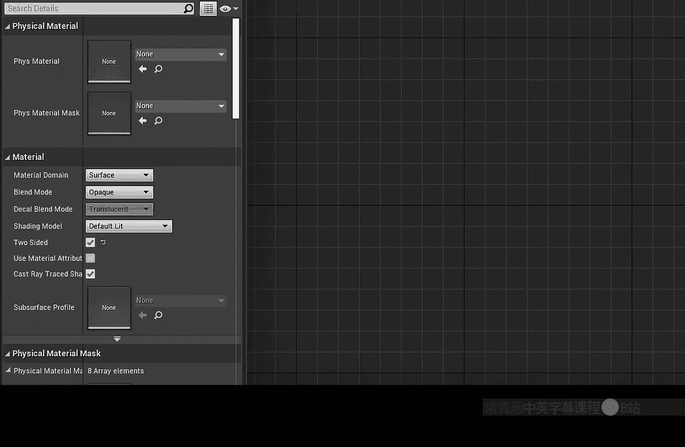
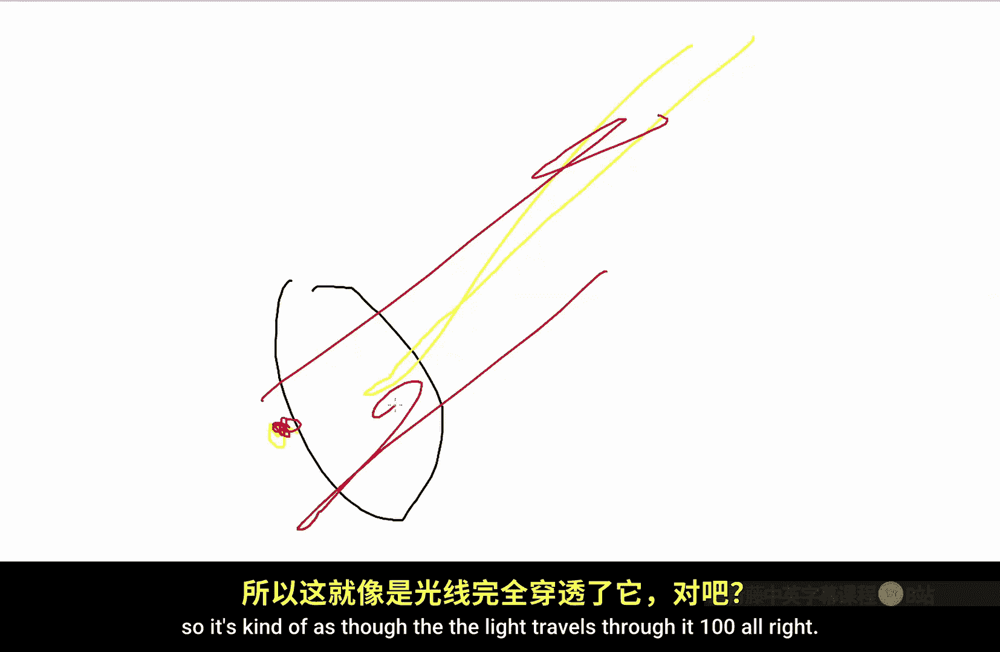
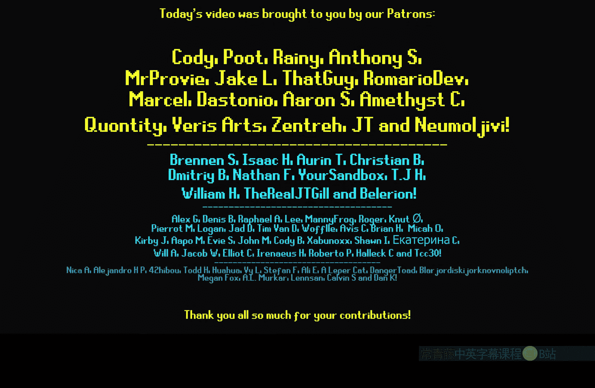

# 028：双面符号节点详解 🎨

在本节课中，我们将学习虚幻引擎材质编辑器中的“双面符号”节点。这个节点对于处理双面材质（如卡片、树叶等）非常有用，它能帮助我们区分模型的正反面，并基于此实现不同的视觉效果。

---

## 概述

“双面符号”节点在双面材质的正面返回值为 **1**，在背面返回值为 **-1**。本节课我们将探索它的三个主要用途：为模型正反面设置不同颜色或法线、平滑植被的法线光照，以及翻转单面网格的法线方向。

---

## 启用双面材质

首先，要使用“双面符号”节点，必须将材质设置为双面模式。

1.  打开你的材质。
2.  在材质细节面板中，找到 **“材质”** 分类。
3.  将 **“双面”** 属性勾选为 `True`。

设置完成后，将材质应用到一个平面网格上。此时，材质正面显示为白色（返回值1），背面显示为黑色（返回值-1）。

---

## 用途一：为正反面设置不同属性

我们可以利用“双面符号”节点的返回值，通过条件判断为模型的正反面赋予不同的颜色或纹理。

以下是具体操作步骤：

1.  在材质图表中添加 **`TwoSidedSign`** 节点。
2.  添加一个 **`Saturate`** 节点（或 **`Clamp`** 节点，范围设为0到1），并将其连接到 `TwoSidedSign` 的输出端。这会将-1转换为0，从而得到正面为1、背面为0的清晰信号。
3.  使用 **`Lerp` (线性插值)** 节点。将 `Saturate` 节点的输出连接到 `Lerp` 的 **Alpha** 输入端。
4.  将你希望正面显示的颜色或纹理连接到 `Lerp` 的 **A** 输入端，将背面显示的颜色或纹理连接到 **B** 输入端。
5.  将 `Lerp` 节点的输出连接到材质的 **基础颜色** 或所需通道。

**核心逻辑公式：**
`最终颜色 = Lerp(背面颜色, 正面颜色, Saturate(TwoSidedSign))`

通过此方法，你可以轻松实现诸如树叶正面绿色、背面浅黄色等效果。同样，你也可以为正反面连接不同的法线贴图，实现更复杂的表面细节差异。

---

## 用途二：平滑植被法线（双面光照）

在制作草地、树叶等植被时，背光面常常会因法线方向相反而显得异常黑暗。“双面符号”节点可以巧妙地解决这个问题。

上一节我们介绍了如何区分正反面，本节中我们来看看如何用它来改善光照。

**问题根源：** 在双面材质中，背面的法线方向与正面相反。当光线照射时，背面法线可能指向错误方向，导致计算出的光照很暗。

**解决方案：** 将世界法线（或顶点法线）与 `TwoSidedSign` 值相乘。

1.  获取模型的法线信息（例如使用 **`VertexNormalWS`** 节点）。
2.  添加 **`TwoSidedSign`** 节点。
3.  使用 **`Multiply`** 节点，将法线与 `TwoSidedSign` 值相乘。
4.  将相乘后的结果连接到材质的 **法线** 输入通道。

**核心逻辑公式：**
`调整后法线 = 原始法线 * TwoSidedSign`

这个操作会使背面的法线方向翻转，变得与正面一致。从光照计算的角度看，就好像光线能够100%穿透叶片一样，从而使植被的正反面都能获得均匀、自然的光照，消除了不自然的黑暗背面。

---

## 用途三：翻转单面网格的法线

这是一个特殊用途，可以创造出一些视觉错觉效果。它能够将单面网格（如立方体、球体）的可见面从正面翻转到背面。

以下是实现步骤：

1.  将材质的 **混合模式** 改为 **“蒙版”**。
2.  添加 **`TwoSidedSign`** 节点。
3.  使用 **`Multiply`** 节点，将 `TwoSidedSign` 乘以 **-1**。
4.  连接一个 **`Saturate`** 节点，将结果限制在0到1之间。
5.  将 `Saturate` 节点的输出连接到材质的 **不透明度蒙版** 通道。

**核心逻辑代码：**
`OpacityMask = Saturate(TwoSidedSign * -1)`

此时，原本应该渲染的正面（`TwoSidedSign` = 1）会因乘以-1并饱和后变为0而被剔除，而原本不可见的背面（`TwoSidedSign` = -1）经过计算后变为1而被渲染出来。效果就是你能看到模型的“内部”，类似于一个反转的外壳，可以用于制作一些特殊的艺术效果或视觉谜题。

---

## 总结

本节课我们一起学习了“双面符号”节点的核心功能与应用。

*   **功能**：在双面材质的正面返回 **1**，背面返回 **-1**。
*   **应用一**：通过 `Lerp` 节点，为模型正反面设置不同的颜色或法线贴图。
*   **应用二**：将法线与节点输出相乘，翻转背面的法线方向，从而实现植被平滑、自然的双面光照效果。
*   **应用三**：通过数学处理连接至不透明度蒙版，可以翻转单面网格的显示面，创造特殊视觉效果。

掌握这个节点能极大地增强你对双面材质和特殊光照效果的控制能力。

