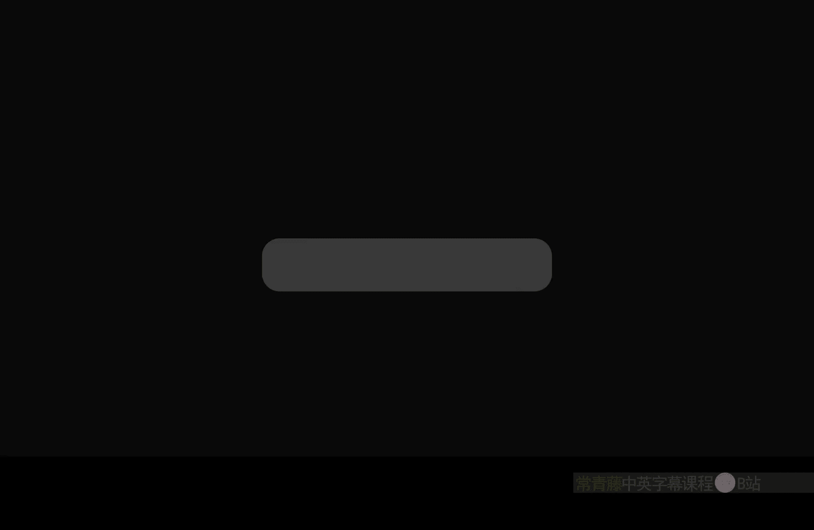
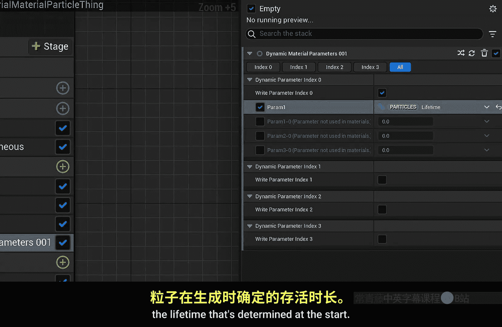

# 029：P29 Niagara粒子与材质



## 概述
在本节课中，我们将学习如何让Niagara粒子系统与材质进行交互。我们将探索如何通过材质节点访问粒子的属性（如速度、颜色、大小），以及如何利用这些属性创建动态的视觉效果，例如根据粒子速度改变颜色，或实现复杂的噪波淡出效果。

---

## 粒子材质基础
上一节我们介绍了课程主题，本节中我们来看看如何创建一个基础的粒子材质。

首先，我们需要创建一个新的材质。将其命名为 `Tutorial_Particle_Ship`，并将其材质域设置为“用户界面”，因为我们将其用作精灵粒子。在材质中，我们将基础颜色设置为蓝色。

接下来，创建一个Niagara系统。在“发射器更新”部分，添加一个“生成爆发（瞬时）”模块，设置生成数量为100。在“粒子生成”部分，添加一个“添加速度”模块，让粒子向随机方向喷射。

现在，关键的一步是将我们创建的材质指定给粒子。在精灵渲染器模块中，找到“材质”选项，点击并搜索我们创建的 `Tutorial_Particle_Ship` 材质。应用后，粒子将显示为蓝色的方块。

为了让粒子看起来更自然，我们通常希望它们是圆形的。回到材质，将混合模式从“不透明”改为“遮罩”。然后，使用一个“径向梯度指数”节点，将其输出连接到“不透明度遮罩”引脚。保存后，粒子将变为圆形。

---

## 使用粒子属性驱动材质
上一节我们创建了基础的圆形粒子，本节中我们来看看如何用粒子自身的属性（如速度）来动态改变材质。

在材质编辑器中，有一系列红色的输入节点，它们专门用于访问粒子数据。例如，“粒子速度”节点可以获取当前粒子的运动速度。

以下是实现速度驱动颜色的步骤：
1.  获取“粒子速度”。
2.  将其除以一个值（例如400）进行标准化，然后使用“饱和”节点将结果限制在0到1之间。
3.  将结果输入到一个“线性插值”节点。
4.  设置插值两端的颜色（例如，A端为蓝色，B端为红色）。
5.  将插值结果连接到“基础颜色”。

**公式示意：**
`颜色 = 线性插值(蓝色, 红色, 饱和(粒子速度 / 400))`

保存材质并返回Niagara系统，你将看到粒子在高速运动时呈红色，随着速度降低逐渐变为蓝色。这个技巧可以用于制作火花等效果，让粒子在高速时更亮。

---

## 粒子颜色与生命周期
粒子颜色不仅可以在材质中计算，也可以在Niagara系统中直接设置和随时间变化。

在Niagara的“初始化粒子”模块中，可以设置“颜色模式”为“直接设置”，并指定一个初始颜色（如红色）。也可以在“粒子生成”时，使用“范围内的随机颜色”来赋予粒子随机颜色。

更动态的方法是在“粒子更新”模块中使用“颜色”模块。你可以将其设置为“从曲线获取颜色”，并将曲线索引关联到“标准化年龄”。这样，粒子的颜色会随着其生命周期（从0到1）根据你定义的曲线变化。

你还可以将粒子的“生命周期”设置为一个随机范围（例如3到6秒），这样每个粒子都会以不同的速率老化并改变颜色。

在材质中，我们可以访问这个由Niagara系统控制的粒子颜色。使用“粒子颜色”节点，可以获取其RGB和Alpha（透明度）值。例如，将“粒子颜色”的Alpha输出乘以之前的径向梯度，再输入到“不透明度遮罩”，可以实现粒子随生命周期淡出的效果。

---

## 高级技巧：噪波淡出与纹理稳定
简单的线性淡出可能看起来不够自然。一个重要的技巧是使用“高度插值”来创建噪波淡出效果。

高度插值本质上使用一张噪波贴图（如“预烘焙云噪波”）作为过渡。在材质中：
1.  对噪波纹理进行 `(纹理值 * 2) - 1` 的处理，将其值域扩展到-1到1。
2.  将处理后的噪波与一个从1到0变化的参数（如粒子颜色的Alpha）相加。
3.  对结果使用“对比度”节点增强效果。
4.  最后，将结果与径向梯度相乘，输入到“不透明度遮罩”。

**代码示意：**
```
处理后的噪波 = (噪波纹理采样 * 2) - 1;
混合值 = 处理后的噪波 + 粒子颜色Alpha;
最终遮罩 = 饱和(对比度(混合值)) * 径向梯度;
```

为了避免所有粒子以相同的噪波图案淡出，我们需要引入随机性。使用“粒子随机”节点获取一个0到1的随机值，将其添加到噪波纹理的UV坐标中。这样每个粒子在淡出时都会使用噪波贴图的不同部分，效果更加多样。

当粒子大小随时间变化时，其附着的纹理也会被拉伸。如果你希望纹理保持视觉上的大小不变，可以使用“粒子半径”节点。
1.  获取“粒子半径”的倒数。
2.  将纹理UV坐标偏移 `-0.5`，使其中心对齐。
3.  用偏移后的UV坐标除以（粒子半径倒数 * 缩放系数）。
**公式示意：**
`稳定UV = (原始UV - 0.5) / (1.0 / 粒子半径 * 缩放系数) + 0.5`
这样，即使粒子精灵卡片变大，其表面的纹理视觉大小也能保持恒定。

---

## 动态材质参数
最强大的工具之一是“动态参数”节点。它允许Niagara系统将自定义数据直接传递到材质实例。

在Niagara的“粒子更新”或“粒子生成”模块中，可以添加“动态材质参数”模块。你可以选择四个浮点参数通道（Param 0-3）中的一个来传递数据。

例如，在“粒子更新”中，你可以将“标准化年龄”输入到一个复杂的曲线中，然后将曲线输出值赋给动态参数（如Param 0）。接着，在材质中，使用“动态参数”节点读取这个值，并用来驱动颜色插值、透明度等任何属性。这让你能通过曲线精确控制粒子生命周期内材质的变化。

在“粒子生成”时设置动态参数，则可以传递一些一次性数据，例如粒子的初始生命周期。在材质中利用这个值，可以让寿命不同的粒子呈现出不同的初始状态。



---

## 总结
本节课中我们一起学习了Niagara粒子与材质交互的核心方法。

我们首先创建了基础的粒子材质并将其设为圆形。然后，我们探索了如何使用**粒子速度**、**粒子颜色**等节点在材质中访问并响应粒子属性。接着，我们介绍了实现更自然视觉效果的高级技巧，包括使用**高度插值**创建噪波淡出，利用**粒子随机**增加多样性，以及应用**粒子半径**来稳定纹理大小。最后，我们了解了功能强大的**动态材质参数**，它能够在Niagara系统与材质之间建立灵活的数据通道。


通过结合这些技术，你可以创造出从简单颜色变化到复杂有机消散的各种动态粒子效果，极大地增强视觉表现力。