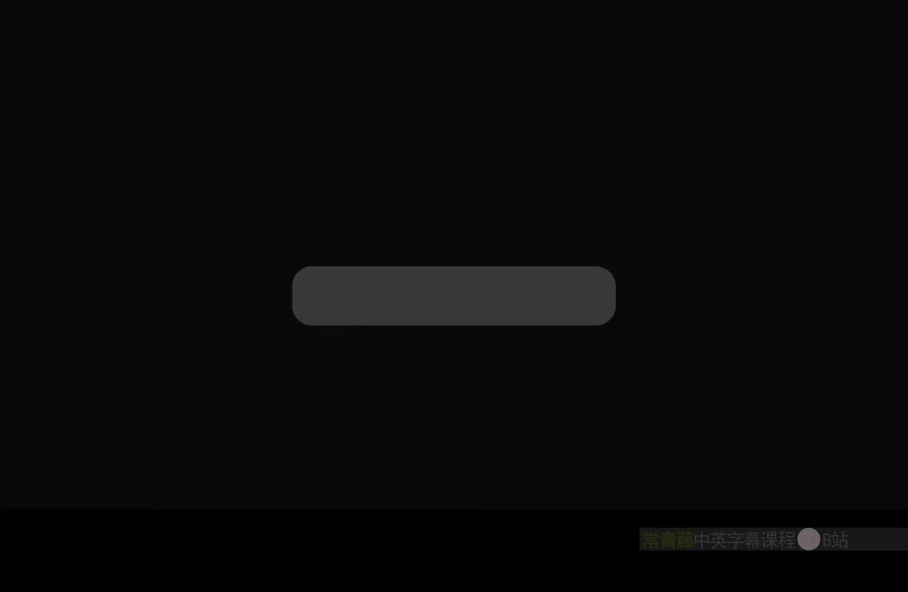
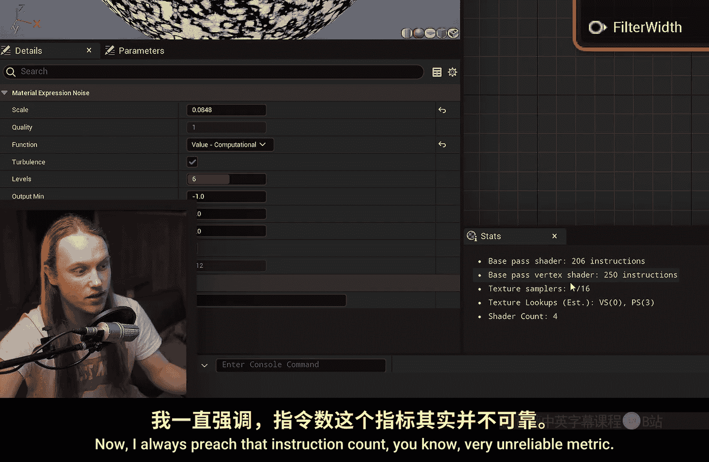
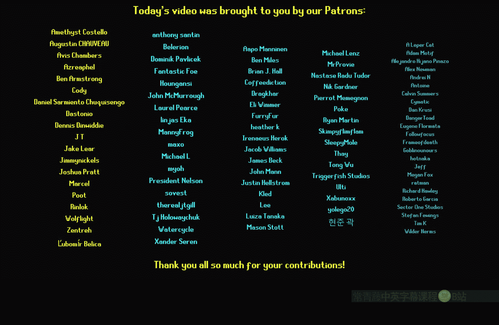

# 030：噪波节点 🎨



在本节课中，我们将学习虚幻引擎材质编辑器中的“噪波”节点。我们将了解它的工作原理、它与传统纹理采样的区别，以及如何利用其三维特性来创建不受UV贴图影响的复杂材质效果。

---

## 概述

噪波节点是材质编辑器中一个强大的工具，它能够生成程序化的噪波图案。与使用纹理贴图不同，噪波节点可以完全通过计算生成，并且能够创建三维的噪波效果，这对于处理复杂模型或需要无缝衔接的效果至关重要。

---

## 噪波节点基础

首先，我们在材质编辑器中搜索并添加“噪波”节点。请注意，它并非一个纹理采样节点。




将其直接连接到基础颜色通道后，你会发现生成的噪波图案非常细小。

我们可以通过两种方式调整其尺度：
1.  直接在噪波节点的属性面板中修改“比例”参数。
2.  使用世界位置或其他坐标输入来动态控制。噪波节点可以接受二维或三维向量输入，并自动适应。

例如，我们可以将世界位置节点乘以一个标量值后，再输入到噪波节点，以此来控制噪波的整体缩放。

---

## 节点模式与参数

噪波节点有多种计算模式。切换模式时，指令计数会发生变化，这可以粗略地反映不同模式的计算开销。


以下是使用噪波节点而非纹理的几个关键原因，特别是其三维噪波能力。

选择“快速梯度3D纹理”模式后，我们可以调整以下参数：
*   **等级**：控制噪波的“八度”数量。等级越少，性能开销通常越低。
*   **输出范围**：可以将默认的（-1 到 1）范围重新映射到（0 到 1）。这也可以通过后续的数学节点完成。
*   **等级比例**：改变每个后续等级噪波的缩放比例。设为1意味着叠加相同比例的噪波；设为1.5则会使每一层噪波比前一层更大。
*   **湍流**：启用后会生成更扭曲、混乱的噪波图案，通常保持关闭以获得更自然的效果。

调整这些参数后，我们可以获得一个细腻的噪波图案。

---

## 三维噪波的优势

三维噪波的核心优势在于其独立性。它不依赖于模型的UV贴图坐标，而是在世界空间中生成。

这意味着：
*   对于球体等难以完美展开UV的模型，三维噪波可以无缝覆盖。
*   噪波效果可以跨越UV接缝，不会产生断裂。
*   当相机或物体移动时，噪波图案会平滑变化，如同在三维空间中真实存在一样。

例如，观察一个噪波中的暗点：当我们在世界中上下移动视角时，就像是在切割一个三维的噪波体，从不同角度观察这个暗点。

---

## 矢量噪波变体

另一个有用的节点是“矢量噪波”。它本质上是在RGB三个通道中分别生成三个不同的噪波。

我们可以通过一个简单的公式将输出范围从 (-1, 1) 映射到 (0, 1)：

**公式**：`(NoiseOutput + 1) / 2`

这样做的好处是，我们可以将R、G、B三个通道拆分开，作为三个互不重叠的独立噪波来使用，为材质增加更多样的细节。

---

## 实际应用案例

以下是三维噪波在实际材质创作中的两个应用示例。

### 案例一：角色污渍/石化效果

如果使用传统的二维噪波纹理，图案会受UV布局影响，在UV接缝处（如手套中间）会出现不连续。



切换到三维噪波后，噪波图案在模型表面（包括手套和兜帽顶部）变得连续且一致，不受UV接缝干扰。

我们可以利用这个噪波值驱动一个**高度混合**节点，在角色的基础材质和“泥污”或“岩石”材质之间进行混合。这样就能创建出覆盖全身、无视UV的污渍或石化效果。

### 案例二：动态雨滴效果

这是利用三维噪波模拟雨滴沿表面下落的巧妙方法。

其原理并非移动纹理，而是让噪波图案在世界空间中沿Z轴（垂直方向）随时间移动。

**核心思路**：将世界位置的Z分量减去一个随时间增大的值，再输入给噪波节点。

**代码示意（蓝图概念）**：
```
NoiseInput = WorldPosition - (0, 0, Time * Speed)
NoisePattern = Noise(NoiseInput)
```

从顶部看，这像是随机出现的雨点；但从侧面看，由于噪波在垂直方向“下落”，就形成了雨水沿表面流淌的效果。这种方法计算成本低，效果却非常逼真。

---

## 总结


本节课我们一起学习了虚幻引擎中的噪波节点。我们了解了它与纹理采样的区别，探索了其作为三维程序化噪波发生器的强大功能，并研究了如何通过调整等级、比例等参数来控制噪波形态。最后，我们通过“角色污渍”和“动态雨滴”两个案例，看到了三维噪波在解决UV接缝问题和创造动态空间效果方面的实际应用。掌握这个节点，将为你创建复杂、无缝的材质效果打开新的大门。