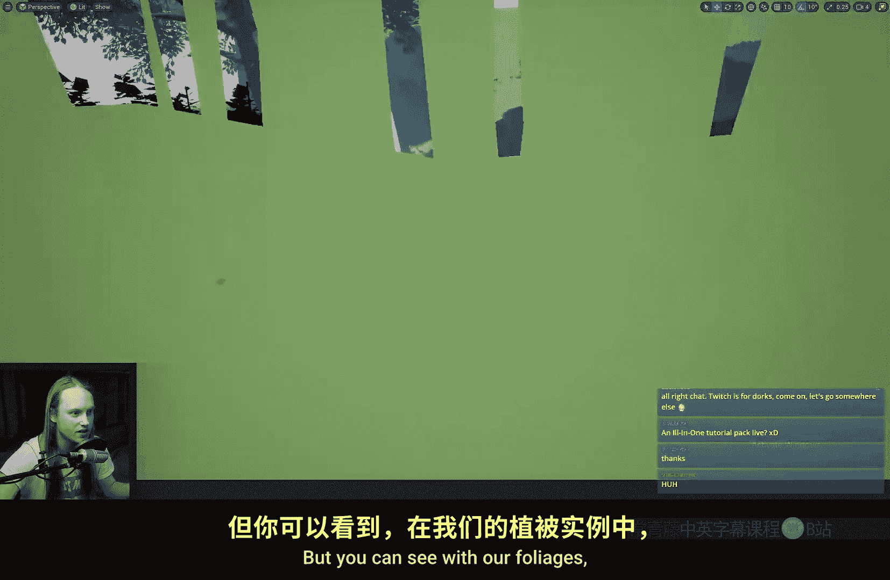

# 031：顶点插值器节点详解 🧩


在本节课中，我们将要学习虚幻引擎材质编辑器中的一个特殊节点——**顶点插值器**。这个节点功能强大且独特，能够将计算从像素阶段转移到顶点阶段，从而在特定情况下显著提升性能或实现特殊效果。

---

## 节点外观与基本效果

顶点插值器节点是材质编辑器中少数几个呈现古铜色的特殊节点之一。


当我们将其连接到材质输出时，效果会非常奇特。例如，一个立方体会变得棱角分明，而一个角色模型则会严重失真。这是因为该节点正在利用模型顶点上的额外数据（一个UV通道）在**顶点阶段**运行计算，而非默认的像素阶段。

---

## 性能优化原理

上一节我们介绍了节点的基本效果，本节中我们来看看它如何优化性能。核心原理在于计算量的转移。

*   在**像素阶段**，计算针对屏幕上渲染的**每一个像素**进行。例如，一个350x350像素的区域大约有12万个像素需要处理。
*   在**顶点阶段**，计算仅针对模型的**每一个顶点**进行。对于一个550个顶点的模型，就只计算550次。

**公式表示性能差异：**
`计算量对比 ≈ 顶点数量 vs. 屏幕像素数量`

因此，将非必需精确到像素的计算移至顶点阶段，通常能带来显著的性能提升。虽然使用节点本身可能有一些开销，但在多数情况下收益巨大。

---

## 适用场景与案例

理解了性能原理后，我们探讨几个顶点插值器的具体应用场景。

以下是顶点插值器的几个典型用途：

1.  **纯色材质**：如果材质使用的是纯色（例如绿色），将其通过顶点插值器计算，让每个顶点决定颜色，比让每个像素计算相同的颜色更高效。
2.  **角色着色**：在我的角色材质中，大量使用了顶点插值。具体做法是：将多层颜色在**顶点阶段**进行混合或计算，然后使用一个**像素阶段**的纹理采样（如遮罩纹理）来混合这些顶点颜色。这样既保留了丰富的色彩变化，又将大量计算转移到了更高效的顶点阶段。
    *   **代码逻辑示意**：
        ```
        // 顶点阶段
        VertexColor1 = VertexInterpolator(ColorData1);
        VertexColor2 = VertexInterpolator(ColorData2);
        // 像素阶段
        FinalColor = Lerp(VertexColor1, VertexColor2, TextureMask.r);
        ```
3.  **实例化对象的独立效果**：这是顶点插值器一个非常实用的特性。对于大量实例化的物体（如植被），有时我们希望效果基于每个实例的独立原点（Pivot）计算，而不是整个实例集合。

---

## 实例化对象应用详解

让我们深入探讨一下在实例化对象中的应用。假设我们有一片由实例化生成的植被，我们想为每一株植物创建一个从根部到顶部的黑白渐变遮罩。

如果直接在像素阶段使用世界位置和物体原点进行计算，渐变会基于**整个实例集合的原点**生成，导致所有植物共享同一个渐变梯度，效果不符合预期。




然而，如果将这个计算连接到**顶点插值器**，再输出到颜色，渐变就会基于**每个实例自身的原点**独立计算。这对于可视化每棵植物的遮罩，或在像素阶段实现基于实例的特定效果（如按高度着色）非常有用。

**请注意**：如果你是为了驱动**世界位置偏移**而计算此类遮罩，则不需要使用顶点插值器，因为输入到“世界位置偏移”引脚的数据本身就是在顶点阶段处理的。此示例主要适用于需要在像素阶段查看或使用该遮罩数据的情况。

---

## 总结与核心要点

本节课中我们一起学习了顶点插值器节点的奥秘。我们来总结一下它的核心用途：

*   **性能优化**：将计算从昂贵的像素阶段转移到相对廉价的顶点阶段。经验法则是：如果效果不需要像素级精度，就优先考虑放在顶点阶段。
*   **实现特殊效果**：特别是在处理实例化对象时，能够实现基于单个实例而非整个集合的独立计算效果。


记住这个节点的古铜色外观，当你需要优化材质性能或处理实例化对象的独立属性时，它将会是一个强大的工具。